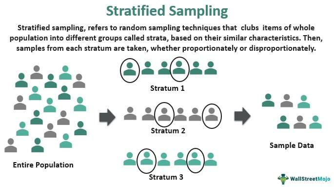

Survey Methodology refers to the set of processes used to conduct surveys, ensuring that the data collected is accurate, reliable, and representative of the target population. This concept is vital in understanding the Current Population Survey (CPS), which is one of the most significant and influential surveys conducted in the United States. The CPS, a joint initiative by the U.S. Bureau of Labor Statistics (BLS) and the U.S. Census Bureau, is instrumental in providing critical insights into the U.S. labor market.

The CPS is primarily designed to assess labor force statistics, such as employment, unemployment, and other market dynamics. Consequently, it plays a crucial role in informing economic and labor market analyses, offering stakeholders valuable data to guide policy formulation and business strategy. For instance, with its detailed labor force statistics, the CPS allows policymakers to develop employment policies that can effectively address labor market challenges.



Beyond policy formulation, CPS data is increasingly harnessed in algorithmic trading and decision-making processes. Algorithmic trading involves the use of computer algorithms to trade financial securities, and it relies heavily on a wide array of data inputs to optimize trading strategies. CPS data, with its demographic and employment statistics, provides predictive insights into economic trends that traders and investors find essential. By incorporating CPS data, trading algorithms can better predict market movements and make real-time adjustments to trading strategies.

In summary, the Current Population Survey's robust methodology enables the collection of high-quality data, which holds significant value for economic analyses and trading. As the financial markets grow more data-driven, the integration of CPS data into algorithmic trading models exemplifies its expansive utility. Ensuring that CPS data remains relevant and accurate is critical for advancing economic decision-making.

## Table of Contents

## Understanding the Current Population Survey

The Current Population Survey (CPS) is a monthly survey that serves as the primary source of labor force statistics for the U.S. economy. Administered jointly by the U.S. Bureau of Labor Statistics (BLS) and the U.S. Census Bureau, the CPS provides critical data on employment, unemployment, and other key demographic characteristics of the national labor market. This survey's primary aim is to quantify and understand the economic, social, and demographic forces affecting labor market conditions in the United States.

The CPS originated in the early 1940s, a time when accurate labor statistics were desperately needed to address the economic challenges of the Great Depression and World War II. Since then, it has become the definitive statistical tool for estimating unemployment rates and providing comprehensive insights into the employment situation. Every month, the CPS surveys approximately 60,000 eligible households, representing a cross-section of the nation's demographic composition. This large sample size allows it to generate detailed estimates that inform policymakers, economists, and researchers.

The significance of the CPS is underscored by its robust methodology and its ability to capture a wide range of labor market variables. It collects data on employment status, job searches, work hours, earnings, and occupational categories, among other metrics. These [statistics](/wiki/bayesian-statistics) are not only vital for assessing the health of the economy but also for understanding trends over time. The survey results are instrumental in calculating critical measures such as the Monthly Employment Report, which influences economic policy decisions and financial markets.

Furthermore, the data from the CPS are utilized in conjunction with other statistical measures to evaluate the effectiveness of economic policies, study demographic changes, and assess the social impact of labor market shifts. As such, the CPS remains a cornerstone in the collection and analysis of labor force data in the United States, continually adapting to meet the needs of a changing economic landscape.

## Survey Methodology of the CPS

The Current Population Survey (CPS) employs a robust survey methodology that is essential for collecting reliable labor force statistics. Central to the CPS methodology is its complex sampling design, which utilizes a stratified, multistage approach. This design is crucial in ensuring representative and precise estimates of the U.S. population's labor characteristics.

The sampling technique involves the use of a 4-8-4 rotation scheme, a key feature that enhances the survey’s reliability. In this scheme, households are interviewed for four consecutive months, left out of the sample for the following eight months, and then interviewed again for another four months before being permanently rotated out of the survey. This rotation minimizes respondent burden while allowing for month-to-month and year-to-year comparisons.

The CPS employs a stratified sample where the population is divided into primary sampling units (PSUs), most of which are counties or groups of counties. These PSUs are further stratified into smaller geographical units, promoting the representation of diverse demographic and economic conditions across the nation. Within these strata, ultimate sampling units (USUs) are selected systematically.

Questionnaire design is another pivotal component of the CPS methodology. The questionnaire covers a wide spectrum of topics pertinent to employment status, demographic characteristics, and income. To maintain consistency and accuracy, the CPS employs standardized questions that align with international labor definitions. Interviews are generally conducted via personal visits and telephone, facilitating flexible and comprehensive data collection.

Data collection processes in the CPS are meticulously structured. Field representatives receive extensive training to conduct interviews and handle various response-related challenges. The use of computer-assisted interviewing (CAI) technologies improves data accuracy by reducing entry errors and allowing complex question routing.

To ensure accuracy, the CPS implements rigorous data verification and validation techniques. Post-collection, datasets undergo multiple rounds of processing and analysis to adjust for non-response and to calibrate the sample to align with population controls derived from the most recent decennial census and vital statistics data.

The CPS's 4-8-4 rotation scheme and its associated sampling and data collection methodologies form the backbone of its ability to produce precise and dependable labor market statistics, crucial for policy formulation and economic analysis in the United States.

## Data Utilization: CPS in Economic Decision Making

The Current Population Survey (CPS) serves as a critical tool in economic decision making for businesses, investors, and policymakers. As a primary source of data on labor force statistics in the United States, CPS offers vital insights into employment, unemployment, and overall economic health. The comprehensive nature of CPS data allows these stakeholders to evaluate labor force participation and the employment landscape effectively.

CPS data is instrumental in assessing labor force participation rates, which reflect the portion of people eligible to work who are either employed or actively seeking work. This data aids businesses and policymakers in identifying labor market trends, such as shifts in employment across different sectors, which can influence decisions regarding investment and workforce planning. For instance, an increase in participation rates might indicate a strengthening economy, encouraging businesses to expand operations and hire more workers.

Furthermore, CPS data plays a key role in dissecting employment statistics. By examining this information, investors and policymakers can gauge economic stability and potential growth areas. Such data assists in predicting economic cycles and labor market tightness, which can, in turn, affect monetary policies and interest rates. For example, consistent rises in employment numbers might lead the Federal Reserve to adjust interest rates to control inflation.

In addition, the impact of CPS data extends to economic policy formulation. Policymakers rely on CPS findings to draft informed labor and economic policies that align with current conditions. For example, a spike in unemployment data may prompt government interventions through stimulus packages or job creation programs to counteract economic downturns.

Strategic business decision making is also heavily influenced by CPS data. Companies often use labor market insights to make informed decisions on everything from location expansions to product launches. For example, a tech company may analyze regional CPS employment data to decide optimal locations for new data centers, ensuring a robust pool of skilled labor.

Overall, the utilization of CPS data in economic decision making is multifaceted, encompassing broad evaluations of labor market health, shaping policy directions, and enhancing strategic planning. The accurate reflection of labor dynamics that CPS provides ensures stakeholders can make data-driven decisions that are aligned with the economic milieu, thereby optimizing outcomes and fostering economic resilience.

## Algorithmic Trading and CPS Data

Algorithmic trading relies on the ability to process and analyze vast amounts of data rapidly and accurately, allowing traders to make informed decisions in real-time. The demographic and employment statistics provided by the Current Population Survey (CPS) serve as a critical input for developing sophisticated trading strategies. By incorporating CPS data, traders can assess labor market trends, identify economic shifts, and anticipate market movements more effectively.

CPS data, including unemployment rates, labor force participation rates, and employment demographics, provide valuable insights into the economic health and potential consumer behavior. For instance, high unemployment rates can indicate economic downturns, which may lead to downward trends in certain markets. Conversely, increases in the labor force participation rate might signal economic recovery or growth, potentially driving up stock prices in specific sectors.

Incorporating CPS data into trading algorithms involves the creation of models that quantify the influence of labor statistics on market variables. These models can use historical CPS data to identify patterns and correlations with asset price movements. For example, a model could use a regression analysis where stock prices are regressed on CPS metrics to determine how changes in employment figures affect market performance. The formula might look as follows:

$$
Price_t = \alpha + \beta_1 \times UnemploymentRate_t + \beta_2 \times ParticipationRate_t + \epsilon_t
$$

Here, $Price_t$ represents the asset price at time $t$, $UnemploymentRate_t$ and $ParticipationRate_t$ are CPS-derived metrics, and $\epsilon_t$ is the error term.

Real-time decision-making benefits from CPS data when incorporated into automated trading systems. These systems can execute trades based on pre-defined criteria triggered by updated CPS statistics. For instance, an algorithm could automatically short-sell equities in consumer goods sectors if the CPS reports a spike in unemployment, anticipating reduced consumer spending.

Python offers tools such as pandas and numpy to process CPS data efficiently. A simple use case can be demonstrated through a Python snippet that triggers a trading action based on CPS data:

```python
import pandas as pd

# Assuming 'cps_data' is a DataFrame with columns 'Date', 'UnemploymentRate', 'ParticipationRate'
cps_data = pd.read_csv('cps_data.csv') 

# Define a threshold for action
unemployment_threshold = 7.0

# Check latest data
latest_data = cps_data.iloc[-1]

# Trading Condition
if latest_data['UnemploymentRate'] > unemployment_threshold:
    print("Trigger sell action in consumer sectors")
else:
    print("Monitor market conditions")
```

The influence of CPS data extends further into real-time trading algorithms due to its timeliness and relevance in capturing economic trends. As traders refine their algorithms with more sophisticated [machine learning](/wiki/machine-learning) models, the predictive power of CPS-based indicators can enhance risk management and profitability in [algorithmic trading](/wiki/algorithmic-trading) endeavors. By continuously integrating updated CPS data, traders can leverage macroeconomic insights to fine-tune their strategies, maintaining a competitive edge in volatile financial markets.

## The Future of CPS Data and Algorithmic Trading

The Current Population Survey (CPS) stands at the forefront of labor market analysis, providing valuable data that has the potential to influence numerous sectors, including algorithmic trading. As the financial and technological landscapes evolve, the CPS must adapt to meet new demands. Anticipated modernization efforts for the CPS aim to increase the timeliness, accessibility, and depth of data, which in turn can significantly enhance its applicability in algorithmic trading.

Firstly, advancements in data analytics are expected to play a significant role in augmenting the utility of CPS data within trading algorithms. By leveraging machine learning techniques and big data analytics, traders can extract more nuanced insights from CPS data, enabling them to capture subtle market trends and improve predictive models. For instance, machine learning models can be trained to identify patterns in demographic and employment statistics that correlate with economic indicators such as consumer spending, interest rates, and stock market performance.

Python, as a widely-used language in data science, provides robust libraries like Scikit-learn and TensorFlow that can be employed to build sophisticated predictive models. Consider the straightforward example of using Python to explore correlations in employment data:

```python
import pandas as pd
from sklearn.linear_model import LinearRegression
from sklearn.model_selection import train_test_split

# Load CPS data
cps_data = pd.read_csv('cps_data.csv')

# Features and target variable
X = cps_data[['employment_rate', 'median_income', 'education_level']]
y = cps_data['market_indicator']

# Splitting the data
X_train, X_test, y_train, y_test = train_test_split(X, y, test_size=0.2, random_state=42)

# Using a simple linear regression model
model = LinearRegression()
model.fit(X_train, y_train)

# Model evaluation
score = model.score(X_test, y_test)
print(f'Model Accuracy: {score:.2f}')
```

This basic model demonstrates how CPS data can be integrated into a predictive algorithm, analyzing how different employment metrics might influence market indicators. 

Furthermore, the future of CPS data integration into trading algorithms may benefit from increasing the accuracy and predictive power through refined methodologies. As the CPS updates its sampling techniques and data processing methods, the resultant data is expected to reflect real-time labor market conditions more precisely. Enhanced accuracy in CPS datasets means that algorithmic models can focus on more reliable inputs, reducing prediction errors and improving decision-making efficacy.

As these innovations unfold, the potential for CPS data is vast. Integrating near real-time updates and expanding data dimensions can lead to more adaptive trading strategies and finer market predictions. Essentially, modernizing the CPS permits a more robust foundation, upon which traders can construct algorithms capable of seizing nuanced opportunities and mitigating risks more effectively, ensuring that the role of CPS data in algorithmic trading continues to grow and evolve with precision and impact.

## Conclusion

The Current Population Survey (CPS) is a cornerstone in the landscape of labor market analysis in the United States, providing indispensable insights into employment trends, labor force participation, and a host of socio-economic indicators. Its significance goes beyond academic and policy-making circles, extending into the realm of economic analyses and algorithmic trading strategies. As an authoritative source of labor statistics, CPS data empowers businesses, investors, and policymakers with the information needed for informed decision-making. The granular demographic and employment statistics offered by the CPS facilitate a nuanced understanding of economic conditions, enabling the development of robust economic and trading strategies.

Furthermore, the integration of CPS data in algorithmic trading exemplifies its practical utility in real-time decision-making environments. Traders leverage the comprehensive data sets to craft predictive models and algorithms that respond dynamically to labor market fluctuations. This synthesis of comprehensive labor statistics and advanced analytical techniques underscores the critical role that CPS data plays in enhancing the sophistication and precision of economic and financial strategies.

Looking ahead, the need for continuous advancements in survey methodologies and data integration remains paramount. As data analytics and computational technologies evolve, the potential to refine CPS methodologies offers a pathway to even greater accuracy and predictive power in economic forecasting and decision-making processes. By embracing innovations in data collection and analysis, the CPS can continue to evolve as a pivotal tool for navigating the complexities of the modern economic landscape, ensuring that decision-makers are equipped with the most accurate and relevant insights. In conclusion, the ongoing commitment to methodological improvements will ensure the enduring value of CPS data in both economic analysis and algorithmic trading, fostering a more informed and responsive economic environment.

## References & Further Reading

[1]: U.S. Bureau of Labor Statistics. ["Current Population Survey - Design and Methodology."](https://www.bls.gov/cps/publications.htm)

[2]: U.S. Census Bureau. ["Current Population Survey (CPS)."](https://www.census.gov/programs-surveys/cps.html)

[3]: ["Econometric Analysis of Cross Section and Panel Data"](https://ipcig.org/evaluation/apoio/Wooldridge%20-%20Cross-section%20and%20Panel%20Data.pdf) by Jeffrey M. Wooldridge

[4]: Chincarini, L., & Kim, D. (2006). ["Quantitative Equity Portfolio Management: An Active Approach to Portfolio Construction and Management."](https://archive.org/details/quantitativeequi0000chin_c9d6)

[5]: ["The Economics of Algorithmic Trading"](https://www.semanticscholar.org/paper/The-Economics-of-Algorithmic-Trading-Riordan/33693384fd0d3a3e8e341f50cea2d25fde20fd6a) by the Brookings Institution

[6]: Capiello, B. (2012). ["Incorporating Economic Indicators into Algorithmic Trading"](https://www.mdpi.com/2227-7390/10/18/3302). Social Science Research Network.