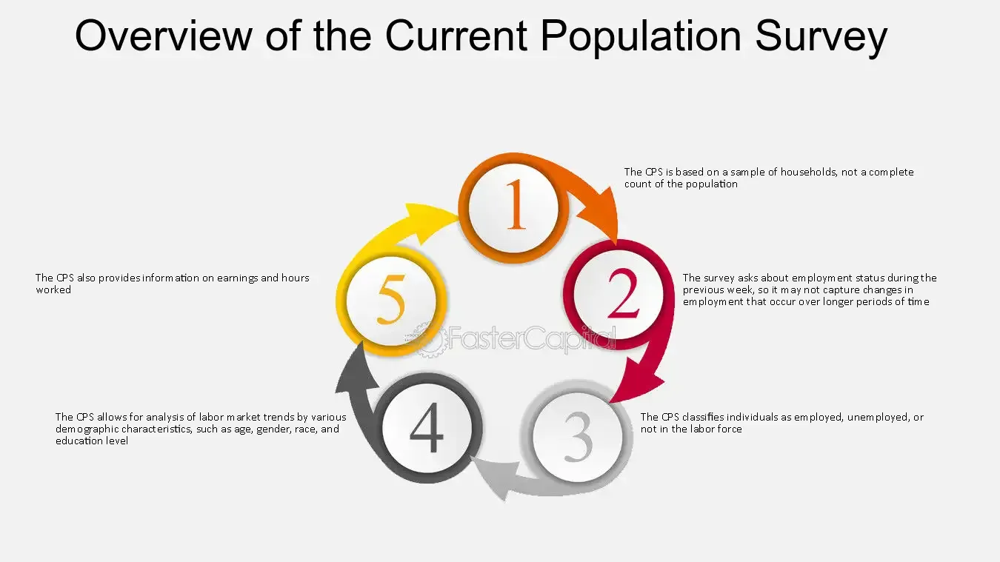

## Table of Contents

## What is the Current Population Survey (CPS)?

The Current Population Survey (CPS) is a monthly survey done by the United States Census Bureau for the Bureau of Labor Statistics. It asks questions to about 60,000 households across the country to find out how many people are working and how many are not. This helps the government understand the employment situation in the country.

The CPS is important because it gives us the official unemployment rate each month. It also collects information about other things like how much people earn, if they have health insurance, and how many people are in school. This information helps the government make decisions about jobs, education, and other important issues.

## Who conducts the Current Population Survey?

The Current Population Survey is done by the United States Census Bureau. They work for the Bureau of Labor Statistics, which is part of the government. Every month, they talk to about 60,000 households all over the country to learn about people's jobs.

This survey is important because it helps the government know how many people have jobs and how many do not. It also asks about other things like how much money people make, if they have health insurance, and if they are going to school. This information helps the government make good choices about work, education, and other important topics.

## How often is the Current Population Survey conducted?

The Current Population Survey is done every month. It is a regular check to see how many people have jobs and how many do not. The United States Census Bureau talks to about 60,000 households all over the country to get this information.

This survey is important because it helps the government know the employment situation each month. It also asks about other things like how much money people make, if they have health insurance, and if they are going to school. This information helps the government make good choices about work, education, and other important topics.

## What is the primary purpose of the Current Population Survey?

The main goal of the Current Population Survey is to find out how many people in the United States have jobs and how many do not. It is done every month by the United States Census Bureau, which works for the Bureau of Labor Statistics. They talk to about 60,000 households all over the country to get this information. This helps the government know the employment situation each month.

The survey also asks about other important things like how much money people make, if they have health insurance, and if they are going to school. This extra information helps the government make good choices about work, education, and other important topics. By understanding these details, the government can make better plans and policies to help people.

## What types of data does the CPS collect?

The Current Population Survey collects a lot of information about people's jobs. Every month, they ask about 60,000 households if they are working or not. This helps them figure out the unemployment rate, which tells us how many people want a job but can't find one. They also ask about how many hours people work and what kind of jobs they have.

Besides job information, the CPS also asks about other important things. They want to know how much money people make, which helps understand if people are [earning](/wiki/earning-announcement) enough to live comfortably. They also ask if people have health insurance, which is important for knowing if people can get the medical care they need. Lastly, they check if people are going to school, which helps the government plan for education.

All this information is very useful. It helps the government see the big picture of what's happening with jobs, money, health, and education in the country. By knowing these details, they can make better plans and policies to help people have better lives.

## How is the sample for the CPS selected?

The Current Population Survey uses a special way to pick the households they talk to. They start by dividing the whole country into small areas called primary sampling units. These can be cities, groups of towns, or even just parts of a big city. Then, they pick some of these areas to include in the survey. This is called a multi-stage sample design, which helps make sure they get information from all different kinds of places.

After choosing the areas, they pick specific households within those areas. They use a list of addresses from the Census Bureau to do this. The idea is to make sure the households they choose are a good mix of different kinds of people, so the survey results can represent everyone in the country. They talk to the same households for four months, take a break for eight months, and then talk to them again for another four months. This helps them see changes over time.

This way of [picking](/wiki/asset-class-picking) the sample is important because it makes the survey results more accurate. By including different areas and types of households, the CPS can give a good picture of what's happening with jobs, money, health, and education all over the United States. This helps the government make better decisions to help people.

## What is the typical response rate for the CPS?

The Current Population Survey usually has a response rate of about 80 to 85 percent. This means that out of all the households they ask, around 80 to 85 out of every 100 answer the survey. This is pretty good because it means the information they get is likely to be a good picture of what's happening across the country.

Having a high response rate is important because it helps make sure the survey results are accurate. If too many people don't answer, the results might not show what's really going on with jobs, money, health, and education. The CPS works hard to get as many people to answer as possible so they can help the government make good decisions for everyone.

## How does the CPS ensure data accuracy and reliability?

The Current Population Survey works hard to make sure the information they collect is correct and trustworthy. They use a special way to pick the households they talk to, called a multi-stage sample design. This means they divide the country into small areas and then choose some of these areas to include in the survey. They also pick specific households within those areas to make sure they get a good mix of different kinds of people. By doing this, they can be sure that the survey results represent everyone in the country.

Another way the CPS makes sure the data is accurate is by having a high response rate. Usually, about 80 to 85 out of every 100 households they ask answer the survey. This is important because if too many people don't answer, the results might not show what's really going on. The CPS also talks to the same households for four months, takes a break for eight months, and then talks to them again for another four months. This helps them see changes over time and makes the information even more reliable.

## What are the key differences between the CPS and other similar surveys?

The Current Population Survey (CPS) is different from other surveys like the American Community Survey (ACS) and the Survey of Income and Program Participation (SIPP) in a few big ways. The CPS focuses a lot on jobs and employment. It asks about 60,000 households every month to find out who is working and who is not. This helps the government know the unemployment rate and other job details. The CPS also collects some information on income, health insurance, and education, but its main focus is on employment.

On the other hand, the American Community Survey (ACS) looks at a wider range of topics. It asks about things like where people live, how they get to work, their education, and even their ancestry. The ACS talks to about 3.5 million households each year, but it doesn't focus as much on monthly job changes like the CPS does. The Survey of Income and Program Participation (SIPP) is also different because it looks at how people's income and participation in government programs change over time. The SIPP talks to the same people every few months for several years, which is different from the CPS's monthly check-ins and breaks.

These differences mean that each survey gives the government different kinds of information. The CPS is great for understanding the job market and quick changes in employment. The ACS gives a broad picture of many parts of people's lives, and the SIPP helps track changes in income and government program use over longer periods. By using all these surveys, the government can make better decisions to help people in different ways.

## How is the data from the CPS used by policymakers and researchers?

The data from the Current Population Survey is very important for people who make laws and rules, and for people who study things like jobs and money. Policymakers use the CPS to understand how many people have jobs and how many do not. This helps them make decisions about programs that help people find work or learn new skills. They also use the information about how much money people make to see if people are earning enough to live well. This can help them decide if they need to change laws about the minimum wage or other money-related issues.

Researchers also find the CPS very useful. They use the survey to study how the job market is changing over time. By looking at the data, they can see if more people are getting jobs or if more people are losing them. They also use the information about health insurance and education to understand how these things affect people's lives. This helps them write reports and articles that can guide policymakers on what to do next. Both policymakers and researchers rely on the CPS to make smart choices that help people in the country.

## What are some of the challenges faced in conducting the CPS?

Conducting the Current Population Survey can be tough because it's hard to get everyone to answer the questions. Even though the CPS has a good response rate of about 80 to 85 percent, some people don't want to talk about their jobs or money. This can make the information less accurate if too many people say no. The survey team has to work hard to explain why the survey is important and try to get as many people to answer as possible.

Another challenge is making sure the survey includes all kinds of people from different places. The CPS uses a special way to pick households, but it's still hard to make sure every group is represented well. If some groups are left out, the survey results might not show the true picture of what's happening with jobs and money in the country. The team has to be very careful and keep checking their methods to make sure the survey is fair and accurate.

## How has the methodology of the CPS evolved over time to address these challenges?

The Current Population Survey has changed its methods over time to deal with these challenges. One big change was how they pick the households to talk to. They started using a multi-stage sample design, which means they divide the country into small areas and then choose some of these areas and specific households within them. This helps make sure they get a good mix of different kinds of people and places. They also started talking to the same households for four months, taking a break for eight months, and then talking to them again for another four months. This helps them see changes over time and makes the information more reliable.

Another change was how they try to get more people to answer the survey. They started using different ways to reach people, like phone calls and online surveys, not just knocking on doors. They also worked on making the survey easier to understand and answer. The CPS team also started giving more reasons why the survey is important, hoping to convince more people to take part. These changes have helped improve the response rate and make the data more accurate and useful for understanding what's happening with jobs, money, health, and education in the country.

## What is the relationship between Algorithmic Trading and CPS Data?

Algorithmic trading relies on the ability to process and analyze vast amounts of data rapidly and accurately, allowing traders to make informed decisions in real-time. The demographic and employment [statistics](/wiki/bayesian-statistics) provided by the Current Population Survey (CPS) serve as a critical input for developing sophisticated trading strategies. By incorporating CPS data, traders can assess labor market trends, identify economic shifts, and anticipate market movements more effectively.

CPS data, including unemployment rates, labor force participation rates, and employment demographics, provide valuable insights into the economic health and potential consumer behavior. For instance, high unemployment rates can indicate economic downturns, which may lead to downward trends in certain markets. Conversely, increases in the labor force participation rate might signal economic recovery or growth, potentially driving up stock prices in specific sectors.

Incorporating CPS data into trading algorithms involves the creation of models that quantify the influence of labor statistics on market variables. These models can use historical CPS data to identify patterns and correlations with asset price movements. For example, a model could use a regression analysis where stock prices are regressed on CPS metrics to determine how changes in employment figures affect market performance. The formula might look as follows:

$$
Price_t = \alpha + \beta_1 \times UnemploymentRate_t + \beta_2 \times ParticipationRate_t + \epsilon_t
$$

Here, $Price_t$ represents the asset price at time $t$, $UnemploymentRate_t$ and $ParticipationRate_t$ are CPS-derived metrics, and $\epsilon_t$ is the error term.

Real-time decision-making benefits from CPS data when incorporated into automated trading systems. These systems can execute trades based on pre-defined criteria triggered by updated CPS statistics. For instance, an algorithm could automatically short-sell equities in consumer goods sectors if the CPS reports a spike in unemployment, anticipating reduced consumer spending.

Python offers tools such as pandas and numpy to process CPS data efficiently. A simple use case can be demonstrated through a Python snippet that triggers a trading action based on CPS data:

```python
import pandas as pd

# Assuming 'cps_data' is a DataFrame with columns 'Date', 'UnemploymentRate', 'ParticipationRate'
cps_data = pd.read_csv('cps_data.csv') 

# Define a threshold for action
unemployment_threshold = 7.0

# Check latest data
latest_data = cps_data.iloc[-1]

# Trading Condition
if latest_data['UnemploymentRate'] > unemployment_threshold:
    print("Trigger sell action in consumer sectors")
else:
    print("Monitor market conditions")
```

The influence of CPS data extends further into real-time trading algorithms due to its timeliness and relevance in capturing economic trends. As traders refine their algorithms with more sophisticated [machine learning](/wiki/machine-learning) models, the predictive power of CPS-based indicators can enhance risk management and profitability in [algorithmic trading](/wiki/algorithmic-trading) endeavors. By continuously integrating updated CPS data, traders can leverage macroeconomic insights to fine-tune their strategies, maintaining a competitive edge in volatile financial markets.

## References & Further Reading

[1]: U.S. Bureau of Labor Statistics. ["Current Population Survey - Design and Methodology."](https://www.bls.gov/cps/publications.htm)

[2]: U.S. Census Bureau. ["Current Population Survey (CPS)."](https://www.census.gov/programs-surveys/cps.html)

[3]: ["Econometric Analysis of Cross Section and Panel Data"](https://ipcig.org/evaluation/apoio/Wooldridge%20-%20Cross-section%20and%20Panel%20Data.pdf) by Jeffrey M. Wooldridge

[4]: Chincarini, L., & Kim, D. (2006). ["Quantitative Equity Portfolio Management: An Active Approach to Portfolio Construction and Management."](https://archive.org/details/quantitativeequi0000chin_c9d6)

[5]: ["The Economics of Algorithmic Trading"](https://www.semanticscholar.org/paper/The-Economics-of-Algorithmic-Trading-Riordan/33693384fd0d3a3e8e341f50cea2d25fde20fd6a) by the Brookings Institution

[6]: Capiello, B. (2012). ["Incorporating Economic Indicators into Algorithmic Trading"](https://www.mdpi.com/2227-7390/10/18/3302). Social Science Research Network.