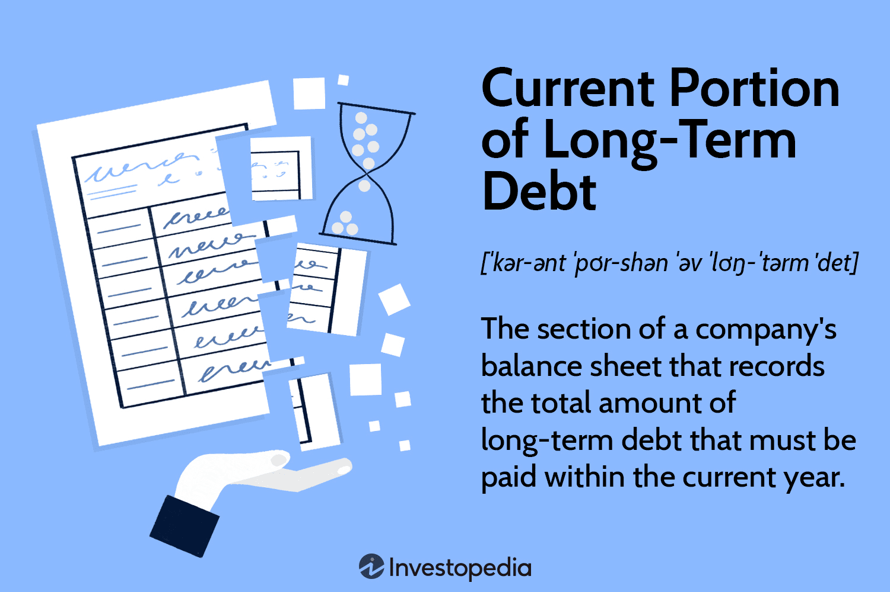

## Table of Contents

## What is the current portion of long-term debt?

The current portion of long-term debt is the part of a company's long-term debt that needs to be paid back within the next year. When a company borrows money for a long time, like through loans or bonds, it has to pay it back over many years. But each year, some of that money becomes due. This amount that is due in the next year is called the current portion of long-term debt.

This figure is important because it shows how much money a company needs to have ready to pay off its debts soon. It is listed on the company's balance sheet under current liabilities. By looking at this number, people who want to invest in the company or lend it money can see if the company will have enough cash to meet its short-term obligations. If the current portion of long-term debt is too high compared to the company's cash, it might be a sign that the company could have trouble paying its debts.

## Why is it important to separate the current portion from the long-term debt?

It's important to separate the current portion from the long-term debt because it helps everyone understand a company's financial health better. The current portion tells us how much money the company needs to pay back in the next year. This is different from the long-term debt, which is the money the company doesn't need to pay back right away. By knowing these two amounts separately, people can see if the company has enough money to cover its bills that are due soon.

If the current portion of the debt is too big compared to the company's cash, it might mean the company could have trouble paying its bills on time. This information is really helpful for investors and lenders. They use it to decide if they want to invest in or lend money to the company. By keeping the current portion separate, it's easier to see if the company is managing its money well and if it can keep going without running into money problems.

## How is the current portion of long-term debt classified on a balance sheet?

The current portion of long-term debt is shown on a company's balance sheet under the section called "current liabilities." This part of the balance sheet lists all the money the company needs to pay back within the next year. It's important to put the current portion of long-term debt here because it helps people see how much money the company needs to have ready to pay its bills soon.

By separating the current portion from the rest of the long-term debt, which stays in the "long-term liabilities" section, it's easier for investors and lenders to understand the company's financial health. If the current portion is too high compared to the company's cash, it might mean the company could have trouble paying its debts on time. This information helps people decide if they want to invest in or lend money to the company.

## What factors determine the amount classified as the current portion of long-term debt?

The amount classified as the current portion of long-term debt is determined by the terms of the loan or bond that the company has taken out. When a company borrows money for a long time, the loan agreement or bond terms will say how much the company needs to pay back each year. If part of that money is due within the next year, it gets counted as the current portion of long-term debt. This can include principal payments, which are the main part of the loan, and sometimes interest payments if they are part of the regular payments.

Sometimes, the company might have to pay back the whole loan early if certain things happen, like if the company doesn't follow the rules of the loan. These rules are called covenants. If breaking a covenant means the whole loan becomes due right away, then the entire amount of the loan might be counted as the current portion of long-term debt. This is why it's important to look at all the details of the loan agreement to figure out what goes into the current portion.

## Can you give an example of how a company calculates the current portion of long-term debt?

Let's say a company, ABC Corp, took out a 5-year loan for $100,000. The loan agreement says they have to pay back $20,000 every year, plus interest. When it's time to make the financial statements, ABC Corp looks at the loan agreement and sees that they need to pay $20,000 in the next year. So, they put $20,000 as the current portion of long-term debt on their balance sheet under current liabilities.

Now, let's think about another company, XYZ Inc. They have a $50,000 loan that lasts for 10 years. The loan agreement says they pay $5,000 each year, but they also have a rule that says if they don't keep their profit above a certain level, they have to pay back the whole loan right away. If XYZ Inc. didn't make enough profit last year, they broke this rule. So, even though they usually only pay $5,000 a year, the whole $50,000 loan becomes the current portion of long-term debt because it's all due right away. They would put $50,000 under current liabilities on their balance sheet.

## How does the current portion of long-term debt affect a company's liquidity?

The current portion of long-term debt affects a company's liquidity because it shows how much money the company needs to pay back soon. Liquidity is about how easily a company can turn its assets into cash to pay its bills. If the current portion of long-term debt is high, it means the company needs a lot of cash in the next year. This can make it harder for the company to have enough money for other things like buying new stuff or paying workers.

If a company has a lot of money tied up in the current portion of long-term debt, it might need to use up its cash reserves or sell some assets to pay it back. This can make the company less liquid because it has less cash on hand. Investors and lenders look at this to see if the company can handle its short-term money needs. If the company can't pay its debts on time, it might have to borrow more money or face other money problems.

## What are the implications of a high current portion of long-term debt for a company's financial health?

A high current portion of long-term debt can be a warning sign for a company's financial health. It means the company has to pay back a lot of money in the next year. If the company doesn't have enough cash or other ways to get money quickly, it might struggle to pay its bills on time. This can make investors and lenders worried because it shows the company might not be managing its money well. They might think twice about giving the company more money or investing in it.

If a company has to use a lot of its cash to pay off the current portion of long-term debt, it might not have enough money left for other important things. For example, the company might need money to buy new equipment, pay its workers, or grow its business. If it can't do these things because all its money is going to debt payments, the company might not be able to keep running smoothly. This can lead to bigger problems, like not being able to make a profit or even going out of business.

## How does the current portion of long-term debt impact a company's cash flow management?

The current portion of long-term debt can really affect how a company manages its cash flow. This is the part of the debt that needs to be paid back in the next year. If this amount is high, the company has to make sure it has enough cash to cover these payments. This can be tricky because the company also needs money for other things like buying supplies, paying workers, and keeping the business running. If too much cash goes towards paying off the debt, the company might not have enough left for these other important expenses.

Having a high current portion of long-term debt can make cash flow management more challenging. The company might need to find ways to get more cash quickly, like selling assets or taking out new loans. This can be risky because it might mean the company is always trying to keep up with its debts instead of focusing on growing the business. If the company can't manage its cash flow well, it might run into bigger problems, like not being able to pay its bills on time or even going out of business.

## What are the accounting standards (e.g., GAAP, IFRS) that govern the reporting of the current portion of long-term debt?

The current portion of long-term debt is reported according to accounting standards like Generally Accepted Accounting Principles (GAAP) and International Financial Reporting Standards (IFRS). Under GAAP, which is used mainly in the United States, companies must show the current portion of long-term debt on their balance sheet under current liabilities. This means they have to look at their loan agreements and figure out how much money they need to pay back in the next year. GAAP makes sure that this information is clear so that investors and lenders can see how much cash the company will need soon.

IFRS, which is used in many countries around the world, also requires companies to separate the current portion of long-term debt from the rest of the long-term debt. Like GAAP, IFRS says that this amount should be listed under current liabilities on the balance sheet. The goal is to give a true picture of the company's short-term financial obligations. By following these rules, companies help investors and lenders understand if the company can pay its bills on time and manage its money well.

## How do changes in interest rates affect the current portion of long-term debt?

Changes in interest rates can affect the current portion of long-term debt, but it depends on the type of debt a company has. If a company has a fixed-rate loan, the interest rate stays the same for the whole time they are paying it back. So, changes in interest rates won't change how much they need to pay in the next year. The current portion of the debt stays the same because the payments are set.

On the other hand, if a company has a variable-rate loan, the interest rate can go up or down. If interest rates go up, the company might have to pay more interest in the next year. This could make the current portion of the debt higher because they need more money to cover the interest. If interest rates go down, the opposite happens, and the current portion might be lower. So, for companies with variable-rate loans, changes in interest rates can really affect how much money they need to have ready for the next year.

## What strategies can a company use to manage or reduce the current portion of long-term debt?

A company can manage or reduce the current portion of long-term debt by refinancing their loans. Refinancing means taking out a new loan to pay off an old one. If they can get a new loan with a lower interest rate or longer time to pay it back, the amount they need to pay in the next year could be less. This can help the company have more cash for other things. Another way is to use extra cash to pay off part of the debt early. If they pay more than they have to, the amount due in the next year will be smaller.

Another strategy is to negotiate with lenders to change the terms of the loan. Sometimes, lenders will agree to let the company pay less in the next year if they can show they are having money problems. This can help the company keep more cash on hand. The company might also sell assets to get cash to pay down the debt. By selling things they don't need right away, they can use that money to reduce what they owe in the next year. These strategies can help a company manage its money better and avoid having too much debt due soon.

## How do analysts and investors interpret changes in the current portion of long-term debt over time?

Analysts and investors look at changes in the current portion of long-term debt over time to understand how a company is managing its money. If the current portion goes up a lot, it might mean the company will need more cash to pay its debts soon. This can worry investors because it shows the company might have less money for other things like growing the business or paying workers. On the other hand, if the current portion goes down, it can be a good sign. It means the company might have paid off some of its debt or changed its loan terms to pay less in the next year, which can make investors feel more confident about the company's financial health.

Changes in the current portion of long-term debt can also tell analysts and investors about the company's strategy. If a company keeps refinancing its debt to push payments into the future, it might be trying to manage its cash flow better. But if this happens a lot, it could also mean the company is just moving its problems around instead of solving them. Investors want to see that a company is not just pushing off its debts but is actually reducing them over time. This helps them decide if the company is a good investment and if it can keep going strong in the future.

## What is CPLTD: Its Definition and Significance?

The Current Portion of Long-Term Debt (CPLTD) is a critical component of a company's balance sheet, representing the portion of long-term debt that must be repaid within the next 12 months. It plays a pivotal role in financial accounting and analysis, offering insights into a company's short-term financial health and obligations.

CPLTD influences a company’s [liquidity](/wiki/liquidity-risk-premium), which is the ability to meet short-term obligations using liquid assets. Liquidity ratios like the current ratio and the quick ratio are directly affected by CPLTD. The current ratio, defined as:

$$
\text{Current Ratio} = \frac{\text{Current Assets}}{\text{Current Liabilities}}
$$

includes CPLTD in the denominator. A higher CPLTD increases current liabilities, potentially reducing the current ratio, indicating less liquidity.

Similarly, the quick ratio, which excludes inventory from current assets, is calculated as:

$$
\text{Quick Ratio} = \frac{\text{Current Assets} - \text{Inventory}}{\text{Current Liabilities}}
$$

This ratio provides a more stringent measure by assessing a company's ability to cover short-term obligations without relying on inventory sales. An increased CPLTD lowers the quick ratio, suggesting a strained ability to settle debts rapidly.

The impact of CPLTD on short-term financial obligations and liquidity metrics extends further into a company's financial strategy. High levels of CPLTD require more immediate cash outflows, pressuring a firm’s liquidity. This situation necessitates prudent cash flow management to ensure sufficient liquidity to meet debt obligations and operating expenses without distress.

For investors and creditors, CPLTD serves as a vital indicator of financial health. It provides insights into the company’s leverage and its capability to meet upcoming debt obligations. A proportionally large CPLTD relative to total long-term debt could signal potential liquidity issues, prompting investors and creditors to scrutinize the company's cash flow generation capacity meticulously.

In summary, CPLTD is not only a fundamental element of a company's balance sheet but also a crucial metric influencing liquidity, financial ratios, and the overall assessment of financial stability by stakeholders such as investors and creditors. Its careful management is key to maintaining financial health and securing favorable financial conditions.

## What is the classification of debt: current versus long-term?

In financial statements, the classification of debt is crucial for assessing a company's financial health and stability. Debts are primarily divided into two categories: current liabilities and long-term liabilities. This distinction is made primarily based on the repayment horizons associated with each type of obligation.

**Current Liabilities**

Current liabilities are obligations that a company is expected to settle within its normal operating cycle, typically one year. These include debts such as accounts payable, short-term loans, and the current portion of long-term debt (CPLTD), which represents the portion of long-term obligations due within the next 12 months. The classification affects a company's liquidity measures, as current liabilities are subtracted from current assets to determine the working capital, a critical metric for short-term financial health.

Mathematically, if $CA$ represents current assets and $CL$ represents current liabilities, then working capital is given by:

$$
\text{Working Capital} = CA - CL
$$

Current liabilities contribute directly to liquidity ratios such as the current ratio and quick ratio, which help assess a company’s capability to meet its short-term obligations. These ratios are calculated as follows:

- **Current Ratio**: $\frac{CA}{CL}$
- **Quick Ratio**: $\frac{(\text{Cash} + \text{Marketable Securities} + \text{Receivables})}{CL}$

**Long-Term Liabilities**

Long-term liabilities are obligations not due within the current operating cycle, with repayment typically scheduled over multiple years. This category includes bonds payable, long-term lease obligations, and any long-duration loans. Long-term liabilities are crucial for understanding a company's long-term solvency and financing strategies. They affect leverage ratios like the debt-to-equity ratio, which is vital for investors and creditors evaluating the risk and return profile of a company.

Businesses manage these debts strategically to optimize their financial stability, balancing short-term liquidity requirements with long-term growth and investment opportunities. Effective debt management involves negotiating favorable terms, such as interest rates and covenants, and deciding on the appropriate mix of short-term versus long-term financing.

Companies report these liabilities in a classified balance sheet, which separates current from non-current items, providing a clear picture of liquidity and financial commitments. By classifying liabilities accurately, businesses ensure compliance with accounting standards and enhance transparency for stakeholders analyzing the company's financial position. Accurate recording and classification of liabilities aid in effective financial planning, risk management, and strategy formulation.

## References & Further Reading

[1]: ["Financial Statement Analysis"](https://www.investopedia.com/terms/f/financial-statement-analysis.asp) by Martin S. Fridson and Fernando Alvarez

[2]: Brealey, R.A., Myers, S.C., & Allen, F. (2020). ["Principles of Corporate Finance."](https://www.amazon.com/Principles-Corporate-Finance-Richard-Brealey/dp/1260565556) McGraw-Hill Education.

[3]: ["Inside the Black Box: A Simple Guide to Quantitative and High Frequency Trading"](https://www.amazon.com/Inside-Black-Box-Quantitative-Frequency/dp/1118362411) by Rishi K. Narang

[4]: Damodaran, A. (2012). ["Investment Valuation: Tools and Techniques for Determining the Value of Any Asset."](https://books.google.com/books/about/Investment_Valuation.html?id=5SRHAAAAQBAJ) Wiley Finance.

[5]: ["Trading and Exchanges: Market Microstructure for Practitioners"](https://www.amazon.com/Trading-Exchanges-Market-Microstructure-Practitioners/dp/0195144708) by Larry Harris