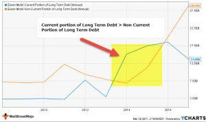

Understanding the Current Portion of Long-Term Debt (CPLTD) is fundamental for interpreting financial statements accurately. CPLTD refers to the segment of a company's long-term debt that is due within the forthcoming year and is a crucial indicator of a company's short-term financial obligations. It provides insight into the immediate debt repayment obligations that a company faces, which in turn affects liquidity ratios, such as the current ratio and the quick ratio. These ratios are essential for evaluating a company's financial stability in the short term, influencing both investor and creditor decisions.

Debt classification in corporate finance divides debt into current liabilities and long-term liabilities based on their repayment timelines. Current liabilities are obligations that the company needs to settle within one financial year, which includes CPLTD, while long-term liabilities extend beyond that period. Proper classification aids businesses in managing their cash flow and strategizing financial stability.

Algorithmic trading, a transformative force in today's financial markets, employs complex algorithms to execute trades at high speeds and volumes. It is increasingly relevant to financial analysis, where rapid data processing and pattern identification in large datasets of corporate financial statements, including debt obligations, are vital. Algorithmic trading systems can identify trends and risks in a company's debt structure, enhancing market efficiency and investment strategies.

The intersection of CPLTD, long-term debt, and algorithmic trading is significant. Accurate analysis of a company's debt structure helps algorithmic traders make informed decisions, improving the prediction of financial trends and investment risks.

For investors and financial analysts, understanding CPLTD and debt classification is indispensable. It aids in assessing a company's financial health, liquidity position, and risk, which are critical for making informed financial and investment decisions. Embracing these concepts enhances strategic financial planning and paves the way for leveraging algorithmic trading in maximizing financial returns while minimizing risks.

## Table of Contents

## Understanding CPLTD: Definition and Significance

The Current Portion of Long-Term Debt (CPLTD) is a critical component of a company's balance sheet, representing the portion of long-term debt that must be repaid within the next 12 months. It plays a pivotal role in financial accounting and analysis, offering insights into a company's short-term financial health and obligations.

CPLTD influences a company’s [liquidity](/wiki/liquidity-risk-premium), which is the ability to meet short-term obligations using liquid assets. Liquidity ratios like the current ratio and the quick ratio are directly affected by CPLTD. The current ratio, defined as:

$$
\text{Current Ratio} = \frac{\text{Current Assets}}{\text{Current Liabilities}}
$$

includes CPLTD in the denominator. A higher CPLTD increases current liabilities, potentially reducing the current ratio, indicating less liquidity.

Similarly, the quick ratio, which excludes inventory from current assets, is calculated as:

$$
\text{Quick Ratio} = \frac{\text{Current Assets} - \text{Inventory}}{\text{Current Liabilities}}
$$

This ratio provides a more stringent measure by assessing a company's ability to cover short-term obligations without relying on inventory sales. An increased CPLTD lowers the quick ratio, suggesting a strained ability to settle debts rapidly.

The impact of CPLTD on short-term financial obligations and liquidity metrics extends further into a company's financial strategy. High levels of CPLTD require more immediate cash outflows, pressuring a firm’s liquidity. This situation necessitates prudent cash flow management to ensure sufficient liquidity to meet debt obligations and operating expenses without distress.

For investors and creditors, CPLTD serves as a vital indicator of financial health. It provides insights into the company’s leverage and its capability to meet upcoming debt obligations. A proportionally large CPLTD relative to total long-term debt could signal potential liquidity issues, prompting investors and creditors to scrutinize the company's cash flow generation capacity meticulously.

In summary, CPLTD is not only a fundamental element of a company's balance sheet but also a crucial metric influencing liquidity, financial ratios, and the overall assessment of financial stability by stakeholders such as investors and creditors. Its careful management is key to maintaining financial health and securing favorable financial conditions.

## Classification of Debt: Current vs. Long-Term

In financial statements, the classification of debt is crucial for assessing a company's financial health and stability. Debts are primarily divided into two categories: current liabilities and long-term liabilities. This distinction is made primarily based on the repayment horizons associated with each type of obligation.

**Current Liabilities**

Current liabilities are obligations that a company is expected to settle within its normal operating cycle, typically one year. These include debts such as accounts payable, short-term loans, and the current portion of long-term debt (CPLTD), which represents the portion of long-term obligations due within the next 12 months. The classification affects a company's liquidity measures, as current liabilities are subtracted from current assets to determine the working capital, a critical metric for short-term financial health.

Mathematically, if $CA$ represents current assets and $CL$ represents current liabilities, then working capital is given by:

$$
\text{Working Capital} = CA - CL
$$

Current liabilities contribute directly to liquidity ratios such as the current ratio and quick ratio, which help assess a company’s capability to meet its short-term obligations. These ratios are calculated as follows:

- **Current Ratio**: $\frac{CA}{CL}$
- **Quick Ratio**: $\frac{(\text{Cash} + \text{Marketable Securities} + \text{Receivables})}{CL}$

**Long-Term Liabilities**

Long-term liabilities are obligations not due within the current operating cycle, with repayment typically scheduled over multiple years. This category includes bonds payable, long-term lease obligations, and any long-duration loans. Long-term liabilities are crucial for understanding a company's long-term solvency and financing strategies. They affect leverage ratios like the debt-to-equity ratio, which is vital for investors and creditors evaluating the risk and return profile of a company.

Businesses manage these debts strategically to optimize their financial stability, balancing short-term liquidity requirements with long-term growth and investment opportunities. Effective debt management involves negotiating favorable terms, such as interest rates and covenants, and deciding on the appropriate mix of short-term versus long-term financing.

Companies report these liabilities in a classified balance sheet, which separates current from non-current items, providing a clear picture of liquidity and financial commitments. By classifying liabilities accurately, businesses ensure compliance with accounting standards and enhance transparency for stakeholders analyzing the company's financial position. Accurate recording and classification of liabilities aid in effective financial planning, risk management, and strategy formulation.

## Algorithmic Trading and Debt Analysis

Algorithmic trading refers to the use of computer algorithms to automate the process of trading financial instruments, such as stocks, bonds, and other securities. It leverages complex mathematical models and a vast amount of market data to execute trades with speed and precision far beyond human capability. This high-frequency trading methodology significantly impacts financial markets by providing liquidity and enhancing market efficiency through rapid execution and lower transaction costs.

In the context of analyzing corporate financial data, including debt, [algorithmic trading](/wiki/algorithmic-trading) plays a crucial role. The algorithms are designed to parse and interpret vast quantities of market and financial data in real-time, including a company’s debt structure. By assessing metrics such as the Current Portion of Long-Term Debt (CPLTD) and overall debt obligations, these algorithms can identify a company's financial strengths and weaknesses. This evaluation is important for trading strategies that depend on a company’s financial health metrics.

Algorithms aid in identifying financial strengths and risks associated with debt structures by employing a multitude of data analytics techniques. For instance, [machine learning](/wiki/machine-learning) models can be trained to predict a company’s future financial stability based on its current debt level, interest costs, and repayment capabilities. By recognizing patterns and anomalies in the financial statements, these algorithms can signal potential risks or opportunities, thus informing investment decisions.

The relationship between accurate debt profiling and successful algorithmic trading strategies is significant. Algorithms depend on precise and timely data to make informed decisions, and the accurate classification and understanding of debt are crucial components of this data. Misclassification or misunderstanding of a company's debt could lead to erroneous predictions and potentially costly trading errors. Therefore, a robust debt profiling process involves scrutinizing the terms of the debt, maturity schedules, interest obligations, and potential refinancing risks.

In conclusion, algorithmic trading’s ability to analyze and interpret corporate financial data, including debt, provides a refined and informed approach to trading in modern financial markets. By leveraging advanced algorithms, traders and analysts can rapidly assess a company’s financial health and execute strategies that enhance investment decision-making. This integration ensures that trading strategies are aligned with a comprehensive understanding of fiscal realities, thus optimizing financial outcomes.

## Interpreting CPLTD in Financial Analyses

Current Portion of Long-Term Debt (CPLTD) represents the segment of a company’s long-term debt that is due for payment within the next fiscal year. Analyzing CPLTD is crucial for evaluating a company’s short-term debt repayment capability. This analysis provides insights into the company’s immediate financial obligations and assists investors and financial analysts in assessing the firm’s liquidity position.

### Impact of CPLTD on Financial Health

CPLTD is a pivotal component when examining a company's liability structure in conjunction with cash flow statements and liquidity measures. The amount of CPLTD relative to a company’s total current liabilities is a direct indicator of the firm's immediate debt repayment pressure. Consequently, an increase in CPLTD without a corresponding increase in cash flow or current assets can indicate financial strain. For thorough analysis, it is advisable to evaluate CPLTD alongside key liquidity ratios such as the current ratio and quick ratio:

- **Current Ratio** = $\frac{\text{Current Assets}}{\text{Current Liabilities}}$

- **Quick Ratio** = $\frac{\text{Current Assets} - \text{Inventory}}{\text{Current Liabilities}}$

High CPLTD levels can decrease these ratios, suggesting potential liquidity issues. Therefore, investors should observe shifts in these ratios for signs of financial stress.

### Analyzing CPLTD with Cash Flow Statements

Cash flow statements provide details on the actual inflow and outflow of cash, which aids in assessing whether a company generates sufficient cash to meet its CPLTD obligations. A critical measure in this evaluation is the operating cash flow (OCF):

- **Operating Cash Flow (OCF)** = Net cash generated from operating activities

Analyzing the OCF against CPLTD provides insight into whether the company's operating activities can support its near-term debt repayments. For instance, a robust OCF that exceeds CPLTD indicates satisfactory coverage, reducing the risk of liquidity crises.

### Strategies to Manage and Reduce CPLTD

Effective management and reduction of CPLTD involve strategic financial planning aimed at maintaining financial health and enhancing investment appeal. Some strategies include:

1. **Refinancing Existing Debt**: Companies can negotiate to restructure their debt, potentially extending repayments and reducing the CPLTD.

2. **Improving Cash Flow Management**: Enhancing operational efficiencies to optimize cash flow can ensure better coverage of CPLTD. Techniques involve tightening credit policies and accelerating receivables collections.

3. **Asset Liquidation**: Selling non-essential or underperforming assets can generate cash to repay CPLTD, thereby reducing short-term liabilities.

4. **Equity Financing**: Issuing additional equity can raise capital to address CPLTD, avoiding reliance on debt financing.

Each of these strategies requires careful consideration of the company's overall strategic and financial objectives. By reducing CPLTD and optimizing the company's liquidity profile, businesses can present themselves as more attractive investments. Financial analysts and investors continuously monitor these dynamics to predict the company’s financial trajectory and decision-making efficacy.

## Case Studies and Practical Applications

Analyzing case studies where companies effectively manage their Current Portion of Long-Term Debt (CPLTD) provides concrete insights into financial strategy and market success. A notable example is the management strategies employed by General Electric (GE) during its financial restructuring in the late 2010s. GE faced significant long-term debt obligations, yet successfully navigated liquidity challenges by renegotiating terms to shift portions of long-term debt into short-term obligations only when favorable terms were secured. This approach allowed GE to maintain liquidity ratios conducive to attracting investors and satisfying creditors.

Similarly, Apple Inc. demonstrates strategic CPLTD management by leveraging its substantial cash reserves to assiduously manage short-term liabilities, which in turn strengthens its balance sheet. Apple's method involves maintaining a conservative debt profile where the current portion is carefully matched against its cash flow, ensuring liquidity and operational stability.

Algorithmic trading has also played a pivotal role in modern debt analysis, facilitating more precise financial assessments. A study conducted on the effects of algorithmic trading systems at Goldman Sachs illustrates enhanced debt analysis capabilities, where algorithms are employed to parse large datasets for actionable insights on debt holdings. These systems can automatically track corporate debt levels, enabling traders and analysts to execute timely trades based on near real-time analysis.

For instance, algorithms that detect anomalies in debt structures contributed to the identification of financial strengths and weaknesses within Deutsche Bank's loan [books](/wiki/algo-trading-books), which were undetected through conventional analysis. This approach not only curtails investment risks but also supports strategic decision-making to exploit market conditions.

Lessons from these examples emphasize the necessity of integrating advanced technological tools into financial strategies. Efficient management of CPLTD requires a balance between maintaining liquidity and optimizing long-term financing. Innovative approaches that incorporate algorithmic analyses to assess and predict the impacts of debt structures afford companies competitive advantage in financial markets. These solutions signify the evolution of debt management from traditional methodologies to ones replete with data-driven insights, substantially benefiting financial health and investment strategies.

## Conclusion

The relationship between the current portion of long-term debt (CPLTD), long-term debt classification, and algorithmic trading plays a pivotal role in financial scrutiny and investment strategy. Understanding CPLTD helps stakeholders gauge a company's ability to meet its short-term liabilities, offering insights into its immediate financial health. The precise classification of a company’s liabilities—whether they are current or long-term—is fundamental for the creation of accurate financial statements, influencing liquidity ratios that depict the firm’s fiscal stability.

Algorithmic trading, with its capacity to process vast amounts of financial data swiftly, enhances the analysis of these debt structures. By integrating sophisticated algorithms, investors can swiftly identify the strengths and vulnerabilities in a corporation’s debt profile, enabling informed trading strategies. This technological advancement allows for more precise forecasting and risk management, making it a crucial component of modern financial analysis.

These concepts jointly underscore a robust framework for strategic financial planning. Companies that effectively manage and classify their debt not only improve liquidity and solvency ratios but also enhance their market appeal. The algorithms capable of analyzing and predicting debt behaviors significantly bolster a firm's strategic planning through better foresight and improved financial decision-making processes.

As financial landscapes evolve, the continuous application and understanding of these principles remain critical. Advanced financial analysis techniques allow practitioners to adapt to changing economic conditions, ensuring resilient and informed financial strategies. For stakeholders, maintaining an up-to-date grasp of these methodologies ensures sound investment decisions, ultimately fostering stable and sustainable fiscal growth.

## References & Further Reading

[1]: ["Financial Statement Analysis"](https://www.investopedia.com/terms/f/financial-statement-analysis.asp) by Martin S. Fridson and Fernando Alvarez

[2]: Brealey, R.A., Myers, S.C., & Allen, F. (2020). ["Principles of Corporate Finance."](https://www.amazon.com/Principles-Corporate-Finance-Richard-Brealey/dp/1260565556) McGraw-Hill Education.

[3]: ["Inside the Black Box: A Simple Guide to Quantitative and High Frequency Trading"](https://www.amazon.com/Inside-Black-Box-Quantitative-Frequency/dp/1118362411) by Rishi K. Narang

[4]: Damodaran, A. (2012). ["Investment Valuation: Tools and Techniques for Determining the Value of Any Asset."](https://books.google.com/books/about/Investment_Valuation.html?id=5SRHAAAAQBAJ) Wiley Finance.

[5]: ["Trading and Exchanges: Market Microstructure for Practitioners"](https://www.amazon.com/Trading-Exchanges-Market-Microstructure-Practitioners/dp/0195144708) by Larry Harris