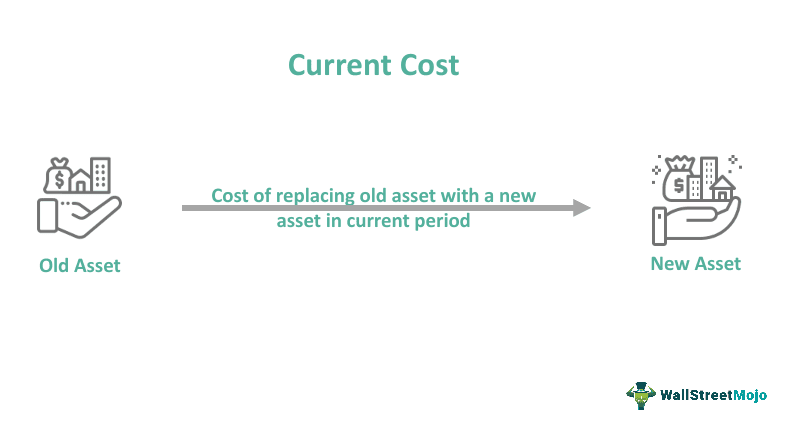

In today's fast-paced financial world, understanding the nuances of pricing in trading is crucial. The trading market encompasses a wide array of pricing terms and types, reflecting the varying worth of securities at any given moment. Prices are not only referred to as market value or cash price but also include various functions and types, such as spot prices, bid and ask prices, and trade prices. These distinctions are integral to formulating and executing effective trading strategies.

Furthermore, the concept of current prices serves as a fundamental indicator of the market value of securities, providing a baseline for trading decisions. Additionally, algorithmic trading has revolutionized the financial markets by introducing unprecedented levels of precision and speed in transactions. Through sophisticated pre-defined algorithms, traders can automate trading activities, enhance execution, and remove emotional biases from decision-making processes.



The interaction between pricing mechanisms and algorithmic trading significantly influences trading dynamics and strategic decisions. Understanding these elements is vital as they collectively shape the landscape of modern trading markets. As technology advances and the trading environment evolves, staying informed on these topics remains essential for traders and investors seeking to navigate this complex financial arena effectively.

## Table of Contents

## Understanding Price Synonyms and Types

In trading, understanding the various synonyms and types of prices is fundamental to comprehending market dynamics and making informed investment decisions. Prices are often referred to by different terms that traders use interchangeably, such as "market value," "current value," and "cash price." Each of these terms is vital as they collectively signify the worth of a security at any given moment across various trading contexts.

The concept of price in trading is not monolithic. Distinctions such as spot prices, bid and ask prices, and trade prices each fulfill unique roles in trading strategies and market operations. The spot price represents the current price at which a particular asset can be bought or sold for immediate delivery. It is a prevalent indicator in commodities and currency trading. For instance, if a trader wants to purchase a commodity like oil, the spot price will determine its current cost per barrel.

Bid and ask prices are integral components of price determination in financial markets. The bid price is the highest price a buyer is willing to pay for a security, while the ask price is the lowest price a seller is prepared to accept. The difference between the bid and ask prices is known as the spread, which can be a critical measure of market liquidity and transaction cost. A narrower spread typically indicates a more liquid market, where buying and selling can occur with minimal price movement.

Trade prices are the prices at which trades actually occur, reflecting the equilibrium point where buyers and sellers agree on a transaction. They provide historical data that traders analyze to understand market trends and make future predictions. In financial models, the trade price is used as an input for calculating returns and [volatility](/wiki/volatility-trading-strategies).

Grasping the nuances among these various price types is essential for investors and traders as it influences almost every aspect of trading and financial decision-making. For example, understanding that a tight bid-ask spread might signify minimal transaction costs can make a considerable difference when dealing in high-[volume](/wiki/volume-trading-strategy) trades or when [liquidity](/wiki/liquidity-risk-premium) is a concern. Furthermore, knowing how spot prices can impact future contracts or derivatives adds another layer of strategy in investment planning.

In summary, the lexicon of pricing in the trading context is diverse and multifaceted, but understanding these synonyms and types of prices is critical. It serves as a cornerstone for evaluating market opportunities and developing effective trading strategies, thereby enhancing the decision-making process for traders across numerous market segments.

## The Concept of Current Price

Current price refers to the most recent selling price at which a security, commodity, or asset is traded in the market. It serves as an immediate indicator of the asset's market value. This price is pivotal as it provides a reference point for both buyers and sellers, helping them assess the current market conditions. However, the current price does not necessarily predict the exact price at which the next transaction will occur, as it is subject to continuous fluctuations due to variable market factors.

The dynamics of the current price are largely influenced by the forces of supply and demand. An increase in demand or a decrease in supply will typically lead to a rise in the current price, as buyers are willing to pay more to acquire the asset. Conversely, an increase in supply or a decrease in demand generally results in a price drop, as sellers may lower prices to attract buyers. This continuous interplay emphasizes the fluid nature of current prices.

For traders, understanding the factors that lead to changes in current prices is crucial. By analyzing market trends, economic indicators, and investor sentiment, traders can anticipate potential movements in current prices. This knowledge allows them to time their entry and [exit](/wiki/exit-strategy) from markets more effectively, optimizing their trading strategies to maximize profits or minimize losses.

A quantitative approach to understanding current price dynamics often involves using mathematical models and algorithms to process vast amounts of market data. These models can include regression analysis to predict price movements or [machine learning](/wiki/machine-learning) algorithms to identify patterns not immediately evident. In Python, for example, libraries such as pandas, NumPy, and scikit-learn can assist traders in analyzing historical price data and deriving insights into possible future trends.

```python
import pandas as pd
import numpy as np
from sklearn.linear_model import LinearRegression

# Sample data setup
data = {'Date': ['2023-01-01', '2023-01-02', '2023-01-03'],
        'Price': [100, 102, 101]}

# Create DataFrame
df = pd.DataFrame(data)

# Ensure Date is in datetime format
df['Date'] = pd.to_datetime(df['Date'])

# Calculate daily returns
df['Return'] = df['Price'].pct_change()

# Prepare data for regression
df.dropna(inplace=True)  # Drop NA values generated by pct_change
X = np.array((df['Date'] - df['Date'].min()).dt.days).reshape(-1, 1)  # Convert dates to ordinal
y = df['Return'].values

# Linear Regression model
model = LinearRegression()
model.fit(X, y)

# Predicted price movement
df['PredictedReturn'] = model.predict(X)

# Display the DataFrame with predicted returns
print(df)
```
In essence, comprehending the concept of current price and the factors that affect its fluctuation is integral for traders to navigate the financial markets effectively. Competence in analyzing these price movements can lead to more strategic and informed trading decisions.

## Role of Algorithmic Trading in Modern Markets

Algorithmic trading, commonly abbreviated as algo trading, involves the utilization of pre-defined computer algorithms to automate trading decisions and actions. This method uses specified criteria such as price, volume, and timing to execute trades with minimal human intervention. The primary objective is to leverage computational power to enhance the speed and precision of trading activities.

Algo trading's elimination of human emotions from trading activities results in improved decision-making. Human traders often face challenges such as emotional biases and fatigue, which can lead to inconsistent trading actions. By employing algorithms, these issues are mitigated, ensuring a consistent approach based on set parameters. This consistency not only improves execution speed but also enhances accuracy in trade operations.

Various [algorithmic trading](/wiki/algorithmic-trading) strategies cater to different market conditions:

1. **Trend-following strategies**: These are based on identifying and capitalizing on momentum in price movements. For instance, if a stock is showing an upward trend, the algorithm will place buy orders to benefit from the anticipated rise.

2. **Arbitrage strategies**: These strategies exploit price differences of the same asset in different markets. By buying low in one market and selling high in another, traders can lock in profits. The algorithms are designed to identify these disparities and execute trades rapidly before the price differences vanish.

3. **Statistical analysis**: This involves using historical data and statistical methods to forecast future price movements. Models such as mean reversion, where prices are expected to revert to a long-term mean, are deployed to generate trading signals.

Algorithmic trading is extensively used in various financial instruments including equities, foreign exchange ([forex](/wiki/forex-system)), and derivatives. Its prevalence is due to significant technological advancements that have enabled the handling of large volumes of data and execution of complex strategies in real-time. These technological capabilities allow for the rapid detection of trading opportunities that manual methods would likely miss.

However, algorithmic trading is not without challenges. It can significantly impact the market. Large volumes of trades executed in a short time can lead to increased volatility, which in turn might affect market stability. Another concern is the "flash crash" phenomenon, where rapid sell-offs triggered by algorithms can cause sudden and severe price drops.

Additionally, algo trading demands a robust technological infrastructure capable of processing vast amounts of data at high speeds. The necessity for low-latency systems is paramount to ensure that trade orders are executed promptly in highly competitive markets. Furthermore, ensuring the security and resilience of trading systems against cyber threats also poses a significant challenge.

In conclusion, while algorithmic trading offers substantial benefits in terms of speed and efficiency, it also requires careful management of its inherent risks and technical demands. Balancing these factors is essential for harnessing the full potential of algorithmic trading in modern markets.

## Interplay Between Pricing and Algorithmic Trading

Algorithmic trading significantly influences pricing by facilitating rapid transactions, thereby affecting the dynamics of current prices. This rapid execution is made possible by sophisticated algorithms that process market data in real-time, allowing traders to make swift decisions based on predetermined criteria such as price movements and trade volumes.

The efficiency of algorithms in handling large trading volumes can lead to changes in market liquidity and volatility. When trading volumes are high, algorithms can quickly absorb buying and selling pressures, which may stabilize prices under normal market conditions. Conversely, in situations of reduced liquidity, the same speed can amplify price swings, contributing to increased volatility. An example of this can be observed during flash crashes, where algorithmic trading triggers rapid price declines due to cascading sell orders.

Traders leverage algorithmic trading to exploit price discrepancies by identifying [arbitrage](/wiki/arbitrage) opportunities across different markets or securities. These algorithms can execute trades in milliseconds, capturing even minute differences in asset prices before the market adjusts. For example, a simple arbitrage algorithm may continuously monitor prices of a particular stock on different exchanges and execute trades when the price difference exceeds transaction costs, securing a risk-free profit.

Optimizing order execution is another critical benefit of algorithmic trading. Algorithms can break down large orders into smaller chunks, executing them over a period to minimize market impact and avoid substantial price changes that could occur if the entire order were placed at once. Techniques like volume-weighted average price (VWAP) and time-weighted average price (TWAP) strategies are often employed to achieve better execution prices.

Algorithmic trading is also a tool for risk management. By setting stop-loss and take-profit levels within trading algorithms, traders can automatically exit positions without the need to constantly monitor the market. This automation ensures adherence to a predetermined risk management strategy, mitigating potential losses.

The mutual influence of pricing strategies and algorithmic trading shapes the trading ecosystem by continually adjusting how assets are bought and sold. Traders who understand and implement these practices can gain better market positioning and enhance profit potential. Adapting to algorithmic-driven environments requires a keen understanding of both the pricing dynamics and the technical infrastructure supporting algorithmic systems. As technology advances, the symbiotic relationship between pricing and algorithmic trading will likely evolve, presenting both new opportunities and challenges to market participants.

## Conclusion

Navigating the complexities of the trading world requires a deep understanding of pricing mechanisms and the role of technology. The dynamic nature of financial markets demands that traders and investors remain astute and adaptable. Algorithmic trading, often referred to as algo trading, plays a crucial part in contemporary trading by enhancing the efficiency of price assessments and executions. Through sophisticated algorithms programmed to analyze market data, execute trades based on pre-defined criteria, and optimize order processing, algorithmic trading provides a competitive advantage. This optimization leads to more precise and faster trading actions, minimizing the potential for human error and emotional bias.

Moreover, understanding the plethora of synonyms and types of prices—such as market value, spot price, bid and ask prices—is essential for informed trading decisions. These terms reflect the complex nature of market valuation and serve distinct purposes in various trading strategies. A firm grasp of these concepts equips traders with the ability to evaluate investment opportunities and market conditions accurately.

As algorithmic trading evolves alongside technological advancements, its influence on market pricing will continue to grow. This evolution presents both opportunities and challenges, as traders navigate issues related to market impact, liquidity, and infrastructure requirements. Embracing these changes and leveraging technology effectively will be critical for maximizing profitability and maintaining a robust market position.

Keeping abreast of developments in algorithmic trading and pricing strategies is not merely advantageous but essential for success in today's financial markets. As markets become increasingly interconnected and data-driven, the ability to adapt to evolving methodologies and technologies will determine the sustainability and success of traders and investors.

## References & Further Reading

[1]: Bergstra, J., Bardenet, R., Bengio, Y., & Kégl, B. (2011). ["Algorithms for Hyper-Parameter Optimization."](https://dl.acm.org/doi/10.5555/2986459.2986743) Advances in Neural Information Processing Systems 24.

[2]: ["Advances in Financial Machine Learning"](https://www.amazon.com/Advances-Financial-Machine-Learning-Marcos/dp/1119482089) by Marcos Lopez de Prado

[3]: ["Evidence-Based Technical Analysis: Applying the Scientific Method and Statistical Inference to Trading Signals"](https://www.amazon.com/Evidence-Based-Technical-Analysis-Scientific-Statistical/dp/0470008741) by David Aronson

[4]: ["Machine Learning for Algorithmic Trading"](https://github.com/stefan-jansen/machine-learning-for-trading) by Stefan Jansen

[5]: ["Quantitative Trading: How to Build Your Own Algorithmic Trading Business"](https://www.amazon.com/Quantitative-Trading-Build-Algorithmic-Business/dp/1119800064) by Ernest P. Chan