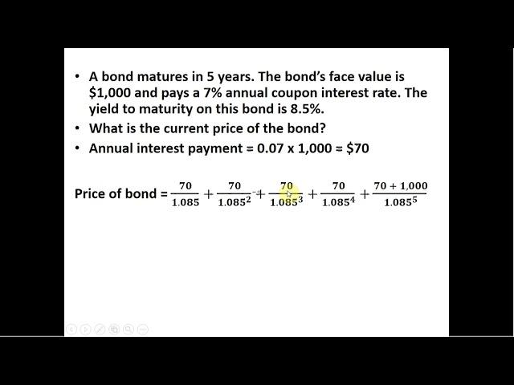

## Table of Contents

## What is the definition of 'current price'?

The current price is the price of something right now. It is what you would pay if you bought it at this very moment. For example, if you are looking at the price of a stock, the current price is what it is trading at that instant.

This price can change often, especially for things like stocks or cryptocurrencies. It is affected by many things, like how many people want to buy it and how many people want to sell it. Keeping an eye on the current price can help you decide when to buy or sell.

## How is the current price determined in the stock market?

In the stock market, the current price of a stock is determined by the forces of supply and demand. When more people want to buy a stock than sell it, the price goes up. This happens because buyers are willing to pay more to get the stock. On the other hand, if more people want to sell a stock than buy it, the price goes down. Sellers have to lower their price to attract buyers.

The actual price at any moment is set by the most recent trade. This means the current price is what the last buyer and seller agreed on. Stock exchanges use something called an [order book](/wiki/order-book-trading-strategies) to keep track of all the buy and sell orders. The order book shows all the different prices people are willing to buy or sell at. When a buyer and seller agree on a price, that becomes the new current price until the next trade happens.

## What factors can influence the current price of a product or service?

The current price of a product or service can be influenced by many things. One big [factor](/wiki/factor-investing) is how many people want to buy it. If lots of people want something, the price usually goes up because people are willing to pay more to get it. Another factor is how much it costs to make the product or provide the service. If it costs more to make or provide, the price might go up so the company can still make money.

Another thing that can affect the price is competition. If there are other companies selling similar things, they might lower their prices to try to get more customers. This can make other companies lower their prices too. Also, things like the economy, taxes, and even the weather can change the price. For example, if the economy is doing well, people might have more money to spend, which can push prices up.

Sometimes, things like news and events can also change the price. If there's good news about a company, people might want to buy its products more, which can raise the price. On the other hand, bad news can make people less interested and lower the price. All these factors together decide the current price of a product or service.

## How often does the current price change for stocks?

The current price of a stock can change many times in a single day. It can even change every few seconds when the stock market is open. This is because lots of people are buying and selling stocks all the time, and each time they agree on a new price, that becomes the current price.

How often the price changes can depend on how popular the stock is. If a lot of people are interested in a stock, like a big company everyone knows, the price might change more often. But for smaller companies that not as many people are watching, the price might not change as much. Also, the price usually changes more during busy times of the day, like when the market opens or closes.

## What is the difference between the current price and the market price?

The current price and the market price are actually the same thing when you're talking about stocks or other things that are traded a lot. The current price is what you would pay for something right now. It's the price of the most recent trade. The market price is also what people are willing to pay for something at that moment. So, for stocks, the current price and the market price are the same because they both mean the price of the last trade.

But sometimes, people might use "market price" to talk about a general idea of what something is worth. For example, if you're selling your house, you might say the market price is what similar houses in your area are selling for. In this case, the current price would be what someone actually offers to pay for your house at that moment. So, while they can mean the same thing, "market price" can sometimes be used more loosely to talk about the general value of something, not just the exact price at a specific time.

## How can one find the current price of a commodity?

You can find the current price of a commodity by looking at websites that track commodity prices. Websites like Bloomberg, Reuters, or even the specific commodity exchange like the Chicago Mercantile Exchange (CME) will show you the current price. These sites update the prices often, so you can see what the price is right now. If you want to know the price of gold, for example, you can go to a site like Kitco and see the current price per ounce.

Another way to find the current price of a commodity is by using a financial app on your phone. Many apps, like those from big banks or investment firms, have tools that show real-time prices for commodities. You can also call a broker who deals with commodities. They can tell you the current price and might even give you advice on buying or selling. Just remember, the price can change quickly, so always check the most recent information.

## What role do supply and demand play in setting the current price?

Supply and demand are the main things that decide the current price of something. When there is a lot of something, like apples in a store, and not many people want to buy them, the price will go down. This is because the store wants to sell the apples before they go bad. But if there are not many apples and lots of people want to buy them, the price will go up. This is because people are willing to pay more to get the apples they want.

These ideas work the same way for everything, not just apples. If a new toy comes out and everyone wants it, the price might go up because the store knows people will pay more to get it. But if nobody wants the toy anymore, the store might lower the price to sell it. So, the current price is always changing because it depends on how many people want something and how much of it there is.

## How does inflation affect the current price of goods?

Inflation means that the prices of things go up over time. When inflation happens, the money you have can buy less than it used to. This is because the cost of making things, like food or clothes, goes up. Companies then have to charge more for their products to cover these higher costs. So, if you see the current price of a candy bar go up, it might be because of inflation.

Inflation can also make people expect prices to keep going up. If people think prices will be higher next month, they might buy things now, which can make the current price go up even more. But if inflation gets too high, it can make it hard for people to afford things. Governments and central banks try to keep inflation at a level that helps the economy grow without making prices go up too fast.

## What are some strategies for predicting changes in the current price of an asset?

One way to predict changes in the current price of an asset is by looking at past prices. People often study charts and graphs to see how the price has moved before. They look for patterns, like if the price goes up and down at certain times of the year. This can help them guess what might happen next. Another thing to look at is news and events that might affect the asset. If a company is about to release a new product, the price of its stock might go up because people think it will do well.

Another strategy is to watch what other people are doing. If lots of people are buying an asset, it might mean the price will go up because more people want it. On the other hand, if lots of people are selling, the price might go down. You can also use tools like technical analysis, which uses math to try to predict price changes. These tools look at things like moving averages and other numbers to help guess where the price might go next. But remember, no one can predict the future perfectly, so it's always a bit of a guess.

## How do real-time data feeds impact the accuracy of current price information?

Real-time data feeds make the current price information more accurate because they update the prices as soon as they change. This means you see the price right now, not from a few minutes or hours ago. For things like stocks or cryptocurrencies that change a lot, having real-time data helps you know exactly what the price is at any moment. This can be really helpful if you are trying to buy or sell something at the best possible price.

However, even with real-time data, there can still be small delays. These delays can happen because of how fast the internet is or how quickly the data gets from the place where the price changes to the place where you see it. But these delays are usually very small, so the price you see is still very close to the real current price. Using real-time data feeds is the best way to make sure you have the most accurate and up-to-date price information.

## What advanced tools or algorithms are used by professionals to analyze current price trends?

Professionals use many advanced tools and algorithms to look at current price trends. One common tool is technical analysis software. This software uses math to find patterns in price data. It can show things like moving averages, which help people see if a price is going up or down over time. Another tool is [machine learning](/wiki/machine-learning) algorithms. These can learn from past price data and try to guess what might happen next. They look at lots of different things, like how much people are buying or selling, to make their guesses.

Another important tool is sentiment analysis. This looks at what people are saying on social media, news, and other places to see if they feel good or bad about an asset. If a lot of people are talking positively about a stock, it might mean the price will go up. Professionals also use high-frequency trading algorithms. These are very fast computers that can buy and sell things in just a few seconds. They use real-time data to make quick decisions and try to make money from small changes in price. All these tools help professionals make better guesses about where prices might go next.

## How can understanding the current price help in making informed investment decisions?

Understanding the current price is really important when you're making choices about investing. It tells you what something is worth right now, so you can decide if it's a good time to buy or sell. If the price is low and you think it will go up, you might want to buy it. But if the price is high and you think it might go down, you might want to sell it or wait for a better time to buy.

By keeping an eye on the current price, you can also see trends and patterns. This can help you guess where the price might go next. If you see the price going up over time, it might be a good sign to invest. But if it's going down, you might want to be careful. Using the current price to make decisions can help you make smarter choices and maybe even make more money from your investments.

## References & Further Reading

[1]: Bergstra, J., Bardenet, R., Bengio, Y., & Kégl, B. (2011). ["Algorithms for Hyper-Parameter Optimization."](https://dl.acm.org/doi/10.5555/2986459.2986743) Advances in Neural Information Processing Systems 24.

[2]: ["Advances in Financial Machine Learning"](https://www.amazon.com/Advances-Financial-Machine-Learning-Marcos/dp/1119482089) by Marcos Lopez de Prado

[3]: ["Evidence-Based Technical Analysis: Applying the Scientific Method and Statistical Inference to Trading Signals"](https://www.amazon.com/Evidence-Based-Technical-Analysis-Scientific-Statistical/dp/0470008741) by David Aronson

[4]: ["Machine Learning for Algorithmic Trading"](https://github.com/stefan-jansen/machine-learning-for-trading) by Stefan Jansen

[5]: ["Quantitative Trading: How to Build Your Own Algorithmic Trading Business"](https://www.amazon.com/Quantitative-Trading-Build-Algorithmic-Business/dp/1119800064) by Ernest P. Chan