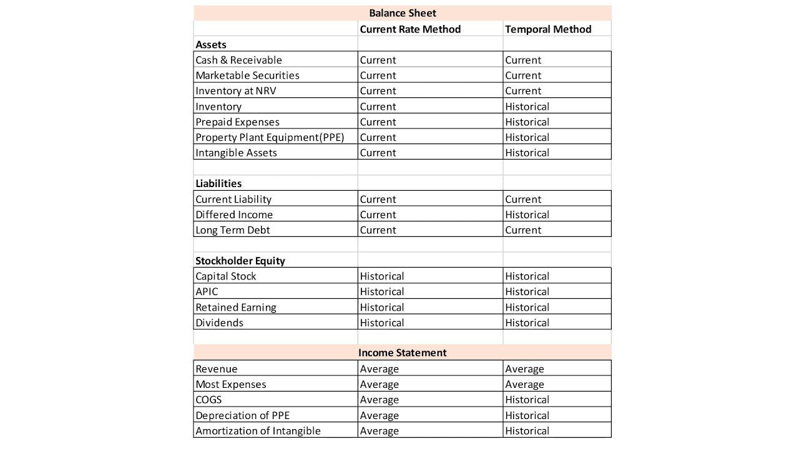

## Table of Contents

## What is the Current Rate Method in financial reporting?

The Current Rate Method is a way of translating the financial statements of a foreign subsidiary into the parent company's currency. When a company has operations in another country, it needs to convert those financial numbers into its own currency to make sense of them. The Current Rate Method does this by using the current exchange rate for all assets and liabilities on the balance sheet. This means that if the exchange rate changes, the value of those assets and liabilities in the parent company's currency will also change.

This method is often used when the foreign operation is fairly independent and not closely tied to the parent company's operations. It can make the financial statements more volatile because exchange rates can change a lot. If the foreign currency gets stronger, the value of the assets in the parent's currency goes up. If it gets weaker, the value goes down. This can make it harder to predict the financial performance of the company, but it gives a more accurate picture of the current value of the foreign subsidiary's assets and liabilities.

## How does the Current Rate Method differ from other translation methods?

The Current Rate Method is different from other translation methods mainly in how it handles the conversion of foreign financial statements into the parent company's currency. While the Current Rate Method uses the exchange rate at the balance sheet date for all assets and liabilities, other methods like the Temporal Method use different rates for different items. For example, the Temporal Method uses historical rates for non-monetary items like inventory and fixed assets, and current rates for monetary items like cash and receivables. This means that under the Temporal Method, the value of non-monetary items doesn't change with fluctuations in the exchange rate, which can make the financial statements less volatile but also less reflective of current values.

Another key difference is how these methods affect the income statement. The Current Rate Method translates the entire income statement at the average exchange rate for the period, which can lead to significant translation gains or losses if the exchange rate changes a lot. On the other hand, the Temporal Method can result in transaction gains or losses on the income statement because it uses different rates for different items, and these gains or losses can impact the reported net income. The choice between these methods can therefore have a big impact on how a company's financial performance is presented and can be influenced by factors like the level of integration between the parent and the foreign subsidiary.

## What are the key steps involved in applying the Current Rate Method?

To use the Current Rate Method, you start by finding the exchange rate on the date of the balance sheet. This rate is used to convert all the assets and liabilities from the foreign currency to the parent company's currency. So, if you have cash, inventory, buildings, and debts in the foreign subsidiary, you change them all into the parent's currency using this one rate. This makes everything on the balance sheet reflect the current value in the parent's currency.

Next, you take the income statement and convert it using the average exchange rate for the period. This means you use the average rate over the year or quarter to change revenues, expenses, and profits into the parent's currency. This step helps to show what the foreign subsidiary's performance looks like in the parent's currency over time. Any difference between the assets and liabilities after conversion goes into a special account called "cumulative translation adjustment" in the equity section of the balance sheet.

## Can you explain the concept of functional currency in relation to the Current Rate Method?

The functional currency is the main currency that a company uses in its day-to-day business. For a foreign subsidiary, it's the currency of the country where it operates. When a parent company wants to understand its foreign subsidiary's financials, it needs to change them into its own currency, which is called the reporting currency. The choice of the functional currency is important because it decides which translation method to use, like the Current Rate Method.

The Current Rate Method is used when the functional currency of the foreign subsidiary is different from the parent company's reporting currency. With this method, all the assets and liabilities on the subsidiary's balance sheet are changed into the parent's currency using the exchange rate on the balance sheet date. The income statement is translated using the average exchange rate for the period. This way, the financial statements show what the foreign subsidiary's numbers look like in the parent's currency at the current time.

## What types of accounts are translated using the current exchange rate under this method?

When using the Current Rate Method, all the accounts on the balance sheet are translated using the current exchange rate. This means things like cash, buildings, and any debts the foreign subsidiary has are all changed into the parent company's currency using the exchange rate on the day of the balance sheet. This makes the numbers show what these items are worth in the parent's currency at that exact time.

The income statement also gets translated, but it uses a different approach. Instead of the current exchange rate, the average exchange rate for the period is used to change revenues, expenses, and profits into the parent's currency. This way, the income statement reflects the performance of the foreign subsidiary over time in the parent's currency.

## How does the Current Rate Method affect the reported financial position of a company?

When a company uses the Current Rate Method, it can make their financial numbers look different because of changes in the exchange rate. All the things a foreign part of the company owns, like buildings and money, and all the things it owes, like loans, are changed into the main company's currency using the exchange rate on the day of the balance sheet. If the exchange rate goes up or down, the value of these things in the main company's currency will also go up or down. This can make the company's financial position look more or less strong depending on how the exchange rate moves.

The income statement is also affected by the Current Rate Method. It uses the average exchange rate over the time period to change the foreign part's earnings and costs into the main company's currency. If the exchange rate changes a lot during the year, this can make the company's profits look bigger or smaller than they really are. Any difference between the value of what the foreign part owns and owes after changing them into the main company's currency goes into a special account called "cumulative translation adjustment." This account shows how much the exchange rate changes have affected the company's financial position.

## What are the advantages of using the Current Rate Method for financial reporting?

Using the Current Rate Method can make a company's financial reports more accurate. This method changes all the foreign part's money, buildings, and debts into the main company's currency using the exchange rate on the day of the report. This way, the numbers show what these things are really worth at that time. It's like taking a snapshot of the foreign part's financial health in the main company's currency, which helps the main company understand how well its foreign part is doing right now.

Another good thing about the Current Rate Method is that it can show how changes in the exchange rate affect the company's money. If the foreign part's currency gets stronger or weaker, this method will show that in the main company's financial reports. This helps the main company see how exchange rates can make its financial position look different. It also makes the reports more clear and easy to understand, because everything is changed using the same rate on the same day.

## What are the potential disadvantages or limitations of the Current Rate Method?

One downside of using the Current Rate Method is that it can make a company's financial reports go up and down a lot. This happens because the method uses the exchange rate on the day of the report to change all the foreign part's money, buildings, and debts into the main company's currency. If the exchange rate changes a lot, the value of these things in the main company's currency can change too. This can make it hard for the main company to predict how much money it will have or how well it's doing, because the numbers can swing a lot just because of the exchange rate.

Another problem with the Current Rate Method is that it might not show the real value of some things the foreign part owns or owes. For example, if the foreign part bought a building a long time ago, the value of that building in the main company's currency might not show what it's really worth now. The method uses the current exchange rate for everything, even things like buildings that don't change in value just because the exchange rate changes. This can make the financial reports less useful for understanding the true value of the foreign part's assets and liabilities.

## How does the Current Rate Method handle the translation of historical costs?

When using the Current Rate Method, historical costs like the original price paid for things like buildings or equipment are changed into the main company's currency using the exchange rate on the day of the report. This means that even if a building was bought years ago, its value in the main company's currency will be based on today's exchange rate. This can make the numbers look different from what they were when the building was bought, because the exchange rate might have changed a lot since then.

This approach can make it hard to see the real value of these historical costs. If the exchange rate goes up, the value of the building in the main company's currency will go up too, even though the building itself hasn't changed. This can make the financial reports less useful for understanding how much things are really worth, because the numbers can be affected a lot by changes in the exchange rate.

## In what scenarios is the Current Rate Method most appropriate to use?

The Current Rate Method is best used when a company's foreign part is pretty independent and doesn't rely a lot on the main company's money or resources. If the foreign part runs its own business and uses the local currency for most of its deals, this method helps show how well it's doing right now in the main company's currency. It's like taking a snapshot of the foreign part's financial health at the current exchange rate, which can be really useful for the main company to understand its foreign part's current value.

This method also works well when the main company wants to see how changes in the exchange rate can affect its money. Because it uses the current exchange rate for everything on the balance sheet, any big changes in the exchange rate will show up in the financial reports. This can help the main company plan better and understand how its financial position might change because of the exchange rate. It's a good choice when the main company needs to keep a close eye on how exchange rates can shake things up.

## How do changes in exchange rates impact financial statements when using the Current Rate Method?

When a company uses the Current Rate Method, changes in exchange rates can really shake up its financial statements. All the things a foreign part of the company owns, like money and buildings, and all the things it owes, like loans, are changed into the main company's currency using the exchange rate on the day of the report. If the exchange rate goes up, the value of these things in the main company's currency goes up too. If it goes down, their value goes down. This can make the company's financial position look a lot different just because of the exchange rate, not because anything about the company itself has changed.

The income statement also feels the impact of exchange rate changes. It uses the average exchange rate over the time period to change the foreign part's earnings and costs into the main company's currency. If the exchange rate changes a lot during the year, this can make the company's profits look bigger or smaller than they really are. Any difference between the value of what the foreign part owns and owes after changing them into the main company's currency goes into a special account called "cumulative translation adjustment." This account shows how much the exchange rate changes have affected the company's financial position, making it clear how much of the change in the financial statements is just because of the exchange rate.

## What are the international accounting standards that govern the use of the Current Rate Method?

The Current Rate Method is guided by the International Financial Reporting Standards (IFRS), specifically IAS 21, which deals with the effects of changes in foreign exchange rates. This standard says that a company should use the current exchange rate to change the financial statements of its foreign parts into the main company's currency if the foreign part's main currency is different from the main company's. This means using the exchange rate on the day of the report for all the things the foreign part owns and owes, like money and buildings. The income statement should be changed using the average exchange rate for the period, which helps show how the foreign part did over time in the main company's currency.

IAS 21 also explains how to handle any differences that come up after changing the foreign part's financials into the main company's currency. These differences go into a special account called "cumulative translation adjustment," which is part of the equity section in the financial statements. This way, the main company can see how much of the change in its financial position is just because of the exchange rate. Using the Current Rate Method helps make sure that the financial reports show a true picture of the foreign part's current value in the main company's currency, even if the exchange rate changes a lot.

## What is the Current Rate Method: A Closer Look?

The current rate method is a widely used approach for converting the financial statements of foreign subsidiaries into the parent company's currency. This method requires that assets and liabilities on the balance sheet be translated at the exchange rate that is current as of the balance sheet date. For instance, if a subsidiary in Japan reports its financials in yen, and the parent company needs to consolidate these figures into U.S. dollars, assets and liabilities must be converted using the yen-to-U.S. dollar exchange rate prevalent at the end of the reporting period.

Conversely, income statement items, such as revenues and expenses, are translated using the average exchange rate over the reporting period. This averaging approach accounts for fluctuations in currency values throughout the year, providing a more representative translation of financial performance over time.

A crucial aspect of the current rate method is the cumulative translation adjustment ([CTA](/wiki/cta-strategy)). The CTA reflects the gains or losses that arise due to changes in exchange rates. These fluctuations can impact the value of the foreign subsidiary's net assets when converted into the parent company's currency. The CTA is not included in calculating net income; instead, it is reported as a separate component within the equity section of the balance sheet. This segregation in equity helps mitigate the effect of volatile currency movements on a company's reported earnings. By isolating the CTA, the method provides a clearer picture of operating performance without the distortion of translation effects.

In financial reporting, the CTA is expressed in monetary units, providing transparency regarding the impact of foreign exchange rate changes. For instance, if a foreign subsidiary's net assets amount to 100 million yen at a reporting period end, and the exchange rate changes from 110 to 100 yen per U.S. dollar, the translation adjustment must be calculated. Assuming the subsidiary’s equity is originally recorded at 1 million dollars (at 110 yen/dollar), the adjustment would be as follows:

$$
\text{CTA} = \left(\frac{100,000,000 \text{ yen}}{100 \text{ yen/dollar}}\right) - \left(\frac{100,000,000 \text{ yen}}{110 \text{ yen/dollar}}\right)
$$

$$
\text{CTA} = 1,000,000 \text{ USD} - 909,091 \text{ USD} = 90,909 \text{ USD}
$$

This $90,909 would be recorded as a cumulative translation adjustment within the equity section of the balance sheet, thereby articulating the impacts of currency exchange movements on the subsidiary’s balances in the parent’s financial statement in dollar terms.

## References & Further Reading

[1]: ["International Financial Reporting Standards (IFRS)."](https://www.investopedia.com/terms/i/ifrs.asp)

[2]: FASB. ["Accounting Standards Codification."](https://asc.fasb.org/)

[3]: Much, M.P., Rees, W., & Rutterford, J. (2007). ["The Impact of Translation Risk on the Financial Statements of Multinational Corporations."](https://pmc.ncbi.nlm.nih.gov/articles/PMC5154041/) Springer.

[4]: ["Algorithmic Trading: Winning Strategies and Their Rationale"](https://www.wiley.com/en-us/Algorithmic+Trading%3A+Winning+Strategies+and+Their+Rationale-p-9781118746912) by Ernest P. Chan

[5]: ["Python for Data Analysis: Data Wrangling with Pandas, NumPy, and IPython"](https://wesmckinney.com/book/) by Wes McKinney

[6]: ["Foreign Currency Matters (ASC 830)."](https://kpmg.com/us/en/frv/reference-library/2024/handbook-foreign-currency.html) FASB Accounting Standards Codification.