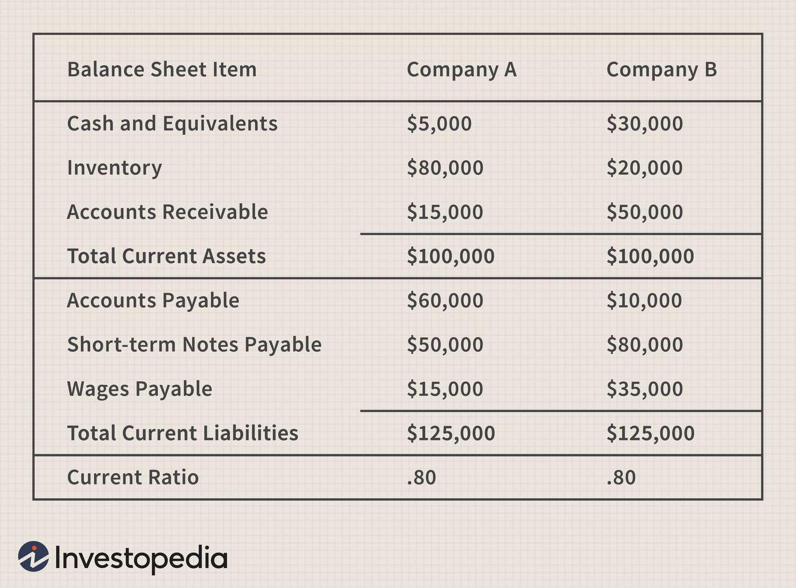

In the world of finance and investments, understanding and utilizing accounting ratios is crucial for making informed decisions. These ratios, derived from financial statements, serve as essential tools in evaluating a company's financial health and guiding investment choices. Among these, the current ratio stands out due to its role in assessing a company's liquidity position. By comparing current assets to current liabilities, the current ratio provides insights into a company's ability to meet short-term obligations, a critical factor for investors when evaluating financial stability.

As financial markets evolve, the intersection of traditional financial analysis and algorithmic trading becomes increasingly significant. Accounting ratios, like the current ratio, offer quantifiable metrics that can enhance algorithmic trading strategies. With the growing complexity of financial markets, automated trading environments benefit from incorporating these metrics to make swift and data-driven decisions. By leveraging accounting ratios, algorithms can execute trades more efficiently, potentially capitalizing on market trends indicative of a company's financial robustness.



This article examines the essential role accounting ratios play in financial analysis, with a focus on their integration into algorithmic trading. Understanding the multifaceted applications of these ratios, particularly the current ratio, can improve trading outcomes and provide a competitive edge. Through the effective use of such metrics, traders and investors can navigate the financial markets with greater precision and confidence.

## Table of Contents

## Understanding Accounting Ratios

Accounting ratios are quantitative tools derived from a company's financial statements, serving as essential indicators of financial health and performance. These ratios distill complex financial data into understandable metrics that can offer insights into areas such as profitability, liquidity, solvency, and operational efficiency. Traders and investors utilize these ratios to assess how well a company is performing financially and to predict potential investment returns or risks.

**Profitability Ratios**

Profitability ratios measure a company's ability to generate profit relative to sales, assets, equity, or other financial benchmarks over a specific period. Key profitability ratios include the gross profit margin, net profit margin, return on assets (ROA), and return on equity (ROE). For example, ROA is calculated as:

$$
\text{ROA} = \frac{\text{Net Income}}{\text{Average Total Assets}}
$$

This ratio indicates how efficiently a company is using its assets to generate profit.

**Liquidity Ratios**

Liquidity ratios assess a company's capacity to meet short-term obligations, thus providing insights into its short-term financial health. The most commonly used [liquidity](/wiki/liquidity-risk-premium) ratios are the current ratio and quick ratio. The current ratio is computed as:

$$
\text{Current Ratio} = \frac{\text{Current Assets}}{\text{Current Liabilities}}
$$

A higher ratio indicates that the company is better positioned to cover its short-term liabilities, though excessively high ratios may reveal inefficiencies in asset management.

**Solvency Ratios**

Solvency ratios evaluate a company’s ability to meet its long-term obligations, offering insights into its financial stability and risk of insolvency. These ratios include the debt to equity ratio and interest coverage ratio. The debt to equity ratio is defined as:

$$
\text{Debt to Equity Ratio} = \frac{\text{Total Liabilities}}{\text{Shareholders' Equity}}
$$

This ratio helps investors understand the proportion of company financing that comes from debt relative to equity.

**Efficiency Ratios**

Efficiency ratios measure how effectively a company uses its assets and liabilities to generate income. These include the inventory turnover ratio and total asset turnover ratio. The inventory turnover ratio is calculated as:

$$
\text{Inventory Turnover Ratio} = \frac{\text{Cost of Goods Sold}}{\text{Average Inventory}}
$$

A high inventory turnover ratio indicates effective inventory management and faster sales of inventory.

Understanding and applying these accounting ratios allows stakeholders to make informed decisions by offering a clear picture of a company's operational and financial performance. These insights are essential for strategic planning, investment analysis, and competitive benchmarking.

## The Current Ratio Explained

The current ratio is an important financial metric used to evaluate a company's liquidity, reflecting its ability to meet short-term liabilities with short-term assets. It is expressed as:

$$
\text{Current Ratio} = \frac{\text{Current Assets}}{\text{Current Liabilities}}
$$

Current assets include cash and equivalents, marketable securities, accounts receivable, and inventory. Current liabilities encompass obligations like accounts payable, short-term debt, and other liabilities due within the year.

A higher current ratio signifies that a company has more than sufficient current assets to cover its short-term obligations, indicating strong liquidity. For example, a current ratio of 2 suggests that a company has twice the amount of current assets needed to settle its current liabilities. However, while a higher ratio is generally favorable, excessively high values might suggest that a company is not efficiently utilizing its assets. For instance, it might indicate excess inventory or idle cash, which could otherwise be invested for growth or used to reduce liabilities.

On the contrary, a lower current ratio might raise concerns about a company's financial health. It implies less cushion available for meeting short-term liabilities, raising the risk of liquidity issues. However, industry norms vary, and a lower ratio might be acceptable or even typical in certain sectors, such as retail, where rapid inventory turnover can sustain a lower ratio without indicating financial difficulties.

In practical financial analysis, while the current ratio provides a snapshot of liquidity, it must be interpreted contextually. A comparative analysis with industry peers or historical performance offers a complete picture, guiding more informed financial decision-making and strategy formulation.

## The Importance of the Current Ratio in Financial Analysis

The current ratio is a crucial tool for investors and financial analysts to assess a company's financial stability. By examining the current ratio, one can evaluate a company's short-term financial health and its ability to meet obligations due within a year. This ratio is calculated by dividing the company's current assets by its current liabilities:

$$
\text{Current Ratio} = \frac{\text{Current Assets}}{\text{Current Liabilities}}
$$

A higher current ratio generally indicates that a company is in a stronger position to pay off its short-term debts, reflecting sound financial stability. However, while a high current ratio can imply financial robustness, an excessively high ratio might suggest that a company is not using its assets efficiently. This could indicate excess inventory or unwisely retained cash that could otherwise be invested for growth or operational improvements.

Analyzing trends in the current ratio over time can yield deeper insights into a company’s operational efficiency and financial health. A steady or improving current ratio over several quarters or years might suggest that a company is enhancing its asset management practices and becoming more efficient in meeting its short-term liabilities. Conversely, a declining trend in the current ratio could be a warning signal, pointing to potential liquidity issues or poorer asset management.

Comparative analysis of the current ratio is essential when evaluating a company within its industry. Each industry may have different standards for what is considered an optimal current ratio due to varying operating requirements and business models. By comparing a company's current ratio to industry norms, investors can assess whether a company is performing better or worse than its peers in terms of liquidity. This benchmarking process helps investors and analysts make informed assessments about a company’s relative financial health.

In summary, the current ratio is a fundamental metric in financial analysis, offering valuable insights into a company’s ability to manage its short-term liabilities. Its application in trend analysis and industry benchmarking helps provide a comprehensive picture of a company's financial stability and operational efficiency.

## Current Ratio in Algorithmic Trading

Algorithmic trading, characterized by the use of complex algorithms to automate trading decisions, relies significantly on quantitative metrics like accounting ratios. Among these, the current ratio serves as a pivotal liquidity measure that can be integrated into trading algorithms to enhance precision in assessing a company's short-term financial health.

The current ratio, calculated by dividing a company's current assets by its current liabilities, provides a snapshot of the firm's ability to meet its short-term obligations. This ratio is particularly valuable in [algorithmic trading](/wiki/algorithmic-trading) environments where the rapid assessment of financial health indicators can lead to more informed trading decisions. Algorithmic trading systems can be programmed to automatically evaluate the current ratio and other financial metrics, thus ensuring that the trading strategies consider the latest financial data.

For example, trading algorithms can be designed to include conditions where trades are executed only if companies meet specific liquidity criteria as indicated by their current ratio. This can be achieved using Python, a popular programming language in finance, to create algorithms that filter stocks based on their liquidity assessment:

```python
def assess_liquidity(data, threshold=1.5):
    """
    Function to assess liquidity of companies based on current ratio.
    :param data: a pandas DataFrame containing 'current_assets' and 'current_liabilities' columns
    :param threshold: the minimum acceptable current ratio for trading
    :return: list of companies meeting the liquidity criteria
    """
    data['current_ratio'] = data['current_assets'] / data['current_liabilities']
    return data[data['current_ratio'] >= threshold]

# Example usage
# Assuming 'financial_data' is a DataFrame containing the necessary financial information
eligible_companies = assess_liquidity(financial_data)
```

In this example, companies with a current ratio above the specified threshold (e.g., 1.5) are selected for trading, thus ensuring that the algorithm prioritizes financially stable entities.

Furthermore, incorporating current ratio metrics into trading algorithms can enhance risk management by automatically adjusting positions based on real-time changes in a company's liquidity status. For instance, an algorithm might be configured to sell a stock if its current ratio drops below a certain level, indicating deteriorating liquidity. This integration of financial health indicators ensures that trading decisions are not solely based on price movements or historical data but also on current qualitative financial stability measures.

Possessing an automated and data-driven approach allows traders to process vast amounts of financial information efficiently, reducing the reliance on manual analysis and enabling rapid response to market conditions. Such algorithms not only optimize trading strategies but also contribute to maintaining a disciplined approach to investment decision-making.

## Limitations and Considerations

Accounting ratios are essential tools in financial analysis, yet they come with inherent limitations worth considering. These metrics, including the current ratio, are predominantly based on historical data. This reliance means that ratios may not fully incorporate the most recent financial developments or predict future trends effectively. For instance, the current ratio, calculated as:

$$
\text{Current Ratio} = \frac{\text{Current Assets}}{\text{Current Liabilities}}
$$

provides insights into a company’s ability to meet short-term obligations. However, it lacks consideration of qualitative factors such as prevailing market conditions or the efficiency and strategic foresight of management teams. These qualitative aspects can significantly impact a company's liquidity and overall financial health, which purely quantitative measures might overlook.

One significant limitation is that the current ratio might not differentiate between the liquidity of various current assets. For example, inventories are considered current assets, but their liquidity can vary depending on the industry and market conditions. Similarly, accounts receivable might show high liquidity but only if customers pay timely. Hence, when relying solely on the current ratio, investors and analysts might encounter skewed interpretations.

To mitigate these limitations and obtain a more comprehensive analysis, it is crucial to diversify the utilization of different financial ratios. Combining the current ratio with other liquidity measures, such as the quick ratio or the cash ratio, can provide a more robust financial view. Additionally, understanding the context in which these ratios are applied is vital. This involves considering the industry norms and the economic environment, which helps in making better-informed decisions.

Furthermore, it is essential to recognize that financial ratios should be interpreted as part of a broader financial analysis framework, which includes market analysis and understanding the qualitative aspects of a business. By supplementing accounting ratios with qualitative assessments, financial analysts and investors can avoid potential pitfalls and develop a more nuanced interpretation of a company’s financial standing.

In conclusion, while accounting ratios like the current ratio are valuable tools in assessing financial health, their limitations require careful consideration. Understanding their context and integrating a range of financial metrics are key strategies to ensure more accurate and reliable financial analysis.

## Conclusion

Accounting ratios are essential tools in financial analysis and trading, offering key insights into a company's financial standing and operational efficiency. Among these, the current ratio stands out as a crucial metric for assessing a company's liquidity. The integration of this ratio into algorithmic trading systems can significantly enhance trading strategies, driving improved decision-making processes and outcomes. By incorporating the current ratio, traders are equipped to quickly assess a company's ability to meet short-term obligations, leveraging this insight to make informed buy or sell decisions promptly and efficiently.

In algorithmic trading, the speed and accuracy of decisions can make or break trading outcomes. Accounting ratios like the current ratio provide a quantitative basis for algorithms to evaluate financial health dynamically, adapting trading strategies to the ever-changing market conditions. For instance, a Python-based trading algorithm could include a module that calculates the current ratio and adjusts trading positions based on predefined liquidity thresholds:

```python
def calculate_current_ratio(current_assets, current_liabilities):
    return current_assets / current_liabilities

def adjust_trading_position(current_assets, current_liabilities, threshold=1.5):
    current_ratio = calculate_current_ratio(current_assets, current_liabilities)
    if current_ratio >= threshold:
        print("Maintain or increase position size")
    else:
        print("Decrease position size or hold")
```

This kind of quantitative assessment, when intertwined with other financial metrics, allows traders to navigate the complexities of financial markets with greater confidence and precision. However, it is also critical for traders to understand the limitations of accounting ratios, which often rely on historical data and may not capture qualitative aspects such as market conditions or management quality. Thus, a diversified approach, taking into consideration multiple financial ratios and their contextual meanings, is essential to avoid misleading conclusions and optimize trading performance.

Overall, the use of accounting ratios, particularly the current ratio, facilitates a structured and informed approach to investment decision-making. By harnessing these metrics, traders can navigate the financial markets more effectively, enhancing their ability to make decisions that align with their financial goals.

## References & Further Reading

[1]: ["Advanced Financial Risk Management: Tools and Techniques for Integrated Credit Risk and Interest Rate Risk Management"](https://www.wiley.com/en-us/Advanced+Financial+Risk+Management%3A+Tools+and+Techniques+for+Integrated+Credit+Risk+and+Interest+Rate+Risk+Managements+-p-9780470821268) by Donald R. Van Deventer and Kenji Imai

[2]: ["Principles of Corporate Finance"](https://www.mheducation.com/highered/product/principles-corporate-finance-brealey-myers/M9781264080946.html) by Richard A. Brealey, Stewart C. Myers, and Franklin Allen

[3]: Lintner, J. (1965). ["The Valuation of Risk Assets and the Selection of Risky Investments in Stock Portfolios and Capital Budgets,"](https://www.jstor.org/stable/1924119) The Review of Economics and Statistics, 47(1), 13-37.

[4]: ["Financial Ratios: Analyzing liquidity, solvency and profitability"](https://www.investopedia.com/terms/r/ratioanalysis.asp) by the University of Illinois, Coursera Course

[5]: Bodie, Z., Kane, A., & Marcus, A. J. (2014). ["Investments"](https://www.mheducation.com/highered/product/investments-bodie-kane/M9781264412662.html). McGraw-Hill Education.