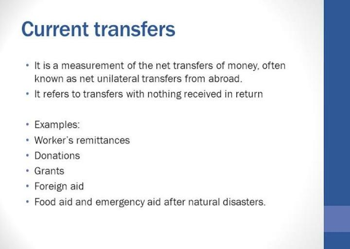

Economic transfers are fundamental components of financial systems worldwide, influencing fiscal policy, current accounts, and modern trading strategies. These transfers involve the allocation of economic value between entities without a quid pro quo exchange, thereby possessing significant implications for the balance of payments of nations. By focusing on current transfers—non-reciprocal transactions affecting the current account—these processes hold the key to understanding global economic dynamics.

Fiscal policies are closely intertwined with economic transfers. Governments use these transfers to achieve national economic goals, stimulating consumption and investment through strategic fiscal measures, especially during economic downturns. Recent innovations in fiscal policies, such as targeted fiscal stimulus packages, demonstrate their significance in maintaining economic stability and growth.



In the context of trading strategies, algorithmic trading has revolutionized how trades are executed in financial markets. This approach leverages computer programs that initiate trades based on predefined criteria, enabling rapid responses to economic data, including fiscal policies and transfers. Integrating algorithmic trading with fiscal insights has the potential to enhance both trading strategies and economic forecasts, offering a novel synergy between technology and fiscal policy.

By examining these components, a comprehensive understanding emerges regarding their synergistic roles in shaping the economic climate. Through this exploration, the contributions of economic transfers, fiscal policies, and algorithmic trading strategies to global economics become clear, highlighting their importance in driving economic stability and growth.

## Table of Contents

## Understanding Economic Transfers

Economic transfers represent movements of value from one entity to another without an expected return or reciprocal exchange. This lack of reciprocity differentiates them from conventional transactions where goods, services, or money are exchanged for something of equivalent value. Economic transfers are pivotal in shaping national economies as they often manifest in various forms, such as subsidies, welfare payments, and grants, impacting both the microeconomic and macroeconomic landscape.

From a macroeconomic perspective, economic transfers significantly influence a nation's current account, which records all economic transactions involving goods, services, investment incomes, and current transfers between residents and non-residents. Current transfers, such as remittances, foreign aid, or gifts, are included in this account. They provide resources to consume more than a country's production might allow, contributing directly to household income and affecting aggregate demand. Consequently, they play a crucial role in adjusting a country's current account balance and affecting exchange rates and foreign exchange reserves.

To break it down further, economic transfers are bifurcated into current transfers and capital transfers, representing distinct types of economic transactions. Current transfers are those which do not involve a change in ownership of fixed assets and have an immediate or short-term influence on the recipient's disposable income. They include transactions such as social benefits, international assistance, and workers' remittances, often aimed at consumption rather than investment.

On the other hand, capital transfers involve the transfer of ownership of fixed assets or the forgiveness of a debt. These are seen within the capital account of a country's balance of payments. Capital transfers often relate to longer-term financial engagements and can include investments in infrastructure, debt forgiveness, or substantial asset donations. They impact the economic structure by potentially altering a nation's productive capacity or altering its debt profile.

The dichotomy of current and capital transfers provides insight into their unique roles within economic transactions. While both represent voluntary movements of value without reciprocity, current transfers primarily affect consumption patterns, whereas capital transfers influence investment and economic potential. Understanding this distinction is key for policymakers aiming to design economic interventions that leverage these types of transfers to stabilize or stimulate the economy.

## Decoding Current Transfers

Current transfers represent a crucial element of a nation's economic interactions and are characterized by their non-reciprocal nature, meaning they occur without direct compensation. These transactions are fundamental to the current account of a country's balance of payments, as they influence the economic flow between nations without involving the exchange of goods, services, or capital assets.

Key examples of current transfers include workers’ remittances, foreign aid, and governmental bilateral support. Workers’ remittances are funds transferred by migrants from their host countries to their home countries. These remittances play a significant role in the economies of many developing nations by providing a vital source of income that can bolster domestic consumption and investment. For instance, remittances can help improve living standards, reduce poverty rates, and contribute to economic growth by increasing household expenditures on goods and services.

Foreign aid, another form of current transfer, refers to the financial assistance provided by one country to another, often to support development projects, humanitarian efforts, or stabilization programs. This aid can be critical in times of crisis, enabling recipient countries to address immediate needs without the burden of repayment or reciprocal obligations. As a result, foreign aid can facilitate economic stability and capacity building.

Governmental bilateral support, encompassing official financial transfers from one government to another, includes grants and donations aimed at fostering diplomatic relations or supporting policy objectives aligned with both nations' interests. These transfers help influence political and economic ties between countries and can lead to cooperative advancements in various sectors, including education, healthcare, and infrastructure.

It is important to note that current transfers do not involve the transfer of ownership of fixed assets, setting them apart from capital transfers. Capital transfers typically involve the acquisition or disposal of fixed assets and are associated with changing the ownership of capital goods or forgiveness of debt.

In evaluating the impact of current transfers on a nation’s economy, it’s pertinent to understand their implications on the balance of payments. These transfers are recorded in the current account section, where they contribute to the balance of a country’s international transactions. Positive net current transfers can augment a country’s financial inflows, thereby improving its ability to manage external obligations and enhance domestic economic resilience.

## Fiscal Policy and Economic Transfers

Fiscal policy serves as a crucial instrument in guiding national economic objectives, and economic transfers form an integral part of this strategy. By strategically utilizing economic transfers, governments can effectively influence both consumption and investment within an economy.

Recent approaches to fiscal policy have increasingly leveraged fiscal stimulus packages, particularly during periods of economic downturn. These packages are designed to bolster aggregate demand, which is vital during recessions when consumer confidence and business investment typically decline. A fiscal stimulus package may include measures such as tax cuts, increased government spending, and direct transfers to individuals. The core idea is to provide immediate financial relief and incentivize spending to jumpstart economic activity.

A quantitative understanding of fiscal measures can significantly enhance their design and implementation. For instance, the multiplier effect is a critical concept in assessing the impact of fiscal policy. It measures the change in output resulting from a change in government spending or taxation. Mathematically, the multiplier ($k$) can be represented by the formula:

$$
k = \frac{1}{1 - MPC(1 - t) + MPI}
$$

where $MPC$ is the marginal propensity to consume, $t$ is the tax rate, and $MPI$ is the marginal propensity to invest. By understanding these parameters, policymakers can predict the potential impact of fiscal measures on the economy.

Additionally, effective design of fiscal policy requires a keen understanding of the economic environment, including the timing and scale of interventions. For example, during the 2008 financial crisis, many countries implemented significant fiscal stimulus packages to stabilize their economies. These measures were instrumental in preventing deeper recessions and facilitating quicker recoveries.

Future policymaking can be significantly guided by analyzing the effectiveness of previous fiscal policies. Historical data provides valuable insights into the timing, scale, and composition of fiscal measures that have been successful or unsuccessful. This data-driven approach allows policymakers to refine strategies and tailor economic transfers to better meet the needs of the current economic climate.

The integration of technology, such as algorithmic modeling, offers further potential to optimize fiscal policy. By simulating various scenarios and projecting outcomes, policymakers can make informed decisions that harness the full potential of economic transfers to achieve desired economic objectives.

## The Role of Algorithmic Trading

Algorithmic trading involves the use of sophisticated computer algorithms to automate the trading process based on predefined conditions. These algorithms are designed to analyze multiple market variables, executing orders at speeds and frequencies that are impossible for human traders. This method fundamentally transforms the execution of trades within financial markets, increasing efficiency and precision.

Algorithmic systems are programmed to respond rapidly to economic data releases and fiscal policy updates. For instance, an algorithm can be set to analyze news feeds for keywords related to fiscal policies or economic transfers, triggering trades when certain criteria are met. This allows traders to capitalize on market movements induced by key economic announcements almost instantaneously.

The integration of [algorithmic trading](/wiki/algorithmic-trading) with fiscal insights offers the potential to enhance trading strategies significantly. By incorporating fiscal policy data alongside technical indicators, traders can refine their algorithms to anticipate market reactions more accurately. For example, if a government announces a fiscal stimulus package, algorithms that incorporate this information can adjust trading strategies to exploit anticipated increases in market [liquidity](/wiki/liquidity-risk-premium) or shifts in equity prices.

Furthermore, these systems can backtest strategies using historical data, allowing traders to evaluate their efficacy before deploying them in live markets. Python, with its robust libraries such as NumPy and pandas, is a popular choice for developing such [backtesting](/wiki/backtesting) systems:

```python
import numpy as np
import pandas as pd

def backtest_strategy(data, strategy):
    results = []
    for date, price in data.iterrows():
        signal = strategy(date, price)
        results.append(signal)
    return pd.Series(results)

# Sample strategy: Buy if price drops 5% within a day
def sample_strategy(date, price):
    if price < price*0.95:
        return 'Buy'
    else:
        return 'Hold'

market_data = pd.DataFrame({'Price': np.random.randn(100)})  # Example data
signals = backtest_strategy(market_data, sample_strategy)
```

The model's ability to process vast datasets quickly results in a highly dynamic and adaptable trading environment. Enhanced economic forecasts also benefit from algorithmic analysis, as these systems can incorporate vast amounts of temporal data, identifying trends and anomalies that might elude traditional analytical methods.

In summary, algorithmic trading revolutionizes trade execution by harnessing the power of automation, thereby improving response times to significant economic events. Its integration with fiscal policy insights not only optimizes trading practices but also supports more informed economic forecasting, reflecting a synergistic relationship between technology and finance in modern economic systems.

## Case Studies in Fiscal Transfers and Trading

Case studies focusing on fiscal transfers and trading offer valuable insights into the practical effects of fiscal policy on economic behavior. One prominent example is the series of fiscal stimulus design experiments conducted in France, which reveal the quantitative impacts of policy adjustments on consumption and investment patterns.

The French government has been proactive in experimenting with fiscal stimulus measures to counteract economic downturns. These experiments aim to determine the optimal design and implementation of transfer payments to maximize economic recovery and growth. One key approach employed in these experiments involves varying the scale and timing of fiscal transfers to assess their direct influence on household consumption and business investment.

In analyzing the data from these experiments, researchers apply econometric models to quantify the elasticity of consumption with respect to fiscal transfers. For instance, the propensity to consume (MPC) out of additional fiscal income can be measured using the formula:

$$
MPC = \frac{\Delta C}{\Delta Y}
$$

where $\Delta C$ represents the change in consumption and $\Delta Y$ denotes the change in income due to fiscal transfers. By calculating the MPC, policymakers can gauge the effectiveness of different stimulus designs in stimulating consumer spending.

Further, these case studies incorporate the use of macroeconomic simulations to predict the broader impact of fiscal policies on national investment levels. Simulation models account for variables such as interest rates, inflation expectations, and business confidence, providing a comprehensive forecast of investment behavior in response to fiscal measures.

Evidence from the French experiments illustrates that strategic adjustments in the timing and magnitude of fiscal transfers can significantly alter consumer behavior and investment trajectories. For instance, front-loading fiscal transfers—distributing a significant portion of funds early during an economic shock—has been shown to enhance immediate consumption, contributing to a quicker economic recovery.

Additionally, these studies underscore the importance of coordinating fiscal measures with existing economic and monetary policies. By aligning fiscal interventions with a supportive monetary environment, governments can amplify the intended effects of stimulus packages.

Ultimately, the findings from these case studies bear significant implications for global economic policy. They underscore the necessity for evidence-based policymaking and highlight the potential for innovative fiscal approaches to foster economic resilience. The insights gained can guide future fiscal policy designs in other countries, enhancing their capacity to manage economic challenges effectively.

## Implications for Global Economic Policy

The interplay between economic transfers, fiscal policy, and algorithmic trading holds significant ramifications for global economic stability and growth. Policymakers must recognize the critical impacts these elements have on economies, taking into account how both current and capital transfers influence fiscal health. Current transfers, such as workers’ remittances and foreign aid, bolster consumption and support economic subsistence in recipient nations, thereby contributing to economic stability. Conversely, capital transfers that involve the redistribution of fixed assets can undergird investment in infrastructure and economic development, promoting longer-term growth.

The interaction between fiscal policy and economic transfers plays a pivotal role in adjusting economic cycles and stabilizing markets. For instance, during economic downturns, governments can employ fiscal policies, such as stimulus packages, to inject liquidity into the economy through direct transfers to households and businesses. These actions are intended to offset declines in economic activity and catalyze recovery. The effectiveness of such measures, however, depends on precise design and implementation, whereby the timing, scale, and targeted nature of transfers are crucial for achieving desired economic outcomes.

Algorithmic trading adds another layer of complexity and opportunity in this context. By enabling rapid responses to fiscal policy announcements and economic data, algorithmic strategies can influence market dynamics substantially. For example, trading algorithms that are sensitive to news on fiscal measures can adjust positions in real-time, providing liquidity and potentially stabilizing volatile markets. Furthermore, integrating economic forecasts informed by algorithmic assessments can sharpen policymakers' ability to gauge economic sentiment and adjust strategies accordingly.

Policymakers are thus encouraged to foster a deeper understanding of these dynamics to devise more robust economic strategies. By doing so, they can anticipate market responses, adapt to shifting economic landscapes, and achieve more resilient economic frameworks. This integrative approach also sets the stage for financial innovation, where enhanced data analytics and [machine learning](/wiki/machine-learning) techniques could lead to more predictive economic modeling and sustainable policy interventions. Advancing these areas will be critical in shaping future global economic policy for enhanced stability and growth.

## Conclusion

Economic transfers, fiscal policies, and trading strategies are foundational to contemporary economic structures, reflecting their significance in shaping global markets and national economies. Their interactions reveal complex relationships that offer valuable insights into how economies operate and adapt. Economic transfers, such as remittances and foreign aid, directly influence the current account balance of national economies, providing critical support during financial imbalances or economic downturns.

Fiscal policies, utilizing economic transfers, serve as strategic tools for governments to regulate economic activity, manage inflation, and enhance employment levels. Through thoughtfully crafted fiscal measures, governments can stimulate economic activity by boosting consumer spending and investment, particularly in times of recession. These actions are integral in maintaining economic stability and fostering long-term growth. For instance, fiscal stimulus packages have proven effective in reviving economies following financial crises, as noted in several case studies from countries like France.

The emergence and evolution of algorithmic trading strategies further emphasize the dynamic nature of global economies. By automating trade executions based on detailed algorithms and economic indicators, these strategies allow for rapid response to market changes and policy shifts. Such technological advancements enhance market efficiency, allowing traders to leverage economic forecasts swiftly, thereby optimizing trading outcomes.

The synergy between these elements—economic transfers, fiscal policy, and trading strategies—demonstrates the nuanced architecture of modern economies. This interconnectedness presents significant opportunities for innovations in policy development and economic governance, paving the way for more resilient and adaptable economic systems. As policymakers and economic stakeholders continue to refine these practices, they are well-positioned to foster robust economic environments capable of weathering future challenges and maximizing growth prospects.

## References & Further Reading

[1]: "Fiscal Policy, Transfers and the Exchange Rate: A Complete markets approach" by Enrique G. Mendoza and Linda L. Tesar, available at [National Bureau of Economic Research (NBER)](https://www.nber.org/papers/w9853).

[2]: Kaminsky, Graciela L., Carmen M. Reinhart, and Carlos A. Végh (2004). "When it rains, it pours: procyclical capital flows and macroeconomic policies," in *NBER Macroeconomics Annual 2004, Volume 19*, available at [University of Chicago Press](https://www.nber.org/papers/w10780).

[3]: "Algorithmic Trading: Winning Strategies and Their Rationale" by Ernest P. Chan, available on [Wiley Online Library](https://www.wiley.com/en-us/Algorithmic+Trading%3A+Winning+Strategies+and+Their+Rationale-p-9781118676998).

[4]: "Algorithmic and High-Frequency Trading" by Álvaro Cartea, Sebastian Jaimungal, and José Penalva, available at [Cambridge University Press](https://assets.cambridge.org/97811070/91146/frontmatter/9781107091146_frontmatter.pdf).

[5]: "Understanding Economic Statistics: An OECD Perspective" by Organization for Economic Co-operation and Development, available at [OECD Library](https://www.oecd.org/en/publications/understanding-economic-statistics-an-oecd-perspective_9789264046986-en.html).

[6]: "Fiscal Policy for Economic Development: An Overview" by Vito Tanzi, available at [International Monetary Fund (IMF)](https://www.researchgate.net/publication/253294094_Fiscal_Policy_for_Economic_Development_An_Overview).