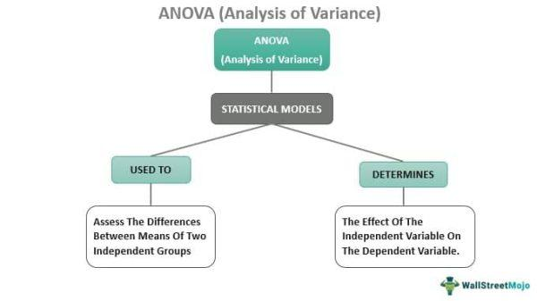

## Table of Contents

## Who is Curtis Faith and what is his background in trading?

Curtis Faith is a well-known trader who became famous for being part of the group called the "Turtles." The Turtles were a group of people who were taught to trade by two successful traders, Richard Dennis and William Eckhardt, in the 1980s. Dennis and Eckhardt wanted to see if they could teach anyone to trade successfully, so they picked a group of people and trained them. Curtis Faith was one of the youngest in the group, and he did very well.

After the Turtle experiment, Curtis Faith continued to trade and also started to write books and teach others about trading. He wrote a book called "Way of the Turtle," where he explained the trading strategies and rules he learned from Dennis and Eckhardt. Faith believes that with the right training and discipline, anyone can learn to trade successfully. He now helps other people learn how to trade through his books and courses.

## What is 'The Way of the Turtle' and why is it significant in the trading community?

'The Way of the Turtle' is a book written by Curtis Faith, who was one of the famous Turtles. The Turtles were a group of people trained by successful traders Richard Dennis and William Eckhardt in the 1980s. The book explains the trading strategies and rules that Faith and the other Turtles learned. It's like a guide that shows how they made money in the markets.

The book is significant in the trading community because it gives people a chance to learn the same methods that helped the Turtles succeed. Many traders want to know how to make money, and this book shares a proven way to do it. It also shows that with the right training and discipline, anyone can learn to trade well. This idea has inspired a lot of people in the trading world.

## How did Curtis Faith become involved with the Turtle Trading experiment?

Curtis Faith became involved with the Turtle Trading experiment when he was just 19 years old. He saw an ad in the newspaper that said Richard Dennis and William Eckhardt were looking for people to teach how to trade. Curtis was interested because he wanted to learn how to make money in the markets. He applied and was one of the few chosen to join the group.

The Turtle Trading experiment was set up to see if successful trading could be taught. Richard Dennis believed he could teach anyone to trade, while William Eckhardt thought it was more about natural talent. They picked a diverse group of people, including Curtis, to train. Curtis did really well in the program and went on to become a successful trader himself.

## What are the basic principles of the Turtle Trading system?

The Turtle Trading system is based on a few simple ideas that helped the Turtles make money. One big idea is to follow a set of clear rules for buying and selling. The Turtles used something called a "breakout" strategy. This means they would buy when the price of something went above a certain point, and they would sell when it went below another point. They also used something called "position sizing," which means they decided how much to buy or sell based on how much risk they were willing to take.

Another important part of the Turtle Trading system is managing risk. The Turtles always knew how much they could lose before they made a trade. They used something called a "stop-loss" order, which is like a safety net that automatically sells if the price goes too low. This helped them not lose too much money on any one trade. They also spread their money around different trades to reduce risk, which is called diversification. By sticking to these rules and managing risk, the Turtles were able to trade successfully.

## Can you explain the concept of trend following as described in 'The Way of the Turtle'?

Trend following is a way of trading that the Turtles used to make money. It's all about finding out if the price of something is going up or down over time and then making trades based on that. If the price is going up, you buy more, and if it's going down, you sell. The Turtles looked at the price over the last few days or weeks to see if there was a clear direction. If they saw the price breaking out to a new high or low, they would jump in and make a trade.

The important thing about trend following is that it doesn't try to guess where the price will go next. Instead, it waits for the price to move and then follows along. This means the Turtles were okay with missing some trades if it meant they could catch the big moves. By sticking to this simple rule of following the trend, they were able to make money over time, even though not every trade worked out.

## What are some key strategies that Curtis Faith recommends for successful trading?

Curtis Faith believes that successful trading is all about following clear rules and managing risk. One of the main strategies he recommends is to use a breakout strategy. This means you buy when the price of something goes above a certain point and sell when it goes below another point. This helps you catch big moves in the market. Faith also talks about position sizing, which means deciding how much to buy or sell based on how much risk you're willing to take. By sticking to these rules, you can make better trading decisions.

Another key strategy Faith recommends is managing risk carefully. He suggests using stop-loss orders, which are like safety nets that automatically sell if the price goes too low. This helps you not lose too much money on any one trade. Faith also believes in diversification, which means spreading your money around different trades to reduce risk. By combining these strategies, you can trade more safely and increase your chances of making money over time.

## How does Curtis Faith suggest managing risk and emotions in trading?

Curtis Faith says that managing risk is very important in trading. He suggests using stop-loss orders, which are like safety nets that automatically sell if the price goes too low. This helps you not lose too much money on any one trade. Faith also believes in diversification, which means spreading your money around different trades to reduce risk. By doing this, you can protect yourself from big losses and keep your trading safe.

Faith also talks about managing emotions in trading. He says that sticking to clear rules can help you control your feelings. When you follow a set plan, you don't let fear or greed make you do something you'll regret. Faith believes that if you stay disciplined and follow your rules, you can make better decisions and avoid emotional mistakes. By managing both risk and emotions, you can become a better trader.

## What are the differences between the original Turtle Trading rules and the adaptations made by Curtis Faith?

The original Turtle Trading rules were set up by Richard Dennis and William Eckhardt. They used a breakout strategy, which means they bought when the price went above a certain point and sold when it went below another point. They also used something called position sizing to decide how much to buy or sell based on how much risk they were willing to take. The Turtles followed strict rules for entering and exiting trades, and they used stop-loss orders to manage risk. They also spread their money around different trades to reduce risk, which is called diversification.

Curtis Faith made some changes to these rules over time. He kept the basic ideas of the breakout strategy and position sizing, but he added his own thoughts on how to manage risk and emotions better. Faith put a big focus on sticking to a clear plan and not letting feelings like fear or greed affect trading decisions. He also talked more about the importance of diversification and how to use stop-loss orders effectively. By making these changes, Faith aimed to make the Turtle Trading system easier to follow and more successful for other traders.

## How has 'The Way of the Turtle' influenced modern trading practices?

'The Way of the Turtle' has had a big impact on how people trade today. The book shows that anyone can learn to trade if they follow clear rules and manage risk well. This idea has encouraged many people to start trading. Traders now use breakout strategies and position sizing, just like the Turtles did, to make smart trading decisions. They also use stop-loss orders to protect their money and spread their investments around to reduce risk. These are all ideas that came from the Turtles and are now common in trading.

The book also talks a lot about managing emotions in trading. Curtis Faith says that sticking to a plan helps traders control their feelings and make better choices. This has made traders think more about how their emotions affect their decisions. Many traders now focus on staying disciplined and not letting fear or greed push them into bad trades. By following these lessons from 'The Way of the Turtle,' modern traders can trade more safely and successfully.

## What criticisms or limitations have been identified with the Turtle Trading system?

Some people think the Turtle Trading system has problems. One big issue is that it doesn't work well in all market conditions. The system is good when prices are moving a lot, but it can lose money when prices stay the same or move slowly. This means traders might miss out on profits or even lose money if they use the system all the time without changing it. Also, the Turtle Trading system needs a lot of money to work well. If you don't have enough money, you can't spread your trades around to reduce risk like the Turtles did.

Another problem is that the system can be hard to stick to because it's very strict. Traders need to follow the rules exactly, and this can be tough when emotions get in the way. If a trader gets scared or greedy, they might not follow the plan, and this can lead to bad trades. Some people also think the system is too simple and doesn't take into account all the things that can affect prices, like news or big events. So, while the Turtle Trading system can work, it has limits and might not be right for everyone.

## Can you provide examples of successful trades made using the Turtle Trading system?

One successful trade using the Turtle Trading system happened in the 1980s with the soybean market. The Turtles used their breakout strategy to buy soybeans when the price went above a certain high point. They kept buying more as the price kept going up, following the trend. When the price finally started to go down, they sold everything and made a lot of money. This trade showed how the breakout strategy and trend following could work well in a big market move.

Another example was with the currency markets. The Turtles traded currencies like the British pound and the US dollar. They saw the pound going up against the dollar and used their rules to buy more pounds as the price rose. They used position sizing to decide how much to buy and stop-loss orders to manage risk. When the trend changed, they sold their pounds and made a good profit. This showed how the Turtle system could be used in different markets, not just commodities.

## What advanced techniques does Curtis Faith discuss for optimizing the Turtle Trading system?

Curtis Faith talks about some advanced ways to make the Turtle Trading system work even better. One way is to use something called "volatility-adjusted position sizing." This means you change how much you buy or sell based on how much the price is moving around. If the price is moving a lot, you might buy less to keep your risk the same. If it's not moving much, you might buy more. This can help you make more money while keeping your risk under control.

Faith also suggests using different time periods to find trends. Instead of just looking at the last few days or weeks, you can look at longer times, like months or even years. This can help you catch bigger trends and make bigger profits. By using these advanced techniques, you can make the Turtle Trading system work better and make more money in the markets.

## What are the Key Principles of Turtle Trading?

The Turtle methodology is primarily founded on the use of mechanical trading systems. These systems are designed to remove emotional biases from trading decisions, yielding more consistent outcomes. At its core, the Turtle trading strategy is characterized by several key components that significantly contribute to its efficacy.

One of the principal aspects of Turtle trading is [volatility](/wiki/volatility-trading-strategies)-based position sizing. This approach requires traders to adjust the size of their trades according to market volatility; larger positions are taken in less volatile conditions and smaller positions in more volatile environments. The Average True Range (ATR) indicator is commonly used to measure volatility in this context:

$$
\text{ATR} = \frac{1}{n} \sum_{i=1}^{n} TR_i
$$

where $TR_i$ (True Range) is defined as the greatest of the following: the current high minus the current low, the absolute value of the current high minus the previous close, and the absolute value of the current low minus the previous close.

Another significant principle of the Turtle strategy is the method of pyramiding into winners. This technique involves adding to a winning position incrementally as it proves successful, rather than committing fully upfront. This allows traders to capitalize on profitable trends while managing risk effectively.

Strict exit strategies are also central to Turtle trading. These predetermined rules for exiting trades are designed to protect profits and minimize losses. The original Turtle strategy employed a breakout system, where trades were exited if prices moved back to or beyond predetermined levels, both to lock in gains and cut losses.

Adhering to simple and robust trading rules is emphasized, ensuring the strategy can be adapted easily to a range of market conditions. The rules laid out by Richard Dennis and William Eckhardt were transparent and could be consistently applied, forming a foundation for the Turtles' trading decisions. This simplicity and clarity are vital in maintaining the strategy's effectiveness without succumbing to over-complication, which often plagues trading systems.

In summary, the Turtle trading strategy’s reliance on mechanical systems, combined with its focus on volatility-based sizing, strategic pyramiding, and rigorous exit rules, offers a framework designed for adaptability and success across various market environments.

## References & Further Reading

[1]: Faith, Curtis M. (2007). ["Way of the Turtle: The Secret Methods that Turned Ordinary People into Legendary Traders."](https://www.amazon.com/Way-Turtle-Methods-Ordinary-Legendary/dp/007148664X) McGraw-Hill Education.

[2]: Michael Covel's ["The Complete TurtleTrader: How 23 Novice Investors Became Overnight Millionaires."](https://www.amazon.com/Complete-TurtleTrader-Investors-Overnight-Millionaires/dp/0061241717) Harper Business.

[3]: ["Trend Following: How to Make a Fortune in Bull, Bear, and Black Swan Markets."](https://www.amazon.com/Trend-Following-5th-Fortune-Markets/dp/1119371872) by Michael W. Covel.

[4]: ["The New Trading for a Living: Psychology, Discipline, Trading Tools and Systems, Risk Control, Trade Management"](https://www.amazon.com/New-Trading-Living-Psychology-Discipline/dp/1118443926) by Dr. Alexander Elder.

[5]: Erdinc Akyildirim et.al. (2020). ["The profitability of turtle trading strategy in cryptocurrency markets."](https://scholar.google.com/citations?user=RVyqw5QAAAAJ) Decisions in Economics and Finance.