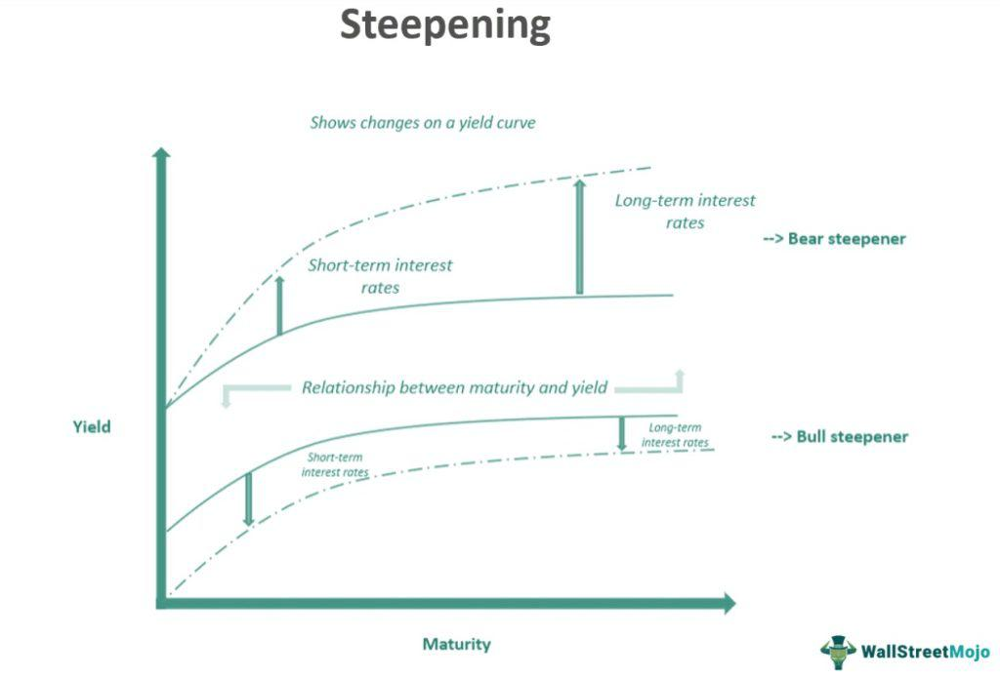

The Curve Steepener Trading Strategy is increasingly gaining traction among financial market participants seeking to capitalize on fluctuations in interest rates. This strategy involves leveraging the differential between short-term and long-term Treasury bond yields, primarily by focusing on the widening yield spread. The yield curve, which graphs interest rates of bonds with equal credit quality across various maturities, can steepen, flatten, or invert. A steepening curve, characterizing higher long-term rates relative to short-term ones, presents significant opportunities for financial traders and investors.

Traders leveraging the Curve Steepener Strategy typically take a long position in short-term Treasury bonds while shorting long-term Treasury bonds. This approach is based on the anticipation that long-term yields will rise more swiftly than short-term yields—an event that often occurs in anticipation of economic growth and rising inflation. Understanding these yield changes is crucial, as they are indicators of macroeconomic conditions and investor sentiment.



As economic conditions fluctuate due to factors such as monetary policy changes, inflation expectations, and global financial events, the Curve Steepener Strategy can provide lucrative avenues for profit. It is of particular interest to those employing algorithmic trading tactics, which allow for automated execution and management of complex trading strategies. This article examines the intricacies of implementing Curve Steepener Strategies within an algorithmic trading framework, offering insights into identifying opportunities and managing associated risks effectively.

## Table of Contents

## Understanding the Curve Steepener Trade

A Curve Steepener Trade involves engaging with the difference between short-term and long-term interest rates by taking a long position in short-term U.S. Treasury bonds while simultaneously shorting long-term U.S. Treasury bonds. The unique objective of this trade is to capitalize on the steepening of the yield curve—a phenomenon where long-term interest rates increase at a faster pace than short-term rates. This approach can offer a hedge against specific economic expectations, notably those related to growth and inflation.

The financial yield curve, which represents the disparity between yields across varied maturities, can fundamentally alter investment strategies. When the yield curve steepens, it reflects increasing confidence in economic growth; investors then expect higher inflation, which typically results in higher interest rates over the long term. Financial market participants often interpret a steepening curve as a sign of economic expansion, driven by probable future rate hikes by central banks like the Federal Reserve. The formula to understand the yield curve dynamics can be expressed as:

$$
\Delta Y = Y_{\text{long-term}} - Y_{\text{short-term}}
$$

where $Y_{\text{long-term}}$ and $Y_{\text{short-term}}$ are the yields on long-term and short-term Treasuries, respectively.

In embracing this strategy, traders place a bet on this differential increasing. However, this does inherently imply an assumption about the future path of interest rates and economic growth. Successful execution requires a deep understanding of macroeconomic factors that can influence yield curves, such as shifts in Federal Reserve policy or notable economic indicators like GDP growth rates or consumer price index (CPI) changes.

The utility of the Curve Steepener trade lies in its potential to provide lucrative returns should investor sentiments regarding economic growth materialize. However, traders must also contend with the risks of incorrect timing or misjudging the trajectory of economic indicators. Robust analytical skills and access to real-time macroeconomic data can support traders in making informed decisions with respect to this sophisticated investment strategy.

## Identifying Yield Curve Steepeners

Successfully implementing a Curve Steepener Strategy requires the strategic identification of scenarios where the yield curve is likely to steepen. This process typically involves a close analysis of several economic indicators and market instruments. 

One of the critical factors to monitor is the Federal Reserve's monetary policy. Changes in the federal funds rate or indications of future policy shifts can significantly impact short-term and long-term interest rates. When the Federal Reserve signals an accommodative policy, it often leads to a decline in short-term interest rates, potentially steepening the yield curve if long-term rates remain stable or increase in response to inflation expectations or economic growth prospects.

Inflation expectations also play a crucial role in identifying yield curve steepeners. An increase in expected inflation often results in higher long-term interest rates as investors demand greater yields to compensate for the decreased purchasing power of future interest payments. Tools like the breakeven inflation rate, derived from Treasury Inflation-Protected Securities (TIPS) and nominal Treasuries, can provide insights into market inflation expectations.

Economic data releases, such as GDP growth rates, employment figures, and consumer confidence indices, should be closely analyzed as they provide valuable context for interpreting policy decisions and market reactions. A robust economic outlook may cause investors to anticipate tighter monetary policy in the future, which could steepen the yield curve.

Traders often employ yield curve analysis to pinpoint these opportunities. This analysis involves examining the spreads between different maturities of Treasury bonds, such as the difference between the 2-year and 10-year Treasury yields. A widening spread suggests a steepening curve. Additionally, using [interest rate](/wiki/interest-rate-trading-strategies) swaps can be beneficial for traders aiming to manage or speculate on changes in interest rate differentials. An interest rate swap allows traders to exchange fixed interest payments for floating-rate payments, effectively positioning them to benefit from interest rate movements.

In summary, identifying yield curve steepeners necessitates a comprehensive approach that integrates macroeconomic factors, institutional policy analysis, and quantitative tools. By closely monitoring these elements, traders can better position themselves to capitalize on anticipated changes in the yield curve's shape.

## Benefits and Risks of the Curve Steepener Strategy

The Curve Steepener Strategy offers potential high returns by leveraging movements in the yield curve, specifically taking advantage of the difference in interest rates between short-term and long-term debt instruments. This strategy is particularly beneficial during periods when long-term interest rates are expected to rise faster than short-term rates, resulting in a steeper yield curve. The primary benefit lies in its ability to exploit mispricings and capitalize on anticipated economic conditions such as inflation and growth expectations, which influence interest rate differentials.

However, this strategy is not without risks. One significant risk is interest rate misjudgment. Predicting the steepening of the yield curve requires accurate anticipation of macroeconomic conditions and central bank policies. An incorrect prediction can lead to substantial financial losses. Additionally, there is a credit risk involved, particularly with the possibility of bond issuers defaulting. While U.S. Treasury securities are considered low-risk, slight missteps can occur in execution with corporate or municipal bonds, especially during economic downturns.

The strategy's effectiveness heavily depends on a comprehensive understanding of market dynamics, as well as robust risk management practices. Effective diversification and hedging strategies are vital to mitigating these risks. Traders often employ stop-loss orders and continuously analyze economic indicators to adjust their positions accordingly. Advanced [algorithmic trading](/wiki/algorithmic-trading) systems can enhance this process by providing real-time analytics and automated decision-making, ensuring that the strategy remains nimble in fluctuating markets. As with any sophisticated trading strategy, the Curve Steepener requires careful consideration of market conditions, a strong theoretical foundation, and stringent risk controls to maximize its benefits while minimizing potential pitfalls.

## Implementing the Curve Steepener in Algo Trading

Algorithmic trading platforms have revolutionized the way traders implement the Curve Steepener Strategy, enabling efficient trade execution by automating processes based on predefined criteria. Through algorithmic trading, traders can leverage the power of technology to continuously monitor market conditions and adjust positions in real-time, significantly enhancing the responsiveness of their strategies.

At the core of implementing the Curve Steepener in algorithmic trading lies the development of sophisticated algorithms that analyze changes in the yield curve. These algorithms are designed to identify potential steepening patterns by examining various market indicators, such as interest rate data, economic forecasts, and Treasury yield movements. By processing this information, algorithms can automatically generate buy and sell signals, reducing the time lag between market changes and trading responses.

Algorithmic trading also facilitates the precise [backtesting](/wiki/backtesting) of the Curve Steepener Strategy using historical data. This process involves simulating trades based on past market conditions to evaluate the potential profitability and risks of the strategy. Backtesting helps refine algorithms, ensuring they are robust and capable of adapting to different market scenarios. A simple Python example of backtesting a strategy using historical yield curve data might look like this:

```python
import pandas as pd
import numpy as np

# Load historical yield curve data
data = pd.read_csv('yield_curve_data.csv')
# Define conditions for a steepening yield curve
data['steepener_signal'] = np.where(
    (data['long_term_yield'] - data['short_term_yield']).diff() > 0, 1, 0)

# Simulate trades based on steepener signals
data['strategy_returns'] = data['steepener_signal'].shift(1) * data['daily_returns']

# Calculate cumulative returns of the strategy
cumulative_returns = (1 + data['strategy_returns']).cumprod()

print("Cumulative Returns:", cumulative_returns.iloc[-1])
```

Algorithmic systems can further enhance the Curve Steepener Strategy by incorporating [machine learning](/wiki/machine-learning) techniques to predict future yield curve movements. Machine learning models, such as decision trees or neural networks, can be trained on a wealth of economic data to improve the accuracy of forecasts. By doing so, traders gain an edge in anticipating market shifts and optimizing their position adjustments.

Moreover, trading algorithms can integrate broader market variables such as geopolitical events or monetary policy changes. Adding these factors into the algorithm's decision-making process allows for a more comprehensive analysis of the elements that drive yield curve steepening, thereby making the strategy more robust.

Finally, the real-time capabilities of algorithmic trading eliminate human biases and emotional reactions, ensuring trades are executed objectively according to the strategic plan. This systematic approach is integral to maximizing profitability while minimizing the risks associated with manual trading errors, thus making algorithmic trading an effective medium for implementing the Curve Steepener Strategy.

## Advanced Curve Steepener Trading Techniques

Advanced Curve Steepener Trading Techniques involve sophisticated methods that can enhance traders' abilities to leverage yield curve dynamics effectively. 

Yield curve modeling plays a critical role in refining the Curve Steepener Strategy. Traders use mathematical models to predict future movements in the yield curve, considering factors such as interest rate [volatility](/wiki/volatility-trading-strategies) and economic forecasts. One popular approach is the Nelson-Siegel model, which offers a parsimonious representation of the yield curve through three main factors: level, slope, and curvature. These factors allow traders to simulate and anticipate potential future curve configurations, enabling strategic positioning.

Spread trading is another essential technique employed by advanced traders. This involves taking simultaneous long and short positions in different maturities to exploit changes in yield spreads. The dynamics of these spreads can be understood via the formula:

$$

\text{Spread} = Y_{\text{long-term}} - Y_{\text{short-term}} 
$$

where $Y_{\text{long-term}}$ and $Y_{\text{short-term}}$ represent the yields of long-term and short-term securities, respectively. By closely monitoring fluctuations in the spread, traders can identify periods of expected steepening or flattening, allowing for strategic entry and exit points.

In addition to these strategies, options trading can enhance the Curve Steepener approach. Options provide leverage and can be used to express views on yield curve movements with limited risk. For instance, a steepener could be executed by purchasing call options on long-term bond futures, benefiting from an expected rise in long-term yields.

Relative value analysis is also instrumental in augmenting Curve Steepeners. This involves cross-market comparisons to identify mispricings or relative value opportunities. Traders may compare the yield spreads between different countries' bonds or between corporate bonds and Treasuries, seeking instances where market discrepancies might indicate profitable steepening trades.

Python's data analysis libraries, such as pandas and NumPy, can be invaluable tools for implementing these techniques algorithmically. Here's a simple example of how Python might be used for spread analysis:

```python
import pandas as pd

# Sample data
data = {'short_term_yield': [0.5, 0.6, 0.55, 0.65],
        'long_term_yield': [1.5, 1.6, 1.55, 1.75]}

df = pd.DataFrame(data)

# Calculate yield spread
df['spread'] = df['long_term_yield'] - df['short_term_yield']

# Determine steepening opportunities
df['steepening_opportunity'] = df['spread'].diff().apply(lambda x: 'Yes' if x > 0 else 'No')

print(df)
```

This script calculates the yield spread and identifies opportunities for steepening based on the spread's movement, showcasing the integration of quantitative methods and data analysis in advanced trading strategies. By employing such advanced techniques, traders can better position themselves to capitalize on the evolving nature of yield curves and interest rate movements.

## Is the Curve Steepener Strategy Suitable for You?

The Curve Steepener Strategy may attract traders who possess a robust risk appetite and a comprehensive understanding of macroeconomic indicators. The strategy's inherent nature, which involves speculating on the steepening of the yield curve, particularly appeals to those prepared for the volatility and complexity of interest rate movements. Consequently, individuals looking to implement this strategy should carefully assess their risk tolerance and investment goals.

To determine the suitability of the Curve Steepener Strategy, traders must first evaluate their comfort with the risks associated with interest rate trades. These involve potential misjudgments in the direction or magnitude of rate changes and exposure to credit risk, especially if the strategy involves non-Treasury instruments. Success in this strategy often hinges on the trader's ability to interpret critical macroeconomic indicators such as Federal Reserve policy decisions, inflation trends, and other economic data that can influence rate movements.

Moreover, the technical proficiency required for executing this strategy cannot be understated. A trader should ideally have a strong background in financial analysis, understanding yield curve dynamics, and familiarity with using derivatives and other financial instruments to hedge risks or enhance returns. 

For those considering algorithmic trading, the use of automated systems to manage Curve Steepener strategies may offer substantial advantages. Algorithmic platforms can continuously monitor relevant market conditions and adjust positions in real-time, potentially increasing both efficiency and responsiveness to changing market dynamics.

In conclusion, while the Curve Steepener Strategy can offer lucrative opportunities, it demands significant expertise, risk management discipline, and a strategic alignment with one's financial goals to be effectively utilized. Therefore, a thorough self-assessment and possibly consulting with financial experts are advisable steps for traders before engaging with this advanced trading strategy.

## Conclusion

The Curve Steepener Trading Strategy provides a compelling opportunity for traders looking to capitalize on fluctuations in interest rates. By astutely leveraging the widening yield spread between short-term and long-term Treasury bonds, this approach can yield significant returns. The key to success lies in a comprehensive understanding of the yield curve dynamics and the use of advanced tools, such as algorithmic trading platforms.

Algorithmic trading facilitates precise execution of the Curve Steepener Strategy by automating trades based on specific criteria. These platforms can continuously assess market conditions and adjust positions in real-time, enhancing a trader's effectiveness and responsiveness to changing economic landscapes. Furthermore, the integration of financial modeling techniques and real-time data analysis can augment the strategy's success.

As the economic landscape continues to evolve, driven by factors such as monetary policy shifts, inflation trends, and geopolitical events, the potential for trading opportunities persists. Traders who cultivate a deep understanding of macroeconomic indicators and possess a willingness to embrace risk may find the Curve Steepener Strategy particularly advantageous. This strategy's adaptability to changing market conditions ensures that it remains a vital tool for those aiming to exploit interest rate fluctuations.

In conclusion, with the right combination of analytical skills, risk management practices, and algorithmic technology, traders can effectively navigate the complexities of the Curve Steepener Trading Strategy. As interest rate environments change, skilled traders can anticipate and act upon these shifts, maintaining a competitive edge in the financial markets.

## References & Further Reading

[1]: ["Treasury Yield Curve and Its Role in Financial Markets"](https://www.sciencedirect.com/science/article/pii/S1057521923003447) - Federal Reserve

[2]: Vineer Bhansali, "Bond Portfolio Investing and Risk Management: Interest Rates, Bonds, and Inflation." 

[3]: ["Interest Rate Swaps and Other Derivatives"](https://www.amazon.com/Interest-Derivatives-Columbia-Business-Publishing/dp/0231159641) by Howard Corb

[4]: ["Algorithmic Trading: Winning Strategies and Their Rationale"](https://onlinelibrary.wiley.com/doi/pdf/10.1002/9781118676998.fmatter) by Ernest P. Chan

[5]: ["Yield Curve Modeling and Forecasting: The Dynamic Nelson-Siegel Approach"](https://www.jstor.org/stable/j.ctt1r2dc4) by Francis X. Diebold and Glenn D. Rudebusch