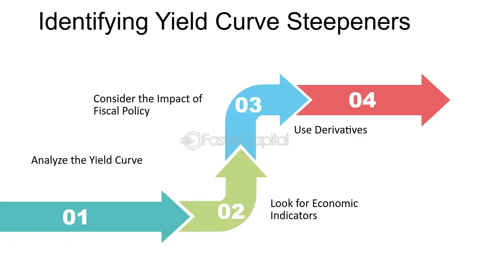

## Table of Contents

## What is a curve steepener trade?

A curve steepener trade is a strategy used in the bond market where an investor tries to make money by betting that the difference between short-term and long-term interest rates will get bigger. This difference is called the yield curve. When the yield curve gets steeper, it means that long-term rates are going up faster than short-term rates. Investors do this trade by buying long-term bonds and selling short-term bonds at the same time.

This trade can be profitable if the investor's guess about the yield curve is right. If the yield curve does get steeper, the price of long-term bonds will go up more than the price of short-term bonds will go down. This means the investor can make a profit from the difference. However, if the yield curve flattens or inverts instead, the trade can lose money. So, it's a bit risky, but it can pay off if the market moves the right way.

## Why would an investor engage in a curve steepener trade?

An investor might engage in a curve steepener trade because they believe that the difference between short-term and long-term interest rates will increase. This belief could be based on economic forecasts, central bank policies, or other market indicators suggesting that long-term rates will rise faster than short-term rates. By buying long-term bonds and selling short-term bonds, the investor is positioning themselves to profit from this expected change in the yield curve.

The potential reward of a curve steepener trade can be appealing to investors looking to capitalize on their market predictions. If the yield curve does steepen as expected, the price of long-term bonds will increase more than the price of short-term bonds will decrease, leading to a profit from the trade. However, this strategy also comes with risks, as an incorrect prediction about the yield curve's movement could result in losses. Despite the risks, the possibility of significant gains makes the curve steepener trade an attractive option for some investors.

## What are the basic components of a yield curve?

A yield curve is a line that shows the interest rates for bonds that have different times until they pay back the money. The basic components of a yield curve are the maturity dates of the bonds and the interest rates, or yields, that these bonds offer. Maturity dates can be short, like a few months, or long, like 30 years. The interest rates show how much money you can earn from the bond over time.

When you look at a yield curve, the horizontal line shows the time until the bond matures, and the vertical line shows the [interest rate](/wiki/interest-rate-trading-strategies). Normally, a yield curve goes up and to the right because longer-term bonds usually have higher interest rates than shorter-term bonds. This happens because investors want more money for lending their money for a longer time, which is called a risk premium.

## How does a steepening yield curve affect the economy?

A steepening yield curve can be a sign that the economy is doing well or might do better soon. When the yield curve gets steeper, it means the difference between short-term and long-term interest rates is getting bigger. This usually happens when people think the economy will grow more in the future. Businesses might see this as a good time to borrow money for new projects because they can get long-term loans at lower rates than they would in the future. This can lead to more spending and investment, which helps the economy grow.

However, a steepening yield curve can also have some downsides. If it happens too fast, it might make banks less willing to lend money because they can earn more by just holding onto government bonds. Also, if the yield curve gets too steep, it might mean that inflation is expected to go up a lot, which can be bad for the economy if it gets out of control. So, while a steeper yield curve can be good for growth, it needs to be watched carefully to make sure it doesn't cause problems.

## What are some common strategies used in curve steepener trades?

In a curve steepener trade, one common strategy is to buy long-term bonds and sell short-term bonds at the same time. This is called a "bull steepener" because the investor believes that long-term rates will go up faster than short-term rates. They expect the yield curve to get steeper because the economy is doing well or inflation is expected to go up. If this happens, the price of the long-term bonds they bought will go up more than the price of the short-term bonds they sold will go down, so they can make a profit.

Another strategy is called a "bear steepener." In this case, the investor thinks that short-term rates will go down while long-term rates stay the same or go up a little. They might do this if they think the central bank will lower short-term rates to help the economy. To do a bear steepener trade, the investor would sell short-term bonds and buy long-term bonds. If their guess is right, the yield curve will get steeper, and they can make money from the difference in how the bond prices change.

## Can you provide an example of a simple curve steepener trade using Treasury securities?

Imagine you think that the difference between short-term and long-term interest rates will get bigger. You decide to do a curve steepener trade using U.S. Treasury securities. You buy a 30-year Treasury bond, which has a long time until it pays you back, and you sell a 2-year Treasury note, which will pay you back sooner. If the difference between long-term and short-term rates does get bigger, the price of the 30-year bond you bought will go up more than the price of the 2-year note you sold will go down. This means you can make money from the trade.

For example, let's say you buy a 30-year Treasury bond with a face value of $100,000 at a yield of 2.5%. At the same time, you sell a 2-year Treasury note with a face value of $100,000 at a yield of 1.5%. If the yield on the 30-year bond drops to 2.3% because long-term rates are going up slower than short-term rates, the price of your bond will go up. If the yield on the 2-year note stays the same or goes up a little, the price of the note you sold will not change much or go down a bit. The difference in how the prices change can help you make a profit from the trade.

## What are the risks associated with curve steepener trades?

Curve steepener trades can be risky because they depend a lot on guessing how interest rates will change. If you guess wrong and the yield curve doesn't get steeper, you could lose money. For example, if you buy long-term bonds and sell short-term bonds, but the long-term rates don't go up faster than the short-term rates, the price of the long-term bonds you bought might not go up enough, or it might even go down. At the same time, the price of the short-term bonds you sold could go up, making your trade lose money.

Another risk is that the market can be unpredictable. Things like changes in government policy, unexpected economic news, or big events can make interest rates move in ways you didn't expect. If the yield curve flattens or inverts instead of getting steeper, your trade will not work out the way you planned. Also, using borrowed money to do these trades can make the risks even bigger because you could lose more than you put in if the market goes against you.

## How do macroeconomic indicators influence the decision to enter a curve steepener trade?

Macroeconomic indicators like inflation rates, employment numbers, and GDP growth can help investors decide if they should do a curve steepener trade. If these indicators show that the economy is getting stronger, investors might think that long-term interest rates will go up faster than short-term rates. This is because a strong economy can lead to higher inflation, and people might want more money for lending over a long time. So, if the indicators suggest good economic growth, an investor might choose to buy long-term bonds and sell short-term bonds, hoping to make money as the yield curve gets steeper.

On the other hand, if the macroeconomic indicators show that the economy is slowing down or might have problems, investors might be less likely to do a curve steepener trade. A weak economy could mean that interest rates will stay low or even go down, which would make the yield curve flatter or even invert. In this case, the trade might not work out well, and investors might look for other ways to make money. So, watching these indicators closely helps investors make better guesses about what will happen with interest rates and the yield curve.

## What are the differences between bull steepening and bear steepening?

Bull steepening happens when people think the economy will get better. They expect long-term interest rates to go up faster than short-term rates. So, investors do a bull steepener trade by buying long-term bonds and selling short-term bonds. If the economy does grow like they thought, the price of the long-term bonds goes up a lot, and the price of the short-term bonds doesn't change much or goes down a little. This makes the trade profitable because the yield curve gets steeper.

Bear steepening is different. It happens when people think short-term rates will go down while long-term rates stay the same or go up a bit. This might happen if the central bank decides to lower short-term rates to help the economy. In a bear steepener trade, investors sell short-term bonds and buy long-term bonds. If their guess is right and short-term rates drop, the yield curve will still get steeper, but for a different reason. The trade can make money if the price of the long-term bonds goes up more than the price of the short-term bonds goes down.

## How can an investor use options to execute a curve steepener strategy?

An investor can use options to do a curve steepener trade by buying and selling options on bonds with different times until they pay back the money. For example, if an investor thinks the difference between short-term and long-term rates will get bigger, they might buy call options on long-term bonds and sell put options on short-term bonds. Call options give the investor the right to buy the bond at a set price, while put options let them sell the bond at a set price. If the yield curve gets steeper like the investor expects, the value of the long-term bond call options will go up, and the value of the short-term bond put options will go down or stay the same. This can make money for the investor.

Using options can be good because it lets the investor make money from their guess about the yield curve without having to buy the bonds themselves. Options can also limit how much money the investor can lose if the yield curve doesn't move the way they thought. But, options can be tricky and have their own risks, like the cost of the options and how fast they lose value over time. So, it's important for the investor to understand options well before using them in a curve steepener trade.

## What advanced techniques can be used to enhance returns in a curve steepener trade?

One advanced technique to enhance returns in a curve steepener trade is to use leverage. This means borrowing money to buy more long-term bonds than you could with just your own money. If the yield curve gets steeper like you thought, the price of the long-term bonds will go up a lot, and you can make more money because you bought more bonds with the borrowed money. But, be careful, because if the yield curve doesn't move the way you thought, you could lose more money than you started with.

Another technique is to use options in a more complex way, like setting up a spread. For example, you can buy call options on long-term bonds at a lower strike price and sell call options on the same bonds at a higher strike price. This way, you can make money if the long-term bond prices go up a little bit, but you won't lose as much if the prices don't move or go down. You can also do this with short-term bonds by selling put options at a lower strike price and buying put options at a higher strike price. This can help limit your risk while still giving you a chance to make money if the yield curve steepens.

## How do global interest rate movements impact the effectiveness of a curve steepener strategy?

Global interest rate movements can have a big effect on how well a curve steepener strategy works. If interest rates in other countries go up, it might make investors want to buy bonds from those countries instead of from the country where you're doing your trade. This can make the yield curve in your country change in ways you didn't expect. For example, if long-term rates in other countries go up a lot, it might pull money away from your long-term bonds, making their prices go down instead of up like you hoped.

Also, if central banks around the world change their interest rates, it can mess up your curve steepener trade. If a big central bank like the one in the U.S. or Europe decides to raise or lower their rates, it can cause a ripple effect on interest rates everywhere. This can make the yield curve in your country move differently than you planned. So, it's important to keep an eye on what's happening with interest rates around the world when you're thinking about doing a curve steepener trade.

## What is the Curve Steepener Trade and How Does it Work?

A Curve Steepener Trade involves engaging with the difference between short-term and long-term interest rates by taking a long position in short-term U.S. Treasury bonds while simultaneously shorting long-term U.S. Treasury bonds. The unique objective of this trade is to capitalize on the steepening of the yield curve—a phenomenon where long-term interest rates increase at a faster pace than short-term rates. This approach can offer a hedge against specific economic expectations, notably those related to growth and inflation.

The financial yield curve, which represents the disparity between yields across varied maturities, can fundamentally alter investment strategies. When the yield curve steepens, it reflects increasing confidence in economic growth; investors then expect higher inflation, which typically results in higher interest rates over the long term. Financial market participants often interpret a steepening curve as a sign of economic expansion, driven by probable future rate hikes by central banks like the Federal Reserve. The formula to understand the yield curve dynamics can be expressed as:

$$
\Delta Y = Y_{\text{long-term}} - Y_{\text{short-term}}
$$

where $Y_{\text{long-term}}$ and $Y_{\text{short-term}}$ are the yields on long-term and short-term Treasuries, respectively.

In embracing this strategy, traders place a bet on this differential increasing. However, this does inherently imply an assumption about the future path of interest rates and economic growth. Successful execution requires a deep understanding of macroeconomic factors that can influence yield curves, such as shifts in Federal Reserve policy or notable economic indicators like GDP growth rates or consumer price index (CPI) changes.

The utility of the Curve Steepener trade lies in its potential to provide lucrative returns should investor sentiments regarding economic growth materialize. However, traders must also contend with the risks of incorrect timing or misjudging the trajectory of economic indicators. Robust analytical skills and access to real-time macroeconomic data can support traders in making informed decisions with respect to this sophisticated investment strategy.

## What are Advanced Curve Steepener Trading Techniques?

Advanced Curve Steepener Trading Techniques involve sophisticated methods that can enhance traders' abilities to leverage yield curve dynamics effectively. 

Yield curve modeling plays a critical role in refining the Curve Steepener Strategy. Traders use mathematical models to predict future movements in the yield curve, considering factors such as interest rate [volatility](/wiki/volatility-trading-strategies) and economic forecasts. One popular approach is the Nelson-Siegel model, which offers a parsimonious representation of the yield curve through three main factors: level, slope, and curvature. These factors allow traders to simulate and anticipate potential future curve configurations, enabling strategic positioning.

Spread trading is another essential technique employed by advanced traders. This involves taking simultaneous long and short positions in different maturities to exploit changes in yield spreads. The dynamics of these spreads can be understood via the formula:

$$

\text{Spread} = Y_{\text{long-term}} - Y_{\text{short-term}} 
$$

where $Y_{\text{long-term}}$ and $Y_{\text{short-term}}$ represent the yields of long-term and short-term securities, respectively. By closely monitoring fluctuations in the spread, traders can identify periods of expected steepening or flattening, allowing for strategic entry and exit points.

In addition to these strategies, options trading can enhance the Curve Steepener approach. Options provide leverage and can be used to express views on yield curve movements with limited risk. For instance, a steepener could be executed by purchasing call options on long-term bond futures, benefiting from an expected rise in long-term yields.

Relative value analysis is also instrumental in augmenting Curve Steepeners. This involves cross-market comparisons to identify mispricings or relative value opportunities. Traders may compare the yield spreads between different countries' bonds or between corporate bonds and Treasuries, seeking instances where market discrepancies might indicate profitable steepening trades.

Python's data analysis libraries, such as pandas and NumPy, can be invaluable tools for implementing these techniques algorithmically. Here's a simple example of how Python might be used for spread analysis:

```python
import pandas as pd

# Sample data
data = {'short_term_yield': [0.5, 0.6, 0.55, 0.65],
        'long_term_yield': [1.5, 1.6, 1.55, 1.75]}

df = pd.DataFrame(data)

# Calculate yield spread
df['spread'] = df['long_term_yield'] - df['short_term_yield']

# Determine steepening opportunities
df['steepening_opportunity'] = df['spread'].diff().apply(lambda x: 'Yes' if x > 0 else 'No')

print(df)
```

This script calculates the yield spread and identifies opportunities for steepening based on the spread's movement, showcasing the integration of quantitative methods and data analysis in advanced trading strategies. By employing such advanced techniques, traders can better position themselves to capitalize on the evolving nature of yield curves and interest rate movements.

## References & Further Reading

[1]: ["Treasury Yield Curve and Its Role in Financial Markets"](https://www.sciencedirect.com/science/article/pii/S1057521923003447) - Federal Reserve

[2]: Vineer Bhansali, "Bond Portfolio Investing and Risk Management: Interest Rates, Bonds, and Inflation." 

[3]: ["Interest Rate Swaps and Other Derivatives"](https://www.amazon.com/Interest-Derivatives-Columbia-Business-Publishing/dp/0231159641) by Howard Corb

[4]: ["Algorithmic Trading: Winning Strategies and Their Rationale"](https://onlinelibrary.wiley.com/doi/pdf/10.1002/9781118676998.fmatter) by Ernest P. Chan

[5]: ["Yield Curve Modeling and Forecasting: The Dynamic Nelson-Siegel Approach"](https://www.jstor.org/stable/j.ctt1r2dc4) by Francis X. Diebold and Glenn D. Rudebusch