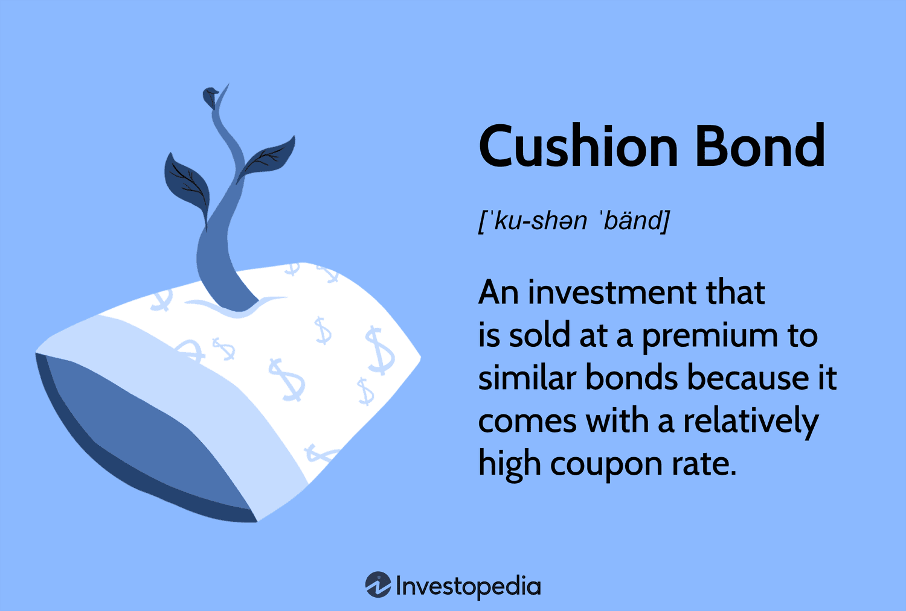

Bond investing serves as a foundational element in portfolio management due to its capacity to offer stability and predictable returns. Bonds are essentially loans from investors to borrowers, such as corporations or governments, which pay periodic interest over a fixed term and return the principal upon maturity. Within bonds, cushion bonds hold particular significance. They provide distinct advantages by offering higher coupon rates compared to prevailing market rates. This characteristic renders them particularly appealing in stable or moderately rising interest rate environments, allowing investors to benefit from larger coupon payments over time.

Cushion bonds encompass specific features, such as being callable, which means the issuer can pay off the bond before its maturity date, under conditions favorable to them. This callable feature is generally offset by the high coupon rate, attracting investors seeking a form of interest rate insurance, or a "cushion," against potential fluctuations. The pricing of cushion bonds centers on the yield-to-call rather than the yield-to-maturity, reflecting the possibility of early repayment.



Algorithmic trading has emerged as a transformative force within bond markets, revolutionizing fixed-income strategies by significantly enhancing trading speed and efficiency. In an environment driven by rapid technological advancements, algorithmic trading employs algorithms to automate the trading process, thereby reducing transaction costs and increasing market liquidity. This technological integration allows for more precise execution of trades, aligning well with the dynamic nature of bond investing.

The confluence of cushion bonds and algorithmic trading provides exciting avenues for optimizing investing strategies within fixed-income portfolios. By combining the characteristics of cushion bonds with the precision of algorithmic trading, investors can achieve enhanced portfolio performance, strategically capitalizing on market conditions while ensuring efficient trade execution. This article aims to examine how the alignment of cushion bonds, fixed income strategies, and algorithmic trading can be orchestrated effectively to achieve optimal investment outcomes.

## Table of Contents

## Understanding Cushion Bonds

Cushion bonds are a distinctive class of bonds characterized by their high coupon rates and callable features. These bonds are typically issued with coupon rates that exceed current prevailing market rates, providing investors with an attractive income stream. The callable feature of cushion bonds grants the issuer the right to redeem the bond before its maturity date, often at a specified call price.

The benefits of cushion bonds become particularly pronounced in environments where interest rates are stable or slowly rising. In such scenarios, the high coupon payments from cushion bonds offer investors a significant cash flow advantage over other bonds with lower coupon rates. This cash flow remains consistent over time, barring the event of the issuer exercising the call option. The high coupon rate acts as a cushion, mitigating the impact of interest rate fluctuations and thereby stabilizing the bond's price.

One of the key aspects to understand about cushion bonds is their pricing mechanism, which emphasizes the yield-to-call (YTC) rather than the traditional yield-to-maturity (YTM). The yield-to-call is the yield an investor can expect if the bond is called prior to maturity. It is calculated by considering the present value of the bond's future cash flows up to the call date, not the maturity date. The formula for yield-to-call can be expressed as:

$$

\text{YTC} = \left( \frac{C + \frac{P - C_P}{N_c}}{\frac{P + C_P}{2}} \right) 
$$

Where:
- $C$ is the annual coupon payment.
- $P$ is the call price (face value if held until maturity).
- $C_P$ is the price paid for the bond.
- $N_c$ is the number of years until the call date.

Unlike yield-to-maturity, which assumes that the bond will be held until maturity, YTC provides a more realistic assessment of the bond's return in the presence of a call option. If interest rates fall, the likelihood of the bond being called increases, thus emphasizing the significance of YTC in cushion bond valuation. By focusing on yield-to-call, investors can better gauge the expected return on cushion bonds. This approach, combined with careful assessment of callable features, aids in aligning the fixed income strategies with [interest rate](/wiki/interest-rate-trading-strategies) expectations and investment goals.

## Benefits of Cushion Bonds in Fixed Income Portfolios

Cushion bonds offer a strategic advantage in fixed income portfolios by providing a buffer against interest rate fluctuations. These bonds typically feature high coupon rates compared to current market interest rates, which inherently grants them a degree of resilience against changes in interest rates. When interest rates rise, bond prices generally fall; however, the larger coupon payments provided by cushion bonds can compensate for potential declines in price, thereby softening the impact of rising rates.

One key advantage of cushion bonds is their ability to achieve faster breakeven points through their larger coupon payments. The breakeven point is the point at which the income generated by the bond equals the initial investment cost. Larger coupon payments allow investors to recover their initial investment more quickly, reducing the risk associated with long-term interest rate movements. This feature is particularly beneficial in environments where interest rates are expected to rise gradually or remain stable.

Cushion bonds are well-suited to conservative investment strategies that aim to minimize [volatility](/wiki/volatility-trading-strategies). Their structure affords them stability and predictable income, appealing to investors seeking to preserve capital while [earning](/wiki/earning-announcement) a steady return. By incorporating cushion bonds into a fixed-income portfolio, investors can better manage interest rate risk while benefiting from consistent cash flows. This makes them an effective tool in diversifying portfolio allocations, reducing overall portfolio volatility, and achieving a balanced risk-return profile.

## Types of Bonds and Their Roles in Portfolios

Bonds are a fundamental component of investment portfolios, serving multiple roles such as providing steady income, preserving capital, and acting as a hedge against equity market volatility. Various types of bonds, including government, municipal, corporate, and high-yield bonds, exhibit distinct characteristics and risk-return profiles that cater to different investor needs.

**Government Bonds**

Government bonds, or sovereign bonds, are debt securities issued by national governments. They are generally considered the safest form of investment due to the backing of the government’s creditworthiness. However, this safety comes with lower returns compared to other bond types. U.S. Treasury bonds are a benchmark for evaluating economic conditions and interest rates. These bonds are crucial in balancing portfolios, offering stability and predictable income streams while mitigating risks associated with equity investments.

**Municipal Bonds**

Municipal bonds are issued by local and state governments to finance public projects such as schools, highways, and water systems. They offer tax advantages, as income from municipal bonds is often exempt from federal taxes, and sometimes state and local taxes, depending on the investor’s residency. The risk associated with municipal bonds is generally low, though not as low as government bonds, resulting in slightly higher yields. These bonds are particularly attractive to investors in higher tax brackets looking to optimize after-tax returns, thereby complementing other income-generating assets in a diversified portfolio.

**Corporate Bonds**

Corporate bonds are issued by companies to raise capital for various purposes such as expansion, capital expenditures, or refinancing existing liabilities. They offer higher yields than government and municipal bonds due to the increased risk of default associated with corporate issuers. The risk-return profile of corporate bonds can vary significantly, depending on the issuing company’s creditworthiness. In typical portfolio strategies, corporate bonds are used to enhance yield while accepting moderate risk, offering a middle ground between the safety of government securities and the higher risk of equities.

**High-Yield Bonds**

High-yield bonds, often referred to as "junk bonds," are issued by companies with lower credit ratings, reflecting a higher risk of default. As compensation for this risk, they offer substantially higher yields than investment-grade corporate bonds. High-yield bonds are suitable for investors seeking high returns and are willing to accept the potential for significant price volatility. They can add an aggressive risk element to portfolios, usually representing a small proportion to avoid excessive exposure to potential default risks.

**Cushion Bonds**

Cushion bonds possess unique features that differentiate them from the bonds mentioned above, primarily through their high coupon rates and callable characteristics. These bonds offer enhanced income through larger coupon payments, making them attractive in stable or slowly rising interest rate environments. Cushion bonds fit into the landscape by providing a buffer against interest rate fluctuations, reducing the duration risk compared to longer-maturity bonds with lower coupons. Their callable feature allows issuers to redeem them before maturity, typically when interest rates fall, which can affect yield predictability. Investors use cushion bonds to achieve faster breakeven points, complementing other fixed-income instruments aimed at minimizing portfolio volatility.

**Portfolio Balancing**

Bonds play a critical role in portfolio diversification, acting as a counterbalance to equities. While stocks can offer substantial growth, they also come with higher volatility. Bonds mitigate this risk through steady income and relative price stability. The inclusion of bonds in a portfolio helps to dampen volatility during market downturns, providing a cushion that reduces overall portfolio risk. The strategic mix of different bond types allows investors to tailor their risk and return profiles, aligning with their financial objectives and market outlook. By integrating cushion bonds, investors can further enhance their income strategy and manage interest rate risks effectively.

## Algorithmic Trading in Fixed Income Markets

Algorithmic trading, a method of executing orders using automated and pre-programmed trading instructions, has significantly transformed fixed income markets. By leveraging complex algorithms, traders can execute large volumes of bond trades with enhanced precision and efficiency. The primary advantage of [algorithmic trading](/wiki/algorithmic-trading) lies in its ability to quickly process vast amounts of market data and execute trades at speeds unattainable by human traders. This increased speed and efficiency can result in reduced transaction costs and improved market [liquidity](/wiki/liquidity-risk-premium).

Algorithms enhance trading precision by ensuring that trades are executed at the best available prices while minimizing market impact and slippage. They do this by calculating optimal trade sizes and execution times to avoid excessive price changes caused by large trades. Additionally, algorithms can be customized to fit different market conditions, further enhancing their effectiveness in fixed income markets.

The integration of [machine learning](/wiki/machine-learning) and [artificial intelligence](/wiki/ai-artificial-intelligence) (AI) in algorithmic trading has further optimized bond investment strategies. Machine learning algorithms can analyze historical market data to identify patterns and trends, enabling the development of predictive models for bond prices and interest rates. These models can assist traders in making informed decisions and adapting to changing market conditions.

AI techniques, such as natural language processing, can be employed to analyze unstructured data sources, like news articles and social media, which may influence bond prices. By incorporating such data into trading models, AI can provide a more comprehensive view of the market, leading to better-informed trading decisions. Furthermore, [reinforcement learning](/wiki/reinforcement-learning), a subset of AI, allows algorithms to learn from past experiences and continuously improve their performance over time.

In summary, the application of algorithmic trading, combined with machine learning and AI, has revolutionized fixed income markets by enhancing trading precision, reducing costs, and offering sophisticated tools for investment strategy optimization. This technological advancement has made it possible for traders to efficiently navigate the complexities of bond markets, offering the potential for improved returns and risk management.

## Integrating Cushion Bonds with Algorithmic Trading

Integrating cushion bonds with algorithmic trading presents a promising avenue for enhancing portfolio performance by marrying traditional fixed income strategies with modern technological advancements. This integration can streamline the management of cushion bond portfolios through the utilization of precise and efficient trading algorithms. 

Algorithmic trading in cushion bond portfolios can capitalize on the distinctive characteristics of these bonds, particularly their high coupon rates and callable features. One key strategy involves developing algorithms that monitor interest rate movements in real-time to determine the optimal timing for bond purchases and sales. This real-time data processing capability enables algorithms to swiftly react to changes in market conditions, thereby maximizing returns while minimizing risks associated with interest rate volatility.

Automated monitoring and trade execution enhance returns by reducing the latency between decision making and trade implementation. The swift execution of trades ensures that investors are better positioned to take advantage of fleeting opportunities in the bond market. For instance, an automated system can be programmed to identify and exploit the most advantageous yield-to-call scenarios, which are pivotal to the pricing of cushion bonds. 

Several algorithmic models can be effectively employed to manage cushion bond portfolios. Machine learning models, such as reinforcement learning, can be trained to optimize trading strategies by learning from historical data and adjusting the allocation of assets to improve yield outcomes. Moreover, trend-following algorithms can track macroeconomic indicators and interest rate trends to execute trades that align with predicted movements in the bond market.

Python, with its rich ecosystem of libraries like NumPy, pandas, and scikit-learn, offers robust tools for building these algorithms. A simple example involves using Python's `pandas` library to handle large datasets of bond prices and execute trades based on moving average crossovers—a common signal used in algorithmic trading. Below is a basic Python code snippet for implementing a moving average crossover strategy:

```python
import pandas as pd

def moving_average_crossover(data, short_window, long_window):
    signals = pd.DataFrame(index=data.index)
    signals['price'] = data['price']
    signals['short_mavg'] = signals['price'].rolling(window=short_window, min_periods=1, center=False).mean()
    signals['long_mavg'] = signals['price'].rolling(window=long_window, min_periods=1, center=False).mean()
    signals['signal'] = 0.0
    signals['signal'][short_window:] = np.where(signals['short_mavg'][short_window:] > signals['long_mavg'][short_window:], 1.0, 0.0)   
    signals['positions'] = signals['signal'].diff()
    return signals

# Example usage
bond_data = pd.read_csv('bond_prices.csv', index_col='date', parse_dates=True)
signals = moving_average_crossover(bond_data, short_window=40, long_window=100)
```

In summary, integrating cushion bonds with algorithmic trading involves leveraging technology to refine trading strategies and optimize portfolio returns through real-time monitoring and execution. By incorporating advanced algorithmic models, investors can effectively exploit the unique characteristics of cushion bonds, enhancing their fixed income strategies.

## Challenges and Risks of Algorithmic Trading in Bonds

Algorithmic trading in the bond markets offers numerous benefits, including speed and precision. However, it also introduces various challenges and risks that investors and traders must navigate. One significant concern is model overfitting. Overfitting occurs when an algorithm is too finely tuned to historical data, capturing noise instead of underlying trends. This results in models that perform well on past data but poorly on new, unseen data. Overfitting can lead to suboptimal trading strategies and unexpected losses. A common approach to mitigate overfitting is to use techniques such as cross-validation, where the dataset is divided into multiple parts, and the model is tested on different subsets to ensure generalized performance.

Market anomalies present another challenge. These are events or conditions in the market that deviate from the expected norm and can distort model predictions. Algorithmic traders must design their models to detect and adapt to such anomalies. This involves implementing adaptive algorithms that can dynamically adjust their parameters based on real-time data inputs and market conditions.

Implementing algorithmic trading in less liquid bond markets poses additional difficulties. Less liquid markets are characterized by fewer transactions and greater price volatility, which can lead to wider bid-ask spreads and increased trading costs. These conditions can reduce the effectiveness of algorithmic strategies, particularly those reliant on high-frequency trading. In low liquidity environments, algorithms may struggle to execute trades at desired prices or sizes, leading to slippage and increased market impact.

To address these challenges, traders can incorporate liquidity-adjusted risk measures into their algorithms. This involves evaluating not only the expected returns but also the liquidity risk associated with trading a particular bond. Developing sophisticated liquidity proxies and incorporating them into risk assessments can improve algorithmic strategies' resilience in illiquid markets.

In summary, while algorithmic trading in bond markets can enhance efficiency and execution, it also requires careful attention to the risks of model overfitting and market anomalies, especially in less liquid environments. By adopting robust risk management practices and adaptive algorithms, traders can better navigate these challenges and optimize their bond trading strategies.

## Conclusion

The integration of cushion bonds with algorithmic trading offers a strategic advantage in enhancing portfolio performance. Cushion bonds, known for their high coupon rates and callable features, provide a steady income stream and act as a buffer against interest rate volatility. When these bonds are managed with algorithmic trading techniques, investors can exploit market inefficiencies, optimize trade execution, and achieve superior precision in portfolio management.

Algorithmic trading adds a layer of sophistication by using advanced models and machine learning to predict market trends and automate decision-making processes. This integration allows for continuous monitoring and swift execution of trades, ensuring that portfolios are dynamically adjusted in response to market changes. Such agility is crucial in maintaining the balance between risk and return, especially in fixed-income investments where timing plays a pivotal role.

Investors should consider combining traditional bond strategies with cutting-edge technologies to meet diverse financial goals. While traditional bonds offer stability, their potential is significantly enhanced when supported by the computational power of algorithmic trading. This synergy not only mitigates risks such as interest rate fluctuations but also maximizes returns, making it an attractive option for both conservative and tech-savvy investors.

## References & Further Reading

[1]: Campbell, J. Y., & Viceira, L. M. (2002). ["Strategic Asset Allocation: Portfolio Choice for Long-Term Investors."](https://academic.oup.com/book/6093) Oxford University Press.

[2]: Fabozzi, F. J. (2007). ["Fixed Income Analysis."](https://www.amazon.com/Fixed-Income-Analysis-Frank-Fabozzi/dp/047005221X) Wiley Finance.

[3]: Goodhart, C. A. E., & O’Hara, M. (1997). ["High Frequency Data in Financial Markets: Issues and Applications."](https://www.sciencedirect.com/science/article/pii/S0927539897000030) Journal of Empirical Finance, 4(2-3), 73-114.

[4]: Cartea, Á., Jaimungal, S., & Penalva, J. (2015). ["Algorithmic and High-Frequency Trading."](https://assets.cambridge.org/97811070/91146/frontmatter/9781107091146_frontmatter.pdf) Cambridge University Press.

[5]: Hull, J. (2018). ["Options, Futures, and Other Derivatives."](https://books.google.com/books/about/Options_Futures_and_Other_Derivatives.html?id=vpIYvgAACAAJ) Pearson Education.

[6]: de Prado, M. L. (2018). ["Advances in Financial Machine Learning."](https://www.amazon.com/Advances-Financial-Machine-Learning-Marcos/dp/1119482089) Wiley.

[7]: Kolanovic, M., & Kriesler, R. (2017). ["Big Data and AI Strategies: Machine Learning and Alternative Data Approach to Investing."](https://docslib.org/doc/12945320/big-data-and-ai-strategies-machine-learning-and-alternative-data-approach-to-investing) J.P. Morgan Research.

[8]: Aronson, D. R. (2007). ["Evidence-Based Technical Analysis: Applying the Scientific Method and Statistical Inference to Trading Signals."](https://onlinelibrary.wiley.com/doi/book/10.1002/9781118268315) Wiley.

[9]: Jansen, S. (2018). ["Machine Learning for Algorithmic Trading: Predictive Models to Extract Signals from Market and Alternative Data for Systematic Trading Strategies with Python."](https://www.amazon.com/Machine-Learning-Algorithmic-Trading-alternative/dp/1839217715) Packt Publishing.

[10]: Chan, E. (2008). ["Quantitative Trading: How to Build Your Own Algorithmic Trading Business."](https://github.com/ftvision/quant_trading_echan_book) Wiley.