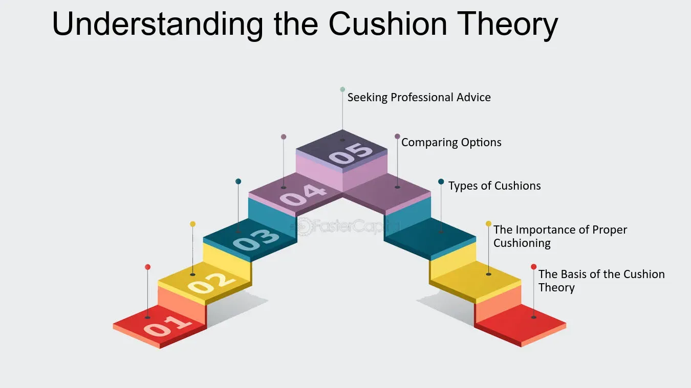

## Table of Contents

## What is Cushion Theory?

Cushion Theory is an idea about how people feel safer and more comfortable when they have a "cushion" or extra resources. This cushion can be money, time, or other things that help people feel secure. For example, having some extra money saved up can make people feel less worried about unexpected expenses.

This theory explains why people might keep working even when they have enough money to stop. They want to keep building their cushion to feel even safer. The cushion helps people handle surprises and changes in life without feeling too stressed. It's like having a safety net that makes life feel easier and more secure.

## Who developed the Cushion Theory and when?

Cushion Theory was developed by a man named Abraham Zaleznik. He came up with this idea a long time ago, in the year 1960. Abraham Zaleznik was a professor who studied how people behave at work and in their lives. He noticed that people often want to have extra resources, like money or time, to feel safer and more comfortable.

Zaleznik called this extra resource a "cushion." He believed that having a cushion helps people feel less worried about unexpected problems. For example, if someone has some extra money saved, they might not be as stressed if they suddenly need to fix their car. This idea of a cushion has been useful for understanding why people keep working even when they don't need to, just to build up their safety net.

## What are the basic principles of Cushion Theory?

Cushion Theory is all about how people like to have extra resources to feel safe and comfortable. These resources can be things like money, time, or even support from friends and family. The main idea is that having a cushion helps people deal with surprises and unexpected problems without getting too stressed. For example, if someone has some extra money saved up, they won't panic if they need to fix their car suddenly. This cushion acts like a safety net, making life feel easier and more secure.

The second principle of Cushion Theory is that people keep working to build up their cushion even when they might not need to. They want to keep adding to their safety net so they can feel even safer. This is why some people don't stop working even when they have enough money to live on. They want to keep that cushion growing so they can handle whatever comes their way without worrying too much. It's all about feeling secure and ready for anything life throws at them.

## How does Cushion Theory apply to everyday life?

Cushion Theory is all about having extra resources to feel safe and comfortable in everyday life. These resources can be money, time, or even help from friends and family. For example, if you have some extra money saved up, you won't panic if your car breaks down or if you need to pay for a sudden medical bill. This extra money acts like a cushion, making you feel more secure and less stressed about unexpected problems.

In everyday life, people often work hard to build up their cushion. They might keep working even when they have enough money to live on because they want to keep adding to their safety net. This way, they can handle whatever comes their way without worrying too much. For instance, someone might save up extra money so they can take a break from work without feeling stressed about their finances. It's all about feeling ready for anything life throws at them and making life feel easier and more secure.

## What are the key components of Cushion Theory?

Cushion Theory is about having extra resources to feel safe and comfortable. These resources can be money, time, or help from friends and family. The main idea is that having a cushion helps people deal with surprises and unexpected problems without getting too stressed. For example, if someone has some extra money saved up, they won't panic if they need to fix their car suddenly. This cushion acts like a safety net, making life feel easier and more secure.

The second key component of Cushion Theory is that people keep working to build up their cushion even when they might not need to. They want to keep adding to their safety net so they can feel even safer. This is why some people don't stop working even when they have enough money to live on. They want to keep that cushion growing so they can handle whatever comes their way without worrying too much. It's all about feeling secure and ready for anything life throws at them.

## Can you explain the psychological basis behind Cushion Theory?

Cushion Theory is based on the idea that people feel safer and less stressed when they have extra resources. These resources can be money, time, or help from others. The psychological basis behind this theory is that having a cushion helps people feel more secure because it gives them a sense of control over their lives. When people know they have something to fall back on, they worry less about unexpected problems. For example, if someone has some extra money saved up, they won't panic if they need to pay for a sudden medical bill. This feeling of security can reduce stress and anxiety, making life feel easier and more comfortable.

Another part of the psychological basis of Cushion Theory is that people are motivated to keep building their cushion. This is because having more resources makes them feel even safer. People often keep working even when they have enough money to live on because they want to keep adding to their safety net. This ongoing effort to build up their cushion is driven by a desire to be prepared for anything that might happen. It's like having a safety net that keeps growing, which helps people feel ready to handle whatever life throws at them without getting too worried.

## How effective is Cushion Theory in managing stress?

Cushion Theory is very effective in managing stress because it helps people feel safer and more secure. When people have extra resources like money or time, they worry less about unexpected problems. For example, if someone has some extra money saved up, they won't panic if they need to fix their car suddenly. This feeling of security reduces stress and anxiety, making life feel easier and more comfortable. The cushion acts like a safety net, giving people a sense of control over their lives.

Another way Cushion Theory helps manage stress is by motivating people to keep building their cushion. This ongoing effort to have more resources makes people feel even safer. People often keep working even when they have enough money to live on because they want to keep adding to their safety net. This sense of being prepared for anything that might happen reduces stress because people feel ready to handle surprises without getting too worried. Having a growing cushion helps people feel more relaxed and secure in their everyday lives.

## What are some practical examples of Cushion Theory in action?

One practical example of Cushion Theory in action is saving money for emergencies. Imagine someone named Sarah who saves a little bit of money every month. She doesn't need the money right away, but she keeps saving it. One day, her car breaks down and she needs to pay for a big repair. Because Sarah has her savings as a cushion, she doesn't feel too stressed about the repair. She can pay for it without worrying about how she will manage other bills. This cushion helps her feel secure and less anxious about unexpected expenses.

Another example is having extra time as a cushion. Let's say John works hard at his job but also makes sure to have some free time every week. He uses this time to relax and do things he enjoys. One day, he gets sick and needs to take a few days off work. Because John has built up a cushion of time, he doesn't feel stressed about taking time off. He knows he can rest and recover without worrying about falling behind at work. This time cushion helps him feel more in control and less stressed about unexpected situations.

## How does Cushion Theory compare to other stress management theories?

Cushion Theory is different from other stress management theories because it focuses on having extra resources to feel safe and less stressed. For example, other theories might talk about changing how you think or using relaxation techniques to manage stress. But Cushion Theory says that having a cushion, like extra money or time, helps you feel more secure. This feeling of security can make you worry less about unexpected problems, which can reduce stress. It's like having a safety net that makes life feel easier and more comfortable.

Compared to theories like Cognitive Behavioral Therapy (CBT), which tries to change the way you think about stress, Cushion Theory is more about what you have, not how you think. CBT might help you see stressful situations differently, but Cushion Theory helps you feel ready for those situations by having extra resources. Both theories can help with stress, but they work in different ways. Cushion Theory is about building up your safety net, while other theories might focus on changing your mind or using relaxation techniques to handle stress.

## What are the limitations and criticisms of Cushion Theory?

One limitation of Cushion Theory is that it might not work for everyone. Not everyone can save extra money or have extra time. Some people might have jobs that don't pay enough or have too many things to do. So, the idea of having a cushion might not help them feel less stressed. Also, Cushion Theory focuses a lot on having extra resources, but it doesn't talk about other ways to handle stress, like talking to friends or doing relaxing activities.

Another criticism of Cushion Theory is that it might make people keep working too much. If people always want to build up their cushion, they might never stop working, even when they have enough. This can lead to burnout and other health problems. Some people might feel like they always need more and never feel safe enough, even with a big cushion. So, while having a cushion can help with stress, it's important to find a balance and not let it take over your life.

## Are there any scientific studies that validate the effectiveness of Cushion Theory?

There have been some studies that look at how having extra resources can help people feel less stressed. One study found that people who had some extra money saved up felt less worried about unexpected expenses. They were able to handle surprises like car repairs or medical bills without feeling too stressed. This shows that having a financial cushion can make a big difference in how people feel about their lives.

Another study looked at the idea of having extra time as a cushion. It found that people who had some free time every week felt less stressed when they had to take time off for things like illness. They didn't worry as much about falling behind at work because they had built up a cushion of time. These studies suggest that Cushion Theory can be effective in helping people manage stress by having extra resources, whether it's money or time.

## How can one implement Cushion Theory in a professional setting?

In a professional setting, you can use Cushion Theory by saving some money from your salary each month. This extra money can be like a cushion that helps you feel safer at work. If something unexpected happens, like you need to take time off for a family emergency, you won't feel as stressed because you have some money saved up. You can also ask your boss if you can have some extra time off saved up, so if you need to take a break, you won't worry about falling behind at work. This way, having a cushion of money and time can make your job feel less stressful.

Another way to use Cushion Theory at work is by building good relationships with your coworkers. They can be a kind of cushion too. If you have a good team around you, they can help you out when you're feeling stressed or overwhelmed. Maybe you can take turns helping each other with big projects or covering for each other when someone needs a break. Having this support from your team can make you feel more secure and less worried about work. It's all about having different kinds of cushions to help you handle whatever comes your way at work.

## What is the in-depth understanding of Cushion Theory?

Cushion Theory is founded on the premise that a substantial [volume](/wiki/volume-trading-strategy) of short positions in a stock can instigate an initial decline in its price, followed by an upward correction as short sellers cover their positions. This dynamic is central to understanding price fluctuations in heavily shorted stocks.

Key to Cushion Theory is the concept of short interest, which quantifies the extent of short selling activity. Short interest is calculated as the ratio of the number of shares sold short to the total number of outstanding shares. Mathematically, it can be represented as:

$$
\text{Short Interest} = \frac{\text{Shares Sold Short}}{\text{Total Outstanding Shares}}
$$

A high short interest implies that a significant portion of the stock's available shares is being bet against by investors expecting a price drop. This creates potential for a short squeeze, a situation where the stock price experiences a sudden and sharp increase, forcing short sellers to urgently buy back shares to mitigate losses. This buying pressure can exacerbate upward price movements.

The process can be described programmatically using a Python snippet that simulates the market dynamics under high short interest:

```python
import random

def simulate_stock_movement(initial_price, short_interest, days):
    price = initial_price
    daily_changes = []

    for _ in range(days):
        # Random market movement
        market_volatility = random.uniform(-2.0, 2.0)

        # Impact of high short interest
        short_impact = -short_interest * random.uniform(0.5, 1.5) if random.random() < 0.5 else short_interest * random.uniform(0.5, 1.5)

        daily_change = market_volatility + short_impact
        price += daily_change
        daily_changes.append(price)

    return daily_changes

initial_price = 100  # Initial stock price
short_interest = 0.3  # 30% short interest
days = 50  # Simulation for 50 days

stock_prices = simulate_stock_movement(initial_price, short_interest, days)
```

This code simulates stock price movements under the influence of high short interest over a specified period. In this simplified model, short interest can cause both a downturn and an eventual recovery in stock prices, illustrating the fundamental concept of Cushion Theory. 

In summary, Cushion Theory emphasizes the dual role of short interest as both a precursor to price declines and a trigger for subsequent recoveries, shaped heavily by the need for short sellers to cover their positions.

## References & Further Reading

[1]: Lo, A. W. (2003). "The Efficient Market Hypothesis and Its Critics." *Journal of Economic Perspectives*, 17(1), 25-46.

[2]: Asness, C. S., Frazzini, A., & Pedersen, L. H. (2012). "Leverage Aversion and Risk Parity." *Financial Analysts Journal*, 68(1), 47-59.

[3]: Anderson, R., & Larsen, J. (2010). ["The Short Squeeze and Its Effect on Stock Prices."](https://omi.fmi.uni-sofia.bg/wp-content/uploads/2020/02/Anderson_CognitivePsychology.pdf) Social Science Research Network.

[4]: [“Short Squeeze: A Primer and Case Study”](https://www.financestrategists.com/wealth-management/investment-management/short-squeeze/) by CFA Institute.

[5]: Bishop, C. M. (2006). *Pattern Recognition and Machine Learning*. Springer.

[6]: ["High-Frequency Trading: A Practical Guide to Algorithmic Strategies and Trading Systems"](https://www.ahmetbeyefendi.com/wp-content/uploads/2020/07/High-Frequency-Trading-Irene-Aldridge.pdf) by Irene Aldridge

[7]: ["The Art of Computer Programming, Volume 3: Sorting and Searching"](https://www.amazon.com/Art-Computer-Programming-Sorting-Searching/dp/0201896850) by Donald E. Knuth

[8]: ["A First Course in Quantitative Finance"](https://www.cambridge.org/highereducation/books/a-first-course-in-quantitative-finance/A3F16A2E9358AAC80A85080C2A50305B) by Thomas Mazzoni