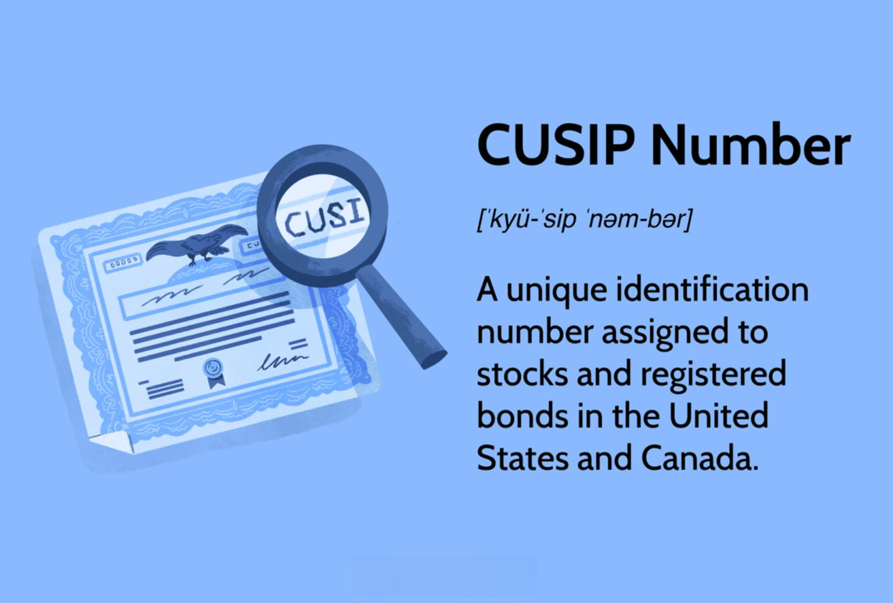

The world of investing offers a diverse array of financial instruments, each serving a distinct purpose and equipped with specific identifiers. Among these instruments are stocks, bonds, and derivatives, which are fundamental to constructing a well-rounded investment portfolio. Stocks signify equity ownership in companies, granting shareholders the dual benefits of voting rights and potential profit-sharing through dividends. On the other hand, bonds are debt securities issued typically by governments or corporations as a means of capital generation, ensuring fixed returns over a specified period.

A crucial element in the seamless trading and settlement of these securities is the assignment of CUSIP numbers. CUSIP, standing for Committee on Uniform Securities Identification Procedures, refers to a system of nine-digit alphanumeric codes that uniquely identify securities in the United States and Canada. These identifiers are essential for reducing errors, enhancing efficiency in trade execution, and streamlining the settlement process, thereby upholding market integrity.

Algorithmic trading, often referred to as algo-trading, has transformed modern markets by facilitating the execution of trades through automated systems at high speed and volume. This technological advancement capitalizes on predefined algorithms to execute trading decisions, effectively harnessing data insights and speed. Algo-trading's reliance on digital identifiers like CUSIP numbers underscores its functionality, ensuring precise and rapid execution of trades.

This article will discuss how stocks, bonds, CUSIP numbers, and algorithmic trading converge to shape modern investment strategies. These elements collectively enhance the efficiency, accuracy, and reliability of trading mechanisms, underscoring their significance as markets continue to evolve.

## Table of Contents

## Understanding Bonds and Stocks

Bonds and stocks are fundamental components of the financial market, serving distinct purposes and offering different risk and return profiles for investors. 

### Bonds

Bonds are debt instruments issued by entities such as governments and corporations to raise funds. When an investor purchases a bond, they are essentially lending money to the issuer. In return, the issuer agrees to pay periodic interest, known as the coupon, and repay the principal amount on a specified maturity date. The [interest rate](/wiki/interest-rate-trading-strategies), or yield, is typically fixed, providing investors with a predictable stream of income. Bonds are considered less risky compared to stocks due to their fixed income nature and priority in case of issuer bankruptcy; however, they are not without risks. Interest rate changes, inflation, and credit risk can impact the value of bonds. 

Mathematically, the price of a bond can be calculated using the present value formula:

$$

P = \sum_{t=1}^{n} \frac{C}{(1 + r)^t} + \frac{M}{(1 + r)^n} 
$$

where $P$ is the price of the bond, $C$ is the coupon payment, $M$ is the maturity value, $r$ is the yield or discount rate, and $n$ is the number of periods until maturity.

### Stocks

Stocks represent ownership in a corporation, providing shareholders with equity interest. By purchasing stocks, investors gain voting rights at shareholder meetings and the potential to receive dividends—a portion of the company's earnings distributed to shareholders. Unlike bonds, stocks do not guarantee returns and are subject to greater [volatility](/wiki/volatility-trading-strategies), offering potentially higher returns in exchange for increased risk. Stock prices fluctuate based on company performance, economic conditions, and market sentiment, presenting opportunities for capital gains when shares are sold at a higher price than their purchase cost.

Both bonds and stocks play crucial roles in building investment portfolios, allowing investors to diversify risk. A balanced portfolio may include a mix of stocks and bonds, with the allocation depending on the investor's risk tolerance, investment horizon, and financial goals. The interaction of these instruments in the financial market contributes significantly to overall market dynamics and [liquidity](/wiki/liquidity-risk-premium). 

Integrating a blend of both assets can mitigate risk, as the inverse relationship between bond prices and interest rates can counterbalance the typically more volatile nature of stocks. Understanding the characteristics and behavior of bonds and stocks is essential for investors aiming to maximize returns while managing risk in their portfolios.

## The Role of CUSIP Numbers

CUSIP (Committee on Uniform Securities Identification Procedures) numbers are pivotal in the financial markets of the United States and Canada. These nine-digit alphanumeric codes effectively function as unique identifiers for a wide range of securities, including stocks and bonds. The primary purpose of these numbers is to ensure that each security is distinctly identified, thereby streamlining the trading process and fostering market stability.

The implementation of CUSIP numbers introduces consistency among market participants, crucial for reducing transaction errors and enhancing the overall efficiency of trading activities. By providing a standard identification system, CUSIP numbers eliminate the potential for confusion that might arise from using different identifiers for the same security. This consistency is indispensable for brokers, traders, and financial institutions that engage in substantial volumes of transactions daily.

In addition to facilitating trades, CUSIP numbers are fundamental to the clearing and settlement processes in the securities market. When trades are executed, they must undergo a series of steps to ensure that the buyer receives their security and the seller receives payment. The CUSIP number plays a critical role in these processes by ensuring that trades are accurately recorded and tracked from initiation to completion.

This meticulous recording and tracking mechanism minimizes the chances of misallocation or settlement failures, thus preserving the integrity and reliability of the financial markets. As financial markets continue to evolve, the significance of CUSIP numbers in underpinning their fundamental operations remains unchanged. Their role in reducing operational risk and optimizing the trading lifecycle underscores their enduring importance in the efficient functioning of modern securities trading.

## Locating and Utilizing CUSIP Numbers

CUSIP numbers, essential alphanumeric identifiers for securities in the U.S. and Canada, serve a critical role in facilitating smooth investment transactions. These numbers can be located via various resources that cater to different investor needs. Brokerage platforms are one of the primary sources for obtaining CUSIP numbers. Most online brokerage services offer tools and resources that allow investors to search and access CUSIP numbers when managing their portfolios or executing trades.

Company websites often provide comprehensive details about their securities, including CUSIP numbers, in their investor relations sections. This is particularly useful for shareholders and potential investors looking for official information directly from the issuer. Additionally, financial statements, such as annual and quarterly reports submitted by companies to regulatory bodies like the Securities and Exchange Commission (SEC), routinely include CUSIP numbers. These documents are publicly accessible, ensuring transparency and aiding in the verification of securities.

Investors require CUSIP numbers when placing orders and executing trades. The unique identifier ensures that the correct security is being traded, reducing the likelihood of errors during transactions. Additionally, CUSIP numbers are integral to tracking and managing securities within an investment portfolio. They facilitate record-keeping and analysis, assisting investors in making informed decisions based on accurate and consistent data.

## Algorithmic Trading in Modern Markets

Algorithmic trading employs complex algorithms to execute trades based on programmed rules and conditions, capitalizing on the speed and precision that technology affords. This automated trading method uses data analysis and high-frequency trading ([HFT](/wiki/high-frequency-trading-strategies)) to buy and sell financial instruments at speeds and volumes beyond human capability. The systems can process large volumes of market data in real-time and make trading decisions based on the analysis of these data points.

Digital identifiers like CUSIP numbers significantly enhance the efficiency of [algorithmic trading](/wiki/algorithmic-trading). These unique identifiers streamline trade execution by allowing algorithms to quickly and accurately discern between different securities. This capability is essential for minimizing errors and ensuring that trades are correctly matched in high-speed environments.

One of the primary advantages of algorithmic trading is the provision of market liquidity. By automating transactions, algorithms can react almost instantaneously to market changes, consistently providing options for buying and selling that manual trading might miss. This heightened responsiveness ensures that there is always a chance for trades to occur, thereby maintaining market fluidity.

Furthermore, algorithmic trading substantially reduces trading costs. The automation of trade processes eliminates the need for constant human oversight, reducing labor costs. By executing trades at optimal prices and employing strategies to take advantage of minute price movements, algorithms also minimize the market impact and price slippage generally associated with large, manual transactions.

The ability of algorithms to analyze vast datasets rapidly allows them to identify and exploit market inefficiencies, optimizing trading strategies that human traders would find challenging to implement at scale. For instance, algorithmic traders can employ strategies like [arbitrage](/wiki/arbitrage), [market making](/wiki/market-making), and [trend following](/wiki/trend-following), taking advantage of small price discrepancies across different markets or timing opportunities based on historical price patterns.

In modern markets, algorithmic trading has become a cornerstone of financial trading strategies, with a significant portion of trading [volume](/wiki/volume-trading-strategy) on major exchanges being executed via algorithms. The integration of tools like CUSIP numbers ensures that these systems operate with high accuracy and speed, crucial for maintaining the trust and efficiency of modern trading platforms. As technology continues to progress, algorithmic systems will likely evolve further, increasingly driving down costs and enhancing market dynamics.

## CUSIP Numbers and Algorithmic Trading: Synergies and Challenges

The integration of CUSIP numbers into algorithmic trading systems significantly enhances the trading process by enabling seamless trade confirmations and clearings. By providing a standardized and reliable method for identifying securities, CUSIP numbers allow algorithmic trading systems to operate with greater efficiency and precision. This efficiency is particularly crucial given the high-speed nature of algorithmic trading, where transactions are executed at a scale and speed that would be impossible for human traders to match.

Algorithmic trading relies on sophisticated algorithms that execute trades based on specific quantitative models and conditions. The inclusion of CUSIP numbers helps these algorithms quickly identify and track securities, thereby facilitating rapid trade executions and reducing the risk of errors that could occur due to misidentification. This synergy ensures that trades are not only executed swiftly but also accurately, aligning with the stringent requirements of modern financial markets.

Despite these advantages, certain challenges must be addressed to fully leverage the potential of integrating CUSIP numbers with algorithmic trading. Maintaining data security is paramount, as the reliance on digital identifiers and automated systems increases the risk of potential cyber threats and breaches. Furthermore, regulatory compliance is a significant concern, given the complexity of global financial regulations that vary across different jurisdictions. Algorithmic trading systems must be designed to adapt to these regulatory landscapes, ensuring that all operations comply with existing financial laws and standards.

To tackle these challenges, continuous advancements in technology and regulatory frameworks are essential. On the technological front, enhancements in cybersecurity measures and more sophisticated encryption methods can help protect sensitive data associated with CUSIP numbers and ensure secure trading environments. Moreover, developing algorithms that are adaptable and capable of ensuring compliance with dynamic regulatory requirements is crucial for the sustainable integration of CUSIP numbers in algorithmic trading.

The interplay between CUSIP numbers and algorithmic trading highlights the need for ongoing collaboration between technology developers, financial institutions, and regulatory bodies. By fostering such collaborations, the industry can better address existing challenges, optimize trading processes, and maintain market integrity in an increasingly digital and automated financial ecosystem.

## Conclusion and Future Outlook

CUSIP numbers play an indispensable role in facilitating the identification and trading of securities across diverse financial markets. These identifiers not only underpin the traditional trading methods but are also essential in the realm of algorithmic trading, where speed and precision are paramount. As the landscape of technology and trading strategies continues to evolve, the robustness and efficiency of CUSIP numbers are pivotal in maintaining market integrity. 

In an era where financial markets are increasingly driven by data and technology, the need for accurate and reliable identifiers like CUSIP numbers cannot be overstated. These identifiers ensure seamless trade execution and settlement, which are crucial for the smooth operation of both traditional and algorithmic trading systems. The continued advancement in trading technologies promises to enhance the functionality and application of CUSIP numbers further, thereby supporting the dynamic nature of modern markets.

For investors and traders, staying informed about developments in trading technologies and identification systems is vital. By understanding and leveraging improvements in these areas, market participants can better position themselves to capitalize on emerging opportunities. As financial markets continue to innovate, the role of CUSIP numbers will likely expand, providing even greater utility and ensuring market participants can navigate the complexities of trading with confidence. The future promises enhanced integration of CUSIP numbers with sophisticated trading platforms, improving transparency, efficiency, and ultimately, market trust.

## References & Further Reading

[1]: ["CUSIP Global Services - About CUSIP"](https://www.cusip.com/index.html), CUSIP Global Services.

[2]: ["Algorithmic Trading: Concepts and Challenges"](https://www.investopedia.com/articles/active-trading/101014/basics-algorithmic-trading-concepts-and-examples.asp), Journal of Trading, Algorithmic Trading Issue.

[3]: ["Committee on Uniform Securities Identification Procedures (CUSIP)"](https://www.investor.gov/introduction-investing/investing-basics/glossary/committee-uniform-securities-identification), Investopedia.

[4]: ["Machine Trading: Deploying Computer Algorithms to Conquer the Markets"](https://www.amazon.com/Machine-Trading-Deploying-Computer-Algorithms/dp/1119219604) by Ernest P. Chan.

[5]: Hasbrouck, Joel & Saar, Gideon. (2013). ["Low-latency trading."](https://papers.ssrn.com/sol3/papers.cfm?abstract_id=1695460) The Review of Financial Studies, 26(9), 2375–2420.

[6]: Narang, Rishi K. (2013). ["Inside the Black Box: A Simple Guide to Quantitative and High Frequency Trading"](https://onlinelibrary.wiley.com/doi/book/10.1002/9781118662717).

[7]: Aldridge, Irene. (2013). ["High-Frequency Trading: A Practical Guide to Algorithmic Strategies and Trading Systems"](https://www.ahmetbeyefendi.com/wp-content/uploads/2020/07/High-Frequency-Trading-Irene-Aldridge.pdf).