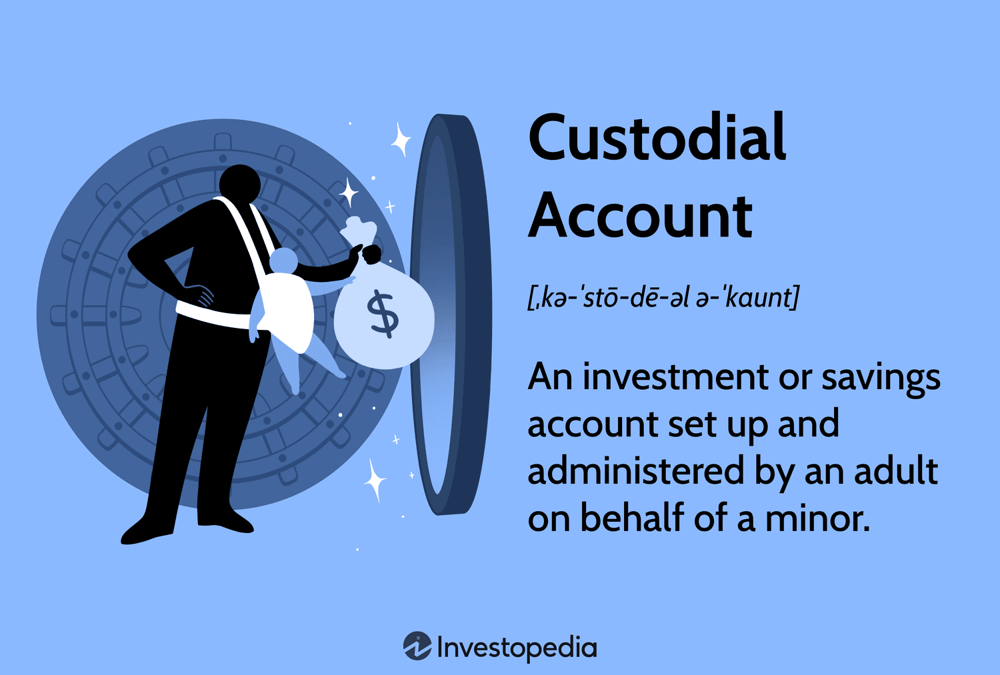

## Table of Contents

## What is a custodial account?

A custodial account is a special type of account that an adult sets up for a child. The adult, called the custodian, manages the account until the child is old enough to take over. This type of account is often used to save money for the child's future, like for college or other big expenses. The money in the account belongs to the child, but the custodian can decide how to invest it and when to use it until the child reaches the age set by law, which is usually 18 or 21.

These accounts can be set up at many banks and investment companies. There are two main types: the Uniform Transfers to Minors Act (UTMA) and the Uniform Gifts to Minors Act (UGMA). The main difference is that UTMA accounts can hold more types of assets, like real estate and art, while UGMA accounts are limited to financial assets like cash and stocks. Once the child reaches the legal age, they gain full control over the account and can use the money however they want.

## Who can open a custodial account?

An adult can open a custodial account for a child. This adult is called the custodian. The custodian can be a parent, a guardian, or any adult the family trusts. They need to be over 18 years old and have a good relationship with the child's family.

To open the account, the custodian goes to a bank or an investment company. They fill out some forms and put money or assets into the account. The account is in the child's name, but the custodian makes all the decisions about it until the child is old enough to take over.

## What are the different types of custodial accounts?

There are two main types of custodial accounts: the Uniform Gifts to Minors Act (UGMA) and the Uniform Transfers to Minors Act (UTMA). The UGMA account is for financial assets like cash, stocks, and bonds. It's a good way to save money for a child's future, like for college. The custodian can put money into the account and decide how to invest it until the child reaches the age set by law, which is usually 18 or 21.

The UTMA account is similar, but it can hold more types of assets. Besides financial assets, a UTMA account can include things like real estate, art, and patents. This makes it more flexible for saving and investing for the child's future. Like the UGMA, the custodian manages the UTMA account until the child reaches the legal age and then the child takes over.

Both types of accounts are set up by an adult for a child. The money and assets in the account belong to the child, but the custodian can decide how to use and invest them until the child is old enough to take control.

## How does a custodial account work?

A custodial account is a way for an adult to save money or assets for a child. The adult, called the custodian, sets up the account at a bank or investment company. The account is in the child's name, but the custodian makes all the decisions about it until the child is old enough. The money or assets in the account belong to the child, but the custodian can choose how to invest it and when to use it. This helps the child save for things like college or other big expenses.

There are two main types of custodial accounts: UGMA and UTMA. A UGMA account can hold financial assets like cash, stocks, and bonds. A UTMA account can hold those things too, but it can also include other types of assets like real estate, art, and patents. Both types of accounts work the same way: the custodian manages the account until the child reaches the age set by law, which is usually 18 or 21. Once the child reaches that age, they take over the account and can use the money or assets however they want.

## What are the benefits of using a custodial account?

A custodial account is a great way to save money for a child's future. It lets an adult, called the custodian, put money or assets into an account that belongs to the child. The custodian can decide how to invest the money and when to use it until the child is old enough, usually 18 or 21. This helps the child save for big things like college or buying a house. It's a simple way to plan ahead and make sure the child has money when they need it.

Another benefit is that custodial accounts can hold many types of assets. There are two main types of custodial accounts: UGMA and UTMA. A UGMA account can hold financial assets like cash, stocks, and bonds. A UTMA account can hold those things too, but it can also include other types of assets like real estate, art, and patents. This flexibility makes it easier to save and invest in different ways for the child's future.

## What are the tax implications of a custodial account?

When it comes to taxes, a custodial account has some special rules. The money in the account belongs to the child, so the child is the one who pays taxes on the earnings. But, there's a rule called the "kiddie tax" that can affect how much tax the child has to pay. If the child is under 19, or under 24 and a full-time student, and their investment income is more than a certain amount, the earnings over that amount are taxed at the parents' tax rate, which is usually higher. This is to stop people from using custodial accounts to avoid paying taxes.

The good news is that the first bit of the child's investment income is usually tax-free or taxed at a lower rate. This can help the account grow faster. Also, money put into the account is considered a gift, and there's a yearly gift tax limit. As long as the custodian doesn't put in more money than the limit each year, there won't be any gift tax to worry about. So, while there are some tax rules to think about, a custodial account can still be a smart way to save for a child's future.

## How can funds in a custodial account be used?

The money in a custodial account is meant for the child, so it should be used to help them. The adult in charge, called the custodian, can use the money for things that benefit the child, like paying for school, buying clothes, or even helping with a big purchase like a car. The custodian can decide how to spend the money as long as it's for the child's good.

When the child gets old enough, usually 18 or 21, they take over the account. At that point, they can use the money however they want. They might use it to pay for college, start a business, or save it for the future. It's up to them once they're in control.

## At what age does the beneficiary gain control of the custodial account?

The beneficiary of a custodial account usually gains control when they reach the age set by the law in their state. This age is typically 18 or 21, depending on where they live. Once the beneficiary reaches this age, they become the owner of the account and can use the money however they want.

Until the beneficiary reaches the legal age, the custodian, who is usually an adult like a parent or guardian, is in charge. The custodian can decide how to invest the money and use it for things that benefit the child, like paying for school or buying clothes. Once the beneficiary takes over, they can choose to keep the money invested, spend it, or save it for their future.

## What are the potential drawbacks of a custodial account?

One potential drawback of a custodial account is that the money in it belongs to the child. This means that once the child reaches the age set by law, usually 18 or 21, they can use the money however they want. The adult who set up the account, called the custodian, can't control how the money is spent after that. This can be a problem if the child doesn't use the money wisely.

Another issue is that the money in a custodial account can affect the child's eligibility for financial aid. When applying for college, the money in a custodial account is considered the child's asset. This can reduce the amount of financial aid they might get. So, if the goal is to save for college, a custodial account might not be the best choice because it could lead to less financial help from schools.

Lastly, there are tax implications to consider. The earnings on the money in the account are taxed, and if the child's investment income is over a certain amount, it could be taxed at the parents' higher tax rate under the "kiddie tax" rules. This can make the account less attractive for saving money because of the potential tax burden.

## How does a custodial account impact financial aid eligibility?

A custodial account can affect how much financial aid a child might get for college. When a family applies for financial aid, the money in a custodial account is counted as the child's asset. This means it can lower the amount of aid the child can receive. Colleges expect that up to 20% of a student's assets will be used to pay for college, so having money in a custodial account can make it look like the family needs less help.

Because of this, if the main goal is to save for college, a custodial account might not be the best choice. Other types of savings accounts, like a 529 plan, might be better because they have less impact on financial aid eligibility. A 529 plan is seen as the parent's asset, and only up to 5.64% of that is expected to be used for college costs. So, families should think carefully about how a custodial account might affect their financial aid before deciding to use one.

## What are the legal responsibilities of a custodian managing a custodial account?

A custodian managing a custodial account has important legal responsibilities. They must use the money in the account only for the child's benefit. This means the custodian can spend the money on things like school, clothes, or other things that help the child. The custodian cannot use the money for themselves or for anything that doesn't help the child.

The custodian also needs to keep good records of how the money is spent and invested. They must follow the rules set by the state where the account is set up. When the child reaches the age set by law, usually 18 or 21, the custodian must give control of the account to the child. Until then, the custodian is in charge, but they always have to think about what's best for the child when making decisions about the account.

## How do custodial accounts compare to other savings vehicles like 529 plans or trusts?

Custodial accounts, 529 plans, and trusts are all ways to save money for a child's future, but they work differently. A custodial account, like a UGMA or UTMA, is managed by an adult called a custodian until the child reaches the legal age, usually 18 or 21. The money in the account belongs to the child, and it can be used for anything that benefits them, like school or buying clothes. The custodian has to use the money wisely and keep good records. But, once the child is old enough, they can use the money however they want. This can be a problem if they don't spend it wisely. Also, the money in a custodial account can affect how much financial aid the child gets for college.

A 529 plan is different because it's mainly for saving for college. The money in a 529 plan grows without being taxed, and when it's used for college costs, it's not taxed either. This can help the money grow faster. The person who sets up the 529 plan, usually a parent, stays in control of the money, even after the child goes to college. This is good because it means the money can be used the way the parent wants. Also, a 529 plan doesn't affect financial aid as much as a custodial account does, so it can be a better choice if the goal is to save for college.

A trust is another way to save money for a child. It's more complicated and often costs more to set up. A trust lets the person who sets it up, called the grantor, decide exactly how and when the money can be used. This can be good if the grantor wants to make sure the money is used for specific things, like college or buying a house. A trust can also help with estate planning and can be set up to last longer than a custodial account or a 529 plan. But, because trusts are more complex, they usually need a lawyer to set them up, which can make them more expensive.

## References & Further Reading

[1]: IRS. (2022). ["Publication 17 (2022), Your Federal Income Tax"](https://www.irs.gov/pub/irs-prior/p17--2022.pdf). Internal Revenue Service.

[2]: IRS. (n.d.). ["IRS Publication 929, Tax Rules for Children and Dependents"](https://www.irs.gov/publications/p929). Internal Revenue Service.

[3]: Savingforcollege.com. (n.d.). ["How Assets Impact Financial Aid"](https://www.savingforcollege.com/article/how-7-different-assets-can-affect-your-financial-aid-eligibility).

[4]: Lopez de Prado, M. (2018). ["Advances in Financial Machine Learning"](https://www.amazon.com/Advances-Financial-Machine-Learning-Marcos/dp/1119482089). John Wiley & Sons.

[5]: Chan, E. P. (2009). ["Quantitative Trading: How to Build Your Own Algorithmic Trading Business"](https://github.com/ftvision/quant_trading_echan_book). John Wiley & Sons.

[6]: Aronson, D. R. (2006). ["Evidence-Based Technical Analysis: Applying the Scientific Method and Statistical Inference to Trading Signals"](https://www.amazon.com/Evidence-Based-Technical-Analysis-Scientific-Statistical/dp/0470008741). John Wiley & Sons.

[7]: Jansen, S. (2020). ["Machine Learning for Algorithmic Trading"](https://github.com/stefan-jansen/machine-learning-for-trading). Packt Publishing.