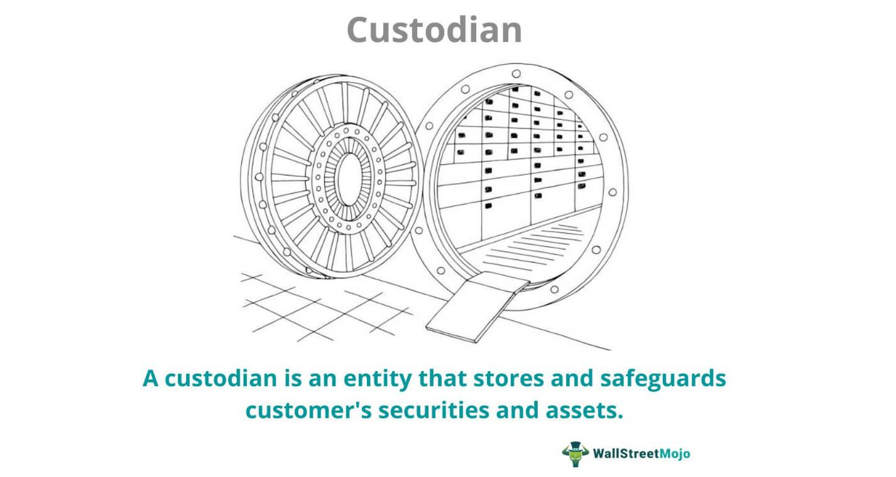

## Table of Contents

## What is custody-only trading?

Custody-only trading is a type of trading where a financial institution holds your investments for you, but you make all the trading decisions yourself. This means the institution acts like a safekeeper for your stocks, bonds, or other assets, but they don't give you advice on what to buy or sell. You use their platform to place your trades, but you're in charge of choosing what to do with your money.

This kind of trading is different from full-service trading, where a broker might give you advice and help you make decisions. With custody-only trading, you have more control over your investments, but you also have to do more research and make all the choices on your own. It's a good option for people who want to manage their own investments but still need a secure place to keep them.

## How does custody-only trading differ from traditional trading?

Custody-only trading and traditional trading are different in a few key ways. In custody-only trading, a financial institution holds your investments, but you make all the trading decisions. This means you use their platform to buy and sell stocks, bonds, or other assets, but they don't give you any advice. You're in charge of choosing what to do with your money, which gives you more control over your investments. On the other hand, traditional trading often involves a broker who can give you advice and help you make decisions. This can be helpful if you're new to investing or want guidance.

The main difference is the level of involvement from the financial institution. In custody-only trading, the institution acts like a safekeeper for your assets, but they don't get involved in your trading decisions. This can be a good option if you want to manage your own investments but need a secure place to keep them. In traditional trading, the broker might actively help you with your investment choices, which can be more suitable if you prefer having professional guidance. Both methods have their advantages, depending on how much control and support you want.

## What are the basic steps involved in custody-only trading?

In custody-only trading, the first thing you do is open an account with a financial institution that offers this service. Once your account is set up, you'll need to transfer money into it. This money will be used to buy stocks, bonds, or other investments. You can do all of this online or through the institution's app, which makes it easy and convenient.

After your account is funded, you can start trading. You'll use the institution's trading platform to buy and sell investments. Since it's custody-only trading, you won't get any advice from the institution. You have to decide what to buy or sell on your own. Once you make a trade, the institution will hold your investments safely until you decide to sell them or move them somewhere else.

## Who are the main participants in custody-only trading?

The main participants in custody-only trading are the individual investor and the financial institution. The individual investor is the person who owns the account and makes all the trading decisions. They use the financial institution's platform to buy and sell stocks, bonds, or other investments. The investor needs to do their own research and choose what to do with their money because they don't get any advice from the institution.

The financial institution is the company that holds the investor's assets. They keep the investments safe but don't get involved in the trading decisions. Their role is to provide a secure place for the investor's money and a platform to make trades. This setup gives the investor more control over their investments while still having a trusted place to keep them.

## What are the benefits of custody-only trading for beginners?

Custody-only trading can be a good choice for beginners because it lets them learn about investing on their own. When you use custody-only trading, you have to make all the choices about what to buy and sell. This means you get to practice making decisions and learn from your own experiences. It's like having a safe space to try out investing without someone else telling you what to do all the time.

Another benefit is that it's usually cheaper than traditional trading. Since you're not getting advice from a broker, the fees for custody-only trading can be lower. This means you get to keep more of your money while you learn. Plus, the financial institution still keeps your investments safe, so you don't have to worry about that part. It's a good way for beginners to start investing without spending a lot of money on fees.

## What are the common risks associated with custody-only trading?

Custody-only trading can be risky because you have to make all the trading decisions yourself. If you don't know a lot about investing, you might make choices that lose you money. There's no one to tell you if you're making a bad decision, so you have to be careful and do a lot of research. It's easy to make mistakes if you're new to trading, and those mistakes can be costly.

Another risk is that you might get overwhelmed by all the choices you have to make. Without advice from a broker, you need to keep up with a lot of information about different investments. This can be hard and stressful, especially if you're trying to learn as you go. If you don't stay on top of things, you could miss important news or changes that affect your investments.

## How can one secure their assets in custody-only trading?

To keep your assets safe in custody-only trading, it's important to choose a trustworthy financial institution. Look for a company that is well-known and has a good reputation for keeping customers' money safe. Make sure they are regulated by a financial authority, which means they have to follow strict rules to protect your investments. Also, use strong passwords and enable two-[factor](/wiki/factor-investing) authentication on your account to make it harder for anyone to get into your account without your permission.

Once you've chosen a good institution, keep an eye on your account regularly. Check your statements and transactions to make sure everything looks right. If you see something strange or think something might be wrong, contact the institution right away. They can help you figure out what's going on and keep your money safe. Remember, even though you're making all the trading decisions, the institution is still responsible for holding your assets securely.

## What regulatory considerations should be noted in custody-only trading?

When you do custody-only trading, it's important to know about the rules that keep your money safe. Different countries have different rules, but they all aim to make sure financial institutions treat customers fairly and keep their money secure. In the United States, for example, the Securities and Exchange Commission (SEC) and the Financial Industry Regulatory Authority (FINRA) are two groups that make rules for trading. They require financial institutions to have strong security measures and to be clear about how they handle your money.

Another thing to think about is how these rules affect what you can do with your investments. Some rules might limit the types of investments you can make or how often you can trade. It's also important to know that if something goes wrong with the financial institution, like if it goes bankrupt, there are rules in place to help protect your money. For example, in the U.S., the Securities Investor Protection Corporation (SIPC) can help you get your money back if the institution fails. So, understanding these rules can help you feel more confident about keeping your investments safe in custody-only trading.

## What advanced strategies can be used in custody-only trading?

In custody-only trading, one advanced strategy you can use is called dollar-cost averaging. This means you put the same amount of money into your investments at regular times, no matter what the market is doing. This can help you buy more shares when prices are low and fewer when prices are high, which can lower your overall cost over time. It's a good way to manage risk because you're not trying to guess when the market will go up or down.

Another strategy is called diversification, which means you spread your money across different types of investments. This can help protect you if one type of investment does badly because you still have others that might do well. You could invest in stocks, bonds, and maybe even real estate or commodities. By having a mix, you can balance out the risks and possibly get better returns over time. Both of these strategies need you to do a lot of research and keep a close eye on your investments, but they can help you do better in custody-only trading.

## How does technology impact custody-only trading?

Technology makes custody-only trading easier and more convenient. With online platforms and apps, you can trade anytime and anywhere. You don't have to call a broker or go to a bank to make a trade. Everything is right at your fingertips. Plus, technology gives you access to a lot of information and tools that can help you make better decisions. You can use charts, graphs, and analysis tools to understand the market better and figure out when to buy or sell.

However, technology also brings some challenges. It can be overwhelming to have so much information and so many choices. You might feel like you need to keep up with everything all the time, which can be stressful. Also, there's a risk of technology problems, like if the platform goes down or if there's a security breach. You need to be careful and use strong security measures to protect your account. But overall, technology makes custody-only trading more accessible and gives you more control over your investments.

## What are the current market trends affecting custody-only trading?

Right now, one big trend affecting custody-only trading is the rise of online and mobile trading platforms. More and more people are using their phones or computers to trade. This makes it easier for anyone to start trading without needing to go through a traditional broker. These platforms often have lower fees, which is good for people who want to save money. They also have lots of tools and information that can help you make better choices about what to buy or sell.

Another trend is the growing interest in cryptocurrencies and other new types of investments. More people are using custody-only trading to buy and sell things like Bitcoin or Ethereum. This can be exciting, but it also comes with more risk because these markets can be very unpredictable. Also, rules about cryptocurrencies are still changing, so you need to stay updated on what's allowed and what's not. These trends are making custody-only trading more popular, but they also mean you need to be careful and do your research.

## What future challenges might custody-only trading face?

One future challenge for custody-only trading might be keeping up with new technology. As more people use their phones and computers to trade, the platforms need to stay safe and easy to use. If there are problems with the technology, like the website crashing or hackers getting into accounts, it can make people lose trust in custody-only trading. Also, as new types of investments like cryptocurrencies become more popular, the platforms need to be able to handle these new kinds of trades without issues.

Another challenge could be dealing with changing rules and regulations. Governments around the world are still figuring out how to manage new types of investments and trading methods. If the rules change a lot, it might be hard for people to know what they're allowed to do. This can make custody-only trading more complicated and might scare some people away. Keeping up with these changes and making sure everything is done correctly will be important for the future of custody-only trading.

## References & Further Reading

[1]: Bergstra, J., Bardenet, R., Bengio, Y., & Kégl, B. (2011). ["Algorithms for Hyper-Parameter Optimization."](https://dl.acm.org/doi/10.5555/2986459.2986743) Advances in Neural Information Processing Systems 24.

[2]: ["Advances in Financial Machine Learning"](https://www.amazon.com/Advances-Financial-Machine-Learning-Marcos/dp/1119482089) by Marcos Lopez de Prado

[3]: ["Evidence-Based Technical Analysis: Applying the Scientific Method and Statistical Inference to Trading Signals"](https://www.amazon.com/Evidence-Based-Technical-Analysis-Scientific-Statistical/dp/0470008741) by David Aronson

[4]: ["Machine Learning for Algorithmic Trading"](https://github.com/stefan-jansen/machine-learning-for-trading) by Stefan Jansen

[5]: ["Quantitative Trading: How to Build Your Own Algorithmic Trading Business"](https://www.amazon.com/Quantitative-Trading-Build-Algorithmic-Business/dp/1119800064) by Ernest P. Chan