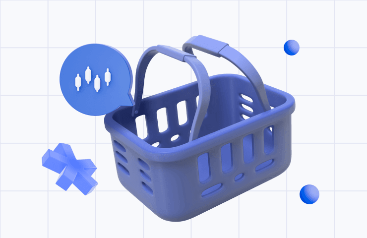

## Table of Contents

## What is a custom basket exchange-traded fund (ETF)?

A custom basket exchange-traded fund (ETF) is a type of ETF where the basket of securities it holds can be tailored to meet specific investment goals or themes. Unlike traditional ETFs that track a broad market index, a custom basket ETF allows investors to focus on particular sectors, industries, or strategies that align with their personal investment preferences or market outlook. For example, an investor might choose a custom basket ETF that focuses on technology companies, renewable energy, or even a mix of stocks and bonds that fit their risk tolerance and financial goals.

These ETFs are often created through collaboration between investors and fund managers, who work together to design the basket of assets. This customization can provide more flexibility and potentially better align the ETF with the investor's unique strategy. However, custom basket ETFs may come with higher fees due to the additional management required to maintain and adjust the basket over time. Despite this, many investors find the benefits of a tailored investment approach outweigh the costs, especially when aiming to achieve specific financial objectives.

## How does a custom basket ETF differ from a traditional ETF?

A custom basket ETF is different from a traditional ETF because it lets you pick what goes inside it. With a traditional ETF, you usually get a bunch of stocks or bonds that follow a big index, like the S&P 500. But with a custom basket ETF, you and the fund manager can choose specific stocks or themes that you care about. For example, if you're really into green energy, you can make an ETF that only has companies working on solar power or wind energy.

The other big difference is that custom basket ETFs might cost more. Because you're working with a fund manager to pick and change what's in the ETF, there are extra fees. Traditional ETFs are usually cheaper because they just follow an index and don't need as much work to keep up. Even though custom basket ETFs can be pricier, some people think it's worth it because they can match the ETF to what they want to achieve with their money.

## What are the benefits of investing in a custom basket ETF?

Investing in a custom basket ETF lets you pick exactly what you want in your investment. If you care about certain things, like green energy or tech companies, you can choose to include only those in your ETF. This way, your money goes exactly where you want it to, and you can aim for specific goals that are important to you. It's like making your own pizza with your favorite toppings instead of buying one that everyone else is eating.

However, custom basket ETFs can cost more because you work with a fund manager to pick and change what's in the ETF. Even though they might be pricier, many people think it's worth it because they can match the ETF to what they want to achieve with their money. It's a bit like paying extra for a tailor-made suit that fits you perfectly, rather than buying a one-size-fits-all option off the rack.

## Who can create a custom basket ETF and what are the requirements?

Anyone who wants to invest can work with a financial company to create a custom basket ETF. You don't need to be a big investor, but you'll need to find a fund manager who can help you put it together. These fund managers work at financial firms and have the tools and knowledge to set up and manage the ETF. You'll need to tell them what kind of companies or themes you want in your ETF, like tech companies or green energy firms.

The main requirement is working with a fund manager, which means you'll need to pay for their services. This can make custom basket ETFs a bit more expensive than regular ETFs. But if you have specific goals or interests, it might be worth it. The fund manager will help you pick the right mix of stocks or bonds, and they'll keep an eye on the ETF to make sure it stays in line with what you want.

## How is the performance of a custom basket ETF measured?

The performance of a custom basket ETF is measured by looking at how the value of the stocks or bonds inside it changes over time. If the companies in the ETF are doing well, the value of the ETF goes up. If they're not doing so well, the value might go down. People also look at things like the ETF's total return, which includes any dividends or interest it earns, and they compare it to how other investments are doing to see if it's a good choice.

Another way to measure performance is by checking how the ETF does compared to what you wanted it to do. If you made the ETF to focus on green energy, you'd see if it's doing better than other green energy investments. It's also important to think about the fees you pay for the ETF. If the fees are high, they can eat into your returns, so you want to make sure the ETF is still worth it after you pay those costs.

## What are the costs associated with setting up and maintaining a custom basket ETF?

Setting up a custom basket ETF involves working with a fund manager, and this can be expensive. You'll need to pay for the fund manager's time and expertise to help you pick the right mix of stocks or bonds for your ETF. There might also be fees for setting up the ETF itself, like legal and administrative costs. These setup fees can add up, so it's important to think about whether the benefits of having a custom ETF are worth the money you'll spend.

Once your custom basket ETF is up and running, you'll need to keep paying for its maintenance. This includes ongoing management fees, which are charges for the fund manager to keep an eye on the ETF and make sure it stays in line with your goals. There could also be other costs like trading fees whenever the fund manager buys or sells stocks inside the ETF. All these costs can make custom basket ETFs more expensive than regular ETFs, but if the ETF matches your investment goals well, many people think it's worth it.

## Can you explain the process of creating a custom basket ETF?

Creating a custom basket ETF starts with finding a fund manager who can help you. You'll need to talk to them about what you want your ETF to focus on, like tech companies or green energy firms. Once you've decided on the theme or the specific stocks you want, the fund manager will work with you to pick the right mix of investments. They'll also handle all the legal and administrative stuff needed to set up the ETF. This can take some time and money, so it's important to think about whether the benefits are worth the costs.

After the ETF is set up, the fund manager will keep an eye on it to make sure it stays in line with your goals. They might buy or sell stocks inside the ETF to keep it performing well. You'll need to pay ongoing fees for this management, as well as any trading fees that come up. Even though custom basket ETFs can be pricier than regular ETFs, many people find them worthwhile because they can match their investments to what they really care about.

## What are the risks involved in investing in custom basket ETFs?

Investing in custom basket ETFs comes with some risks. One big risk is that because these ETFs are focused on specific themes or sectors, they might not be as spread out as regular ETFs. If the companies or industries you picked don't do well, your whole ETF could lose value. It's like putting all your eggs in one basket - if that basket falls, you could lose a lot. Also, because these ETFs are custom, they might not be as easy to buy and sell as regular ETFs, which can make it harder to get your money out if you need to.

Another risk is the cost. Custom basket ETFs usually have higher fees because you need to pay a fund manager to set them up and keep them running. These fees can eat into your returns, making it harder to make money. Plus, if the fund manager doesn't pick the right stocks or if the market changes in a way they didn't expect, your ETF might not perform as well as you hoped. So, while custom basket ETFs can be a great way to invest in what you care about, you need to be aware of these risks and think carefully about whether they're right for you.

## How does the liquidity of a custom basket ETF compare to other ETFs?

Custom basket ETFs might not be as easy to buy and sell as other ETFs. This is because they are often more specialized and focused on specific themes or sectors. Since fewer people might be interested in these specific themes, there could be fewer buyers and sellers, which can make it harder to quickly turn your investment into cash if you need to. This is different from regular ETFs, which usually have more people trading them, making them more liquid and easier to buy and sell.

However, the liquidity of a custom basket ETF can also depend on how big it is and how popular its theme is. If a lot of people are interested in the same theme, like green energy, then the ETF might have better liquidity. But if it's a very niche or new theme, it might be harder to find someone to trade with. So, while custom basket ETFs can offer a tailored investment approach, you need to think about how easy it will be to sell your shares if you need to.

## What role do authorized participants play in the creation and redemption of custom basket ETFs?

Authorized participants are important in the world of ETFs, including custom basket ETFs. They are big financial companies that help create and redeem ETF shares. When you want to create a custom basket ETF, these authorized participants work with the fund manager to put together the basket of stocks or bonds you've chosen. They buy those stocks or bonds and then exchange them for new ETF shares, which they can sell to investors.

When it comes time to redeem the ETF shares, authorized participants play a key role again. If investors want to sell their ETF shares, the authorized participants take those shares back and give the investors the underlying stocks or bonds in return. This process helps keep the ETF's price in line with the value of its holdings. Because custom basket ETFs might be less liquid, the role of authorized participants can be even more important to make sure there's a smooth process for creating and redeeming shares.

## How can investors use custom basket ETFs for advanced portfolio management strategies?

Investors can use custom basket ETFs to fine-tune their portfolios in ways that match their specific goals or beliefs. For example, if you want to invest in companies that are working on new technology or fighting climate change, you can create an ETF that only includes those companies. This lets you focus your money on what you care about most. You can also use custom basket ETFs to balance risk and reward in your portfolio. If you think certain industries will do well in the future, you can put more of your money into those areas, while still keeping some in safer investments.

Another way investors can use custom basket ETFs is for tax planning. By choosing what goes into your ETF, you can pick stocks that might give you better tax benefits. For example, some stocks pay dividends that are taxed at a lower rate. You can also use these ETFs to manage how often you buy and sell, which can help reduce the taxes you owe on capital gains. Overall, custom basket ETFs give you the flexibility to build a portfolio that's just right for you, helping you reach your financial goals in a way that fits your personal strategy.

## What are the regulatory considerations and compliance requirements for custom basket ETFs?

When setting up a custom basket ETF, there are some rules and checks you need to follow to make sure everything is done right. These rules come from groups like the Securities and Exchange Commission (SEC) in the U.S. You need to fill out forms and get approval to start the ETF. The SEC wants to make sure that the ETF is fair and clear to everyone who might invest in it. This means you have to tell people exactly what's in the ETF and how it's managed. You also need to follow rules about how you can advertise the ETF and make sure you're not promising returns that you can't deliver.

Once your custom basket ETF is running, you have to keep following these rules. This includes regular reports to the SEC about how the ETF is doing and any changes you make to it. You also need to make sure the ETF stays in line with what you said it would do when you started it. This means keeping the right mix of stocks or bonds and making sure you're not breaking any other financial rules. It's important to work with a good fund manager who knows all these rules and can help you stay on the right side of them.

## References & Further Reading

[1]: Petajisto, A. (2013). ["Active Share and Mutual Fund Performance."](http://www.petajisto.net/papers/petajisto%202013%20faj%20-%20active%20share.pdf) Financial Analysts Journal, 69(4), 73-93.

[2]: ["Advances in Financial Machine Learning"](https://www.amazon.com/Advances-Financial-Machine-Learning-Marcos/dp/1119482089) by Marcos Lopez de Prado

[3]: ETFGI. ["Global ETF Industry Insights."](https://etfgi.com/news/press-releases/2024/07/etfgi-reports-assets-invested-global-etfs-industry-reached-new-record)

[4]: ["Machine Learning for Asset Managers"](https://www.cambridge.org/core/elements/machine-learning-for-asset-managers/6D9211305EA2E425D33A9F38D0AE3545) by Marcos Lopez de Prado

[5]: Hougan, M., & Younes, N. (2020). ["An Introduction to the World of ETFs."](https://eric.ed.gov/?q=%22Hougen+Martha+C.%22&id=ED606512) CFA Institute Research Foundation

[6]: Hasbrouck, J. (2003). ["Intraday Price Formation in U.S. Equity Index Markets."](https://onlinelibrary.wiley.com/doi/10.1046/j.1540-6261.2003.00609.x) The Review of Financial Studies, 16(2), 653-684.