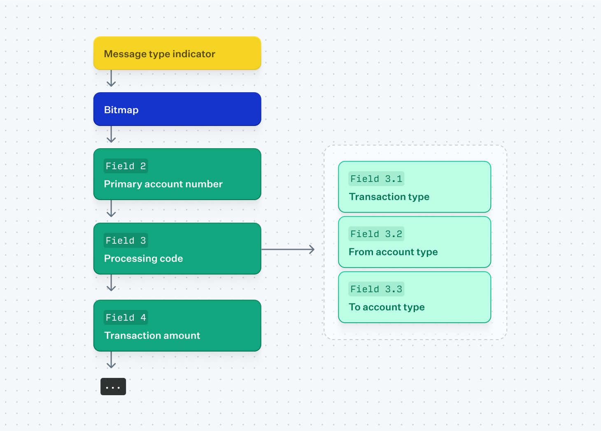

## Table of Contents

## What are Customer Type Indicator Codes?

Customer Type Indicator Codes are special labels that businesses use to categorize their customers. These codes help companies understand different types of customers they have, like regular shoppers, new customers, or big spenders. By using these codes, businesses can tailor their services and marketing efforts to better meet the needs of each customer group.

For example, a store might use a code to identify customers who buy a lot of items. They can then send special offers or discounts to these customers to keep them coming back. This helps the business make more sales and keep their customers happy. Overall, Customer Type Indicator Codes make it easier for businesses to know their customers better and serve them more effectively.

## Why are Customer Type Indicator Codes important in business?

Customer Type Indicator Codes are important in business because they help companies understand who their customers are and what they need. By using these codes, businesses can group their customers into different categories, like frequent buyers or first-time shoppers. This helps the company know which customers to focus on and how to serve them better. For example, if a business knows that a customer often buys a lot, they can send that customer special deals to keep them coming back.

These codes also help businesses make smarter decisions about marketing and sales. When a company knows the different types of customers they have, they can create targeted ads or promotions that appeal to each group. This can lead to more sales because the messages are more relevant to what the customers want. Overall, Customer Type Indicator Codes help businesses build better relationships with their customers, which can lead to more loyal customers and more money for the business.

## How are Customer Type Indicator Codes used in different industries?

In the retail industry, Customer Type Indicator Codes help stores know who their shoppers are. For example, a store might use a code to label customers who buy a lot or those who only shop during sales. By knowing this, the store can send special offers to big spenders to keep them coming back or offer bigger discounts to bargain hunters. This makes shopping better for customers and helps the store make more money.

In the banking industry, these codes are used to understand different types of account holders. Banks might use codes to identify customers who save a lot of money, those who take out loans often, or new customers. This helps banks offer the right services to each group, like special savings accounts for savers or better loan terms for frequent borrowers. By doing this, banks can keep their customers happy and attract more people to their services.

In the healthcare industry, Customer Type Indicator Codes can help hospitals and clinics know more about their patients. They might use codes to identify patients who need regular check-ups, those with chronic illnesses, or new patients. This helps healthcare providers give better care to each group, like sending reminders for check-ups to regular patients or providing more information to new patients. By using these codes, healthcare providers can improve patient care and make their services more efficient.

## What are the common types of Customer Type Indicator Codes?

Customer Type Indicator Codes can be divided into several common types. One type is the 'Frequent Buyer' code, which businesses use for customers who shop often. These customers are important because they keep coming back, so companies might send them special deals or reward them with loyalty programs. Another type is the 'New Customer' code, used for people who are shopping or using a service for the first time. Businesses might give these customers a warm welcome with a discount or a free trial to make them want to come back.

Another common type is the 'High-Value Customer' code, which is for people who spend a lot of money. These customers are key because they bring in a lot of business, so companies might offer them exclusive deals or personalized services. There is also the 'Occasional Buyer' code for customers who don't shop often. Businesses might try to get these customers to shop more by sending them reminders or special offers during big sales.

Lastly, the 'Bargain Hunter' code is used for customers who only buy things when they are on sale. Companies might target these customers with big discounts or flash sales to attract them. Each of these codes helps businesses understand their customers better and tailor their services and marketing to meet different needs.

## How do businesses assign Customer Type Indicator Codes to customers?

Businesses assign Customer Type Indicator Codes to customers by looking at how they shop or use their services. They might use information like how often a customer buys something, how much they spend, or if it's their first time shopping. For example, if a customer keeps coming back and buying a lot, the business might give them a 'Frequent Buyer' code. This helps the business know who their loyal customers are and how to keep them happy.

To do this, businesses often use a computer system or software that keeps track of customer information. When a customer shops or uses a service, the system can automatically assign a code based on what the customer does. Sometimes, a person at the business might also look at the customer's history and decide which code fits best. By doing this, businesses can make sure they are using the right codes to understand their customers and serve them better.

## What are the benefits of using Customer Type Indicator Codes for customer segmentation?

Using Customer Type Indicator Codes helps businesses know their customers better. By sorting customers into groups like frequent buyers, new customers, or big spenders, companies can see who shops a lot and who doesn't. This makes it easier for businesses to focus on the customers who are most important to them. For example, they can send special deals to people who buy a lot to keep them coming back. This way, businesses can make their customers happier and sell more stuff.

These codes also help businesses make smarter choices about what to sell and how to tell people about it. When a company knows the different types of customers they have, they can make ads or special offers that match what each group wants. For example, they might offer big discounts to people who only shop during sales. By doing this, businesses can get more people to buy their products and make more money. Overall, Customer Type Indicator Codes help businesses take better care of their customers and run their business more smoothly.

## How can Customer Type Indicator Codes improve marketing strategies?

Customer Type Indicator Codes help businesses make their marketing better by knowing who their customers are. When a business knows if a customer shops a lot, spends a lot of money, or is new, they can make ads and special offers that fit what each group wants. For example, if a store knows someone always buys a lot, they can send that person special deals to keep them coming back. This way, the store can make sure their marketing messages are right for each customer, which can lead to more sales.

These codes also help businesses use their marketing money in smarter ways. By knowing which customers to focus on, a business can spend more on ads for the people who are most likely to buy their stuff. For example, if a company knows that people who shop during sales are a big group, they can make big sale events and tell those customers about them. This can make the business's marketing more effective and help them make more money by getting the right message to the right people.

## What challenges might businesses face when implementing Customer Type Indicator Codes?

Businesses might find it hard to set up Customer Type Indicator Codes because it can be tricky to collect the right information about their customers. They need to know things like how often someone shops, how much they spend, and if they are new or regular customers. This means they have to keep good records and use special computer systems that can track all this information. If they don't do this well, the codes might not be accurate, and they could end up sending the wrong messages to their customers.

Another challenge is making sure that everyone in the business understands and uses the codes correctly. If the people working at the store or in the office don't know how to use the codes, they might not be able to help customers the right way. Also, the codes need to be updated regularly because customers can change over time. If a business doesn't keep the codes up to date, they might miss out on chances to make their customers happier and sell more stuff.

## How do Customer Type Indicator Codes integrate with CRM systems?

Customer Type Indicator Codes work well with CRM systems because they help businesses keep track of their customers in a smart way. A CRM system is like a big computer file that stores information about customers, like their names, how often they shop, and how much they spend. When businesses use Customer Type Indicator Codes, they can add these codes to the CRM system. This means that every time a customer shops or uses a service, the CRM system can automatically put the right code on their file. This makes it easier for the business to know who their customers are and how to serve them better.

For example, if a customer is a frequent buyer, the CRM system can show this with a 'Frequent Buyer' code. Then, the business can use this information to send special deals or rewards to that customer. By having the codes in the CRM system, everyone in the business can see them and use them to make better decisions about marketing and sales. This helps the business keep their customers happy and make more money.

## What advanced analytics can be applied to Customer Type Indicator Codes data?

Advanced analytics can help businesses learn a lot from Customer Type Indicator Codes data. By using these codes, companies can see patterns in how different types of customers behave. For example, they can find out if frequent buyers tend to shop at certain times of the year or if high-value customers prefer certain products. With this information, businesses can make better guesses about what customers will do next and plan their marketing and sales strategies accordingly. They might use [machine learning](/wiki/machine-learning) to predict which customers are likely to buy more in the future or which ones might leave and go to another business.

Another way advanced analytics can help is by showing how different customer groups respond to different marketing efforts. Businesses can test different ads or special offers and see which ones work best for each customer type. This can help them spend their marketing money more wisely and get better results. By using data from Customer Type Indicator Codes, companies can also see how customer behavior changes over time and adjust their strategies to keep up with these changes. This makes their marketing and sales more effective and helps them keep their customers happy and loyal.

## How can Customer Type Indicator Codes be used to predict customer behavior?

Customer Type Indicator Codes help businesses predict how their customers will act by looking at patterns in their shopping habits. For example, if a store sees that customers with a 'Frequent Buyer' code tend to buy more during holiday seasons, they can predict that these customers will shop a lot during the next holiday too. By knowing this, the store can get ready with special deals or more stock to meet the demand. This way, businesses can plan ahead and make sure they are ready for what their customers will do next.

These codes also help businesses guess which customers might leave and go to another store. If a business sees that customers with an 'Occasional Buyer' code haven't shopped in a while, they might predict that these customers are at risk of leaving. The business can then reach out to these customers with special offers or reminders to bring them back. By using Customer Type Indicator Codes to predict behavior, businesses can keep their customers happy and coming back, which helps them make more sales and grow.

## What future trends are expected in the use of Customer Type Indicator Codes?

In the future, businesses will use Customer Type Indicator Codes more with new technology like [artificial intelligence](/wiki/ai-artificial-intelligence) (AI). AI can look at lots of customer data and find patterns that humans might miss. This means businesses can use these codes to predict what customers will do even better. For example, a store might use AI to see that people with a 'High-Value Customer' code often buy certain products at certain times. The store can then send special offers to these customers right when they are most likely to buy, making their marketing more effective.

Another trend is that Customer Type Indicator Codes will be used more in personalized marketing. As businesses learn more about their customers, they will make ads and offers that are just right for each person. This means that instead of sending the same message to everyone, a business might send different messages to customers with different codes. For example, a 'New Customer' might get a welcome discount, while a 'Frequent Buyer' might get a loyalty reward. By using these codes to make marketing more personal, businesses can keep their customers happy and coming back.

## References & Further Reading

[1]: Domowitz, I., & Steil, B. (2001). ["Automation, Trading Costs, and the Structure of the Securities Trading Industry."](https://www.nomurafoundation.or.jp/en/wordpress/wp-content/uploads/2014/09/19971011_Ian_Domowitz_-_Benn_Steil.pdf) Financial Analysts Journal, 57(1).

[2]: Chlistalla, M. (2011). ["High-Frequency Trading: Better Than Its Reputation?"](https://c.mql5.com/forextsd/forum/168/high-frequency_trading_-_better_than_its_reputation.pdf) Deutsche Bank Research.

[3]: Hendershott, T., Jones, C. M., & Menkveld, A. J. (2011). ["Does Algorithmic Trading Improve Liquidity?"](https://onlinelibrary.wiley.com/doi/full/10.1111/j.1540-6261.2010.01624.x) The Journal of Finance, 66(1).

[4]: Cartea, Á., & Penalva, J. (2012). ["Where Is the Value in High Frequency Trading?"](https://papers.ssrn.com/sol3/papers.cfm?abstract_id=1855555) The Quarterly Journal of Finance, 2(03).

[5]: Aldridge, I. (2013). ["High-frequency Trading: A Practical Guide to Algorithmic Strategies and Trading Systems,"](https://books.google.com/books/about/High_Frequency_Trading.html?id=6l0DDQAAQBAJ) 2nd Edition. Wiley.