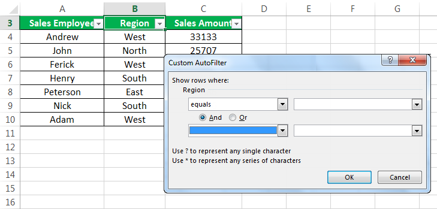

Algorithmic trading has become a cornerstone of modern financial markets, utilizing advanced technology to automate and enhance trading decision-making processes. Key to successful algorithmic trading is the ability to filter and analyze large volumes of data effectively, which enables the identification of market trends and potential trading opportunities. One such tool that stands out for its effectiveness in detecting changes in data series is the Cumulative Sum (CUSUM) filter.

Originally developed for quality control processes, the CUSUM filter is used to monitor changes in the cumulative sum of deviations from a target value or an expected mean. In the context of finance, it has found significant application in improving the detection of price breakpoints and trend reversals within time-series data. By rapidly signaling shifts in data series, the CUSUM filter can identify moments of significant change sooner than traditional methods, such as moving averages.



The CUSUM filter employs a straightforward approach by applying predefined thresholds to cumulative sums, detecting when a trend or structural change occurs. Its simplicity and computational efficiency make it highly attractive for algorithmic trading systems, especially those requiring real-time data analysis. Furthermore, its precision allows traders to separate noise from actual trends, enhancing their strategies for both entering and exiting markets.

This article provides a comprehensive guide to understanding and implementing the CUSUM filter within algorithmic trading. It explores its fundamental principles, practical applications, and the benefits it offers. Additionally, considerations for effective calibration and integration within trading models are discussed, underlining the filter’s value in making informed, data-driven trading decisions. By leveraging the CUSUM filter, traders can improve the performance of automated trading systems, contributing to more effective risk management and trading success.

## Table of Contents

## What is a CUSUM Filter?

A CUSUM filter, or Cumulative Sum Control Chart, is a statistical tool originally developed for quality control processes but has since gained traction in financial analytics and [algorithmic trading](/wiki/algorithmic-trading). It operates as a sequential analysis technique aimed at detecting changes in the cumulative sum of deviations from a predefined target value or the expected mean of a data series. This filter is particularly useful for identifying shifts in the level of a data series by comparing cumulative sums against preset thresholds. Once these thresholds are breached, the CUSUM filter flags a trend or structural change in the data.

Mathematically, the CUSUM process involves calculating the cumulative sum of deviations. Suppose $X_t$ represents the observed value at time $t$, and $\mu$ is the target or reference value (often the historical mean of the series). The cumulative sum $C_t$ can be expressed as:

$$
C_t = C_{t-1} + (X_t - \mu)
$$

The goal of CUSUM is to monitor the value of $C_t$. When this cumulative sum exceeds a positive or negative predetermined limit, it signifies a significant change in the data series. This method is preferred over traditional techniques like moving averages because it is more sensitive to detecting small shifts that are accumulated over time, thus offering a quicker response to changes in data patterns.

The CUSUM filter assigns positive or negative values when the cumulative deviations surpass these limits, thereby signaling potential moments for taking trading actions. The ability of CUSUM to accumulate minor changes and provide alerts promptly makes it an advantageous tool for market analysts and traders looking to efficiently capture the onset of price trends and reversals.

## Implementation in Algorithmic Trading

Implementing the Cumulative Sum (CUSUM) filter in algorithmic trading involves utilizing its sensitivity to detect subtle changes in market conditions, hence allowing for timely and effective trading decisions. A critical step in this implementation is the definition of threshold values or limits. These thresholds determine the points at which the cumulative sum signals a significant shift, thereby triggering trading signals. 

Thresholds can be determined through fixed values or dynamically adjusted based on prevailing market conditions. One effective method for dynamic threshold setting is using the exponentially weighted moving standard deviation of returns. This approach accounts for the varying [volatility](/wiki/volatility-trading-strategies) in financial markets, ensuring the CUSUM filter remains responsive and optimal across different trading environments. 

By accumulating relevant data and comparing it against these thresholds, the CUSUM filter distinguishes between mundane noise and genuine shifts in market trends, making it highly effective for crafting both entry and [exit](/wiki/exit-strategy) strategies. Its rapid response to changes provides traders with an advantage by offering early indications of potential market moves.

The following is a concise Python example demonstrating the implementation of the CUSUM filter to monitor market data:

```python
import numpy as np
import pandas as pd

def calculate_cusum(price_series, threshold):
    """Calculate CUSUM filter values for a given price series."""
    cusum_pos = np.zeros_like(price_series)
    cusum_neg = np.zeros_like(price_series)

    for i in range(1, len(price_series)):
        price_change = price_series[i] - price_series[i-1]
        cusum_pos[i] = max(0, cusum_pos[i-1] + price_change - threshold)
        cusum_neg[i] = min(0, cusum_neg[i-1] + price_change + threshold)

    return cusum_pos, cusum_neg

# Example usage
price_data = pd.Series([100, 101, 102, 103, 104, 105])
threshold_value = 1.0

cusum_pos, cusum_neg = calculate_cusum(price_data, threshold_value)

# Breach points indicate potential trading opportunities
signal_buy = cusum_pos > 0
signal_sell = cusum_neg < 0
```

In this implementation, `calculate_cusum` computes the positive and negative CUSUM filters for a given series of price data. The thresholds are set, and the resulting signals highlight points where threshold breaches occur, indicating potential buy or sell actions. The use of such a model requires careful calibration and [backtesting](/wiki/backtesting) to ensure its effectiveness across different market regimes and conditions, thereby maximizing its utility in algorithmic trading strategies.

## Benefits and Limitations

One of the primary benefits of the Cumulative Sum (CUSUM) filter is its capability to provide early warnings of price movements. This allows traders to respond swiftly to changes in market conditions, enhancing their ability to capitalize on potential trading opportunities. The method's straightforwardness in implementation and its computational efficiency make it highly suitable for real-time applications within trading systems. The CUSUM filter leverages the accumulation of minor changes over time, resulting in the rapid detection of significant shifts compared to traditional methods like moving averages.

Implementing CUSUM effectively requires the meticulous selection of threshold limits, as these influence the filter's sensitivity to market movements. Static thresholds may not be adequate in environments of fluctuating volatility. Hence, dynamic calculation of thresholds, utilizing techniques such as the exponentially weighted moving standard deviation, can be advantageous. This adaptability enhances the filter’s capability to differentiate between market noise and genuine trend changes, facilitating strategic entry and exit points for traders. 

Despite its advantages, the effectiveness of the CUSUM filter is largely dependent on the volatility of the trading environment. Markets with high volatility may lead to frequent signals that could be misleading, while low-volatility environments may not trigger the filter as often, potentially missing out on subtle, yet significant shifts. Consequently, it is crucial for traders to calibrate and adjust the CUSUM parameters to suit different market conditions.

Furthermore, extensive backtesting is imperative for ensuring the robustness of CUSUM-based strategies across diverse market regimes. By testing the filter across historical data, traders can refine their strategies, adjust threshold limits where necessary, and better tailor their models to accommodate varying degrees of market volatility. This practice not only helps in validating the filter's effectiveness but also aids in optimizing its performance before live trading.

In summary, the CUSUM filter, when utilized with properly calibrated parameters and validated through comprehensive backtesting, serves as a powerful tool in algorithmic trading strategies. It offers a systematic approach to detecting market shifts, enabling traders to improve their data-driven decision-making and risk management.

## Conclusion

The CUSUM filter serves as a significant asset in algorithmic trading, providing traders with a systematic and dynamic approach to identifying shifts in price trends. By enabling the early detection of significant changes, CUSUM allows traders to make informed, data-driven decisions. This capability can enhance the performance of automated trading systems, providing a competitive edge in fast-paced financial markets.

When appropriately calibrated, the CUSUM filter facilitates more effective risk management and improves the identification of trading opportunities. By differentiating between noise and genuine market signals, the filter offers valuable insights, allowing traders to navigate complex market dynamics. However, the effectiveness of the CUSUM model is heavily dependent on proper calibration, as inappropriate threshold settings might result in false signals or missed opportunities.

Comprehensive testing and ongoing refinement are essential for the CUSUM filter to remain relevant and useful amidst the continuously evolving market conditions. Traders should rigorously backtest their CUSUM-based strategies across various market regimes to ensure robustness and adaptiveness. Regular evaluation enables the adjustment of thresholds and parameters, ensuring alignment with current market volatility and trends.

Overall, the CUSUM filter's potential for enhancing trading system performance, coupled with its simplicity and computational efficiency, makes it a valuable component in the toolkit of algorithmic traders. While it is not without limitations, its benefits justify the rigorous testing and refinements needed to optimize its application in the fast-evolving arena of financial trading.

## References & Further Reading

[1]: Hawkins, D. M., & Olwell, D. H. (1998). ["Cumulative Sum Charts and Charting for Quality Improvement."](https://link.springer.com/book/10.1007/978-1-4612-1686-5) Springer.

[2]: Page, E. S. (1954). ["Continuous Inspection Schemes."](https://www.jstor.org/stable/2333009) Biometrika, 41(1-2), 100-115.

[3]: "Advances in Financial Machine Learning" by Marcos Lopez de Prado, ISBN 978-1119482086.

[4]: "Statistical Models and Methods for Quality Control" by Hans-Joachim Lenz and Peter-Theodor Wilrich, ISBN 978-3540439898.

[5]: Montogomery, D. C. (2008). "Introduction to Statistical Quality Control," John Wiley & Sons, ISBN 978-0470233977.