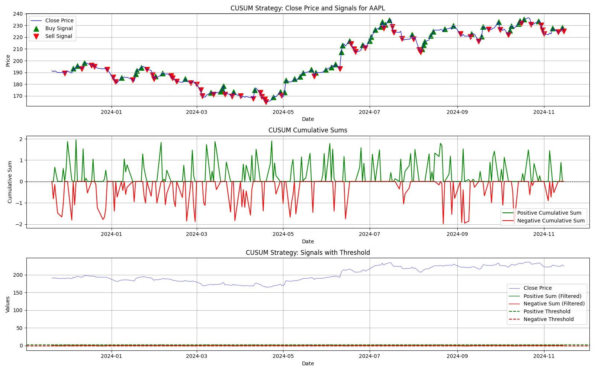

## Table of Contents

## What is a CUSUM filter?

A CUSUM filter, short for Cumulative Sum, is a type of statistical tool used to detect small shifts in the mean of a process over time. It works by keeping a running total of the differences between each data point and a target value. If these differences accumulate and exceed a certain threshold, it signals that a change has occurred in the process. This makes the CUSUM filter very useful in quality control and monitoring systems where maintaining a stable process is important.

The CUSUM filter is particularly good at spotting small changes that other methods might miss. It does this by being sensitive to the cumulative effect of deviations, rather than looking at each data point in isolation. This means it can detect a shift in the process even if individual data points do not seem very different from the target. Because of this, CUSUM filters are widely used in industries like manufacturing, healthcare, and finance to ensure processes stay within desired limits.

## How does a CUSUM filter work?

A CUSUM filter works by keeping track of how much a process is off from where it should be. Imagine you have a target value that you want your process to hit every time. The CUSUM filter looks at each new piece of data and sees if it's above or below this target. If it's above, it adds the difference to a running total. If it's below, it subtracts the difference. This running total is what we call the CUSUM value. 

If the CUSUM value gets too high or too low, it means the process might be shifting away from the target. You set a limit, called a threshold, and if the CUSUM value goes past this limit, it's a signal that something has changed in the process. This helps you catch small changes early, so you can fix them before they become big problems. It's like keeping a close eye on a scale to make sure it doesn't tip too far in one direction.

## What are the main components of a CUSUM filter?

The main parts of a CUSUM filter are the target value, the CUSUM value, and the threshold. The target value is what you want your process to be at. It's like aiming at a bullseye. The CUSUM value is a running total that keeps track of how far your process is from the target. It adds up the differences between each piece of data and the target. The threshold is a limit that tells you when the process might be going off track. If the CUSUM value goes past this limit, it's time to check what's going on.

These parts work together to help you spot small changes in your process. Every time you get new data, you compare it to the target and update the CUSUM value. If the CUSUM value starts to get too high or too low, it means the process might be shifting. The threshold acts like an alarm, warning you when the CUSUM value goes too far. This way, you can fix small problems before they get bigger.

## What are the typical applications of CUSUM filters?

CUSUM filters are often used in manufacturing to make sure products are made well. They help workers see if machines are starting to make parts that are too big or too small. If the CUSUM value goes past the threshold, it's a sign that the machine needs to be checked or fixed. This helps keep the products good and stops small problems from becoming big ones that waste time and money.

In healthcare, CUSUM filters are used to watch how well patients are doing after surgery or treatment. Doctors use them to see if patients are getting better or worse over time. If the CUSUM value shows a change, it can mean that the treatment needs to be changed or that something else is affecting the patient's health. This way, doctors can help patients faster and better.

CUSUM filters are also used in finance to watch the stock market or other investments. They help investors see if the value of their investments is going up or down more than expected. If the CUSUM value goes past the threshold, it might mean it's time to buy or sell. This helps investors make smart choices and protect their money.

## How is a CUSUM filter different from other types of filters?

A CUSUM filter is different from other types of filters because it focuses on the cumulative effect of small changes over time, rather than looking at each data point by itself. Other filters, like moving average filters, might smooth out data to see trends, but they don't keep a running total of how far the data is from a target value. CUSUM filters are really good at spotting small shifts in a process, which makes them useful for catching problems early before they get big.

Unlike Shewhart control charts, which check if each data point is within certain limits, CUSUM filters add up all the differences between the data and the target. This means they can detect a change even if individual data points don't look very different from the target. This makes CUSUM filters more sensitive to small changes, which is why they are often used in industries where keeping things steady is important.

In simple terms, while other filters might look at data in different ways, like smoothing it out or checking each point against limits, CUSUM filters keep a running score of how the process is doing compared to the target. This running score helps them catch small changes that other methods might miss, making them a powerful tool for monitoring and control.

## What are the advantages of using a CUSUM filter?

One big advantage of using a CUSUM filter is that it's really good at spotting small changes in a process. It does this by keeping a running total of how far each piece of data is from the target value. If the process starts to shift, even just a little bit, the CUSUM filter will notice because the total will start to grow. This helps catch problems early before they get bigger, which saves time and money. It's like having a very sensitive alarm that goes off when things start to go off track, even if it's just a tiny bit.

Another advantage is that CUSUM filters are easy to set up and use. Once you have your target value and your threshold, you just need to keep updating the CUSUM value with each new piece of data. This makes it simple to keep an eye on a process over time. Plus, because CUSUM filters are so good at catching small changes, they work well in lots of different areas, like making things in a factory, keeping patients healthy in a hospital, or watching the stock market. This means they are a versatile tool that can help in many different situations.

## What are the limitations or challenges of implementing a CUSUM filter?

One challenge of using a CUSUM filter is that it can be sensitive to how you set it up. If you pick the wrong target value or threshold, the filter might give false alarms or miss real problems. It's like trying to find the right spot to set a trap. If it's too tight, it might catch nothing, but if it's too loose, it might catch everything, even things you don't want. This means you need to know your process well and choose the right settings, which can take time and practice.

Another limitation is that CUSUM filters work best when the changes in the process are small and steady. If the process changes a lot or in big jumps, the CUSUM filter might not be the best tool. It's like using a magnifying glass to look at tiny details. It's great for that, but if you need to see the big picture or sudden changes, you might need a different tool. This means you have to think about what kind of changes you're trying to catch before you decide to use a CUSUM filter.

## How do you set up and tune the parameters of a CUSUM filter?

To set up a CUSUM filter, you first need to pick a target value. This is the number you want your process to hit every time. Think of it like the center of a bullseye. Then, you need to decide on a threshold. This is like a warning line that tells you when the process is starting to go off track. If the CUSUM value, which is the running total of how far your data is from the target, goes past this threshold, it's a sign that something might be wrong. You also need to start with an initial CUSUM value, usually set to zero.

Tuning the parameters of a CUSUM filter means adjusting the target value and threshold to make sure they work well for your process. If you set the threshold too low, the filter might give too many false alarms, like a smoke detector that goes off when you're just cooking. If it's too high, you might miss real problems, like not noticing a small leak until it becomes a big flood. To get it right, you might need to try different settings and see how the filter performs over time. It's a bit like tuning a musical instrument until it sounds just right.

## Can you provide an example of a CUSUM filter algorithm?

Imagine you're making cookies and want them to be exactly 10 grams each. You set up a CUSUM filter to help you check if your cookie dough is staying at the right weight. You start with a target value of 10 grams and a threshold of 5 grams. Every time you weigh a cookie, you look at how far it is from 10 grams. If the cookie is 11 grams, you add 1 to your CUSUM value. If it's 9 grams, you subtract 1. You keep doing this with every cookie, and if your CUSUM value ever goes above 5 or below -5, you know something's off with your dough.

Let's say you've made 5 cookies. The first cookie is 10.5 grams, so you add 0.5 to your CUSUM value, making it 0.5. The second cookie is 9.8 grams, so you subtract 0.2, making the CUSUM value 0.3. The third cookie is 10.2 grams, adding 0.2 to the CUSUM value, making it 0.5. The fourth cookie is 9.5 grams, subtracting 0.5, bringing the CUSUM value back to 0. The fifth cookie is 11 grams, adding 1 to the CUSUM value, making it 1. Since 1 is still below your threshold of 5, you keep going. But if the next cookie makes the CUSUM value go above 5 or below -5, you'll know to check your dough.

## How does the performance of a CUSUM filter vary with different parameter settings?

The performance of a CUSUM filter changes a lot depending on how you set the target value and the threshold. If you set the target value wrong, the CUSUM filter might not catch the small changes you want to see. It's like aiming at the wrong spot on a dartboard. If the threshold is too low, the filter might go off too often, giving false alarms. It's like a smoke detector that beeps every time you cook. But if the threshold is too high, the filter might miss real problems, like not noticing a slow leak until it's too late.

Finding the right balance with these settings is important for the CUSUM filter to work well. If you set the target value and threshold just right, the filter will catch small changes without going off too often. It's like tuning a guitar so it sounds perfect. You might need to try different settings and see how the filter does over time. This way, you can make sure the CUSUM filter helps you spot problems early, without bothering you with false alarms.

## What advanced techniques can be used to enhance the performance of a CUSUM filter?

One way to make a CUSUM filter work better is by using something called adaptive thresholds. This means the threshold can change based on how the process is doing. If the process is steady, the threshold can be smaller to catch tiny changes. But if things are jumping around a lot, the threshold can get bigger so you don't get false alarms. It's like adjusting the sensitivity of a metal detector depending on where you're searching.

Another technique is to use multiple CUSUM filters at the same time. You can set up different filters to look for different kinds of changes, like small shifts or big jumps. By watching all these filters together, you can get a better picture of what's happening in your process. It's like having different tools in a toolbox, each one good for a different job, so you can fix problems faster and better.

## How can CUSUM filters be integrated into larger systems or processes?

CUSUM filters can be added to bigger systems or processes to help keep an eye on things and catch problems early. Imagine you're running a factory that makes car parts. You can use CUSUM filters to watch the machines and make sure they're making parts the right size. If a CUSUM filter sees a small change, it can send a warning to the computer system that runs the factory. This way, workers can fix the machine before it starts making bad parts. It's like having a smart helper that tells you when something needs your attention.

In a hospital, CUSUM filters can be part of the system that keeps track of how patients are doing after surgery. The hospital's computer system can use CUSUM filters to watch things like heart rate or blood pressure over time. If a patient's numbers start to shift, the CUSUM filter can alert the doctors or nurses. This helps them take care of the patient faster and better. By being part of a bigger system, CUSUM filters help make sure everything runs smoothly and problems are fixed quickly.

## What is a CUSUM Filter?

A CUSUM filter, or Cumulative Sum Control Chart, is a statistical tool originally developed for quality control processes but has since gained traction in financial analytics and [algorithmic trading](/wiki/algorithmic-trading). It operates as a sequential analysis technique aimed at detecting changes in the cumulative sum of deviations from a predefined target value or the expected mean of a data series. This filter is particularly useful for identifying shifts in the level of a data series by comparing cumulative sums against preset thresholds. Once these thresholds are breached, the CUSUM filter flags a trend or structural change in the data.

Mathematically, the CUSUM process involves calculating the cumulative sum of deviations. Suppose $X_t$ represents the observed value at time $t$, and $\mu$ is the target or reference value (often the historical mean of the series). The cumulative sum $C_t$ can be expressed as:

$$
C_t = C_{t-1} + (X_t - \mu)
$$

The goal of CUSUM is to monitor the value of $C_t$. When this cumulative sum exceeds a positive or negative predetermined limit, it signifies a significant change in the data series. This method is preferred over traditional techniques like moving averages because it is more sensitive to detecting small shifts that are accumulated over time, thus offering a quicker response to changes in data patterns.

The CUSUM filter assigns positive or negative values when the cumulative deviations surpass these limits, thereby signaling potential moments for taking trading actions. The ability of CUSUM to accumulate minor changes and provide alerts promptly makes it an advantageous tool for market analysts and traders looking to efficiently capture the onset of price trends and reversals.

## References & Further Reading

[1]: Hawkins, D. M., & Olwell, D. H. (1998). ["Cumulative Sum Charts and Charting for Quality Improvement."](https://link.springer.com/book/10.1007/978-1-4612-1686-5) Springer.

[2]: Page, E. S. (1954). ["Continuous Inspection Schemes."](https://www.jstor.org/stable/2333009) Biometrika, 41(1-2), 100-115.

[3]: "Advances in Financial Machine Learning" by Marcos Lopez de Prado, ISBN 978-1119482086.

[4]: "Statistical Models and Methods for Quality Control" by Hans-Joachim Lenz and Peter-Theodor Wilrich, ISBN 978-3540439898.

[5]: Montogomery, D. C. (2008). "Introduction to Statistical Quality Control," John Wiley & Sons, ISBN 978-0470233977.