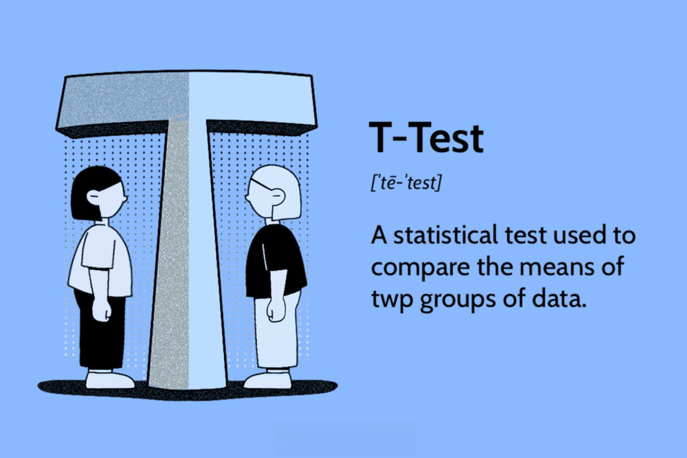

In the rapidly evolving world of algorithmic trading, traders and analysts continuously seek robust statistical tools to refine and enhance their strategies. As markets become increasingly complex and dynamic, identifying the subtle shifts in data becomes crucial for maintaining a competitive edge. The Cumulative Sum (CUSUM) Test has emerged as a notable technique in this domain, known for its ability to detect changes in the mean level of time series data effectively. 

CUSUM tests provide a methodology to monitor data streams for structural changes or trends, which can significantly influence trading decisions. This procedure accumulates the sum of deviations from a mean, allowing for the detection of shifts that may signal new trends or phases within a market. By applying CUSUM, traders can discern these changes promptly, ensuring their strategies are responsive to evolving market conditions. 



In this article, we will examine the characteristics and fundamentals of CUSUM tests and illuminate their application within algorithmic trading. Through this exploration, we aim to illustrate how these tests can be seamlessly integrated into trading strategies, boosting decision-making processes and enhancing overall performance. The potential of CUSUM tests could make them an invaluable component of a trader's toolkit, especially for those who prioritize data-driven strategies in a competitive market landscape.

## Table of Contents

## Understanding Cumulative Sum (CUSUM) Tests

Cumulative Sum (CUSUM) tests are integral to sequential analysis techniques aimed at detecting changes in time series data. The core function of a CUSUM test is to accumulate the sum of deviations from a predefined mean, thereby identifying shifts in data behavior that may signal underlying changes. Formally, the CUSUM is represented as:

$$
C_t = C_{t-1} + (X_t - \mu)
$$

where $C_t$ is the cumulative sum at time $t$, $X_t$ is the observed value, and $\mu$ is the target mean of the process. The process begins with $C_0 = 0$.

CUSUM charts effectively monitor process stability by detecting even minor shifts in the mean with minimal delay, making them valuable in quality control and financial monitoring. These charts plot the cumulative sum of deviations, allowing for visual representation of significant trends or shifts. When these cumulative sums cross predetermined control limits, it indicates a potential change in the process mean, prompting further investigation or action.

In practice, CUSUM tests are advantageous due to their sensitivity to small shifts, offering timely insights into variations that other methods might overlook. They are particularly preferred in contexts necessitating continuous monitoring, where maintaining the process mean is crucial. By efficiently signaling deviations from the expected performance, CUSUM tests contribute meaningfully to the understanding and control of processes across diverse applications, including manufacturing and finance.

## Application of CUSUM Tests in Algorithmic Trading

Algorithmic traders leverage Cumulative Sum (CUSUM) tests to recognize and capitalize on shifts within financial markets by systematically identifying changes as they occur. These shifts, particularly in time series data, can signal significant opportunities for timely buy and sell decisions, enhancing the precision of [algorithmic trading](/wiki/algorithmic-trading) strategies.

CUSUM tests are instrumental in signaling the inception of new trends or pinpointing break points within financial time series. This method calculates the cumulative sum of deviations from a target value or mean, allowing traders to promptly detect shifts. When the cumulative sum surpasses a predefined threshold, it indicates a potential change in the trend, prompting trading algorithms to execute transactions aligned with the detected trend direction. This approach enables traders to preemptively respond to emerging market conditions and gain a competitive edge. For instance, consider a stock whose price series $X_t$ is subject to analysis. The CUSUM statistic at any time $t$ can be expressed as:

$$
C_t = \max(0, C_{t-1} + (X_t - \mu - K))
$$

Where $\mu$ represents the target value or mean, and $K$ is a slack parameter chosen to adjust sensitivity to changes.

One of the notable advantages of using CUSUM in trading algorithms is its ability to provide objective signals that are less susceptible to noise than heuristic-based signals. In market environments characterized by high [volatility](/wiki/volatility-trading-strategies), purely heuristic-based strategies may generate signals prone to erroneous noise, potentially leading to suboptimal decisions. CUSUM tests, through their statistical foundation, offer a more robust framework for signal generation, enabling traders to navigate noisy data with greater accuracy.

When implementing CUSUM-based strategies, traders are encouraged to integrate them with complementary statistical tools to filter out false positives and enhance the robustness of their trading approach. Adapting parameters such as the target mean and threshold sensitively to current market conditions further optimizes the accuracy and effectiveness of the CUSUM signals. Importantly, this systematic adaptation ensures that trading algorithms remain responsive to shifts without succumbing to minor fluctuations inherent in financial markets.

In summary, CUSUM tests present a valuable method for algorithmic traders aiming to detect shifts and adjust their strategies accordingly. By offering early and objective signals of potential trend shifts, CUSUM plays a crucial role in enhancing decision-making and strategy adaptation in fluid market conditions.

## Implementing CUSUM Tests in Trading Algorithms

To implement CUSUM in trading algorithms, the first step involves computing the cumulative sum of deviations from the mean of a price series. The CUSUM statistic can be mathematically expressed as follows:

$$
C_t = \max(0, C_{t-1} + (x_t - \mu_0 - k))
$$

Where:
- $C_t$ is the cumulative sum at time $t$.
- $x_t$ is the observed value at time $t$.
- $\mu_0$ is the reference value or target mean.
- $k$ is a slack parameter that helps reduce the number of false alarms in cases of minor fluctuations.

To effectively apply the CUSUM test in the context of trading algorithms, traders set predefined control limits. These limits function as thresholds, and when they are breached by the cumulative sum, they signal a potential shift in the time series. Specifically, when $C_t$ exceeds these control limits, it indicates a statistically significant change that might necessitate trading action.

Backtesting is a critical process in the use of CUSUM tests, allowing traders to calibrate control limits and adapt the test to actual market conditions. Through simulations using historical data, traders can adjust the sensitivity of their CUSUM tests to align signals with meaningful market events. This ensures the test's responsiveness while reducing false positives.

Programmatically, implementing CUSUM can be done on various trading platforms using programming languages such as Python or R. These languages offer robust libraries for statistical analysis and computation. For instance, the following Python code snippet demonstrates a basic implementation of CUSUM:

```python
import numpy as np

def cusum(price_series, target_mean, k, h):
    cum_sum = 0
    signals = []
    for x in price_series:
        cum_sum = max(0, cum_sum + (x - target_mean - k))
        if cum_sum > h:
            signals.append(1)
            cum_sum = 0  # Resetting after breach
        else:
            signals.append(0)
    return signals

# Example usage
price_data = np.random.normal(0, 1, 100)  # Simulated price data
signals = cusum(price_data, target_mean=0, k=0.5, h=5)
```

In this example, $h$ represents the decision interval or the control limit that triggers a signal when exceeded. The sample code provides a basic framework that can be further refined and integrated with more comprehensive trading systems. Utilizing Python libraries such as NumPy or Pandas can significantly facilitate data handling and computation efficiency in larger datasets. Through this methodical approach, traders can leverage CUSUM tests to systematically detect significant shifts and recalibrate their trading strategies in real time.

## Benefits and Limitations of Using CUSUM Tests

One of the primary advantages of CUSUM tests in algorithmic trading is their heightened sensitivity to data changes, allowing traders to respond to trends or shifts more quickly than traditional methods. This sensitivity is achieved by cumulatively summing deviations from a historical mean, which helps in detecting shifts in the mean level of a price series. As a result, CUSUM tests can provide early warning signals, enabling traders to make proactive adjustments to their strategies in response to market dynamics.

However, the sensitivity of CUSUM tests can also be a double-edged sword. In highly volatile markets where random noise is prevalent, they are prone to generating false positives. A false positive in this context means interpreting random fluctuations as significant shifts, potentially leading traders to make unnecessary or erroneous decisions. As a safeguard against this, it is important for traders to combine CUSUM tests with other validation methods. Techniques such as moving averages, Bollinger Bands, or other statistical tests can serve as complementary tools to verify CUSUM signals and filter out noise.

The effectiveness of CUSUM tests greatly depends on understanding the market context and carefully calibrating test parameters. Parameters such as control limits and reference values must be selected judiciously to align with the particular characteristics of the market being analyzed. For instance, in less volatile markets, wider control limits might reduce the sensitivity to noise, while in markets with frequent fluctuations, tighter limits may be necessary.

The implementation of CUSUM involves careful tuning and analysis. Backtesting strategies are critical in fine-tuning these parameters and ensuring that the CUSUM methods align well with actionable market events. A rigorous [backtesting](/wiki/backtesting) regimen allows traders to simulate how CUSUM signals would have performed historically, aiding in the adjustment of parameters to minimize errors and enhance reliability.

In conclusion, while CUSUM tests are valuable tools for early detection of shifts in financial time series, their use requires careful consideration of their potential limitations. Traders must exercise diligence in parameter calibration and maintain a diversified strategy that includes additional validation techniques to ensure robust trading decisions.

## Conclusion

CUSUM tests offer a compelling tool for traders seeking to detect shifts in financial time series and adapt their strategies accordingly. By providing early signals on potential trend shifts, CUSUM can enhance the decision-making process, enabling more responsive trading strategies. Traders benefit from the method's sensitivity, which allows for the detection of minute changes in data that can precede significant market movements. This capability is particularly valuable for swiftly adjusting trading algorithms to new market conditions, enhancing overall performance.

Despite their advantages, it is crucial to acknowledge the limitations of CUSUM tests and ensure they are integrated into a broader, diversified strategy. One key challenge is the potential for false positives, especially in volatile markets where noise can lead to misleading signals. This necessitates a cautious approach where CUSUM tests are complemented with other analytical methods to validate the detected trends and reduce the risk of erroneous trades.

Traders interested in leveraging CUSUM should ensure rigorous backtesting and validation to verify its effectiveness within their specific trading frameworks. Backtesting can aid in calibrating parameters such as control limits, ensuring that the signals generated by CUSUM tests align with actionable market trends. Implementing CUSUM in a programmatic environment, such as Python or R, can facilitate extensive testing and refinement. Ultimately, while CUSUM adds a valuable dimension to trading strategies, its success depends on careful tuning and validation tailored to the trader's unique objectives and the dynamics of their chosen markets.

## References & Further Reading

[1]: Page, E. S. (1954). ["Continuous Inspection Schemes."](https://www.jstor.org/stable/2333009) Biometrika, 41(1/2), 100-115.

[2]: Hawkins, D. M., & Olwell, D. H. (1998). ["Cumulative Sum Charts and Charting for Quality Improvement."](https://link.springer.com/book/10.1007/978-1-4612-1686-5) Springer.

[3]: Lucas, J. M. (1982). ["Combined Shewhart-CUSUM Quality Control Schemes."](https://www.tandfonline.com/doi/abs/10.1080/00224065.1982.11978790) Journal of Quality Technology, 14(2), 51-59.

[4]: Lopez de Prado, M. (2018). ["Advances in Financial Machine Learning."](https://www.amazon.com/Advances-Financial-Machine-Learning-Marcos/dp/1119482089) John Wiley & Sons.

[5]: Kratz, M., & Resnick, S. I. (1996). ["The CUSUM Test and Tail Prozesses."](https://www.semanticscholar.org/paper/The-qq-estimator-and-heavy-tails-Kratz-Resnick/9511b4852a00818af800636195074e99d9337ca7) Transactions of the American Mathematical Society, 348(2), 2423-2440.

[6]: O'Brien, R. M., & Kaiser, M. K. (1985). ["Cumulative Sum Techniques on Structural Characteristics of Time Series Models."](https://pubmed.ncbi.nlm.nih.gov/3983301/) Journal of Peace Research, 22(1), 51-65.