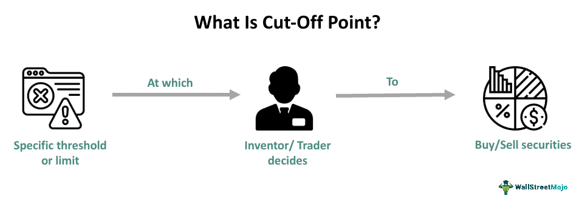

Algorithmic trading, often abbreviated as algo trading, is a sophisticated method of executing trades based on pre-programmed criteria. These algorithms analyze market data in real-time and make trading decisions with precision and speed, far surpassing human capabilities. An essential component within this framework is the use of cutoff thresholds, which are crucial for making informed and strategic trading decisions.

Cutoff thresholds, or cutoff points, refer to the predefined levels at which trading actions are automatically triggered to either limit potential losses or secure profits. These thresholds ensure that trades are executed automatically when specific market conditions are met, thus reducing emotional bias and enhancing the consistency of trading strategies. By employing these methodologies, traders can effectively navigate volatile financial markets and align their trades with predefined risk and reward parameters.



The importance of cutoff thresholds in algorithmic trading cannot be overstated, particularly with the escalating utilization of technology in financial markets. Understanding these mechanisms is vital for both novice and experienced traders who aim to develop robust trading strategies in increasingly complex and competitive environments. Cutoff thresholds serve as safeguards against unforeseen market fluctuations, allowing traders to maintain control over their investment strategies.

This article aims to provide a comprehensive overview of how cutoff thresholds are employed in algorithmic trading, discussing their various types and their strategic significances. By shedding light on these mechanisms, the article seeks to empower traders with knowledge that can optimize their trading strategies and enhance their ability to capitalize on market movements.

## Table of Contents

## Understanding Cutoff Thresholds in Algo Trading

Cutoff thresholds in algorithmic trading are predefined markers within trading algorithms that automatically initiate trades under specific market conditions. These strategic limits play a critical role in enhancing the efficiency and effectiveness of trading operations by enabling a rules-based approach to decision-making. Unlike human traders, who might be swayed by emotions such as fear or greed, algorithms operate on data-driven insights, ensuring objective adherence to predetermined strategies.

When a cutoff threshold is reached, the algorithm executes trades that align with the investor's financial objectives and risk tolerance. By setting these points in advance, traders can achieve a high level of responsiveness to market fluctuations. This capability is crucial in fast-paced trading environments where timely decisions can significantly impact financial outcomes.

A solid grasp of how cutoff thresholds operate allows traders to optimize their portfolio management strategies. By designating specific limits for executing trades, these thresholds serve to cap potential losses while safeguarding accrued profits. For instance, setting a threshold at a certain percentage below the purchase price can help mitigate losses if the asset's value begins to decline. Similarly, a threshold set above the purchase price can lock in profits once a target gain is realized.

In practice, the implementation of cutoff thresholds can involve various approaches, depending on the trader's risk profile and investment strategy. Some may elect to employ simple stop-loss orders, while others might use advanced trailing stops that move with market trends. Through a comprehensive understanding of these strategic limits, traders can effectively tailor their algorithmic systems to match their specific financial aspirations and market scenarios.

## Types of Cutoff Thresholds

Cutoff thresholds play a pivotal role in [algorithmic trading](/wiki/algorithmic-trading) by setting predetermined limits, aiding traders in managing risks effectively. The application and choice of these thresholds depend on individual trading strategies, risk tolerance, and desired outcomes. The following are the principal types of cutoff thresholds employed by traders:

1. **Daily Cutoff Points**: These thresholds are designed to impose restrictions on losses incurred within a single trading day. By establishing these limits, traders can avoid making impulsive decisions that may arise after experiencing significant daily losses. For instance, if a daily cutoff is set at 2%, any losses exceeding this amount during the day would trigger an automatic halt in trading activities. This approach provides traders with the discipline to stay within their risk management strategies, thereby protecting their capital from substantial daily declines.

2. **Weekly Cutoff Points**: Acting as a buffer against cumulative daily losses, weekly cutoff points help curb overall losses over a week. This threshold ensures that even if individual daily limits are breached, the total weekly loss does not threaten the trader's capital excessively. Weekly cutouts can be particularly beneficial in volatile markets, where losing days might be offset throughout the week. For example, consider setting a 5% weekly cutoff, allowing traders to adjust their strategies or take corrective actions before capital erosion occurs.

3. **Overall Cutoff Points**: These thresholds are set over extended periods, such as monthly or yearly spans, enabling traders to maintain a broader view of their investment outcomes. Overall cutoff points cover scenarios where trends might not be evident over shorter timescales, thus assisting traders in achieving long-term financial goals. Setting an overall cutoff, say 10% monthly, allows the trader to evaluate strategies monthly, ensuring alignment with their broader financial objectives and preventing significant capital deviations from their plan.

Selecting the appropriate cutoff thresholds is a strategic decision that hinges on the trader's overall strategy, including their risk appetite and desired rate of return. For instance, a risk-averse trader might opt for tighter daily and weekly cutoffs to limit exposure, while a risk-tolerant trader may choose broader thresholds, seeking more considerable potential returns. In practice, the effectiveness of these thresholds lies in their integration within the trading algorithm, which should dynamically assess market conditions and adjust appropriately, thereby enabling a proactive approach to risk management.

## Implementing Cutoff Points Using Stop-Loss Orders

Stop-loss orders are instrumental in managing risks and effectively implementing cutoff thresholds in trading strategies. These orders are designed to limit an investor's loss on a position in a security by triggering its sale once the price falls to a predetermined level. The primary function of stop-loss orders is to automate the decision-making process, thereby removing emotional decision-making from trading activities and helping traders adhere to their predefined risk management strategies.

A traditional stop-loss order is placed at a fixed price point, which means that if a stock is purchased at $50 and the trader sets a stop-loss at $45, the stock will be sold automatically if the price falls to $45. This helps ensure that the maximum loss is limited to $5 per share, regardless of market conditions. 

Trailing stop-loss orders add flexibility and adaptability to the traditional stop-loss concept. Instead of being set at a fixed price, a trailing stop-loss order is set at a percentage or dollar amount below (for long positions) or above (for short positions) the stock's current market price. As the price moves favorably, the trailing stop price adjusts accordingly but remains fixed if the price starts moving unfavorably. For example, if a stock is bought at $50 with a 5% trailing stop, and the price rises to $55, the trailing stop rises to $52.25 — 5% below $55. This approach allows traders to lock in profits while still safeguarding against potential downside risks.

Here is a basic implementation of a trailing stop-loss using Python:

```python
class TrailingStopLoss:
    def __init__(self, trailing_percentage):
        self.trailing_percentage = trailing_percentage
        self.highest_price = 0
        self.stop_price = 0

    def update_price(self, current_price):
        if current_price > self.highest_price:
            self.highest_price = current_price
            self.stop_price = current_price * (1 - self.trailing_percentage)
        elif current_price < self.stop_price:
            return "Sell"
        return "Hold"

# Example use
trailing_stop = TrailingStopLoss(trailing_percentage=0.05)
prices = [50, 52, 55, 53, 51, 50]

for price in prices:
    action = trailing_stop.update_price(price)
    print(f"Current Price: ${price:0.2f}, Action: {action}")
```

Traders often use diverse types of stop-loss orders to suit their individual trading strategies and adapt to fluctuating market conditions. Besides fixed and trailing stop-loss orders, some traders may use [volatility](/wiki/volatility-trading-strategies)-based stop-loss orders which adjust the cutoff threshold based on market volatility indicators, providing a dynamic buffer against market swings.

The implementation of stop-loss orders is not just limited to cutting losses; they are crucial in enabling disciplined trading and maintaining a structured approach to investment goals. They ensure that trader's emotions do not interfere with logical decision-making and enable consistent adherence to predetermined trading plans. This places stop-loss orders among the most essential tools for effectively implementing cutoff thresholds in algorithmic trading.

## Special Considerations in Algo Trading with Cutoff Thresholds

Determining the optimal cutoff point in algorithmic trading is a nuanced process that requires consideration of various personal and market factors. Each trader's financial objectives, market expectations, and risk appetite will influence this decision. For instance, a risk-averse trader may set conservative cutoff points to minimize potential losses, while an aggressive trader may opt for wider thresholds to capture greater profit opportunities. 

Balancing strict adherence to cutoff thresholds with the need for flexibility is crucial in responding effectively to dynamic market conditions. Markets are inherently volatile and can shift rapidly, necessitating adjustments in strategy. Overly rigid adherence to predefined cutoff points might cause traders to miss out on advantageous trades or prematurely [exit](/wiki/exit-strategy) profitable positions. Traders should be prepared to reassess and adjust their cutoff points as market conditions evolve.

Implementing a diversified approach with multiple cutoff strategies can also enhance risk management. By integrating various types of cutoff points—such as daily, weekly, or overall thresholds—traders can create a layered defense against market volatility. This diversification allows for tailored responses to different market scenarios, potentially stabilizing trading performance over time.

Continuous evaluation of cutoff strategies is vital. This ongoing process involves monitoring market trends, assessing the effectiveness of current strategies, and making necessary modifications to align with both market shifts and personal financial goals. Utilizing [backtesting](/wiki/backtesting) can provide insights into how different cutoff strategies might perform under historical market conditions, helping traders refine their approaches. 

Incorporating advanced technological solutions and data analytics can aid in optimizing cutoff strategies. Machine learning algorithms, for example, can analyze vast amounts of data to predict optimal cutoff points under varying market scenarios. By continually refining these strategies, traders can maintain a robust framework capable of adapting to changing market environments while safeguarding their investments.

## Conclusion

Cutoff thresholds play a pivotal role in algorithmic trading by offering a structured method for managing risk and enhancing decision-making processes. They enable traders to avoid emotional responses to market fluctuations, thus preserving their capital and optimizing profit-taking opportunities. By integrating these thresholds effectively within trading algorithms, investors can protect their portfolios against adverse market movements. This systematic approach not only mitigates potential losses but also aligns trading activities with specific financial goals and risk appetites.

Successful implementation of cutoff thresholds necessitates an ongoing evaluation of strategies to adapt to the ever-changing market conditions. Constantly assessing and refining these thresholds ensures that trading systems remain effective, allowing traders to maintain a competitive edge. Incorporating advanced technological solutions like [machine learning](/wiki/machine-learning) and data analytics can further refine cutoff strategies, making them more precise and responsive to real-time market data.

In summary, adopting cutoff thresholds in algorithmic trading frameworks enables traders to harness sophisticated risk management techniques, thereby enhancing their ability to capitalize on market opportunities with assured confidence and precision. This proactive stance in using technology-driven solutions not only safeguards investments but also positions traders to achieve consistent, long-term success in a dynamic trading environment.

## Frequently Asked Questions (FAQs)

What is a cutoff point in algo trading?

A cutoff point in algorithmic trading represents a predefined level or threshold where a trade is automatically executed. These thresholds are integral components of trading algorithms, designed to manage risks by defining conditions for entering or exiting trades. By establishing specific market conditions as triggers, algorithms can execute trades methodically, minimizing emotional bias and enhancing the precision of trading strategies.

How do different types of cutoff points benefit traders?

Different types of cutoff points offer traders varied advantages based on their trading strategies and risk tolerance:

1. **Daily Cutoff Points**: These help in controlling losses within a single trading day by setting limits that, when breached, halt further trading activities. This restricts impulsive decisions and curtails significant intraday losses.

2. **Weekly Cutoff Points**: By acting as a buffer over daily thresholds, these points prevent accumulated losses from escalating throughout the week, thus preserving capital over a more extended period.

3. **Overall Cutoff Points**: Implemented over longer durations like monthly or yearly intervals, these thresholds enable traders to maintain investment discipline and adjust their strategies according to broader market perspectives.

Can cutoff thresholds replace manual trading decisions?

While cutoff thresholds offer systematic approaches to trading, they cannot entirely replace manual trading decisions. Cutoff points provide automated responses to specific market triggers, enhancing efficiency and speed. However, manual interventions may still be necessary to adapt to unexpected market changes or to capitalize on opportunities not initially envisaged by the trading algorithm. A balanced strategy incorporating both automated and manual inputs proves beneficial in dynamic trading environments.

How to determine the best cutoff point for my trading strategy?

Determining the optimal cutoff point requires aligning the thresholds with your trading objectives, market conditions, and risk tolerance. Here's a simplified approach:

1. **Risk Assessment**: Start by analyzing your financial goals and determine how much risk you are willing to take.

2. **Historical Analysis**: Evaluate past market data to identify patterns or fluctuations that can inform the setting of practical cutoff thresholds.

3. **Simulations**: Use backtesting tools to simulate how different cutoff levels would have performed historically. This aids in understanding the potential effectiveness and pitfalls.

4. **Adjustments**: Regularly revisit and adjust your cutoff points as necessary, based on evolving market conditions and your current financial status.

What role do stop-loss orders play in implementing cutoff points?

Stop-loss orders are pivotal in actualizing cutoff points within algorithmic trading strategies. They automatically initiate a trade to sell securities when they fall to a specified price, thereby mitigating potential losses. Here's a basic example of a stop-loss order in Python using a simplified framework:

```python
def execute_trade(current_price, stop_loss_price):
    if current_price <= stop_loss_price:
        return "Sell order executed"
    else:
        return "No action"

# Example usage
current_market_price = 95
stop_loss_price = 100
action = execute_trade(current_market_price, stop_loss_price)
print(action)  # Output: Sell order executed
```

Trailing stop-loss orders extend this functionality by adjusting the stop-loss level in accordance with favorable market movements, thus offering protection while allowing for potential gains. These versatile tools enable adherence to cutoff points, aligning closely with broader trading objectives and risk management strategies.

## References & Further Reading

[1]: Avellaneda, M., & Stoikov, S. (2008). ["High-frequency Trading in a Limit Order Book."](https://people.orie.cornell.edu/sfs33/LimitOrderBook.pdf) Quantitative Finance, 8(3), 217-224.

[2]: Madhavan, A. (2000). ["Market microstructure: A survey."](https://www.sciencedirect.com/science/article/pii/S1386418100000070)00023-7) Journal of Financial Markets, 3(3-4), 205-258.

[3]: Aldridge, I. (2013). ["High-Frequency Trading: A Practical Guide to Algorithmic Strategies and Trading Systems."](https://www.amazon.com/High-Frequency-Trading-Practical-Algorithmic-Strategies/dp/1118343506) Wiley.

[4]: Kissell, R. (2013). ["The Science of Algorithmic Trading and Portfolio Management."](https://www.sciencedirect.com/book/9780124016897/the-science-of-algorithmic-trading-and-portfolio-management) Academic Press.

[5]: Hasbrouck, J. (2007). ["Empirical Market Microstructure: The Institutions, Economics, and Econometrics of Securities Trading."](https://academic.oup.com/book/52241) Oxford University Press.