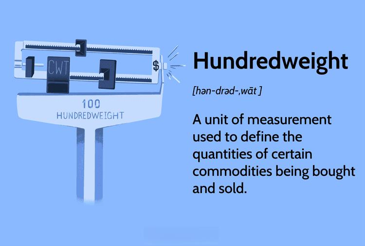

The concept of hundredweight (CWT) is a traditional unit of measurement that has been embedded in the lexicon of commodities trading and shipping for centuries. Despite the global shift towards the metric system, CWT continues to hold significance in certain sectors, particularly agriculture and shipping, due to its historical roots and practical utility. One hundredweight in North America is equivalent to 100 pounds (approximately 45.4 kilograms), while in the United Kingdom, it equals 112 pounds (about 50.8 kilograms). This difference highlights the need for precision when dealing with international trade and shipping, where weight calculations are crucial.

CWT is often leveraged for its simplicity and ease of understanding, especially when dealing with large volumes of goods. The unit allows traders and shippers to streamline calculations related to pricing and logistics, ensuring efficiency in operations. In certain commodities markets, such as grains and livestock, CWT serves as a standard unit of measure, offering a common language that facilitates trade across regions. The persistence of CWT in these industries underscores its relevance, where traditional practices intersect with modern economic activities.



Moreover, in contemporary contexts, the integration of CWT within algorithmic trading frameworks reflects the adaptation of historical units to modern technological advancements. Algorithmic trading involves using computer algorithms to quickly execute trades and requires precise input metrics to optimize execution. By incorporating CWT into these algorithms, traders can enhance pricing and volume analysis, particularly in the commodities markets where understanding weight and cost is paramount.

This article will explore how CWT is calculated, its importance in various markets, and its role in modern algorithmic trading, offering insights into this enduring unit of measurement.

## Table of Contents

## Understanding Hundredweight (CWT)

Hundredweight, abbreviated as CWT, is a traditional unit of mass measurement frequently employed in the quantification of large volumes of commodities. Distinct variations in the definition of hundredweight exist across different regions. In North America, it is equivalent to 100 pounds, which is approximately 45.4 kilograms. Conversely, in the United Kingdom, a hundredweight equals 112 pounds, or roughly 50.8 kilograms. This variance stems from historical practices and emphasizes the need for clarity when engaging in international trade.

The hundredweight's historical significance lies in its origin as a simplified method for trading staples such as grains and livestock. During the times when international trade was burgeoning, particularly in agricultural products, having a standardized unit like the hundredweight facilitated easier calculation and transaction processes across borders. This simplification was vital in periods when electronic scales and digital conversions were not yet available.

The choice of 100 pounds in North America and 112 pounds in the UK can be linked to differences in measuring systems and commercial practices that predate modern metrication. This divergence has occasionally created complexities in global trade, requiring specific knowledge of regional standards to ensure accurate communication and calculation of commodity quantities.

Understanding hundredweight and its regional variations remains crucial for stakeholders in commodities trading and shipping. This knowledge helps in ensuring accuracy in measuring product volumes, negotiating prices, and executing trades effectively. Despite the rise of the metric system, hundredweight continues to hold relevance in specific markets due to its historical roots and practical implications in these industries.

## Calculation of CWT

Hundredweight (CWT) is a measurement unit used primarily in shipping and commodities trading, crucial for determining costs related to the transportation and sale of goods. Calculating CWT is straightforward yet essential for pricing accuracy and financial assessments.

In North America, one hundredweight equals 100 pounds, while in the United Kingdom, it equals 112 pounds. To compute the CWT in either region, you divide the total weight of a shipment by the respective CWT [factor](/wiki/factor-investing). For instance, a shipment weighing 500 pounds in North America would be calculated as:

$$

\text{CWT} = \frac{\text{Total weight in pounds}}{100} = \frac{500}{100} = 5
$$

For the same 500-pound shipment in the UK:

$$

\text{CWT} = \frac{\text{Total weight in pounds}}{112} = \frac{500}{112} \approx 4.46
$$

Understanding CWT extends beyond mere calculation; it plays a vital role in determining shipping costs. Companies often use the price per CWT to evaluate the efficiency of different shipping options. To find the price per CWT, divide the total price of the shipment by its calculated weight in CWT. For example, if a shipment weighing 500 pounds in North America costs $300, the per-CWT cost can be determined as:

$$

\text{Price per CWT} = \frac{\text{Total Price}}{\text{CWT}} = \frac{300}{5} = 60
$$

This means the cost is $60 per CWT for this particular shipment. Using these calculations allows businesses to make informed decisions and optimize their logistics.

## CWT in Algorithmic Trading

Algorithmic trading, a method characterized by the deployment of advanced algorithms to execute orders with speed and precision, has become integral to modern commodities markets. In these markets, units like the hundredweight (CWT) play a crucial role, particularly in sectors dealing with bulk goods such as grains and livestock.

The integration of CWT data into [algorithmic trading](/wiki/algorithmic-trading) systems allows for nuanced pricing and [volume](/wiki/volume-trading-strategy) analysis. Traders utilize CWT to assess the weight and cost of commodities, making it essential for developing strategies that align trade execution with market dynamics. For example, the cost per CWT in commodities such as cattle or grain is vital for determining profitability and making informed trading decisions.

Consider a scenario where the price of cattle is given in CWT. Algorithms can input this data and cross-reference it with historical price trends, volume fluctuations, and market forecasts to predict future price movements. This predictive power is enhanced by algorithms that analyze patterns and calculate the optimal timing for trades.

Python, being a favored language in algorithmic trading, serves as a useful tool for implementing these strategies. Below is a simplified example of how a Python script might be structured to calculate the value of a commodity trade based on CWT:

```python
def calculate_trade_value(weight_in_pounds, price_per_cwt, cwt_conversion_factor=100):
    # Convert weight to CWT
    weight_in_cwt = weight_in_pounds / cwt_conversion_factor
    # Calculate trade value
    trade_value = weight_in_cwt * price_per_cwt
    return trade_value

# Example: Calculate the trade value for a 2000-pound shipment where the price is $50 per CWT
weight_in_pounds = 2000
price_per_cwt = 50
trade_value = calculate_trade_value(weight_in_pounds, price_per_cwt)
print(f"The trade value is ${trade_value:.2f}")
```

In this example, the function `calculate_trade_value` converts the given weight into CWT and computes the total trade value based on the specified price per CWT. This basic script underscores the utility of algorithmic approaches in handling CWT data efficiently, enhancing the decision-making process in commodities trading.

Overall, incorporating CWT into algorithmic trading strategies modernizes traditional trading practices, providing enhanced capabilities for market analysis and trade optimization.

## Comparison: CWT vs. Metric System

The hundredweight (CWT) and metric system coexist as units of measure but cater to different regions and industries. The metric system, with its base-10 structure, is the primary unit in most of the world due to its simplicity and standardization. However, the CWT persists in the U.S. and some sectors, primarily in agriculture and shipping, attributable to historical practices and easier calculations for those accustomed to it.

The metric system's rise led to a global shift away from traditional units like the CWT, fostering uniformity in international trade. Given the metric system's widespread adoption, it simplifies conversions and calculations through its standardized units: meters for length, kilograms for weight, and liters for volume. For example, the straightforward relationship between kilograms and grams simplifies the understanding and conversion of different weights efficiently.

Despite this, the CWT retains significance in specific U.S. markets due to its established presence and practicality for certain commodities. In contexts such as agriculture, where historical practices deeply entwine with daily operations, the CWT offers a convenience that often outweighs the benefits of transitioning to the metric system. Its use allows traders and shippers to calculate costs and weights effectively without requiring conversion knowledge.

Challenges emerge in international trade, primarily due to the lack of standardization in the CWT's definition across different countries. In North America, one CWT equals 100 pounds (45.4 kg), while in the United Kingdom, it equals 112 pounds (50.8 kg). These discrepancies necessitate careful consideration when engaging in international transactions to avoid miscommunication and errors.

To address potential confusions, many modern software systems in logistics and trading incorporate automatic conversions and calculations between CWT and metric units. Python, for instance, can be used to create conversion scripts that simplify the process:

```python
def cwt_to_kg(weight_cwt, region='US'):
    if region == 'US':
        return weight_cwt * 45.4
    elif region == 'UK':
        return weight_cwt * 50.8
    else:
        raise ValueError("Region must be 'US' or 'UK'.")

def kg_to_cwt(weight_kg, region='US'):
    if region == 'US':
        return weight_kg / 45.4
    elif region == 'UK':
        return weight_kg / 50.8
    else:
        raise ValueError("Region must be 'US' or 'UK'.")
```

The continued use of the CWT in certain areas highlights the challenge of transitioning fully to metric standards while respecting traditional practices. As industries evolve, the reconciliation between these systems remains a pivotal consideration for efficient and effective trading and shipping operations.

## CWT Shipping vs. LTL Shipping

CWT pricing, or hundredweight pricing, is often chosen for shipments that are lighter in weight and do not necessitate filling an entire truckload. This method serves as a cost-effective solution for transporting smaller volumes of goods, particularly when the overall weight is manageable within freight charges measured per hundred pounds. The pricing structure of CWT is beneficial for industries where shipping volumes fluctuate and flexibility is needed in managing partial loads.

On the other hand, Less-than-Truckload (LTL) shipping is a logistical solution tailored for heavier or bulkier items requiring palletization. LTL shipping is especially advantageous when the shipments are sizeable enough to need secure handling but not voluminous enough to warrant a full truckload. It effectively consolidates freight from various shippers, optimizing space, reducing costs, and supporting logistics networks by ensuring that no truck departs with wasted capacity.

Companies select between CWT and LTL shipping based on several factors, including efficiency, cost, and the specific characteristics of the goods being transported. When considering efficiency, a business might opt for LTL if the shipment consists of pallets that necessitate particular handling or if the routes allow for multiple stops. Conversely, CWT pricing can be more efficient for rapidly moving smaller, lightweight items where pinpoint management of weights is beneficial.

Cost considerations involve evaluating the comprehensive transportation expenses, including fuel surcharges, handling fees, and potential additional costs in LTL for using shared services. CWT shipping can present lower costs for shippers managing tight budgets when the weight threshold makes CWT pricing more advantageous. For example, a business may calculate the price per hundredweight using the formula:

$$
\text{Cost per CWT} = \frac{\text{Total Shipping Cost}}{\text{Total Weight in CWT}}
$$

The nature of the goods is also pivotal in determining the shipping method. Fragile or high-value shipments might favor LTL due to enhanced security and tracking systems to monitor palletized goods. In contrast, commodities shipped in uniform, smaller loads might suit CWT pricing, providing straightforward billing and simplified weight assessments.

Ultimately, businesses weigh these factors to determine the most practical and economical shipping method. Each option offers specific benefits that, when matched correctly to the shipment needs, ensure efficient and cost-effective transportation solutions.

## Conclusion

Despite the widespread adoption of the metric system, the hundredweight (CWT) continues to be a valuable measurement unit in specific sectors such as agriculture, shipping, and commodities trading. The enduring relevance of CWT is attributable to its historical usage and the simplicity it offers in certain contexts. For traders and shippers, a thorough understanding of CWT is imperative for executing cost-effective operations. Calculating CWT involves straightforward computations, either dividing total weight by 100 in North America or by 112 in the UK, which simplifies handling transactions and pricing strategies.

Moreover, the integration of CWT into algorithmic trading has demonstrated potential advantages. Algorithmic trading, which utilizes complex algorithms for high-speed and high-volume transactions, benefits from incorporating CWT data. This integration enhances precision in pricing and volume analysis, particularly within commodities markets that deal with livestock and grain trades. By considering CWT in their strategies, traders can fine-tune their decision-making processes, potentially optimizing market performance and profitability. As a result, while the metric system predominates, CWT retains a significant role due to its practicality and strategic value in particular economic activities.

## References & Further Reading

[1]: ["Advances in Financial Machine Learning"](https://www.amazon.com/Advances-Financial-Machine-Learning-Marcos/dp/1119482089) by Marcos Lopez de Prado

[2]: ["Evidence-Based Technical Analysis: Applying the Scientific Method and Statistical Inference to Trading Signals"](https://www.amazon.com/Evidence-Based-Technical-Analysis-Scientific-Statistical/dp/0470008741) by David Aronson

[3]: ["Machine Learning for Algorithmic Trading"](https://github.com/stefan-jansen/machine-learning-for-trading) by Stefan Jansen

[4]: ["Quantitative Trading: How to Build Your Own Algorithmic Trading Business"](https://www.amazon.com/Quantitative-Trading-Build-Algorithmic-Business/dp/1119800064) by Ernest P. Chan

[5]: Fama, E. F., & French, K. R. (1993). ["Common Risk Factors in the Returns on Stocks and Bonds."](https://www.sciencedirect.com/science/article/pii/0304405X93900235) Journal of Financial Economics, 33(1), 3-56.

[6]: Hull, John C. (2017). ["Options, Futures, and Other Derivatives"](https://www.pearson.com/en-us/subject-catalog/p/options-futures-and-other-derivatives/P200000008765/9780134472089). Pearson Education Limited. 

[7]: Van Vliet, Pim (2018). ["High Returns from Low Risk: A Remarkable Stock Market Paradox"](https://www.paradoxinvesting.com/). Springer.