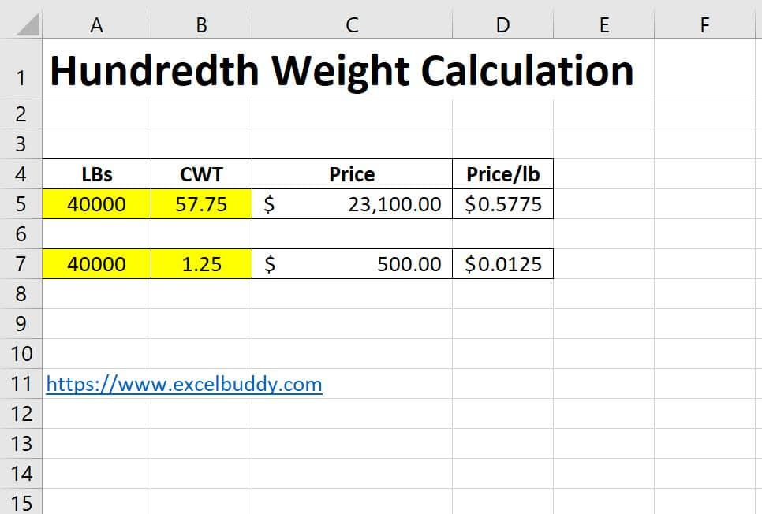

## Table of Contents

## What is CWT and why is it important?

CWT stands for "Chirp Weighting Technique." It is a method used in signal processing to improve the quality of signals, especially in environments with a lot of noise. Imagine you are trying to listen to a bird singing in a noisy city. CWT helps to make the bird's song clearer by reducing the background noise. This technique is important because it allows us to better understand and analyze signals in many different fields, like telecommunications, medical imaging, and even music.

In telecommunications, CWT helps to make phone calls and internet connections clearer, even when there is a lot of interference. For example, if you are on a video call and someone nearby is using a loud machine, CWT can help make your voice sound clearer to the person on the other end. In medical imaging, CWT can help doctors see clearer images of the inside of the body, which can lead to better diagnoses and treatments. Overall, CWT is important because it helps us to communicate and understand information better in many different situations.

## How does CWT differ from other types of wavelets?

CWT, or Chirp Weighting Technique, is different from other types of wavelets because it focuses on improving the signal quality by reducing noise. Think of it like trying to hear a soft melody in a noisy room. CWT acts like a special filter that helps to make the melody clearer by tuning out the background noise. Other wavelets, like the Haar wavelet or the Daubechies wavelet, are more about breaking down a signal into different parts to analyze it, but they don't focus as much on noise reduction.

In simple terms, while other wavelets are good at showing the different pieces of a signal, CWT is better at making the whole signal easier to understand by removing the noise. For example, if you are trying to listen to a friend's voice on a windy day, CWT would help you hear your friend better by reducing the sound of the wind. Other wavelets might help you see the different frequencies in the wind and your friend's voice, but they wouldn't make the voice clearer.

## What are the basic steps involved in performing a CWT?

Performing a Chirp Weighting Technique (CWT) involves a few key steps to help make a signal clearer by reducing noise. First, you start with the noisy signal, which is like a mix of the sound you want to hear and the background noise. Then, you create a special filter called a chirp, which is a signal that changes its frequency over time, like a bird's chirp that starts low and goes high. You use this chirp to match the signal you want to hear, and you adjust it to focus on the important parts of the signal.

Next, you apply this chirp filter to the noisy signal. This step is like using the chirp to 'listen' to the signal and pick out the parts that match the chirp, while ignoring the noise. The chirp helps to highlight the signal you want and reduce the background noise, making the signal clearer. After applying the chirp filter, you can see or hear the signal much better, like being able to understand your friend's voice on a windy day.

## Can you explain the concept of scale in the context of CWT?

In the context of Chirp Weighting Technique (CWT), the concept of scale is about how we look at the signal over different time periods. Imagine you are trying to see the details of a painting. If you stand far away, you see the big picture, but not the small details. If you get closer, you can see the brush strokes and finer details. In CWT, scale works the same way. A larger scale means we are looking at the signal over a longer time, seeing the bigger picture, while a smaller scale means we are looking at shorter time periods, seeing more detailed parts of the signal.

Using different scales in CWT helps us to better understand and clean up the signal at different levels. For example, if there is a lot of low-frequency noise, like the hum of a machine, we might use a larger scale to focus on that part of the signal and remove the noise. If there is high-frequency noise, like the sound of a buzzing insect, we might use a smaller scale to target and reduce that noise. By adjusting the scale, CWT allows us to fine-tune how we process the signal, making it clearer and easier to understand.

## What are some common applications of CWT in various fields?

In the field of telecommunications, CWT is really helpful for making phone calls and internet connections clearer. Imagine you're on a video call and there's a lot of noise around you, like a loud machine or people talking. CWT can help make your voice sound clearer to the person on the other end by reducing that background noise. This makes it easier for people to talk and understand each other, even in noisy places.

In medical imaging, CWT helps doctors see clearer pictures of the inside of the body. Think of it like trying to see a small detail in a foggy photo. CWT can help clear up the fog, making it easier for doctors to see things like bones or organs. This can lead to better diagnoses and treatments because doctors can see what's going on inside the body more clearly.

CWT is also used in music and audio processing. If you're listening to a song and there's a lot of background noise, like traffic or wind, CWT can help make the music sound better by reducing that noise. This is important for musicians and sound engineers who want to make sure their recordings are as clear and enjoyable as possible.

## How does the choice of wavelet function affect the results of a CWT?

The choice of wavelet function in a Chirp Weighting Technique (CWT) can make a big difference in how well the technique works. Think of the wavelet function like a special tool that helps to pick out the important parts of a signal. If you choose a wavelet that matches the signal you want to hear, like a chirp that sounds similar to the signal, it will be better at making the signal clearer and reducing the noise. But if the wavelet doesn't match the signal well, it might not be as good at [picking](/wiki/asset-class-picking) out the important parts, and the signal might still sound noisy.

For example, if you're trying to listen to a bird's song in a noisy park, you would want to use a wavelet that sounds like the bird's song. This would help the CWT focus on the bird's song and reduce the noise from the park, like people talking or cars driving by. If you use a wavelet that sounds more like the noise, the CWT might not be able to tell the difference between the bird's song and the noise, and the bird's song might still be hard to hear. So, choosing the right wavelet is important for making sure the CWT works well and the signal comes through clearly.

## What are the computational challenges associated with CWT, and how can they be addressed?

Using Chirp Weighting Technique (CWT) can be tough because it needs a lot of math and computer power. When you apply CWT, you have to do a lot of calculations to make the signal clear. This can slow down your computer or take a long time, especially if the signal is very long or if you're using a lot of different scales to look at it. Also, choosing the right wavelet function can be hard because you need to find one that matches the signal you want to hear, and that can take a lot of trial and error.

To make CWT easier to use, people have come up with some ways to help. One way is to use special computer programs that are made to handle a lot of calculations quickly. These programs can do the math faster and make the process smoother. Another way is to use simpler wavelet functions that still work well but don't need as much computer power. By trying out different wavelets and finding the one that works best for your signal, you can make the CWT process easier and faster.

## Can you describe the mathematical formula used in CWT calculations?

The mathematical formula for Chirp Weighting Technique (CWT) involves using a special function called a wavelet to help make a signal clearer. Imagine you have a noisy signal, and you want to hear the important part, like a bird's song. You use a wavelet, which is like a special filter, to match the bird's song. The formula for CWT looks like this: you take the noisy signal and multiply it by the wavelet at different times and scales. This helps to highlight the parts of the signal that match the wavelet and reduce the noise. The formula is written as CWT(a, b) = ∫ f(t) * ψ((t - b) / a) dt, where f(t) is the noisy signal, ψ is the wavelet, a is the scale, and b is the time shift.

In simpler terms, you're sliding the wavelet over the signal and changing its size to see how well it matches different parts of the signal. When the wavelet matches the signal well, it helps to make the signal clearer. The scale 'a' controls how stretched or squeezed the wavelet is, and the time shift 'b' controls where the wavelet is placed along the signal. By trying different scales and time shifts, you can find the best way to make the signal clear. This process involves a lot of calculations, but it helps to make the important parts of the signal stand out and reduce the noise.

## How can one interpret the results obtained from a CWT?

When you use Chirp Weighting Technique (CWT) on a signal, you get a special picture called a scalogram. This picture shows how the signal changes over time and at different scales. Imagine you're looking at a painting where the colors and shapes change as you move closer or farther away. In the scalogram, the bright spots show where the signal matches the wavelet well, which means those parts of the signal are important. The darker areas show where there's less of a match, which could be noise or less important parts of the signal. By looking at this picture, you can see which parts of the signal are strong and clear, and which parts are noisy or weak.

To understand the scalogram better, you can think about it like listening to music. If you're trying to hear a specific instrument in a noisy room, the bright spots in the scalogram would show you when and at what scale that instrument's sound is clear. The darker areas would show you the times when the noise is louder, making it harder to hear the instrument. By studying the scalogram, you can figure out how to adjust the CWT to make the important parts of the signal even clearer. This helps you to focus on what you want to hear or see, and ignore the noise that's getting in the way.

## What advanced techniques can be used to enhance the performance of CWT?

One way to make CWT work even better is by using adaptive wavelet selection. This means you pick different wavelets for different parts of the signal, depending on what the signal looks like at that time. Imagine you're trying to hear different instruments in a song. You might use one wavelet to hear the guitar clearly and another to hear the drums. By choosing the right wavelet for each part of the signal, you can make the whole signal clearer and easier to understand.

Another technique is to use multi-resolution analysis. This means you look at the signal at many different scales at the same time. Think of it like using a zoom lens on a camera. You can zoom in to see the small details or zoom out to see the big picture. By looking at the signal at different scales, you can see both the big, slow changes and the small, fast changes. This helps you to understand the signal better and remove noise more effectively.

## How does CWT compare to other time-frequency analysis methods like the Short-Time Fourier Transform?

Chirp Weighting Technique (CWT) and Short-Time Fourier Transform (STFT) are both ways to look at signals over time and frequency, but they do it a bit differently. CWT is really good at making signals clearer by reducing noise. It does this by using special filters called wavelets that can change in size and move along the signal. This helps to pick out the important parts of the signal and ignore the noise. CWT is like using a magnifying glass to look at different parts of a picture, zooming in and out to see the details clearly. On the other hand, STFT uses a fixed window to look at the signal. It's like taking a snapshot of the signal at different times, but the size of the snapshot stays the same. This can make it harder to see the small details or to remove noise as effectively as CWT.

Both methods have their uses, but CWT is often better at handling signals that change a lot over time or have a lot of noise. For example, if you're trying to hear a bird's song in a noisy park, CWT can help you focus on the bird's song and ignore the noise from the park. STFT might show you the bird's song and the noise together, making it harder to hear the song clearly. However, STFT can be faster to calculate because it uses a simpler approach. So, if you need quick results and the signal isn't too noisy, STFT might be a good choice. But if you want to make the signal as clear as possible, especially in noisy conditions, CWT is usually the better option.

## What are the current research trends and future directions in the field of CWT?

Current research in Chirp Weighting Technique (CWT) is focusing on making it work even better and faster. Scientists are trying to find new ways to choose the best wavelet for different signals. They are also working on making the calculations quicker so that CWT can be used on big signals without taking too long. Another big area of research is using CWT with other methods, like [machine learning](/wiki/machine-learning), to make it even better at removing noise and understanding signals. This could help in fields like medicine, where clear signals are really important for things like heart monitors or brain scans.

In the future, CWT might become even more important as we find new ways to use it. Researchers are looking at how CWT can be used in new areas, like analyzing data from the internet or improving the sound quality in virtual reality. They are also working on making CWT easier to use, so that more people can use it without needing to be experts in math or computers. As technology gets better, CWT could become a key tool in many different fields, helping us to understand and use signals in new and exciting ways.

## What is the Calculation of CWT?

Hundredweight (CWT) is a measurement unit used primarily in shipping and commodities trading, crucial for determining costs related to the transportation and sale of goods. Calculating CWT is straightforward yet essential for pricing accuracy and financial assessments.

In North America, one hundredweight equals 100 pounds, while in the United Kingdom, it equals 112 pounds. To compute the CWT in either region, you divide the total weight of a shipment by the respective CWT [factor](/wiki/factor-investing). For instance, a shipment weighing 500 pounds in North America would be calculated as:

$$

\text{CWT} = \frac{\text{Total weight in pounds}}{100} = \frac{500}{100} = 5
$$

For the same 500-pound shipment in the UK:

$$

\text{CWT} = \frac{\text{Total weight in pounds}}{112} = \frac{500}{112} \approx 4.46
$$

Understanding CWT extends beyond mere calculation; it plays a vital role in determining shipping costs. Companies often use the price per CWT to evaluate the efficiency of different shipping options. To find the price per CWT, divide the total price of the shipment by its calculated weight in CWT. For example, if a shipment weighing 500 pounds in North America costs $300, the per-CWT cost can be determined as:

$$

\text{Price per CWT} = \frac{\text{Total Price}}{\text{CWT}} = \frac{300}{5} = 60
$$

This means the cost is $60 per CWT for this particular shipment. Using these calculations allows businesses to make informed decisions and optimize their logistics.

## What are the differences between CWT Shipping and LTL Shipping?

CWT pricing, or hundredweight pricing, is often chosen for shipments that are lighter in weight and do not necessitate filling an entire truckload. This method serves as a cost-effective solution for transporting smaller volumes of goods, particularly when the overall weight is manageable within freight charges measured per hundred pounds. The pricing structure of CWT is beneficial for industries where shipping volumes fluctuate and flexibility is needed in managing partial loads.

On the other hand, Less-than-Truckload (LTL) shipping is a logistical solution tailored for heavier or bulkier items requiring palletization. LTL shipping is especially advantageous when the shipments are sizeable enough to need secure handling but not voluminous enough to warrant a full truckload. It effectively consolidates freight from various shippers, optimizing space, reducing costs, and supporting logistics networks by ensuring that no truck departs with wasted capacity.

Companies select between CWT and LTL shipping based on several factors, including efficiency, cost, and the specific characteristics of the goods being transported. When considering efficiency, a business might opt for LTL if the shipment consists of pallets that necessitate particular handling or if the routes allow for multiple stops. Conversely, CWT pricing can be more efficient for rapidly moving smaller, lightweight items where pinpoint management of weights is beneficial.

Cost considerations involve evaluating the comprehensive transportation expenses, including fuel surcharges, handling fees, and potential additional costs in LTL for using shared services. CWT shipping can present lower costs for shippers managing tight budgets when the weight threshold makes CWT pricing more advantageous. For example, a business may calculate the price per hundredweight using the formula:

$$
\text{Cost per CWT} = \frac{\text{Total Shipping Cost}}{\text{Total Weight in CWT}}
$$

The nature of the goods is also pivotal in determining the shipping method. Fragile or high-value shipments might favor LTL due to enhanced security and tracking systems to monitor palletized goods. In contrast, commodities shipped in uniform, smaller loads might suit CWT pricing, providing straightforward billing and simplified weight assessments.

Ultimately, businesses weigh these factors to determine the most practical and economical shipping method. Each option offers specific benefits that, when matched correctly to the shipment needs, ensure efficient and cost-effective transportation solutions.

## References & Further Reading

[1]: ["Advances in Financial Machine Learning"](https://www.amazon.com/Advances-Financial-Machine-Learning-Marcos/dp/1119482089) by Marcos Lopez de Prado

[2]: ["Evidence-Based Technical Analysis: Applying the Scientific Method and Statistical Inference to Trading Signals"](https://www.amazon.com/Evidence-Based-Technical-Analysis-Scientific-Statistical/dp/0470008741) by David Aronson

[3]: ["Machine Learning for Algorithmic Trading"](https://github.com/stefan-jansen/machine-learning-for-trading) by Stefan Jansen

[4]: ["Quantitative Trading: How to Build Your Own Algorithmic Trading Business"](https://www.amazon.com/Quantitative-Trading-Build-Algorithmic-Business/dp/1119800064) by Ernest P. Chan

[5]: Fama, E. F., & French, K. R. (1993). ["Common Risk Factors in the Returns on Stocks and Bonds."](https://www.sciencedirect.com/science/article/pii/0304405X93900235) Journal of Financial Economics, 33(1), 3-56.

[6]: Hull, John C. (2017). ["Options, Futures, and Other Derivatives"](https://www.pearson.com/en-us/subject-catalog/p/options-futures-and-other-derivatives/P200000008765/9780134472089). Pearson Education Limited. 

[7]: Van Vliet, Pim (2018). ["High Returns from Low Risk: A Remarkable Stock Market Paradox"](https://www.paradoxinvesting.com/). Springer.