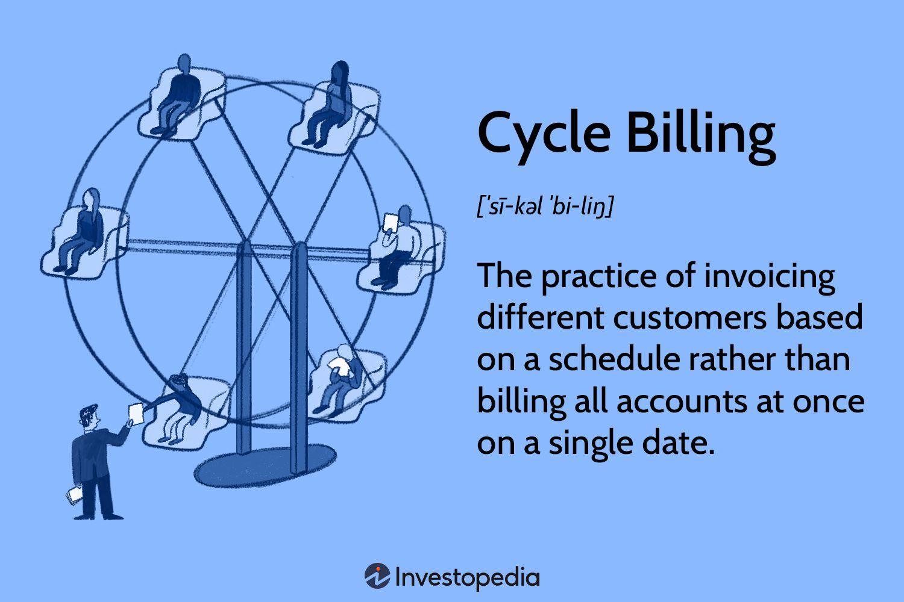

## Table of Contents

## What is cycle billing?

Cycle billing is a way that companies, like credit card companies or utility providers, send out bills to their customers. Instead of sending all bills at the same time, they divide their customers into different groups. Each group gets their bill on a different day of the month. This helps spread out the work of making and sending bills, so the company doesn't get too busy all at once.

This method is helpful for both the company and the customers. For the company, it makes the billing process smoother and more manageable. They can handle billing tasks more evenly throughout the month. For customers, it means they don't all have to pay their bills at the same time. This can help with managing money, as people can plan when they need to pay their bills.

## How does cycle billing work?

Cycle billing works by dividing all the customers of a company into different groups. Each group gets their bill on a different day of the month. For example, if a company has four groups, one group might get their bill on the 1st, another on the 8th, another on the 15th, and the last one on the 22nd. This way, the company doesn't have to send out all the bills at once, which can be a lot of work.

This method helps the company manage its workload better. Instead of having to process all the bills on one day, they can do it a little bit at a time throughout the month. It also helps the customers because they don't all have to pay their bills at the same time. This can make it easier for people to plan their finances, knowing exactly when their bill will come each month.

## What are the benefits of cycle billing for businesses?

Cycle billing helps businesses by spreading out the work of making and sending bills. Instead of having to do everything at once, they can do a little bit each day. This makes the job easier and less stressful for the people who work on billing. It also means that the business can handle any problems or questions from customers more easily, because they are not all coming at the same time.

Another benefit is that it can help businesses save money. When they spread out the billing, they don't need as many people working at the same time. This can lower the costs of running the billing department. Plus, it can make the business run more smoothly, because they are not overwhelmed with work all at once. This can lead to happier customers and a better reputation for the business.

## Can cycle billing help with cash flow management?

Cycle billing can help businesses manage their cash flow better. When businesses send out bills at different times throughout the month, they get money coming in more evenly. This means they don't have to wait for all the money to come in at the end of the month. Instead, they get some money every week or so, which can help them pay their own bills and keep their business running smoothly.

For customers, cycle billing can also help with managing their own money. If everyone got their bill at the same time, it could be hard to pay them all at once. But with cycle billing, people know when their bill is coming and can plan their money around that. This can make it easier for them to pay their bills on time and not have to worry about a big pile of bills all at once.

## What are the potential drawbacks of cycle billing?

Cycle billing can be a bit confusing for customers. They might forget when their bill is coming because it's not on the same day as everyone else's. This can make it hard for them to remember to pay on time. Also, if a customer wants to change their billing date, it might be tricky because the company has already set up the cycle.

Another problem is that it might take longer for the company to see if there are any issues with the billing system. Since the bills are spread out, any problems might not show up until later in the month. This could mean that some customers might get the wrong bill and not find out until it's too late to fix it easily.

## How does cycle billing affect customer satisfaction?

Cycle billing can affect customer satisfaction in different ways. On one hand, it can make things easier for customers. They don't have to pay all their bills at the same time, which can help them plan their money better. Knowing when their bill is coming each month can make it easier to pay on time and avoid late fees. This can make customers feel more in control of their finances and happier with the company.

On the other hand, cycle billing can also cause some problems. Some customers might find it confusing to remember when their bill is due, especially if it's different from when their friends or family get their bills. If they forget, they might miss a payment and get charged a late fee, which can make them unhappy. Also, if there's a mistake with the billing, it might take longer to fix because the bills are spread out over the month. This could lead to frustration and lower satisfaction with the company.

## What industries benefit most from cycle billing?

Cycle billing is really helpful for the credit card industry. They have a lot of customers and sending out all the bills at once would be too much work. By spreading out the billing, they can manage their work better and make sure they are not too busy at one time. This also helps their customers because they don't all have to pay at the same time, which can make it easier to manage money.

Utility companies like electricity and water also benefit a lot from cycle billing. These companies have to send out bills to a lot of people every month. If they did it all at once, it would be a big job. Cycle billing helps them spread out the work and make sure they can handle any problems that come up. It also helps their customers plan when they need to pay their bills, which can make things easier for them.

## How can a company implement cycle billing?

A company can start using cycle billing by first figuring out how many groups they want to divide their customers into. They might choose four groups, so each group gets a bill once a week. After deciding on the number of groups, the company needs to sort their customers into these groups. They can do this by using the last digit of the customer's account number or by some other fair way. Once the groups are set, the company can start sending out bills on different days of the month to each group.

To make sure cycle billing works well, the company needs to set up a good system for keeping track of which group each customer is in. They can use a computer program to help with this. The company also needs to let their customers know about the new billing schedule. They can send out a letter or an email to explain when each customer will get their bill. This way, customers can plan their money better and know when to expect their bill each month.

## What are the best practices for managing cycle billing?

To manage cycle billing well, a company should first make sure they have a good system for sorting customers into groups. They can use the last digit of the customer's account number or another fair way to do this. It's important to keep track of which group each customer is in, so a computer program can help with this. The company should also make sure their billing system works smoothly and can handle sending out bills on different days of the month.

Another important thing is to communicate clearly with customers about the new billing schedule. The company should send out a letter or an email to let customers know when they will get their bill each month. This helps customers plan their money better and makes sure they don't miss any payments. The company should also be ready to answer any questions or fix any problems that come up with the new billing system.

Lastly, the company should keep an eye on how cycle billing is working and make changes if needed. They should check if customers are happy with the new system and if it's helping the company manage its workload better. If there are any issues, the company should be quick to fix them and keep improving their billing process.

## How does cycle billing integrate with accounting software?

Cycle billing can work well with accounting software. The software can be set up to send out bills on different days of the month to different groups of customers. This means the company doesn't have to do everything by hand. The accounting software can keep track of which group each customer is in and make sure the bills go out on the right day. This makes the billing process easier and less work for the company.

The accounting software can also help the company keep track of when money comes in from customers. Since cycle billing spreads out the payments, the software can show the company how much money is coming in each week. This helps the company plan better and make sure they have enough money to pay their own bills. Using accounting software with cycle billing can make things smoother for both the company and their customers.

## What are the legal and compliance considerations with cycle billing?

When a company uses cycle billing, they need to make sure they are following the law. This means they have to be clear and honest with their customers about when bills will be sent out. They also need to follow rules about how long customers have to pay their bills. If the company doesn't do this right, they could get in trouble with the law or upset their customers.

Another thing to think about is making sure the billing system is fair for everyone. The company should not treat some customers differently from others just because of the billing cycle. They also need to keep good records of all their bills and payments. This helps them show they are following the rules if anyone asks. By doing these things, the company can use cycle billing without breaking any laws or making customers unhappy.

## How can data analytics improve the effectiveness of cycle billing?

Data analytics can help make cycle billing work better by looking at when customers pay their bills. By studying this information, a company can see if some billing dates work better than others. They might find out that customers pay faster if their bill comes at the beginning of the month instead of the end. This can help the company choose the best days to send out bills, so they get their money faster and customers are happier.

Also, data analytics can help the company see if there are any problems with their billing system. If some customers are always late with their payments, the company can look at the data to find out why. Maybe those customers are getting their bills at a bad time, or maybe there's a mistake in the billing. By fixing these problems, the company can make sure more customers pay on time and everyone is happy with the billing system.

## References & Further Reading

[1]: Bergstra, J., Bardenet, R., Bengio, Y., & Kégl, B. (2011). ["Algorithms for Hyper-Parameter Optimization"](https://dl.acm.org/doi/10.5555/2986459.2986743). Advances in Neural Information Processing Systems 24.

[2]: ["Advances in Financial Machine Learning"](https://www.amazon.com/Advances-Financial-Machine-Learning-Marcos/dp/1119482089) by Marcos Lopez de Prado

[3]: Clements, R. (2019). ["Principles of Utility Billing and Collections"](https://ethics.community/materials/on-the-principle-of-utility/). Utility Billing Solutions.

[4]: ["Machine Learning for Algorithmic Trading"](https://github.com/stefan-jansen/machine-learning-for-trading) by Stefan Jansen

[5]: ["Quantitative Trading: How to Build Your Own Algorithmic Trading Business"](https://www.amazon.com/Quantitative-Trading-Build-Algorithmic-Business/dp/1119800064) by Ernest P. Chan

[6]: Sihna, S. (2020). ["Blockchain Applications in Billing Systems"](https://www.sciencedirect.com/science/article/pii/S0736585318306324). Apress.