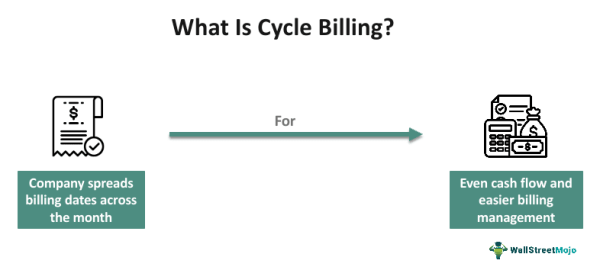

Billing systems are integral to the financial infrastructure of businesses, acting as the backbone for managing revenue, customer relationships, and operational efficiency. They help ensure that transactions are accurately recorded, tracked, and accounted for, which is essential for maintaining financial health and ensuring compliance with legal and regulatory standards. The core function of a billing system is to generate invoices for services or products provided, thereby initiating the process of revenue collection. This highlights their pivotal role in the broader context of business finance.

In financial operations, billing cycles are a critical component. They refer to the periodic intervals at which charges are calculated and presented to customers. These cycles, commonly monthly or quarterly, are fundamental for scheduling payments and managing incoming cash flows. Billing cycles not only affect how businesses plan and forecast their financial needs but also influence customer payment behavior, which can impact a company’s liquidity and budget planning.

Algorithmic trading, which involves using computers to execute a large number of orders at extremely fast speeds, increasingly relies on the accuracy and efficiency offered by modern billing systems. Billing information can influence trading strategies by impacting the financial metrics that algorithms consider when making decisions. For instance, data on cash flow, outstanding balances, or receivables could prompt alterations in algorithmic models to address liquidity risks or to optimize financial outcomes.

The integration of billing systems within the finance cycle is crucial for seamless financial operations. Billing data must synchronously interact with other financial systems, such as accounting, inventory management, and customer relationship management (CRM) systems. This interaction ensures that financial data remains consistent, enabling businesses to make informed decisions based on real-time financial insights. Furthermore, integrated billing systems enhance the accuracy of financial reporting and analysis, which supports more effective planning and strategy formulation.

The purpose of this article is to examine the various facets through which billing systems influence financial and trading strategies. By analyzing the role of billing systems, particularly in the context of algorithmic trading and financial management, we aim to uncover their significance in optimizing finance operations and trading methodologies. This exploration will offer insights into how businesses can leverage advanced billing technologies to enhance their financial performance and strategic competitiveness.

## Table of Contents

## Understanding Billing Systems

A billing system is a comprehensive framework designed to manage and process billing transactions. It serves as a critical tool for businesses to capture, organize, and manage payment information, allowing for accurate and timely invoicing. Key components of a billing system include invoice generation, payment processing, account management, and reporting systems. These elements work in tandem to ensure seamless financial operations by automating the invoicing process, maintaining customer accounts, and generating financial reports.

Billing systems are employed across various industries, each with unique requirements and billing strategies. Some common types include utility billing systems, subscription billing systems, telecommunications billing systems, and healthcare billing systems. Utility billing systems handle the billing of water, gas, and electricity usage, whereas subscription billing systems are used by companies offering services on a recurring basis, such as streaming platforms or software services. Telecommunications billing systems manage complex data related to phone and internet usage, and healthcare billing systems deal with patient billing and insurance claims.

Billing systems are indispensable for effective financial management in businesses. They automate the billing process, reduce errors, and ensure compliance with financial regulations. Additionally, they provide businesses with valuable insights into cash flow by tracking income and expenditures, thus enabling them to make informed financial decisions. By organizing billing data efficiently, these systems enhance operational efficiency and customer satisfaction through accurate and timely invoicing.

Prepaid and postpaid billing represent two fundamental billing methodologies. Prepaid billing requires customers to pay for services or products in advance, thus providing businesses with immediate cash flow and minimizing credit risk. Conversely, postpaid billing allows customers to use services before payment, offering greater flexibility but also introducing the risk of delayed payments. Businesses must carefully choose between these two models based on their financial strategies and customer preferences.

The concept of the billing cycle is crucial in scheduling payments and managing cash flow. A billing cycle is a recurring time frame in which billing transactions are compiled, invoices are generated, and payments are collected. Effective management of billing cycles ensures that businesses maintain a steady cash flow by aligning their income streams with financial obligations. This cycle typically includes periods for service delivery, invoice preparation, and payment collection, providing a structured timeline for financial transactions. By aligning billing cycles with operational needs, businesses can optimize revenue collection and improve financial stability.

## Cycle Billing: A Key Component in Financial Management

Cycle billing is a systematic approach to managing customer billing processes by distributing the generation of invoices over various periods, such as weekly or monthly cycles. This approach is designed to streamline administrative workload and optimize cash flow, ensuring a more uniform distribution of billing tasks throughout the month. By breaking invoices into cycles, businesses can manage and predict their financial inputs and outputs more effectively.

**Advantages of Cycle Billing**

One of the primary benefits of cycle billing is its capacity to balance workload management. Instead of processing all invoices at the end of the month, which could overwhelm the billing department and delay payment processing, companies spread this effort across the cycle. This method also aids in monitoring cash flow by providing a steady influx of payments rather than intermittent spikes and troughs, thereby facilitating more accurate financial forecasting.

**Common Strategies in Cycle Billing**

A typical strategy in cycle billing involves sorting accounts by the largest amounts owed and prioritizing those for earlier billing within the cycle. This approach ensures that substantial revenue streams are secured early, enhancing [liquidity](/wiki/liquidity-risk-premium) and financial stability. Other strategies might include billing customers based on their geographical location or service type to streamline distribution logistics and customer service responses.

**Industries Utilizing Cycle Billing**

Industries with recurring billing needs, such as utilities, telecommunications, and subscription-based services, predominantly employ cycle billing. These sectors benefit significantly from the methodical and predictable cash flow that cycle billing ensures. Additionally, real estate management and insurance brokers utilize cycle billing to manage regular rent or premium collections, ensuring smooth operational cash handling.

**Challenges and Special Considerations**

Implementing cycle billing is not devoid of challenges. It requires robust billing software capable of managing numerous billing cycles while maintaining data accuracy and customer confidentiality. Companies must also consider the need for adjustments to billing cycles to accommodate holidays, weekends, and varying customer preferences, which can complicate operations. Furthermore, careful communication with customers about billing dates and expectations is crucial to avoid confusion and disputes.

Cycle billing remains a fundamental component of financial management for many businesses, contributing to improved cash flow, more manageable workload distribution, and enhanced operational efficiency. However, successful implementation requires thoughtful planning and the right technological infrastructure to overcome the potential hurdles.

## The Intersection of Billing and Algorithmic Trading

Algorithmic trading, commonly known as algo trading, involves the use of computer programs to execute trading orders at rapid speeds and with specific conditions set by the trader. This form of trading is heavily reliant on data accuracy, as algorithmic systems are driven by precise inputs to determine buying or selling actions. Any discrepancies in data can significantly impact trading outcomes, leading to potential financial losses.

Accurate billing data is crucial for these algorithms, particularly when trading decisions are based on financial reports, subscription revenues, or recurring payments. Ensuring a seamless integration between billing systems and trading algorithms is essential. This connection allows traders to leverage comprehensive financial insights, enhancing decision-making processes. For instance, if a billing system inaccurately reports revenue data, it could mislead an algorithm into executing unfavorable trades or failing to capitalize on profitable ones.

Billing data can directly impact trading decisions, particularly for companies involved in subscription-based models or those requiring close monitoring of accounts receivable. If a business recognizes an uptick in revenue from its billing system, it might prompt algorithms to invest more aggressively in related assets. Conversely, a decline could trigger a more cautious approach. Moreover, cash flow forecasts derived from accurate billing information can inform liquidity management strategies, influencing trading volumes and frequency.

One potential risk in the integration of billing with trading systems is the latency in data transmission. Delays in updating billing records can result in lagged responses in trading environments, causing missed opportunities or delayed risk management interventions. To mitigate this, systems must be optimized for real-time updates. Implementing robust APIs and employing [machine learning](/wiki/machine-learning) models that can predict and adjust for timing discrepancies is one effective solution. 

Furthermore, hackers targeting financial data pose a serious threat to billing and trading linkages. Blockchain technology offers a potential solution, enhancing security through a decentralized ledger system that ensures data integrity. 

Looking ahead, the convergence of financial technology and billing systems is likely to intensify. As AI and machine learning continue to evolve, these technologies can be harnessed to create adaptive billing algorithms that autonomously align with trading strategies. This innovation could lead to personalized financial solutions that optimize both billing cycles and trading performances, tailored to market conditions and individual business needs.

## Advantages and Disadvantages of Modern Billing Systems

Modern billing systems have transformed financial operations, offering both benefits and drawbacks that have consequential impacts on businesses and their strategies. The immediate advantages include increased efficiency, improved cash flow management, and enhanced customer experience.

### Benefits

1. **Increased Efficiency**: Automating billing processes reduces the time and effort required for manual entry and minimizes errors. This automation allows for rapid invoice generation and processing, leading to quicker revenue recognition. Workflow automation tools further streamline billing systems by integrating them with other financial processes. For example, using APIs to connect billing systems with accounting software can update financial records automatically.

2. **Better Cash Flow Management**: Modern billing systems offer real-time visibility into outstanding invoices and customer payments, aiding businesses in managing their cash flow more effectively. This capability allows companies to identify overdue invoices promptly and improve their collection processes. Predictive analytics can further enhance cash flow forecasting by analyzing historical billing data to predict future revenue streams.

3. **Enhanced Customer Experience**: Personalization options like customized invoicing and flexible payment terms cater to diverse customer needs, thereby enhancing satisfaction and loyalty. Systems equipped with user-friendly interfaces and secure payment gateways improve the overall billing process, contributing to a positive customer experience.

### Drawbacks

1. **Data Accuracy Issues**: Despite advancements, inaccuracies in data entry or system configurations can lead to billing errors, potentially damaging customer trust and incurring financial discrepancies. Ensuring data integrity and regular auditing of billing systems are crucial to mitigating these risks.

2. **System Failures**: Reliance on technology opens billing systems to the risk of downtime or cyber-attacks, which can disrupt operations and lead to revenue loss. Implementing robust cybersecurity measures and building redundant systems to ensure continuity are essential strategies to counteract these vulnerabilities.

3. **Customer Confusion**: The complexity of modern billing options might overwhelm customers, causing confusion and dissatisfaction. Clear communication and providing educational resources about billing system features and functionalities can help alleviate this challenge.

### Case Studies

A notable case study is that of Netflix, which utilizes a sophisticated billing system to manage its global customer base. Netflix's system supports multiple payment options and subscription models, enabling it to scale efficiently across different markets. This flexibility has been pivotal in supporting its rapid growth and maintaining cash flow. [Source: Netflix Financials (2022)]

### Cost-Benefit Analysis

While the initial investment in modern billing technologies can be substantial, the long-term benefits often justify the costs. These systems can decrease administrative expenses, reduce errors, and improve collected revenues. It is crucial for businesses to consider both direct and indirect cost savings when evaluating these systems.

### Impact on the Financial Landscape

Evolving billing systems continuously reshape the financial landscape by driving automation and integration with other financial technologies. As businesses shift towards digital financial ecosystems, billing system innovations are likely to be at the forefront, further enhancing operational efficiencies and customer experiences. The adaptability of billing systems to emerging financial technologies such as blockchain and [artificial intelligence](/wiki/ai-artificial-intelligence) also indicates a future where transactions could become more secure, transparent, and personalized.

## Innovations in Billing Systems and Their Future

Smart billing systems, driven by advances in artificial intelligence (AI) and machine learning, are transforming traditional billing processes. These technologies enhance data analysis, automate bill generation, and customize billing experiences. AI's ability to analyze large datasets allows businesses to detect anomalies and predict customer payment behavior, thereby reducing late payments and improving cash flow management. Machine learning algorithms facilitate the automatic classification and categorization of billing data, optimizing invoice accuracy and accelerating the billing cycle.

Blockchain technology introduces a new era of security and transparency in billing systems. By creating immutable records of transactions, blockchain reduces fraud and discrepancies, ensuring trust between businesses and clients. Each block in the chain offers a transparent and decentralized ledger of billing transactions, which can be accessed by involved stakeholders while maintaining data integrity. This transformation leads to cost efficiencies in record-keeping and audit processes.

The personalization of billing cycles is another significant innovation, placing customer needs at the forefront. Businesses can now tailor billing schedules to align with customer income patterns and preferences. Personalized billing improves customer satisfaction and loyalty, as clients feel valued and understood. For instance, utility companies might offer plans where billing aligns with consumption patterns, providing a more user-friendly experience.

Flexible billing arrangements are emerging in response to the growing demand for adaptable financial solutions. Subscription-based models, pay-as-you-go plans, and incentives for early payments illustrate the versatility now embedded in billing systems. These flexible arrangements enable businesses to attract a broader customer base and maintain competitive advantages by addressing diverse fiscal requirements and preferences.

As the landscape of billing technology evolves, several predictions can be made. The integration of Internet of Things (IoT) devices with billing systems will automate consumption-based billing in sectors like utilities and telecommunication. Similarly, the increasing emphasis on sustainability might drive the development of eco-friendly billing practices, such as digital-only invoices and paperless billing systems. Additionally, advancements in AI will likely enhance predictive analytics capabilities, enabling businesses to forecast financial trends more accurately and customize offerings accordingly.

In conclusion, the innovations in billing systems, fueled by AI, blockchain, and personalization, are reshaping the financial operations of businesses. As technology continues to advance, the future of billing will likely involve further integration of intelligent systems and increased adaptability to meet the dynamic needs of consumers and industries alike.

## Conclusion

Billing systems play a critical role in shaping the financial landscape of modern businesses, acting as vital tools for managing cash flow, scheduling payments, and enhancing customer experience. They help streamline operations and ensure timely financial transactions, which are crucial for maintaining business health. The integration of these systems with emerging technologies such as [algorithmic trading](/wiki/algorithmic-trading) underscores their importance. Ensuring data accuracy and seamless integration between billing systems and trading algorithms is vital for informed decision-making and optimal trading outcomes.

Businesses need to continually adapt to advances in billing technology to capitalize on the increased efficiency and improved financial management that these systems offer. This adaptation is essential not only for the basic operation of businesses but also offers competitive advantages through enhanced customer interactions and satisfaction.

Modern billing systems, while offering numerous advantages, also come with drawbacks, such as potential issues with data accuracy and system failures. Nevertheless, the cost-benefit analysis typically leans towards positive outcomes, particularly with the integration of artificial intelligence and machine learning, which enhances billing systems further through automation and personalization.

Encouraging further exploration into advanced billing technologies can open up new possibilities for businesses seeking to improve financial performance. As innovations such as blockchain and AI continue to evolve, there remains a promising future for businesses willing to invest in and adapt to these advancements. Continuous exploration and adaptation of these technologies will help businesses not only to maintain competitiveness but to thrive in the ever-evolving financial environment.

## References & Further Reading

[1]: Bergstra, J., Bardenet, R., Bengio, Y., & Kégl, B. (2011). ["Algorithms for Hyper-Parameter Optimization"](https://dl.acm.org/doi/10.5555/2986459.2986743). Advances in Neural Information Processing Systems 24.

[2]: ["Advances in Financial Machine Learning"](https://www.amazon.com/Advances-Financial-Machine-Learning-Marcos/dp/1119482089) by Marcos Lopez de Prado

[3]: Clements, R. (2019). ["Principles of Utility Billing and Collections"](https://ethics.community/materials/on-the-principle-of-utility/). Utility Billing Solutions.

[4]: ["Machine Learning for Algorithmic Trading"](https://github.com/stefan-jansen/machine-learning-for-trading) by Stefan Jansen

[5]: ["Quantitative Trading: How to Build Your Own Algorithmic Trading Business"](https://www.amazon.com/Quantitative-Trading-Build-Algorithmic-Business/dp/1119800064) by Ernest P. Chan

[6]: Sihna, S. (2020). ["Blockchain Applications in Billing Systems"](https://www.sciencedirect.com/science/article/pii/S0736585318306324). Apress.