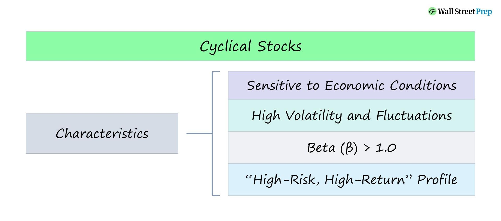

Cyclical industries play a crucial role in comprehending the fluctuations within economic cycles and their subsequent impacts on various market segments. These industries, which include automotive, construction, and consumer discretionary sectors, demonstrate pronounced patterns of growth and contraction aligned with the broader economic environment. As such, understanding their dynamics is essential for investors and business leaders aiming to make informed decisions.

This article seeks to thoroughly examine cyclical industries, the stages of economic cycles, and the strategic contributions of algorithmic trading. By focusing on the symbiotic relationships between cyclical and countercyclical industries, we aim to offer detailed insights into how different sectors respond to economic signals. For instance, while cyclical industries may thrive during economic expansions, countercyclical industries, such as utilities and healthcare, often provide stability during downturns.



Moreover, the article will highlight the strategic advantages provided by algorithmic trading. Leveraging data-driven insights, algorithmic trading allows for more accurate assessments of GDP growth, interest rates, and other economic indicators, thereby optimizing trading strategies across different economic phases. This capability is particularly vital in adjusting investment approaches to align with expansionary or contractionary periods. 

By the conclusion, readers will be equipped with a comprehensive understanding of how to navigate economic cycles effectively, maximizing opportunities while mitigating the inherent risks associated with volatility. The integration of algorithmic trading techniques further enhances this capability, offering a tactical edge in decision-making processes.

## Table of Contents

## Understanding Cyclical Industries

Cyclical industries are fundamentally characterized by their susceptibility to economic fluctuations, experiencing periods of growth and decline in tandem with the broader business cycle. This intrinsic link to the economic environment dictates that their revenue streams fluctuate significantly based on prevailing conditions.

During periods of economic expansion, cyclical industries typically witness robust growth. This growth is driven by increased consumer confidence, heightened levels of disposable income, and greater business investment. As individuals and companies alike become more willing to spend and invest, sectors that are sensitive to economic conditions, such as automotive, construction, and consumer discretionary industries, often see substantial upticks in activity and revenue.

Conversely, during economic downturns or recessions, these same industries often experience a significant decline. The drop in consumer spending, coupled with reduced business investment, typically leads to decreased demand for goods and services within these sectors. This can result in revenue contractions, necessitating that companies operating within cyclical industries remain agile and responsive to changing economic signals.

For instance, the automotive sector generally experiences increased sales during times of economic prosperity when consumers are more likely to purchase new vehicles. However, in a recession, sales tend to fall as consumers defer major purchases. Similarly, the construction industry thrives when there is economic growth spurred by increased investment in infrastructure and housing projects, whereas it slows considerably during periods of economic contraction.

Consumer discretionary industries, which include products and services considered non-essential, such as luxury goods, electronics, and leisure services, also display cyclicality. Their fortunes rise and fall with consumer spending patterns, thriving in buoyant markets but suffering when economic anxiety prompts consumers to tighten their belts.

To navigate these oscillations, companies in cyclical industries must adopt strategies that enhance their resilience and flexibility. This may involve diversifying product lines, optimizing operational efficiencies, and leveraging market intelligence to anticipate economic shifts. By fostering agility and preparedness, these companies can better align their operations with economic cycles, capitalizing on upward trends while mitigating the impact of downturns.

## Stages of Economic Cycles

Economic cycles are characterized by distinct phases: expansion, peak, contraction, and trough. Each phase represents a different state of economic activity and has varying implications for output, employment, and consumer behavior.

During the **expansion** phase, there is a noticeable upturn in economic indicators such as Gross Domestic Product (GDP) and employment levels. This phase is typically driven by increased consumer confidence, leading to heightened spending and investment. Economic policies may favor low interest rates to stimulate borrowing and investment. As a result, businesses expand operations, capital spending rises, and job creation accelerates.

As economic growth continues, the cycle reaches its **peak**. At this stage, the economy operates near its full capacity, and production levels are at their maximum. However, this intense activity can lead to overheating, manifesting as inflationary pressures. Inflation may occur because demand surpasses the economy's capacity to supply goods and services, pushing prices upward. Central banks might consider implementing monetary policies such as increasing interest rates to curb inflation and stabilize the economy.

Subsequently, the economy enters the **contraction** phase. Economic activities start to decline, marked by decreased GDP and rising unemployment. Business investments tend to slow down, consumer spending diminishes, and inventories build up due to waning demand. This phase can often lead to a recession if the downturn becomes pronounced, lasting for an extended period. Policymakers may intervene through fiscal stimuli or monetary easing to reverse the downward trend.

Finally, the cycle reaches the **trough**, which is the lowest point of economic activity. During this phase, economic conditions stabilize and set the stage for recovery. Opportunities abound for investment as asset prices are generally lower, and signs of economic resurgence begin to emerge. The rebalancing of supply and demand leads businesses to explore new growth areas. As confidence rebuilds, the groundwork is laid for the economy to transition back into the expansion phase, thus completing the cycle.

Understanding these stages is crucial for businesses and investors, enabling them to anticipate changes in the economic environment and make informed strategic decisions.

## Examples of Cyclical Industries

Cyclical industries are characterized by their sensitivity to the macroeconomic environment, experiencing fluctuations in performance that mirror the broader economic cycles. Among these, the automotive industry stands out as a prime example of cyclicality. During periods of economic growth, consumer confidence typically rises, leading to increased spending on high-ticket items such as vehicles. Consequently, automotive sales tend to soar when economies are expanding. However, during economic downturns, consumers often delay purchasing new vehicles, leading to a decline in sales and profitability for automotive companies. This cyclical nature necessitates strategic planning and flexibility from companies operating within the automotive sector.

Similarly, the construction industry exhibits pronounced cyclicality. Economic expansions generally stimulate increased investment in infrastructure and real estate development, leading to a surge in construction activity. As interest in residential and commercial projects grows, companies in the construction sector often experience robust growth in revenue and employment. Conversely, during economic contractions, reduced spending and tighter credit conditions can result in a slowdown in construction projects, adversely affecting companies and workers in the industry.

Another sector sensitive to economic cycles is consumer durables, including electronics and home appliances. These goods are often considered non-essential purchases, leading consumers to prioritize them less during economic uncertainty. In times of economic prosperity, increased disposable income and consumer confidence contribute to higher sales of durable goods, while economic anxiety and decreased disposable income during downturns suppress demand.

In summary, industries such as automotive, construction, and consumer durables are quintessential examples of cyclical industries. Their performance intimately ties with economic cycles, underscoring the importance for companies and investors to monitor economic indicators and trends closely.

## Countercyclical Industries

Countercyclical industries have unique operational characteristics that enable them to outperform in times of economic distress. Unlike cyclical industries that thrive during growth periods but struggle in downturns, countercyclical industries can provide consistent performance regardless of economic conditions. This stability is primarily due to the indispensable nature of the goods and services they offer, which tend to remain in demand even when consumer spending decreases.

Utilities and healthcare are prime examples of countercyclical industries. The utilities sector encompasses companies that provide essential services such as electricity, water, and gas. These services are crucial in everyday life, irrespective of economic conditions, ensuring a steady cash flow for utility providers and a consistent dividend yield for investors. As people continue to require heating, lighting, and water, utility companies can maintain stable earnings and dividends, making them attractive to investors prioritizing safety and reliability.

Healthcare is another quintessential countercyclical industry. This sector includes pharmaceuticals, biotechnology, and medical services, all crucial for maintaining public health. Demand for healthcare services tends to remain stable or even increase during economic downturns, as healthcare is often considered non-discretionary spending. In fact, during economic stress, there may be an increased demand for certain healthcare services, such as mental health support and preventive care, which can bolster industry performance.

Investors often gravitate towards these industries during economic downturns as they seek a hedge against the broader market's [volatility](/wiki/volatility-trading-strategies). The consistent cash flow and lower sensitivity to economic cycles associated with countercyclical industries provide a buffer, preserving capital and potentially offering modest returns when cyclically-dependent sectors falter. As a strategic component of a diversified investment portfolio, countercyclical industries offer a balance of risk and stability, proving vital in turbulent economic environments.

## The Role of Algorithmic Trading in Economic Cycles

Algorithmic trading utilizes complex algorithms to process economic indicators, facilitating strategic decision-making across various phases of economic cycles. During expansions, characterized by rising GDP and consumer spending, algorithms might pivot towards growth sectors, such as technology or consumer discretionary, anticipating higher returns in these areas. In contrast, during contractions, marked by economic slowdown and increasing unemployment, algorithms often shift focus to defensive stocks, including utilities and healthcare, which tend to maintain stable performance regardless of economic downturns.

The algorithms' effectiveness hinges on their ability to rapidly analyze and interpret a range of economic variables. Key indicators include GDP growth, which reflects the overall economic health; interest rates, influencing borrowing costs and consumer spending; and inflation rates, impacting purchasing power. By systematically evaluating these factors, algorithms can dynamically adjust trading strategies to align with the current economic environment.

For example, consider an algorithm programmed to optimize stock selection based on economic conditions. In Python, such an algorithm might employ libraries like NumPy for numerical computations and Pandas for data handling. Here's a conceptual snippet:

```python
import numpy as np
import pandas as pd

# Hypothetical economic data
economic_data = {
    'GDP_growth': [3.5, 2.1, -1.2, -3.4],
    'interest_rate': [1.5, 2.0, 3.0, 2.5],
    'inflation_rate': [2.0, 1.8, 0.5, -0.3]
}

df = pd.DataFrame(economic_data)

# Simple strategy to prioritize sectors
def choose_sector(row):
    if row['GDP_growth'] > 2:
        return 'Growth Sector'
    elif row['GDP_growth'] < -2:
        return 'Defensive Stocks'
    else:
        return 'Balanced Strategy'

df['Strategy'] = df.apply(choose_sector, axis=1)

print(df)
```

This basic demonstration highlights how algorithms can translate economic indicators into actionable investment strategies. As such, [algorithmic trading](/wiki/algorithmic-trading) represents a critical tool for navigating the complexities of economic cycles, offering the potential for enhanced returns and risk management through precision and adaptability.

## Investment Strategies for Cyclical Industries

Investing in cyclical industries requires a careful approach, as these sectors are inherently linked to the fluctuations of economic cycles. Success in this domain often hinges on precise timing guided by an understanding of the current phase of the economic cycle—expansion, peak, contraction, or trough. Identifying the right time to enter or [exit](/wiki/exit-strategy) these markets can lead to significant gains, while ill-timed investments may result in substantial losses.

Diversification is a vital strategy for navigating the volatile nature of cyclical industries. By spreading investments across multiple sectors or asset classes, investors can mitigate risks associated with economic downturns specific to certain industries. For example, balancing investments in both cyclical industries, such as automotive or construction, and stable sectors, like healthcare or utilities, can provide a buffer against potential downturns.

Value investing is another important strategy, particularly during economic downturns. This approach involves identifying undervalued stocks that have the potential to appreciate as the economy recovers. Investors look for companies with strong fundamentals but whose stock prices have been adversely affected by broader economic conditions rather than individual performance issues. As markets begin to recover from a trough, these investments can yield significant returns.

An example of a simplified Python code snippet to help identify undervalued stocks might look like this:

```python
import pandas as pd

# Assume data contains stock information with columns 'Company', 'MarketPrice', 'IntrinsicValue'
data = pd.read_csv('stocks.csv')

# Calculate Margin of Safety where MoS = ((Intrinsic Value - Market Price) / Intrinsic Value) * 100
data['MarginOfSafety'] = ((data['IntrinsicValue'] - data['MarketPrice']) / data['IntrinsicValue']) * 100

# Identify undervalued stocks with a Margin of Safety above 20%
undervalued_stocks = data[data['MarginOfSafety'] > 20]

print(undervalued_stocks)
```

This code helps filter stocks that are significantly undervalued, potentially offering a higher margin of safety and a better chance for returns as economic conditions improve.

In conclusion, successful investment in cyclical industries relies heavily on timing, diversification, and identifying undervalued opportunities during downturn phases. By integrating these strategies, investors can navigate the economic cycles more effectively, optimizing potential returns while minimizing risks.

## Conclusion and Final Thoughts

Understanding cyclical industries and economic cycles is essential for informed strategic investment and operational decisions. Cyclical industries, characterized by their sensitivity to economic conditions, require investors and businesses to be agile and forward-thinking. Recognizing the stages of economic cycles—expansion, peak, contraction, and trough—can help in crafting precise strategies that optimize opportunities and mitigate associated risks.

Preparedness for economic fluctuations involves anticipating shifts and adapting tactics accordingly. This foresight can allow stakeholders to capitalize on growth opportunities during expansions and safeguard interests during contractions. By being attuned to economic signals, businesses in cyclical industries can effectively navigate the inherent volatility, ensuring resilience and long-term success.

Algorithmic trading offers a powerful tool in navigating these dynamics. By harnessing data-driven insights, algorithms can analyze economic indicators such as GDP growth, inflation rates, and unemployment figures to make informed trading decisions across different economic phases. For instance, during economic expansions, algorithms might focus on growth-oriented sectors, while in contractions, they could pivot towards defensive stocks. The capacity to process vast amounts of data quickly allows these algorithms to optimize trading strategies, providing a strategic advantage.

For investors, adopting diversified investment strategies within cyclical industries can mitigate potential risks. Approaches such as value investing can be particularly beneficial during downturns, positioning investors to reap substantial returns as markets rebound. Overall, a nuanced understanding of cyclical industries and economic cycles, coupled with the strategic deployment of algorithmic trading, equips investors and businesses with the necessary tools to navigate economic complexities effectively.

## References & Further Reading

[1]: Bergstra, J., Bardenet, R., Bengio, Y., & Kégl, B. (2011). ["Algorithms for Hyper-Parameter Optimization."](https://dl.acm.org/doi/10.5555/2986459.2986743) Advances in Neural Information Processing Systems 24.

[2]: ["Advances in Financial Machine Learning"](https://www.amazon.com/Advances-Financial-Machine-Learning-Marcos/dp/1119482089) by Marcos Lopez de Prado

[3]: ["Evidence-Based Technical Analysis: Applying the Scientific Method and Statistical Inference to Trading Signals"](https://www.amazon.com/Evidence-Based-Technical-Analysis-Scientific-Statistical/dp/0470008741) by David Aronson

[4]: ["Machine Learning for Algorithmic Trading"](https://github.com/PacktPublishing/Machine-Learning-for-Algorithmic-Trading-Second-Edition) by Stefan Jansen

[5]: ["Quantitative Trading: How to Build Your Own Algorithmic Trading Business"](https://www.amazon.com/Quantitative-Trading-Build-Algorithmic-Business/dp/1119800064) by Ernest P. Chan