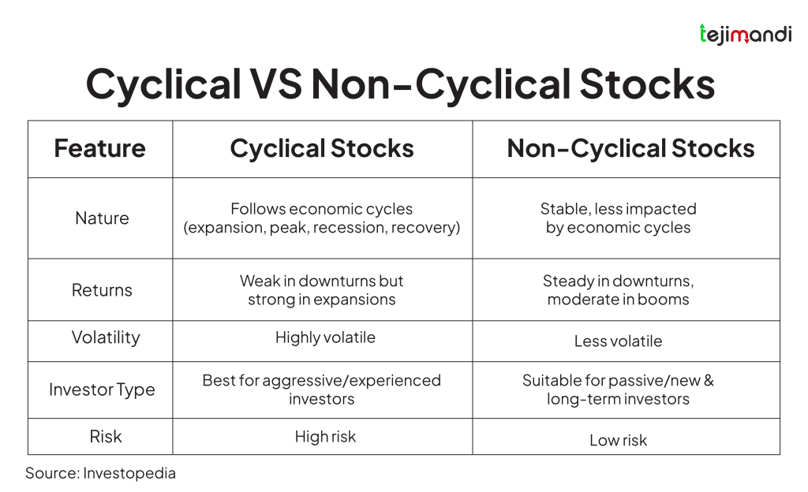

## Table of Contents

## What are stocks?

Stocks are small pieces of a company that people can buy. When you buy a stock, you own a tiny part of that company. Companies sell stocks to get money to grow their business. People buy stocks because they hope the company will do well and the stock price will go up. If the stock price goes up, people can sell their stocks for more money than they paid.

The price of a stock can change every day. It goes up when more people want to buy it, and it goes down when more people want to sell it. This can happen because of news about the company, the economy, or other reasons. Buying stocks can be risky because the price can go down and you might lose money. But it can also be a good way to make money if you choose the right stocks and hold onto them for a long time.

## What are cyclical stocks?

Cyclical stocks are stocks of companies that do well when the economy is growing but not so well when the economy is slowing down. These companies often sell things that people want but don't need, like cars, vacations, and fancy clothes. When people have more money, they buy more of these things, and the companies make more profit. But when times are tough, people cut back on these extras, and the companies' profits go down.

For example, car companies and hotels are often cyclical because people are more likely to buy new cars or go on trips when they feel financially secure. When the economy is strong, these companies' stocks go up because they are making more money. But when the economy weakens, fewer people buy cars or travel, so these companies' profits drop, and their stock prices fall. Investors who understand the economy's ups and downs can try to buy cyclical stocks when they are cheap and sell them when they go up.

## What are non-cyclical stocks?

Non-cyclical stocks are stocks of companies that make things people need no matter how the economy is doing. These are things like food, medicine, and utilities like electricity and water. People always need these things, so these companies usually make money even when the economy is bad. That's why non-cyclical stocks are also called defensive stocks, because they help protect your money during tough times.

For example, a company that makes toilet paper or a utility company that provides electricity will still sell their products even if people are not spending much money on other things. Their sales might not grow a lot when the economy is good, but they won't drop much when times are hard. Investors often buy non-cyclical stocks to have a stable part of their portfolio that can balance out the ups and downs of more risky investments.

## How do cyclical stocks perform during economic cycles?

Cyclical stocks go up and down with the economy. When the economy is doing well, people have more money to spend on things they want but don't need, like new cars or vacations. Companies that make these things, like car makers or hotels, make more money, and their stock prices go up. This is because more people are buying their products and services, so the companies are doing better.

But when the economy slows down, people start to save their money and spend less on extras. They might not buy a new car or go on a big trip. This means companies that sell these things don't make as much money, and their stock prices go down. So, if you own cyclical stocks, they can lose value during tough economic times. It's important to know when the economy is doing well or not so you can decide when to buy or sell these stocks.

## How do non-cyclical stocks perform during economic cycles?

Non-cyclical stocks are pretty steady no matter what the economy is doing. They are from companies that sell things people always need, like food, medicine, and electricity. When times are good, people still buy these things, and when times are bad, they still need them. So, these companies keep making money even if the economy is not doing well. That's why non-cyclical stocks are called defensive stocks – they help protect your money when other parts of the market might be going down.

During a strong economy, non-cyclical stocks might not grow as fast as cyclical stocks because people are spending more on extras. But they still do okay because everyone still needs to eat and use electricity. When the economy is weak, non-cyclical stocks can be a safe place to put your money. They don't go up and down as much as cyclical stocks, so they can help keep your investments more stable during tough times.

## Can you give examples of cyclical industries?

Cyclical industries are those that do well when the economy is growing and not so well when the economy slows down. Some examples are the car industry and the travel industry. When people feel good about their money, they buy new cars or go on trips. This means car companies and hotels make more money. But when the economy is not doing well, people don't buy new cars or take vacations as much. So, these companies don't make as much money, and their stocks can go down.

Another example is the luxury goods industry. This includes things like fancy clothes and jewelry. When the economy is strong, people have more money to spend on these nice things. But when times are tough, people cut back on buying luxury items, and companies that sell them don't do as well. So, their stocks go up and down with the economy too.

## Can you give examples of non-cyclical industries?

Non-cyclical industries are those that make things people always need, no matter what the economy is doing. Some examples are the food industry and the utilities industry. People always need to eat, so companies that make food, like grocery stores and food producers, keep selling their products even when times are tough. The same goes for utilities like electricity and water. People can't live without these services, so companies that provide them stay steady even if the economy is not doing well.

Another example is the healthcare industry. People need medicine and medical care no matter what is happening with the economy. So, companies that make medicine or run hospitals and clinics usually keep making money. These industries are called non-cyclical because they don't go up and down as much as others when the economy changes. They are a safe place to put your money if you want to keep it stable during tough times.

## What are the investment strategies for cyclical stocks?

When you want to invest in cyclical stocks, it's good to watch the economy closely. Buy these stocks when the economy is starting to get better. This is because people will have more money to spend on things they want but don't need, like new cars or vacations. Companies that make these things will start making more money, and their stock prices will go up. So, if you buy their stocks at the right time, you can make money when the economy is doing well.

But you also need to know when to sell these stocks. When you see signs that the economy might be slowing down, it's a good idea to sell your cyclical stocks. This is because people will start spending less on extras, and the companies' profits will go down. If you wait too long, you might lose money. So, the key to investing in cyclical stocks is to buy low when the economy is getting better and sell high before it gets worse.

## What are the investment strategies for non-cyclical stocks?

When you invest in non-cyclical stocks, you're looking for stability. These are stocks from companies that make things people always need, like food, medicine, and electricity. So, a good strategy is to buy these stocks and hold onto them for a long time. They won't go up as fast as some other stocks when the economy is doing well, but they won't drop as much when times are tough. This makes them a safe place to put your money if you want to keep it stable.

Another strategy is to use non-cyclical stocks to balance out your other investments. If you have some risky stocks that go up and down a lot, adding non-cyclical stocks can help even things out. When the risky stocks are losing value, the non-cyclical stocks might stay the same or even go up a little. This way, your overall investment doesn't lose as much money. So, non-cyclical stocks can be a good way to protect your money during tough economic times.

## How can investors identify cyclical and non-cyclical stocks?

Investors can identify cyclical stocks by looking at the kind of products or services a company offers. Cyclical stocks are from companies that sell things people want but don't need, like cars, vacations, and fancy clothes. These companies do well when the economy is growing because people have more money to spend on extras. To spot these stocks, you can look at economic reports and see if the company's profits go up and down with the economy. If a company's sales and profits change a lot with economic cycles, it's probably a cyclical stock.

Non-cyclical stocks are easier to spot because they come from companies that sell things people always need, no matter what the economy is doing. This includes food, medicine, and utilities like electricity and water. These companies keep making money even when the economy is bad because people can't stop buying these things. To find non-cyclical stocks, look for companies that have steady sales and profits over time, no matter what's happening with the economy. If a company's earnings don't change much with economic ups and downs, it's likely a non-cyclical stock.

## What are the risks associated with investing in cyclical stocks?

Investing in cyclical stocks can be risky because their prices go up and down a lot with the economy. When the economy is doing well, these stocks can make you a lot of money. But when the economy slows down, their prices can drop a lot. This means you could lose money if you buy them at the wrong time. It's hard to know exactly when the economy will go up or down, so it's easy to make a mistake and buy or sell at the wrong time.

Another risk is that even if you think you know when to buy and sell, something unexpected can happen. For example, a big company might have problems, or there could be a surprise in the economy that nobody saw coming. These surprises can make the stock price go down even if the economy is doing okay. So, even if you try to be careful, there's always a chance you could lose money with cyclical stocks.

## What are the risks associated with investing in non-cyclical stocks?

Investing in non-cyclical stocks is usually safer than investing in cyclical stocks, but there are still some risks. One risk is that these stocks might not grow as fast as other stocks when the economy is doing well. This means you might miss out on making more money if you put all your money in non-cyclical stocks. They can be a good way to keep your money safe, but they might not help you grow your money as much as you want.

Another risk is that even though non-cyclical stocks are usually stable, they can still go down if something bad happens to the company. For example, if a food company has a problem with its products or a utility company has a big accident, their stock price can drop. So, even though non-cyclical stocks are less likely to go up and down with the economy, they can still lose value if the company itself has problems.

## References & Further Reading

[1]: Bergstra, J., Bardenet, R., Bengio, Y., & Kégl, B. (2011). ["Algorithms for Hyper-Parameter Optimization."](https://dl.acm.org/doi/10.5555/2986459.2986743) Advances in Neural Information Processing Systems 24.

[2]: ["Advances in Financial Machine Learning"](https://www.amazon.com/Advances-Financial-Machine-Learning-Marcos/dp/1119482089) by Marcos Lopez de Prado

[3]: ["Evidence-Based Technical Analysis: Applying the Scientific Method and Statistical Inference to Trading Signals"](https://books.google.com/books/about/Evidence_Based_Technical_Analysis.html?id=MeoJAQAAMAAJ) by David Aronson

[4]: ["Machine Learning for Algorithmic Trading"](https://github.com/stefan-jansen/machine-learning-for-trading) by Stefan Jansen

[5]: ["Quantitative Trading: How to Build Your Own Algorithmic Trading Business"](https://github.com/LucindaYa/quant-resources/blob/master/Quantitative%20Trading%20How%20to%20Build%20Your%20Own%20Algorithmic%20Trading%20Business.pdf) by Ernest P. Chan