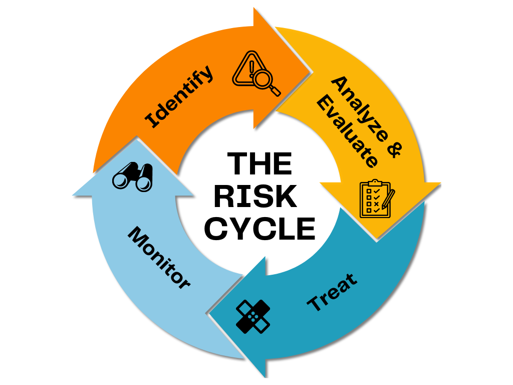

## Table of Contents

## What is cyclical risk?

Cyclical risk is the chance that an investment's value will go up and down because of changes in the economy. Things like interest rates, employment levels, and how much people are spending can affect how well a company does. For example, when the economy is doing well, people might buy more cars, so car companies do better. But when the economy is not doing well, people might not buy as many cars, and car companies might struggle.

Different industries feel cyclical risk in different ways. Some industries, like technology or healthcare, might not be as affected by economic ups and downs because people always need their products or services. On the other hand, industries like construction or tourism can be hit hard by economic downturns because people might delay building projects or cut back on travel when money is tight. Understanding cyclical risk can help investors make smarter choices about where to put their money.

## How does cyclical risk affect different industries?

Cyclical risk affects different industries in different ways. Some industries, like technology and healthcare, are less affected by economic ups and downs. People always need their products or services, no matter how the economy is doing. For example, people still need medicine and computers even during a recession. So, these industries tend to be more stable and less risky for investors.

On the other hand, industries like construction, tourism, and luxury goods can be hit hard by economic downturns. When the economy is not doing well, people might delay building projects, cut back on travel, or stop buying expensive items. This can lead to lower sales and profits for companies in these industries. For example, fewer people might go on vacations or buy new homes when money is tight, which can hurt hotels and real estate companies.

Understanding how cyclical risk affects different industries can help investors make better decisions. By knowing which industries are more or less sensitive to economic changes, investors can choose where to put their money to balance risk and reward. For instance, during good economic times, investing in cyclical industries like construction might be a good idea, while in tougher times, investing in more stable industries like healthcare might be safer.

## What are the main types of cyclical risk?

Cyclical risk can be broken down into different types that affect how well companies do based on the economy. One type is interest rate risk. When interest rates go up or down, it can change how much it costs for companies to borrow money. If rates go up, borrowing becomes more expensive, and companies might cut back on spending or projects. This can hurt their profits and stock prices. On the other hand, if rates go down, borrowing becomes cheaper, and companies might invest more, which can help their business grow.

Another type is demand risk. This happens when people change how much they buy based on the economy. When the economy is doing well, people have more money to spend, so they might buy more cars, houses, or go on vacations. This is good for companies in those industries. But when the economy slows down, people might spend less, and companies can see their sales drop. This can lead to lower profits and can be tough on businesses that rely on people spending money.

A third type is employment risk. This is about how many people have jobs and how much money they make. When unemployment is low and wages are high, people feel more confident about spending money. This can help businesses that sell things people want but don't need, like luxury goods. But if unemployment goes up and wages go down, people might be more careful with their money, which can hurt sales for many companies. Understanding these types of cyclical risk can help investors and businesses plan better for the future.

## Can you explain economic cycles and their impact on cyclical risk?

Economic cycles are the ups and downs that happen in the economy over time. They can last for a few years and go through different stages like growth, peak, downturn, and recovery. When the economy is growing, more people have jobs, and they spend more money. This is good for businesses because they sell more and make more profit. But when the economy reaches its peak and starts to slow down, businesses might see fewer sales, and they might have to cut jobs or lower prices. This is the downturn part of the cycle. Eventually, the economy starts to recover, and the cycle begins again.

These economic cycles have a big impact on cyclical risk. When the economy is growing, cyclical risk is lower because businesses are doing well. Companies in industries like construction, tourism, and luxury goods see more sales because people feel confident about spending money. But when the economy goes into a downturn, cyclical risk goes up. Businesses in those same industries might struggle because people cut back on spending. They might delay buying a new house or going on a vacation. This can lead to lower profits and even losses for companies. Understanding where we are in the economic cycle can help investors and businesses prepare for these changes and manage their risks better.

## How can investors identify cyclical risk in their portfolios?

Investors can identify cyclical risk in their portfolios by looking at the industries they are invested in. Some industries, like technology and healthcare, are less affected by economic ups and downs. These industries are more stable because people always need their products or services. On the other hand, industries like construction, tourism, and luxury goods can be more risky. These industries do well when the economy is growing but can struggle when the economy slows down. By understanding which industries their investments are in, investors can see how much cyclical risk they are taking on.

Another way to identify cyclical risk is by watching economic indicators. Things like unemployment rates, interest rates, and consumer spending can tell investors where the economy is in its cycle. When the economy is growing, these indicators are usually positive, which means lower cyclical risk. But when the economy is slowing down, these indicators can show problems, which means higher cyclical risk. By keeping an eye on these indicators, investors can make better decisions about when to buy or sell investments to manage their risk.

## What strategies can be used to mitigate cyclical risk?

One way to lower cyclical risk is by spreading out your investments. This means putting your money into different kinds of businesses and industries. If you invest in both stable industries like healthcare and more risky ones like construction, you can balance out the ups and downs. When the economy is not doing well, the stable industries might help protect your money. And when the economy is growing, the riskier industries can help you make more money. This way, you are not putting all your eggs in one basket.

Another strategy is to pay attention to economic cycles and change your investments based on where the economy is. If you think the economy is going to slow down, you might want to put more money into stable industries that are less affected by downturns. But if you think the economy is going to grow, you could invest more in industries that do well during good times. Keeping an eye on things like unemployment rates, interest rates, and how much people are spending can help you make these decisions. By adjusting your investments this way, you can better handle the risks that come with economic ups and downs.

## How do macroeconomic indicators influence cyclical risk?

Macroeconomic indicators like unemployment rates, interest rates, and consumer spending can tell us a lot about how the economy is doing. These indicators help us understand where we are in the economic cycle. When the economy is growing, unemployment is usually low, and people feel confident about spending money. This means lower cyclical risk because businesses in all kinds of industries are doing well. But when the economy is slowing down, these indicators can show problems. High unemployment and low consumer spending can mean higher cyclical risk because people are not buying as much, and businesses might struggle.

By watching these indicators, investors and businesses can get a better idea of the risks they face. If unemployment is going up and people are spending less, it might be a good time to invest in more stable industries like healthcare or technology. These industries are less affected by economic downturns. On the other hand, if the economy is doing well, it might be a good time to invest in industries like construction or tourism, which do better when people have more money to spend. Understanding how these indicators affect the economy can help everyone make smarter choices to manage cyclical risk.

## What is the difference between cyclical and non-cyclical industries?

Cyclical industries are businesses that do well when the economy is growing but struggle when the economy slows down. These industries include things like construction, tourism, and luxury goods. When people have more money to spend, they buy more houses, go on more vacations, and buy more expensive items. But when the economy is not doing well, people cut back on these things, and companies in these industries can see their sales drop. This makes cyclical industries riskier because their success depends a lot on how the economy is doing.

Non-cyclical industries are businesses that do well no matter how the economy is doing. These industries include things like healthcare, utilities, and basic food products. People always need medicine, electricity, and food, so companies in these industries have more stable sales. Even when the economy is slowing down, people still need these essential things. This makes non-cyclical industries less risky because their success is not as tied to the ups and downs of the economy.

## How has historical data been used to predict cyclical risk?

People have used historical data to predict cyclical risk by looking at past economic cycles. They study things like how long each cycle lasted, how big the ups and downs were, and what happened in different industries. By looking at this information, they can see patterns and guess what might happen next. For example, if history shows that construction companies do well when the economy is growing and struggle when it slows down, investors can use this information to decide when to buy or sell stocks in those companies.

This kind of analysis helps investors and businesses make better plans. They can see how different industries reacted to past economic changes and use that knowledge to make smarter choices today. For instance, if historical data shows that the economy goes into a downturn every ten years, people might be more careful with their money as that time approaches. By understanding these patterns, they can try to avoid big losses and take advantage of good times.

## What role do government policies play in managing cyclical risk?

Government policies can help manage cyclical risk by trying to keep the economy stable. When the economy is slowing down, the government might lower interest rates to make borrowing cheaper. This can encourage people and businesses to spend more money, which can help the economy grow again. The government might also spend more on things like building roads or schools to create jobs and boost the economy. By doing these things, the government can reduce the risk that comes with economic downturns and make things easier for businesses and people.

On the other hand, when the economy is growing too fast, the government might raise interest rates to make borrowing more expensive. This can slow down spending and help prevent the economy from overheating. The government can also change tax rates or regulations to control how much people and businesses spend. By using these tools, the government can help balance the economy and reduce the ups and downs that come with cyclical risk. This can make it easier for everyone to plan and invest without worrying too much about big economic swings.

## How do global economic conditions affect cyclical risk?

Global economic conditions can have a big impact on cyclical risk because the world's economies are all connected. When one big economy like the United States or China slows down, it can affect other countries too. For example, if the U.S. economy is not doing well, people might buy fewer cars or go on fewer vacations. This can hurt companies in other countries that sell cars or offer travel services to the U.S. So, businesses and investors need to watch what is happening in other parts of the world to understand the risks they face.

On the other hand, when global economies are doing well, it can help reduce cyclical risk. If many countries are growing, there is more demand for goods and services everywhere. This can be good for businesses that sell things like cars, electronics, or luxury goods because people around the world have more money to spend. By keeping an eye on global economic conditions, investors and businesses can make better decisions about where to put their money and how to manage the risks that come with economic ups and downs.

## What advanced models or tools are available for analyzing cyclical risk?

Advanced models and tools for analyzing cyclical risk include econometric models. These models use math to look at past economic data and predict what might happen next. They can help investors and businesses see patterns in the economy and figure out how different industries might do in the future. For example, these models can use data on things like interest rates, unemployment, and consumer spending to guess when the economy might slow down or grow. By understanding these patterns, people can make better decisions about where to put their money and how to manage risks.

Another tool is scenario analysis. This involves creating different stories about what could happen to the economy and seeing how those stories might affect businesses and investments. For instance, someone might create a scenario where interest rates go up and see how that would change the profits of a construction company. By looking at different scenarios, investors can prepare for different possible futures and plan their investments more carefully. This can help them manage cyclical risk better by being ready for whatever the economy might do next.

## What are the types of cyclical risks and their indicators?

Cyclical risks encompass a variety of economic fluctuations that affect asset valuation, business profitability, and investment returns. Key indicators of these risks include inflation, interest rates, and capital expenditure, each offering valuable insights into different economic dynamics and potential market shifts.

Inflation represents the rate at which the general level of prices for goods and services rises, eroding purchasing power over time. High inflation can signal economic overheating, indicating an economy that is growing too quickly and leading to price instability. For example, when inflation rates rise, the purchasing power of currency decreases, which can depress consumer spending and business investment. High inflation often prompts central banks to increase interest rates to slow down economic activity. This interplay can be modeled by the formula:

$$
\text{Real Interest Rate} = \text{Nominal Interest Rate} - \text{Inflation Rate}
$$

Interest rates, set by central banks, play a critical role in economic cycles as they influence the cost of borrowing money. When interest rates rise, borrowing becomes more expensive, which can dampen business investment and consumer spending, potentially leading to an economic downturn. Conversely, lower interest rates make borrowing cheaper, encouraging spending and investment, which can spur economic growth. Investors often watch [interest rate](/wiki/interest-rate-trading-strategies) trends to gauge market sentiment and adjust their portfolios accordingly. The relationship between interest rates and investment can be simplified in a basic investment model:

$$
\text{Investment} = \alpha - \beta \times \text{Interest Rate}
$$

Where $\alpha$ and $\beta$ are parameters that define how sensitive the investment is to changes in interest rates.

Capital expenditure, or the funds spent by a business to acquire or upgrade physical assets, reflects a company's growth expectations and confidence in the economic outlook. High levels of capital expenditure typically indicate business optimism and a readiness to expand operations, which may occur during economic booms. Conversely, reduced capital expenditure can signal caution and potential economic contraction. Monitoring trends in capital expenditure allows investors to predict future business conditions and sector performance.

By analyzing these indicators, investors can discern patterns and trends in economic activity that help anticipate the movement of financial markets. Understanding cyclical risks and their associated indicators offers strategic advantages in positioning portfolios to either mitigate losses during downturns or enhance returns during upswings.

## References & Further Reading

[1]: Jansen, S. (2020). ["Machine Learning for Algorithmic Trading"](https://github.com/stefan-jansen/machine-learning-for-trading), Packt Publishing.

[2]: Lopez de Prado, M. (2018). ["Advances in Financial Machine Learning"](https://www.amazon.com/Advances-Financial-Machine-Learning-Marcos/dp/1119482089), Wiley.

[3]: Chan, E. P. (2008). ["Quantitative Trading: How to Build Your Own Algorithmic Trading Business"](https://github.com/ftvision/quant_trading_echan_book), Wiley.

[4]: Aronson, D. R. (2006). ["Evidence-Based Technical Analysis: Applying the Scientific Method and Statistical Inference to Trading Signals"](https://www.amazon.com/Evidence-Based-Technical-Analysis-Scientific-Statistical/dp/0470008741), Wiley.

[5]: Bergstra, J., Bardenet, R., Bengio, Y., & Kégl, B. (2011). ["Algorithms for Hyper-Parameter Optimization."](https://proceedings.neurips.cc/paper/2011/file/86e8f7ab32cfd12577bc2619bc635690-Paper.pdf) Advances in Neural Information Processing Systems 24.