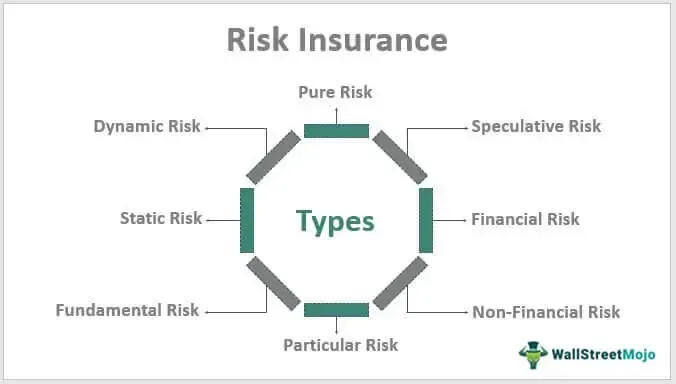

The complex interplay between different types of risks, cyclical risks, and economic cycles forms the backbone of successful investment strategies, particularly for those employing algorithmic trading methods. Understanding these elements is vital for optimizing investment outcomes and effectively managing potential pitfalls inherent in the market environment. Investors engaging in algorithmic trading leverage advanced computational techniques and models to make decisions, often executing trades at high frequency. However, the effectiveness of these algorithms significantly depends on their ability to adapt to varying risk conditions and cyclical economic fluctuations.

Cyclical risks are those that ebb and flow following the natural ups and downs of economic cycles. These cycles, characterized by periods of growth and contraction, influence how risk manifests across markets. During an economic expansion, certain assets may appreciate rapidly, whereas a recession might see widespread asset devaluation. Recognizing how different risk types manifest within these fluctuations allows investors to anticipate market trends more effectively and adjust their strategies accordingly.



Algorithmic trading systems are uniquely positioned to capitalize on this understanding as they can process massive datasets to identify patterns that might indicate a shift in economic conditions. As these algorithms are finely attuned to risk indicators and economic signals, they can be programmed to execute trades that align with the predicted phase of the economic cycle, either mitigating potential losses during downturns or maximizing gains during positive swings.

By dissecting the elements of cyclical risk and their intersection with economic cycles, this article seeks to provide investors with actionable insights into managing these risks within the framework of algorithmic trading. Through a comprehensive approach that considers the intricacies of economic indicators and market signals, investors can harness the full potential of algorithmic strategies, enhancing their ability to navigate the ebbs and flows of the financial markets with confidence.

## Table of Contents

## What is Cyclical Risk?

Cyclical risk is a significant [factor](/wiki/factor-investing) in the financial and investment landscape, referring to the inherent risks that arise from fluctuations in the economic cycle. These risks are intricately tied to the periodic expansion and contraction within the economy, which impact the performance of investments and the profitability of companies. The economic cycle is marked by several distinct phases: expansion, peak, contraction, and trough.

During the expansion phase, there is an increase in economic activity as characterized by rising gross domestic product (GDP), employment, consumer spending, and industrial production. In this phase, investments often yield higher returns due to increased business optimism and consumer confidence. Conversely, during the contraction or recession phase, the economy experiences a slowdown which leads to reduced consumer spending, lower profits, and diminished investment returns.

Different sectors of the economy are affected variably by these economic cycles. For instance, cyclical industries such as automotive, construction, and luxury goods tend to experience pronounced variability in performance throughout the economic cycle. These sectors generally perform well during periods of economic expansion due to higher consumer demand and increased capital spending but suffer during downturns as consumer confidence wanes and spending declines.

In contrast, non-cyclical or defensive sectors like healthcare, utilities, and consumer staples are less sensitive to economic fluctuations as they provide essential goods and services that maintain demand regardless of economic conditions. Consequently, investments in these sectors often offer stable returns and serve as a hedge during economic slowdowns.

For investors, understanding cyclical risk is crucial as it enables anticipation of market dynamics during different economic phases. By recognizing the cyclical nature of various sectors, investors can strategically allocate their portfolios to mitigate potential risks and harness opportunities, thereby optimizing investment outcomes throughout the economic cycle. This insight into cyclical risk facilitates informed decision-making, allowing investors to align their strategies with prevailing economic conditions and sectoral performance prospects.

## The Dynamics of Economic Cycles

Economic cycles represent the natural fluctuation of economic activity over time, marked by alternating periods of expansion and contraction. These cycles are instrumental for understanding the macroeconomic environment and their identification is critical for informed investment decision-making.

### Phases of Economic Cycles

Economic cycles typically consist of four main phases:

1. **Expansion**: During this phase, the economy experiences a rise in economic indicators such as GDP, employment levels, and production output. Consumer confidence is usually high, leading to increased spending and investment.

2. **Peak**: This is the zenith of an economic cycle, where economic indicators hit their maximum growth rates. Resource utilization is at its upper limit, often leading to rising inflation rates.

3. **Contraction**: Characterized by a decline in GDP, reduced investment, and increased unemployment, this phase is often marked by a decrease in consumer and business activities. The contraction can usher in a recession if sustained over successive periods.

4. **Trough**: This phase represents the bottom of the economic cycle, where economic activity is at its lowest. It is a turning point that leads back to expansion as recovery efforts take hold and economic indicators begin to show improvement.

### Key Drivers of Economic Cycles

Economic cycles are driven by a mixture of internal and external factors, including:

- **Monetary and Fiscal Policies**: Central banks and governments wield significant influence over economic cycles through interest rates, tax policies, and government spending. For instance, expansionary monetary policy, such as lowering interest rates, can stimulate economic growth, whereas contractionary policy may slow it down to combat inflation.

- **Consumer Behavior**: The collective spending and saving patterns of consumers deeply impact economic cycles. High confidence and spending can fuel expansion, while low confidence and saving can lead to contraction.

- **Global Events**: Geopolitical tensions, natural disasters, and pandemics are examples of external shocks that can disrupt economic stability and alter cycle trajectories. These events can lead to sudden shifts in trade patterns, supply chains, and economic relations globally.

### Identifying Economic Cycle Stages

Recognizing the current position within an economic cycle is vital for investors, particularly those engaged in [algorithmic trading](/wiki/algorithmic-trading). This understanding informs strategic decisions, such as asset allocation, risk management, and timing of market entry and [exit](/wiki/exit-strategy). Common indicators used to identify economic cycle stages include:

- **Gross Domestic Product (GDP)**: As a broad measure of overall economic activity, changes in GDP signal transitions between expansion and contraction.

- **Employment Statistics**: High employment rates typically coincide with expansion, whereas rising unemployment is indicative of contraction.

- **Inflation Rates**: These can signal overheating during peaks and deflationary pressures during troughs, affecting the central bank's monetary policy.

- **Interest Rates**: Fluctuations in interest rates, as guided by central banks, provide insights into the monetary policy stance and its implications for economic growth.

By analyzing these indicators, economists and investors can estimate the economy's position within a cycle and anticipate future movements, aiding in the decision-making process for investments and trading strategies.

## Types of Cyclical Risks and Their Indicators

Cyclical risks encompass a variety of economic fluctuations that affect asset valuation, business profitability, and investment returns. Key indicators of these risks include inflation, interest rates, and capital expenditure, each offering valuable insights into different economic dynamics and potential market shifts.

Inflation represents the rate at which the general level of prices for goods and services rises, eroding purchasing power over time. High inflation can signal economic overheating, indicating an economy that is growing too quickly and leading to price instability. For example, when inflation rates rise, the purchasing power of currency decreases, which can depress consumer spending and business investment. High inflation often prompts central banks to increase interest rates to slow down economic activity. This interplay can be modeled by the formula:

$$
\text{Real Interest Rate} = \text{Nominal Interest Rate} - \text{Inflation Rate}
$$

Interest rates, set by central banks, play a critical role in economic cycles as they influence the cost of borrowing money. When interest rates rise, borrowing becomes more expensive, which can dampen business investment and consumer spending, potentially leading to an economic downturn. Conversely, lower interest rates make borrowing cheaper, encouraging spending and investment, which can spur economic growth. Investors often watch [interest rate](/wiki/interest-rate-trading-strategies) trends to gauge market sentiment and adjust their portfolios accordingly. The relationship between interest rates and investment can be simplified in a basic investment model:

$$
\text{Investment} = \alpha - \beta \times \text{Interest Rate}
$$

Where $\alpha$ and $\beta$ are parameters that define how sensitive the investment is to changes in interest rates.

Capital expenditure, or the funds spent by a business to acquire or upgrade physical assets, reflects a company's growth expectations and confidence in the economic outlook. High levels of capital expenditure typically indicate business optimism and a readiness to expand operations, which may occur during economic booms. Conversely, reduced capital expenditure can signal caution and potential economic contraction. Monitoring trends in capital expenditure allows investors to predict future business conditions and sector performance.

By analyzing these indicators, investors can discern patterns and trends in economic activity that help anticipate the movement of financial markets. Understanding cyclical risks and their associated indicators offers strategic advantages in positioning portfolios to either mitigate losses during downturns or enhance returns during upswings.

## Algorithmic Trading and Cyclical Risks

Algorithmic trading leverages advanced computational techniques to execute trades with precision and speed, often within milliseconds. The method utilizes algorithms—sets of rules and calculations—to analyze a wide array of data inputs, identify trading opportunities, and execute orders. These systems are advantageous in dealing with cyclical risks because they can quickly parse through voluminous economic and market data to detect patterns consistent with different phases of economic cycles.

Algorithmic systems decode market data and indicators to recognize favorable or adverse conditions linked to economic expansions and contractions. By identifying cyclical patterns—such as those indicated by fluctuations in interest rates, employment figures, or manufacturing indices—algorithms can adjust trading positions to both capitalize on potential gains during economic expansions and mitigate risk during downturns.

Central to their efficacy is the incorporation of cyclical risk assessment into their strategy design. For instance, during periods of economic growth, when indicators suggest a positive business cycle, an algorithm may increase exposure to equity markets or sectors poised to benefit from increased consumer spending. Conversely, in anticipation of economic contraction signaled by rising unemployment rates or declining consumer confidence, algorithms can reduce exposure to riskier assets or shift capital to safer investments such as government bonds or defensive sectors.

Mathematically, these strategies can be represented with conditional programming structures that trigger specific actions when certain thresholds or patterns are detected in the data. For instance, a simplistic Python representation might include:

```python
def adjust_position(economic_indicator):
    if economic_indicator > growth_threshold:
        # Increase exposure to high-growth sectors
        execute_trade('buy', 'high_growth_sectors')
    elif economic_indicator < contraction_threshold:
        # Increase exposure to defensive sectors
        execute_trade('buy', 'defensive_sectors')
```

This code snippet demonstrates the decision-making process based on economic indicators that signal different phases of economic cycles. Such systems can continuously monitor data feeds and react to new information, providing a powerful tool for managing investments in the face of cyclical risks.

Ultimately, the adaptability of algorithmic trading systems to cyclical dynamics not only enhances the potential for gains but also fortifies portfolios against downturns. The constant calibration of trading algorithms to evolving economic signals ensures that they remain attuned to the economic landscape, thereby optimizing performance across varying market conditions.

## Strategies for Mitigating Cyclical Risks

Investors employ various strategies to mitigate cyclical risks, with macro hedging and sector rotation being two prominent approaches.

Macro hedging is a technique used to protect investment portfolios against market downturns by utilizing financial instruments such as options, futures, and other derivatives. Options, for example, can be used to establish a protective put position, which helps to limit downside risk by granting the investor the right to sell an asset at a predetermined price. This strategy effectively acts as an insurance policy, preserving the portfolio's value during periods of economic contraction.

To further illustrate, consider a portfolio heavily invested in equities. An investor might use options to hedge against potential declines in the stock market. By purchasing put options, the investor can establish a floor for the portfolio's value, ensuring that, even if the market falls, losses are capped. This is particularly valuable when cyclical indicators suggest an approaching economic downturn.

Sector rotation, on the other hand, involves tactically shifting investments among different sectors based on their performance during various stages of the economic cycle. Sectors such as consumer staples and health care tend to be more resilient during economic downturns, as they provide essential goods and services. Conversely, cyclical sectors like technology and consumer discretionary often perform better during periods of economic growth.

For example, during an economic expansion, an investor might increase exposure to sectors like technology and industrials, capitalizing on increased consumer and business spending. In contrast, during a contraction phase, the same investor might shift holdings to defensive sectors like utilities and health care. This strategy is predicated on the understanding that different sectors react uniquely to economic changes, allowing investors to optimize returns across varying economic conditions.

By integrating macro hedging and sector rotation, investors can enhance their ability to navigate cyclical risks effectively. These strategies provide a dynamic framework for adjusting portfolios in response to economic signals, helping to manage risk and capitalize on opportunities presented by economic cycles.

## The Role of Economic Indicators in Algorithmic Strategies

Economic indicators serve as essential tools in constructing algorithmic trading strategies to address cyclical risks effectively. These indicators provide quantitative measures that offer insights into the overall economic health and help anticipate shifts in economic cycles. This information equips algorithmic trading systems with the data necessary to make informed and timely trading decisions.

Gross Domestic Product (GDP) is one of the primary indicators used in algorithmic strategies. It measures the total economic output of a country and indicates the growth rate of the economy. A rising GDP typically suggests a healthy, expanding economy, which may encourage asset price increases. In contrast, a declining GDP can signal an economic slowdown, potentially prompting a shift in asset allocation towards safer investments. By incorporating GDP data, algorithms can adjust asset positions to align with projected economic trajectories.

The Consumer Price Index (CPI) is another critical indicator. It measures inflation by tracking changes in the prices of a basket of goods and services. Inflation trends can influence interest rates and purchasing power, directly impacting investment returns. Algorithmic trading strategies can use CPI data to anticipate central bank decisions regarding monetary policy adjustments, thereby optimizing investment choices based on anticipated interest rate changes.

Employment rates provide further insight into the economic environment. High employment rates generally indicate robust economic activity, leading to increased consumer spending and business optimism. Conversely, rising unemployment can foreshadow economic decline, possibly resulting in lower market confidence and weaker investment performance. By monitoring employment trends, algorithms can dynamically reallocate resources to sectors predicted to perform well under prevailing employment conditions.

Incorporating these economic indicators into algorithmic trading strategies allows systems to make dynamic adjustments in line with current market conditions. Algorithms analyze historical and real-time data to predict future market movements, tailoring trading actions accordingly. This capability can be enhanced by employing [machine learning](/wiki/machine-learning) techniques to identify patterns and trends that might escape traditional analysis. For example, using Python, data scientists can implement algorithms that automatically adjust portfolio allocations based on up-to-date GDP, CPI, and employment data. A simple Python example might look like this:

```python
import pandas as pd
from sklearn.linear_model import LinearRegression

# Hypothetical dataset with GDP, CPI, Employment rate as features
data = pd.DataFrame({
    'GDP': [2.3, 2.5, 2.4, 2.6],
    'CPI': [1.2, 1.3, 1.1, 1.4],
    'Employment_rate': [4.5, 4.4, 4.6, 4.3],
    'Market_Return': [6.1, 6.5, 6.3, 6.7]
})

# Defining the model
model = LinearRegression()

# Features and target variable
X = data[['GDP', 'CPI', 'Employment_rate']]
y = data['Market_Return']

# Training the model
model.fit(X, y)

# Prediction using the model
future_data = pd.DataFrame({'GDP': [2.7], 'CPI': [1.5], 'Employment_rate': [4.1]})
predicted_return = model.predict(future_data)

print("Predicted Market Return:", predicted_return)
```

This example illustrates how economic indicators can be incorporated into algorithmic models to predict market returns, thereby enabling data-driven adjustments to trading strategies. By continuously refining these models with updated economic data, traders can better navigate economic shifts and potentially capitalize on cyclical market trends.

## Conclusion: Navigating Cyclical Risk in Algo Trading

Successfully managing cyclical risk in algorithmic trading necessitates a comprehensive understanding of economic cycles and their indicators. Economic cycles, characterized by alternating periods of expansion and contraction, exert a significant influence on market dynamics. Recognizing these phases and their indicators enables investors to make informed decisions, minimizing risks and optimizing gains.

The integration of economic indicators, such as GDP growth rates, Consumer Price Index (CPI) changes, and employment [statistics](/wiki/bayesian-statistics), into algorithmic trading models is crucial. These indicators provide critical insights into the current state of the economy, allowing traders to anticipate potential shifts in market trends. For instance, a rise in CPI could indicate upcoming inflationary pressures, prompting adjustments in trading strategies to hedge against inflation risk.

Algorithmic trading strategies that are well-tuned to cyclical risks employ techniques such as macro hedging and sector rotation. Macro hedging uses financial instruments like options and futures to protect against broad market downturns. Sector rotation involves reallocating investments from declining sectors to those anticipated to outperform, aligning with the economic cycle's stage.

Moreover, the dynamic nature of markets necessitates ongoing research and adjustment of trading algorithms. As market conditions evolve, continuous refinement of algorithms ensures they remain responsive to new data and emerging trends. This adaptability is vital for capitalizing on market upswings and mitigating potential losses during economic downturns.

Incorporating these strategies, tools, and a robust understanding of economic indicators can greatly enhance an investor's ability to navigate the complexities of cyclical risks in algorithmic trading. The key to success lies in maintaining an agile approach, constantly updating strategies to align with the latest economic insights.

## References & Further Reading

[1]: Jansen, S. (2020). ["Machine Learning for Algorithmic Trading"](https://github.com/stefan-jansen/machine-learning-for-trading), Packt Publishing.

[2]: Lopez de Prado, M. (2018). ["Advances in Financial Machine Learning"](https://www.amazon.com/Advances-Financial-Machine-Learning-Marcos/dp/1119482089), Wiley.

[3]: Chan, E. P. (2008). ["Quantitative Trading: How to Build Your Own Algorithmic Trading Business"](https://github.com/ftvision/quant_trading_echan_book), Wiley.

[4]: Aronson, D. R. (2006). ["Evidence-Based Technical Analysis: Applying the Scientific Method and Statistical Inference to Trading Signals"](https://www.amazon.com/Evidence-Based-Technical-Analysis-Scientific-Statistical/dp/0470008741), Wiley.

[5]: Bergstra, J., Bardenet, R., Bengio, Y., & Kégl, B. (2011). ["Algorithms for Hyper-Parameter Optimization."](https://proceedings.neurips.cc/paper/2011/file/86e8f7ab32cfd12577bc2619bc635690-Paper.pdf) Advances in Neural Information Processing Systems 24.