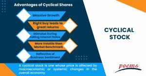

## Table of Contents

## What are cyclical stocks?

Cyclical stocks are types of stocks that go up and down with the economy. When the economy is doing well, these stocks usually do well too. But when the economy slows down, these stocks can lose value. Companies that make things like cars, houses, and luxury items are often cyclical stocks. People buy more of these things when they feel confident about their money, but they cut back when times are tough.

It's important for investors to know about cyclical stocks because they can help make money when the economy is growing. But they can also lose a lot of money if the economy goes into a recession. So, it's a good idea to watch the economy and think about how it might affect these stocks. Some investors like to buy cyclical stocks when they are cheap during a downturn, hoping to sell them for a profit when the economy gets better.

## How do cyclical stocks differ from non-cyclical stocks?

Cyclical stocks and non-cyclical stocks, also known as defensive stocks, behave differently depending on how the economy is doing. Cyclical stocks go up and down with the economy. When the economy is strong, people have more money to spend on things like cars, vacations, and big-ticket items, so companies that make these things do well and their stock prices go up. But when the economy is weak, people cut back on spending, and these companies don't do as well, causing their stock prices to drop.

Non-cyclical stocks, on the other hand, are less affected by economic ups and downs. These stocks are from companies that make things people need no matter what the economy is doing, like food, medicine, and utilities. Because people always need these things, these companies usually have steady sales and profits, even during tough economic times. So, their stock prices tend to be more stable and don't swing as much as cyclical stocks.

Understanding the difference between these two types of stocks can help investors make better choices. If you think the economy will grow, you might want to invest more in cyclical stocks to take advantage of the potential gains. But if you're worried about a downturn, non-cyclical stocks can provide more safety and stability in your portfolio. Balancing both types can help manage risk and potentially improve returns over time.

## What industries are typically associated with cyclical stocks?

Cyclical stocks are found in industries that do well when the economy is growing but struggle when things slow down. Some of these industries include car makers, like Ford or Toyota, because people buy more cars when they feel good about their money. Another big one is construction and home building. When the economy is strong, more people buy houses, so companies like Lennar or D.R. Horton do well. Also, travel and leisure companies, like airlines or hotel chains, see more business when people have more money to spend on vacations.

Other industries that are cyclical include luxury goods and retail. When the economy is good, people buy more expensive items like designer clothes or fancy jewelry, so companies like LVMH or Tiffany & Co. benefit. Retailers that sell non-essential items, like Best Buy or Macy's, also see their sales go up during good economic times. Finally, manufacturing and heavy machinery companies, like Caterpillar, depend a lot on economic cycles because their products are used in construction and other industries that grow with the economy.

## What are the main advantages of investing in cyclical stocks?

Investing in cyclical stocks can lead to big gains when the economy is doing well. Since these stocks go up and down with the economy, they can grow a lot when times are good. For example, if you buy stocks in a car company when the economy starts to get better, you might see your investment grow a lot as more people buy cars. This can be a great way to make money if you can guess when the economy will improve.

Another advantage is that you can buy cyclical stocks at a lower price during tough economic times. When the economy is bad, these stocks often lose value. But if you believe the economy will get better soon, you can buy these stocks when they are cheap. Then, when the economy improves, you can sell them for a higher price. This strategy is called "buying low and selling high," and it can help you make a good profit if you time it right.

## How can cyclical stocks potentially lead to high returns?

Cyclical stocks can lead to high returns because they do really well when the economy is growing. When people feel good about their money, they spend more on things like cars, houses, and vacations. This means companies that make these things, like car makers or home builders, sell a lot more and make bigger profits. As these companies do better, their stock prices go up a lot. So, if you buy their stocks at the right time, when the economy is starting to get better, you can make a lot of money as the stock prices rise with the economy.

Another way cyclical stocks can lead to high returns is by buying them when they are cheap during a bad economy. When times are tough, people don't spend as much, and the stock prices of cyclical companies can drop a lot. But if you think the economy will get better soon, you can buy these stocks when they are low. Then, when the economy starts to improve and people start spending again, the stock prices will go up. If you sell the stocks at the higher price, you can make a big profit. This is like buying something on sale and selling it later for more money.

## What are the key disadvantages of investing in cyclical stocks?

One big problem with investing in cyclical stocks is that they can lose a lot of value when the economy is not doing well. When people don't have much money to spend, they buy fewer cars, houses, and luxury items. This means companies that make these things don't make as much money, and their stock prices go down. If you own these stocks when the economy is bad, you could lose a lot of money. It's hard to know exactly when the economy will go down, so it can be risky to invest in cyclical stocks.

Another disadvantage is that it can be hard to time the market right. To make money with cyclical stocks, you need to buy them when they are cheap and sell them when they are expensive. But guessing when the economy will get better or worse is not easy. If you buy the stocks too early or sell them too late, you might not make as much money as you hoped. This can make investing in cyclical stocks stressful and unpredictable.

## How does economic sensitivity affect the performance of cyclical stocks?

Economic sensitivity means how much a stock's price goes up and down with the economy. Cyclical stocks are very sensitive to the economy. When the economy is doing well, people have more money to spend on things like cars, houses, and vacations. This makes companies that make these things sell more and make more profit. As a result, their stock prices go up a lot. But when the economy is not doing well, people don't spend as much money on these things. This means these companies sell less and make less profit, so their stock prices go down.

Because of this sensitivity, cyclical stocks can be risky. If you buy them when the economy is good, you might make a lot of money as their prices go up. But if the economy turns bad, you could lose a lot of money as their prices drop. It's hard to know exactly when the economy will change, so it can be tricky to decide when to buy or sell these stocks. This makes investing in cyclical stocks a bit like gambling on the economy's ups and downs.

## What are the risks associated with the timing of investments in cyclical stocks?

Timing investments in cyclical stocks can be really tricky and risky. These stocks go up and down with the economy, so you need to buy them when the economy is starting to get better and sell them before it gets worse. But guessing when the economy will change is hard. If you buy the stocks too early, before the economy really starts to grow, you might have to wait a long time before you see any profit. And if you buy them too late, after they've already gone up a lot, you might not make as much money as you hoped.

Another risk is selling the stocks at the wrong time. If you sell too early, you might miss out on even bigger gains if the economy keeps getting better. But if you wait too long to sell, and the economy starts to go down, the stock prices can drop a lot, and you could lose money. It's like trying to catch a wave at the beach – if you jump on too soon or too late, you might not ride it as well as you could. This makes investing in cyclical stocks a bit like gambling on when the economy will go up or down.

## How can diversification help in managing a portfolio with cyclical stocks?

Diversification means spreading your money across different types of investments. When you have cyclical stocks in your portfolio, diversification can help protect you from the ups and downs of the economy. If you only have cyclical stocks and the economy goes down, all your stocks might lose value at the same time. But if you also have non-cyclical stocks, like those in food or medicine companies, these stocks might stay stable or even go up when the economy is bad. This way, the losses from your cyclical stocks might be balanced out by the gains or stability from your non-cyclical stocks.

Another way diversification helps is by reducing the risk of timing the market wrong. Since it's hard to know exactly when the economy will change, having a mix of different types of stocks can make your portfolio less dependent on getting the timing right. If you have some money in cyclical stocks and some in other types of investments, like bonds or real estate, you can still make money even if your cyclical stocks don't do well. This can give you peace of mind and help you keep your money safe no matter what the economy does.

## What are some strategies for identifying the best times to buy and sell cyclical stocks?

One way to figure out the best times to buy and sell cyclical stocks is to keep an eye on economic indicators. These are things like unemployment rates, consumer spending, and GDP growth. When these indicators start to go up, it might be a good time to buy cyclical stocks because the economy is getting better. People will start spending more money on things like cars and houses, which means these companies will do well and their stock prices will go up. On the other hand, if these indicators start to go down, it might be a good time to sell because the economy might be heading into a downturn, and cyclical stocks could lose value.

Another strategy is to watch the stock prices themselves. Cyclical stocks often follow a pattern where they go up and down with the economy. If you see that a cyclical stock has been going down for a while but the economy is starting to get better, it might be a good time to buy. This is because the stock might be at a low price and could go up as the economy improves. But if you see that a cyclical stock has been going up for a while and the economy is starting to slow down, it might be a good time to sell. This way, you can sell the stock at a high price before it starts to go down with the economy.

## How do macroeconomic indicators influence the performance of cyclical stocks?

Macroeconomic indicators like unemployment rates, consumer spending, and GDP growth can really affect how well cyclical stocks do. When these indicators are going up, it means the economy is doing well. People have more money and feel more confident, so they spend more on things like cars, houses, and vacations. This is good for companies that make these things because they sell more and make more profit. As a result, the stock prices of these companies go up. So, if you see these indicators getting better, it might be a good time to buy cyclical stocks because they will likely do well as the economy grows.

On the other hand, when these macroeconomic indicators start to go down, it can be bad news for cyclical stocks. A drop in these indicators means the economy is slowing down, and people don't have as much money to spend on big-ticket items. This means companies that make cars, houses, and luxury goods will sell less and make less profit. As a result, their stock prices can go down a lot. If you see these indicators getting worse, it might be a good time to sell cyclical stocks before their prices drop even more because of a slowing economy.

## What advanced analytical tools can be used to predict the cycles of cyclical stocks?

One advanced tool that can help predict the cycles of cyclical stocks is technical analysis. This involves looking at past stock price movements and trading volumes to spot patterns. By using charts and graphs, you can see when a stock might be about to go up or down. For example, if a stock's price has been going down but then starts to form a pattern that shows it might go up soon, you might decide it's a good time to buy. Technical analysis can help you time your buys and sells better, but it's not perfect and needs to be used carefully.

Another useful tool is [fundamental analysis](/wiki/fundamental-analysis), which looks at the financial health of a company. This includes things like earnings, debt, and how much money the company makes compared to what it spends. By studying these details, you can see if a company is likely to do well when the economy gets better. For instance, if a car company has low debt and good earnings, it might be a good cyclical stock to buy when the economy starts to recover. Fundamental analysis helps you understand the long-term potential of a stock, but it can be complex and requires a lot of data.

Lastly, using economic forecasting models can also help predict cycles in cyclical stocks. These models use data from economic indicators like unemployment rates, consumer spending, and GDP growth to guess what the economy will do next. If the model predicts that the economy will grow, it might be a good time to invest in cyclical stocks. But if it predicts a slowdown, you might want to sell them. These models can be very helpful, but they are not always right, so it's important to use them along with other tools and not rely on them completely.

## What are the investment strategies for cyclical stocks?

Investing in cyclical stocks requires an acute awareness of economic conditions and strategic timing. These stocks fluctuate with the economic cycle, reflecting broad economic trends and consumer confidence. To optimize returns, investors often rely on a combination of analyzing economic indicators, scrutinizing balance sheets, and selecting suitable financial ratios.

### Analyzing Economic Indicators

Economic indicators play a pivotal role in predicting the performance of cyclical stocks. Monitoring [interest rate](/wiki/interest-rate-trading-strategies) trends is crucial since cyclical stocks often respond sensitively to changes in interest rates. Typically, lower interest rates can spur economic growth by making borrowing cheaper, which can enhance the performance of cyclical stocks. Conversely, higher rates might signal a contracting economy, negatively affecting these stocks.

Another key indicator is overall economic growth, measured by GDP growth rates. Investors look for signals of economic recovery or expansion as an opportune time to invest in cyclical stocks. Unemployment rates, consumer confidence indices, and industrial production figures also provide valuable insights into economic health and potential turning points in the economic cycle.

### Monitoring Insider Buying

Insider buying activities can be particularly telling. Executives and directors with in-depth knowledge of their company's outlooks might buy shares of their own company, indicating confidence in future performance. Investors can track insider transactions as part of their strategy to identify potentially undervalued cyclical stocks ahead of an anticipated economic upswing.

### Assessing Financial Health

A thorough examination of a company's financial statements is essential to assess its resilience during economic downturns. Key areas of focus include the company's debt levels, cash flow stability, and operational efficiency. Strong balance sheets with manageable levels of debt and ample [liquidity](/wiki/liquidity-risk-premium) suggest that a company might better endure economic slowdowns, making it a more attractive cyclical stock investment.

### Utilizing Financial Ratios

When evaluating cyclical stocks, traditional metrics like the price-to-earnings (P/E) ratio might not always be suitable due to earnings [volatility](/wiki/volatility-trading-strategies). Instead, the price-to-book (P/B) ratio can offer a more stable gauge of value relative to a company's net assets. This ratio is calculated as:

$$
\text{Price-to-Book (P/B) Ratio} = \frac{\text{Market Price per Share}}{\text{Book Value per Share}}
$$

A low P/B ratio in comparison to the industry average may suggest an undervalued stock, providing a potential investment opportunity as the economy enters a growth phase.

Overall, successful investment in cyclical stocks involves a strategic blend of economic insight, financial analysis, and market timing. By applying these methodologies, investors can position themselves to maximize returns during favorable economic conditions while minimizing risks during downturns.

## References & Further Reading

[1]: Bergstra, J., Bardenet, R., Bengio, Y., & Kégl, B. (2011). ["Algorithms for Hyper-Parameter Optimization."](https://dl.acm.org/doi/10.5555/2986459.2986743) Advances in Neural Information Processing Systems 24.

[2]: ["Advances in Financial Machine Learning"](https://www.amazon.com/Advances-Financial-Machine-Learning-Marcos/dp/1119482089) by Marcos Lopez de Prado

[3]: ["Evidence-Based Technical Analysis: Applying the Scientific Method and Statistical Inference to Trading Signals"](https://www.amazon.com/Evidence-Based-Technical-Analysis-Scientific-Statistical/dp/0470008741) by David Aronson

[4]: ["Machine Learning for Algorithmic Trading"](https://github.com/stefan-jansen/machine-learning-for-trading) by Stefan Jansen

[5]: ["Quantitative Trading: How to Build Your Own Algorithmic Trading Business"](https://www.amazon.com/Quantitative-Trading-Build-Algorithmic-Business/dp/1119800064) by Ernest P. Chan