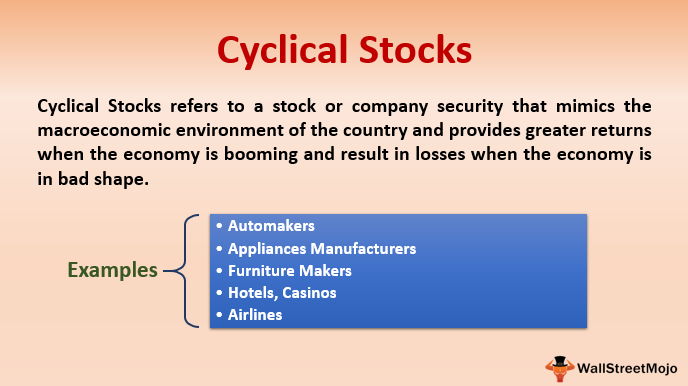

Investing in the stock market necessitates a sophisticated understanding of various investment strategies. Amongst the diverse array of options, cyclical stocks are particularly noteworthy due to their distinct performance patterns during different economic cycle phases. These stocks belong to companies whose earnings and operations tend to align closely with the fluctuations of the broader economy. For instance, industries such as automobiles, airlines, and luxury goods typically see a rise in stock prices during periods of economic expansion, as consumer confidence and spending increase. Conversely, during economic downturns, these industries often experience significant declines.

Cyclical stocks can offer considerable returns if timed correctly. The potential for substantial gains is linked to entering and exiting positions aligned with economic growth periods. However, this potential is balanced by the inherent risks associated with economic contractions, where these stocks might underperform sharply. Consequently, investors need to possess a nuanced understanding of economic indicators and market conditions to optimize their cyclical stock investments.



The landscape of investing in cyclical stocks has been dramatically altered by the rise of algorithmic trading. This innovation leverages complex algorithms and vast computations to execute trades based on predefined conditions, enabling the analysis of vast datasets at speeds unattainable by human traders. Such systems can identify subtle patterns and optimize entry and exit points, thereby enhancing strategic approaches to cyclical stock investments.

This article explores the intricate nature of investment strategies tailored to cyclical stocks, emphasizing the importance of understanding stock market cycles and the transformative impact of algorithmic trading in contemporary investing practices. Through a comprehensive examination, the goal is to equip investors with insights necessary to navigate the complexities and harness the opportunities presented by cyclical stocks in a dynamic market environment.

## Table of Contents

## Understanding Cyclical Stocks

Cyclical stocks represent shares in companies whose business performance and stock prices are directly affected by the macroeconomic environment. These stocks are highly sensitive to changes in economic conditions, meaning their values tend to rise and fall with fluctuations in the broader economy. Industries that typically exhibit cyclical behavior include automobiles, airlines, luxury goods, and other sectors where consumer demand is discretionary rather than essential.

During periods of economic expansion, consumers generally have more disposable income to spend on non-essential goods and services, benefiting companies in cyclical industries. For instance, the automotive industry often experiences higher sales when the economy is booming, as consumers are more likely to purchase new vehicles during these times. Similarly, luxury goods tend to see increased sales figures as consumer confidence and spending power rise.

Conversely, during economic downturns, cyclical stocks can suffer significant losses. As consumers and businesses tighten their belts in response to weaker economic conditions, demand for luxury and discretionary items tends to decrease. This downturn in demand results in diminished revenues for companies in these industries, ultimately affecting their stock performance. For example, airline stocks may decline during economic slowdowns as both business and leisure travel decline.

Investors seeking to capitalize on cyclical stocks must closely monitor economic indicators. Recognizing the phases of economic cycles involves understanding factors such as GDP growth rates, employment figures, consumer confidence, and interest rates. A well-timed entry into cyclical stocks during an economic upswing can lead to substantial gains. Conversely, identifying signs of an impending downturn can help in divesting or managing these holdings to mitigate potential losses.

Analysis of individual companies is also crucial. While being part of a cyclical industry poses inherent risks, factors such as financial health, competitive position, and management effectiveness can influence a company's ability to navigate through economic cycles. Companies with strong balance sheets and low debt may be better positioned to withstand an economic downturn than those burdened with high leverage.

Overall, investing in cyclical stocks demands an acute awareness of broader economic trends and an ability to anticipate shifts in economic cycles. Understanding the intrinsic link between these stocks and economic performance can provide investors with valuable insights to optimize their investment strategies.

## The Importance of Stock Market Cycles

Stock market cycles are patterns seen in the price movements of stocks, which align with broader economic cycles. Recognizing and understanding these cycles is crucial for investors, particularly those dealing in cyclical stocks whose performance is closely tied to economic conditions. The stock market cycles can be broken into four main phases: accumulation, markup, distribution, and markdown.

1. **Accumulation Phase**: This phase marks the end of a downtrend in the market. During this period, informed investors and institutions begin buying stocks, believing that the worst of the economic decline is over. It is characterized by a stable or slowly rising market despite prevalent negative sentiment from past poor performance. This phase is often marked by increased trading volume and a flattening of price declines.

2. **Markup Phase**: During the markup phase, the stock market begins to rise more sharply. Economic indicators might show signs of improvement, leading to increased investor confidence and buying activity. This phase is typically characterized by positive news, an increase in corporate earnings, and more investors entering the market. Stock prices rise as momentum builds, often attracting the general investor population who had stayed on the sidelines during the previous phase.

3. **Distribution Phase**: In the distribution phase, the market reaches a saturation point where the bullish sentiment leads to a plateau in stock prices. Previously accumulated stocks are sold off by early investors at higher prices during this time. This phase is often accompanied by high trading volumes but with little upward price movement, signaling a potential reversal in trend as enthusiasm starts to wane.

4. **Markdown Phase**: Following distribution, the market enters a markdown phase, where stock prices begin to fall. This phase completes the cycle as economic indicators start showing weakness, leading to reduced corporate earnings and investor confidence. Many investors attempt to exit the market, leading to increased selling pressure and continued decline in stock prices.

Understanding these phases allows investors to time their entry and [exit](/wiki/exit-strategy) points more effectively in the context of cyclical stocks, which are sensitive to these market cycles. For example, purchasing cyclical stocks during the accumulation and early markup phases can yield significant returns as the broader economy starts to recover. Conversely, holding onto these stocks during the distribution and markdown phases can lead to losses as economic activity declines.

Market conditions profoundly influence the performance of cyclical stocks. These stocks may outperform during economic expansions but can suffer substantial downturns in economic contractions. Thus, recognizing the current stock market cycle phase is essential for optimizing investment strategies, minimizing risks, and maximizing returns. This necessitates a thorough understanding of not only stock price trends but also the macroeconomic indicators influencing these cycles.

## Investment Strategies for Cyclical Stocks

Investing in cyclical stocks requires an acute awareness of economic conditions and strategic timing. These stocks fluctuate with the economic cycle, reflecting broad economic trends and consumer confidence. To optimize returns, investors often rely on a combination of analyzing economic indicators, scrutinizing balance sheets, and selecting suitable financial ratios.

### Analyzing Economic Indicators

Economic indicators play a pivotal role in predicting the performance of cyclical stocks. Monitoring [interest rate](/wiki/interest-rate-trading-strategies) trends is crucial since cyclical stocks often respond sensitively to changes in interest rates. Typically, lower interest rates can spur economic growth by making borrowing cheaper, which can enhance the performance of cyclical stocks. Conversely, higher rates might signal a contracting economy, negatively affecting these stocks.

Another key indicator is overall economic growth, measured by GDP growth rates. Investors look for signals of economic recovery or expansion as an opportune time to invest in cyclical stocks. Unemployment rates, consumer confidence indices, and industrial production figures also provide valuable insights into economic health and potential turning points in the economic cycle.

### Monitoring Insider Buying

Insider buying activities can be particularly telling. Executives and directors with in-depth knowledge of their company's outlooks might buy shares of their own company, indicating confidence in future performance. Investors can track insider transactions as part of their strategy to identify potentially undervalued cyclical stocks ahead of an anticipated economic upswing.

### Assessing Financial Health

A thorough examination of a company's financial statements is essential to assess its resilience during economic downturns. Key areas of focus include the company's debt levels, cash flow stability, and operational efficiency. Strong balance sheets with manageable levels of debt and ample [liquidity](/wiki/liquidity-risk-premium) suggest that a company might better endure economic slowdowns, making it a more attractive cyclical stock investment.

### Utilizing Financial Ratios

When evaluating cyclical stocks, traditional metrics like the price-to-earnings (P/E) ratio might not always be suitable due to earnings [volatility](/wiki/volatility-trading-strategies). Instead, the price-to-book (P/B) ratio can offer a more stable gauge of value relative to a company's net assets. This ratio is calculated as:

$$
\text{Price-to-Book (P/B) Ratio} = \frac{\text{Market Price per Share}}{\text{Book Value per Share}}
$$

A low P/B ratio in comparison to the industry average may suggest an undervalued stock, providing a potential investment opportunity as the economy enters a growth phase.

Overall, successful investment in cyclical stocks involves a strategic blend of economic insight, financial analysis, and market timing. By applying these methodologies, investors can position themselves to maximize returns during favorable economic conditions while minimizing risks during downturns.

## The Role of Algorithmic Trading

Algorithmic trading, often referred to as algo trading, utilizes complex algorithms to automate and optimize the buying and selling of stocks based on predefined criteria. This approach is becoming increasingly essential in trading cyclical stocks due to its ability to process vast amounts of financial data rapidly and execute trades at speeds unattainable by human traders. 

The main advantage of [algorithmic trading](/wiki/algorithmic-trading) is its capacity to identify patterns and relationships in market data that might not be apparent to human analysts. By leveraging [machine learning](/wiki/machine-learning) techniques and statistical models, algorithms can assess historical data, detect trends, and predict potential future movements in cyclical stocks. These capabilities enable traders to determine optimal entry and exit points, thereby enhancing the potential for profit.

Python, being a widely used programming language in finance, enables the development of sophisticated trading algorithms. For example, a basic algorithm might use a moving average crossover strategy, where trades are executed based on the crossover of short-term and long-term moving averages. Here's a simple Python code snippet that highlights this strategy:

```python
import pandas as pd

# Assume 'data' is a DataFrame containing historical stock prices with 'Close' as the closing price column
data['Short_MA'] = data['Close'].rolling(window=50).mean()  # 50-day moving average
data['Long_MA'] = data['Close'].rolling(window=200).mean()  # 200-day moving average

# Generate buy/sell signals
data['Signal'] = 0
data.loc[data['Short_MA'] > data['Long_MA'], 'Signal'] = 1  # Buy signal
data.loc[data['Short_MA'] < data['Long_MA'], 'Signal'] = -1  # Sell signal

data['Position'] = data['Signal'].diff()
```

In this code, buy signals are generated when the short-term moving average crosses above the long-term moving average, suggesting a potential upward trend. Conversely, sell signals are generated when the short-term average crosses below the long-term average, indicating a potential downturn. This simplistic model can be enhanced further by incorporating additional data sources, such as macroeconomic indicators significant to cyclical stocks, and using advanced machine learning models to improve predictive accuracy.

Despite its advantages, algorithmic trading also comes with certain risks. Technical failures, such as software bugs or connectivity issues, can lead to significant losses if not managed properly. Moreover, the lack of human oversight might result in algorithms making trades under conditions not anticipated by their programmers. Hence, continuous monitoring, testing, and refining of algorithms are crucial to ensure their reliability and effectiveness.

Overall, algorithmic trading offers exciting opportunities to exploit patterns in cyclical stock movements, but it requires a robust framework to mitigate associated risks. Proper configuration and continuous optimization of these algorithms can offer significant competitive advantages to investors.

## Challenges and Risks

Cyclical stocks, known for their sensitivity to economic cycles, can generate substantial returns during periods of economic prosperity. However, these stocks are also susceptible to heightened volatility during economic downturns. This volatility is driven by changes in consumer demand, fluctuations in interest rates, and broader macroeconomic shifts that impact the industries typically associated with cyclical stocks, such as automotive, travel, and luxury goods.

Algorithmic trading, which leverages advanced algorithms to automate and optimize trading strategies, has revolutionized how investors manage cyclical stocks. By analyzing large data sets and executing trades at high speed, these algorithms can identify patterns and capitalize on market inefficiencies. However, the use of algorithmic trading is not without its risks. Technical errors, such as system failures or bugs in the trading algorithms, can result in substantial financial losses. Additionally, the lack of human oversight in algorithmic trading may lead to the execution of trades based on faulty data or misinterpretation of market signals.

Furthermore, the absence of a human decision-making component can result in algorithms exacerbating market volatility during periods of instability. For example, during rapid market declines, algorithmic strategies might trigger a cascade of sell orders, amplifying price swings and contributing to further market instability. These risks necessitate robust risk management protocols and real-time monitoring to mitigate potential technical failures and ensure the algorithms function as intended.

Investors engaging in cyclical stock trading through algorithmic platforms must stay informed about market trends and macroeconomic indicators. Understanding how these factors influence cyclical industries enables traders to anticipate potential downturns and adjust their strategies accordingly. Staying updated on economic data releases, such as GDP growth rates, unemployment figures, and consumer confidence indices, is vital for making informed trading decisions.

Overall, while cyclical stocks and algorithmic trading offer significant opportunities, they come with inherent risks that require continuous monitoring and adaptation. Investors must balance the power of technology with the need for vigilant oversight and an understanding of economic factors to successfully navigate the complexities of cyclical stock investments.

## Conclusion

Cyclical stocks provide investors with the potential for significant returns by leveraging the inherent fluctuations of economic and market cycles. By closely monitoring and understanding these cycles, investors can strategically time their acquisitions and divestitures in sectors such as automobiles, airlines, and luxury goods, which are subject to these cyclical patterns.

With the advent of algorithmic trading, the landscape of investing in cyclical stocks has evolved significantly. Algorithms can process large datasets and identify patterns that human traders might overlook. This capability allows traders to refine their strategies, seeking optimal entry and exit points for their investments. For instance, an algorithm might adjust trading strategies based on economic indicators or cycle phases, automating the investment process for cyclical stocks.

Nevertheless, the promise of high returns from cyclical stocks comes with associated risks, which necessitates a vigilant approach by investors. Understanding market conditions and maintaining a keen awareness of economic signals are crucial to mitigating these risks. Additionally, while algorithmic trading introduces efficiencies and optimizations, it also brings new challenges, such as technical failures or unforeseen market anomalies, underscoring the need for ongoing education and adaptation.

In conclusion, staying informed of economic trends and continuously refining investment strategies can help investors effectively manage risks. By integrating the benefits of algorithmic trading with a solid understanding of stock market cycles, investors can potentially unlock the full potential of investing in cyclical stocks.

## References & Further Reading

[1]: Bergstra, J., Bardenet, R., Bengio, Y., & Kégl, B. (2011). ["Algorithms for Hyper-Parameter Optimization."](https://dl.acm.org/doi/10.5555/2986459.2986743) Advances in Neural Information Processing Systems 24.

[2]: ["Advances in Financial Machine Learning"](https://www.amazon.com/Advances-Financial-Machine-Learning-Marcos/dp/1119482089) by Marcos Lopez de Prado

[3]: ["Evidence-Based Technical Analysis: Applying the Scientific Method and Statistical Inference to Trading Signals"](https://www.amazon.com/Evidence-Based-Technical-Analysis-Scientific-Statistical/dp/0470008741) by David Aronson

[4]: ["Machine Learning for Algorithmic Trading"](https://github.com/stefan-jansen/machine-learning-for-trading) by Stefan Jansen

[5]: ["Quantitative Trading: How to Build Your Own Algorithmic Trading Business"](https://www.amazon.com/Quantitative-Trading-Build-Algorithmic-Business/dp/1119800064) by Ernest P. Chan