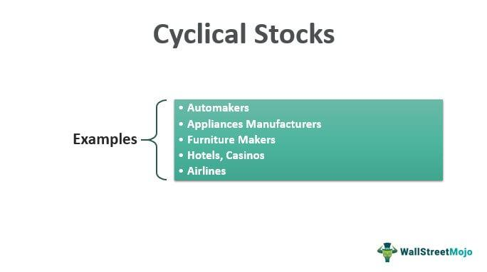

The stock market offers various opportunities for investors seeking growth and diversification. Cyclical stocks stand out as a significant category due to their unique characteristics and the potential for high returns. These stocks tend to move in tandem with broader economic cycles, experiencing growth during economic expansions and declines when the economy contracts. Given their direct relationship with macroeconomic indicators, understanding the risks involved in investing in cyclical stocks is essential.

Investors who utilize algorithmic trading strategies must particularly consider these risks. Algorithmic trading leverages computer programs to trade stocks at high speed and volume, often based on complex mathematical models and algorithms. While this method can capitalize on rapid market movements and extensive data analysis, the volatile nature of cyclical stocks poses unique challenges. Algorithms must be designed to understand and anticipate the economic cycles affecting these stocks accurately.



This article will discuss the dynamics of cyclical stocks, highlighting the inherent risks and rewards associated with investing in them. It will also shed light on how algorithmic trading interacts with these stocks, offering insights into crafting strategies that maximize returns while mitigating risks. Educating investors on these aspects will empower them to make informed decisions in the ever-evolving landscape of stock market investments.

## Table of Contents

## What Are Cyclical Stocks?

Cyclical stocks refer to the equity of companies whose business performance and stock prices are significantly influenced by the phases of the economic cycle, such as expansion, peak, recession, and recovery. These stocks typically perform well during periods of economic expansion when consumer confidence is high and discretionary spending increases. Conversely, they tend to underperform during economic contractions when consumers and businesses cut back on spending.

Industries commonly associated with cyclical stocks include automotive, travel, luxury goods, and construction. In the automotive industry, for instance, companies often experience increased sales and higher stock prices during economic boom periods when consumers are more likely to purchase new vehicles. Similarly, the travel industry sees heightened demand and more robust financial performance during prosperous economic times as people spend more on leisure and business travel.

In contrast to cyclical stocks, non-cyclical or defensive stocks are those belonging to industries that provide essential products or services, which remain in consistent demand regardless of the economic climate. Examples include utilities, healthcare, and consumer staples. These stocks tend to be less volatile, offering more stable returns during economic downturns because their underlying businesses are not as susceptible to economic fluctuations. Investors often seek defensive stocks as a hedge against market volatility, providing a stabilizing effect in diversified portfolios.

Understanding the nature of cyclical versus non-cyclical stocks is crucial for investors aiming to optimize their portfolios in alignment with market conditions, employing strategies that balance growth potential with risk management.

## Investment Risks of Cyclical Stocks

Investing in cyclical stocks is inherently risky due to their sensitivity to economic fluctuations. These stocks often experience greater [volatility](/wiki/volatility-trading-strategies) compared to non-cyclical or defensive stocks. This volatility stems from the fact that cyclical stocks are heavily tied to the overall economic conditions and consumer confidence levels. 

During economic expansions, cyclical stocks tend to perform well as increased consumer spending and a thriving market environment drive up their prices. However, during economic downturns or recessions, these stocks can suffer significant losses. This is because discretionary spending diminishes as consumers and businesses alike tighten their budgets, leading to decreased revenues and profits for companies in cyclical industries.

The volatility of cyclical stocks is quantitatively evident in their beta coefficient, a measure of a stock's volatility in relation to the overall market. A beta greater than 1 suggests that a stock is more volatile than the broader market. Cyclical stocks typically exhibit a high beta, signaling higher risk during downturns but greater potential returns during upswings.

To mitigate the risks associated with cyclical stocks, investors can employ various strategies. Diversification is a fundamental approach, where investors spread investments across a variety of asset classes, industries, and geographical regions. This reduces dependency on any single economic sector. By holding a mix of both cyclical and non-cyclical stocks, investors can balance potential gains with stability. 

Market timing is another strategy, albeit more challenging to execute successfully. It involves predicting economic cycles and adjusting portfolios accordingly. Investors might increase their holdings in cyclical stocks just before an economic recovery and decrease exposure before a downturn. However, market timing requires precise knowledge and often involves a degree of speculation, making it risky for those without expertise or access to reliable economic indicators.

```
import numpy as np
import matplotlib.pyplot as plt

# Simulating cyclical vs non-cyclical stock returns
np.random.seed(42)

# Creating a simple economic cycle function
def economic_cycle(t):
    return np.sin(t) + np.random.normal(0, 0.2, len(t))

# Time points
t = np.linspace(0, 10, 1000)

# Cyclical stock prices (more volatile)
cyclical = economic_cycle(t) * np.random.normal(1, 0.5, len(t)) 

# Non-cyclical stock prices (less volatile)
non_cyclical = 0.5 * economic_cycle(t) * np.random.normal(1, 0.2, len(t))

# Plotting returns
plt.plot(t, cyclical, label='Cyclical Stock', color='blue')
plt.plot(t, non_cyclical, label='Non-Cyclical Stock', color='red')
plt.title("Simulated Stock Price Fluctuations")
plt.xlabel("Time")
plt.ylabel("Stock Price")
plt.legend()
plt.grid(True)
plt.show()
```

This Python script graphically simulates the fluctuation of cyclical versus non-cyclical stock prices over time, highlighting the higher volatility and risk profile of cyclical stocks. 

In conclusion, while cyclical stocks can offer substantial returns during periods of economic growth, they come with significant risks during downturns. Understanding these dynamics and employing sound risk management strategies is crucial for investors looking to optimize their portfolios in the cyclical stock market.

## Algorithmic Trading in the Stock Market

Algorithmic trading, often referred to as algo trading, represents a significant shift in the methodology of trading in the stock market. This approach entails the use of algorithms, which are predefined sets of rules or instructions, to execute trades at speeds and volumes that are practically impossible for human traders. Algorithmic trading leverages the power of computers to analyze vast amounts of market data, identify trading opportunities, and execute orders efficiently.

The prevalence of [algorithmic trading](/wiki/algorithmic-trading) has increased substantially over the past few decades, driven largely by advancements in technology and access to high-frequency trading platforms. According to a report by the Bank for International Settlements, algorithmic trading has expanded its footprint in major stock exchanges worldwide[^1^]. This method is particularly notable in highly liquid markets, where the speed of execution can offer a distinct advantage.

One of the primary advantages of algorithmic trading is its ability to execute trades at high speeds. Computers can process thousands of data points and execute a trade within fractions of a second, which is crucial in a market that moves rapidly. This speed reduces the likelihood of significant price slips between the decision to trade and the actual transaction. Additionally, algorithms can continuously monitor multiple markets simultaneously and make decisions based on complex criteria, allowing for the exploitation of [arbitrage](/wiki/arbitrage) opportunities.

Algorithmic trading also excels in processing large volumes of data to uncover patterns and trends that might not be immediately apparent to human traders. Techniques like statistical analysis and [machine learning](/wiki/machine-learning) can be embedded within algorithms to enhance their decision-making capabilities. For example, algorithms can analyze historical price data and compute moving averages to inform trading strategies. Here is a simple Python code snippet illustrating a moving average calculation:

```python
import numpy as np

# Prices of a stock for the last 10 days
prices = np.array([100, 102, 101, 105, 110, 108, 107, 111, 115, 118])

# Simple moving average of the last 5 days
moving_average = np.convolve(prices, np.ones(5)/5, mode='valid')
print(moving_average)
```

Despite its advantages, algorithmic trading also poses significant risks and challenges. One major concern is the potential for increased market volatility, particularly in markets with cyclical stocks, which naturally have highs and lows tied to economic cycles. Algorithms can exacerbate volatility by executing large volumes of trades in response to quick market movements, sometimes leading to market crashes or flash crashes. The infamous 2010 flash crash, for instance, was partly attributed to high-frequency trading algorithms[^2^].

Additionally, algorithmic trading strategies rely heavily on data quality and model accuracy. Flaws in algorithm design, incorrect data inputs, or unforeseen market events can lead to substantial financial losses. Furthermore, the complexity of algorithms can make it challenging for traders to understand and predict their behavior fully.

The regulatory environment around algorithmic trading is also evolving, as authorities seek to mitigate risks associated with this trading approach. Regulations may include requirements for algorithm testing, risk controls, and clear disclosures of trading strategies[^3^].

In conclusion, while algorithmic trading offers numerous advantages such as speed, efficiency, and data processing capabilities, it also comes with considerable risks. Particularly in volatile markets, traders must be vigilant about the design and implementation of their algorithms to minimize potential downsides.

[^1^]: Bank for International Settlements. (2016). "Electronic trading in fixed income markets." https://www.bis.org/publ/mktc07.pdf
[^2^]: Kirilenko, A., Kyle, A. S., Samadi, M., & Tuzun, T. (2017). "The Flash Crash: High Frequency Trading in an Electronic Market." Journal of Finance.
[^3^]: U.S. Commodity Futures Trading Commission. (2018). "Automated Trading in Futures Markets." https://www.cftc.gov/Media/PressReleases/opa2018-28Attachment1.html

## The Intersection of Cyclical Stocks and Algorithmic Trading

Algorithmic trading systems are increasingly being deployed to manage the complexities and volatilities of cyclical stocks. These systems utilize advanced algorithms to analyze patterns and execute trades at speeds and scales beyond human capabilities. Understanding how these systems handle cyclical stocks is crucial for optimizing trading strategies and managing risk.

Algorithmic trading systems process vast amounts of data related to cyclical stocks, identifying patterns and trends that may be overlooked by human traders. These systems can quickly react to economic indicators and shifts, adjusting trading strategies accordingly. For instance, during economic expansions, algorithms may increase investments in cyclical stocks as consumer spending rises, and conversely, reduce exposure during contractions.

Developing trading algorithms that account for economic cycles involves incorporating macroeconomic indicators such as GDP growth rates, interest rates, and unemployment figures. Predictive models integrating these indicators can enhance algorithms by forecasting economic conditions and adjusting exposure to cyclical stocks accordingly.

A typical approach in designing these algorithms is using machine learning models to predict market trends. For example, neural networks can be trained to recognize patterns linked to economic cycles, such as increased automobile sales during economic growth phases. These models can provide real-time insights and facilitate adaptive trading strategies.

Consider the following simplified Python example of a trading algorithm that uses machine learning to adjust stock portfolio weighting based on economic indicators:

```python
import numpy as np
from sklearn.ensemble import RandomForestRegressor

# Hypothetical economic indicator data
economic_data = np.array([[2.5, 1.2, 3.1], [2.9, 1.5, 3.5], [4.1, 1.8, 4.0], ...])
cyclical_stock_returns = np.array([10.5, 12.8, 15.2, ...])

# Machine learning model to predict stock returns based on economic data
model = RandomForestRegressor()
model.fit(economic_data, cyclical_stock_returns)

# New economic data for prediction
new_data = np.array([[3.0, 1.3, 3.2]])
predicted_return = model.predict(new_data)
```

This example illustrates how machine learning algorithms can assist in predicting the potential returns of cyclical stocks based on economic data, enabling dynamic portfolio adjustments. 

Strategies beneficial for trading cyclical stocks include pairs trading and [momentum](/wiki/momentum)-based approaches. Pairs trading involves identifying pairs of stocks with high correlation and exploiting deviations between them, which is particularly useful during different economic cycles. Momentum-based strategies capitalize on trends by maintaining positions in stocks that are performing well while avoiding or shorting underperforming stocks. Implementing such strategies requires real-time data analysis and rapid execution capabilities, areas where algorithmic trading excels.

In conclusion, the integration of algorithmic trading with cyclical stocks enables sophisticated risk management and optimization strategies. By automatically adjusting to economic shifts and employing advanced data analytics, algorithms can enhance decision-making in volatile and unpredictable market environments characterized by cyclical stocks.

## Conclusion

Investing in cyclical stocks presents both opportunities and challenges for investors. These stocks are characterized by price fluctuations that correspond with the broader economic cycle, often offering potential for substantial returns during economic upswings. However, they also [carry](/wiki/carry-trading) significant risks, particularly during downturns when their values can sharply decline. Algorithmic trading has increasingly played a pivotal role in navigating these conditions by leveraging speed and sophisticated data processing to optimize trading decisions. The intersection of cyclical stocks and algorithmic trading offers prospects for enhanced decision-making but requires careful consideration of market volatility and timing.

The key to navigating the risks associated with cyclical stocks lies in a balanced approach. Diversification remains a fundamental strategy, allowing investors to spread risk across various industries and asset classes. Additionally, understanding economic indicators that influence cyclical stock performance can aid in market timing strategies, mitigating potential losses.

Algorithmic trading, with its ability to process vast amounts of data and make rapid trading decisions, can significantly influence investment outcomes. However, the development of algorithms that effectively account for economic cycles is crucial. These algorithms must be robust and adaptive, incorporating economic indicators and historical data to anticipate market trends. 

As investors navigate the complexities of cyclical stock investing and the growing impact of algorithmic trading, staying informed is essential. Continuous learning and adaptability are vital for leveraging both traditional investment techniques and modern algorithmic strategies. By balancing risks and opportunities, informed investors can better position themselves to capitalize on market movements while safeguarding their portfolios against potential downturns.

## References & Further Reading

[1]: Kirilenko, A., Kyle, A. S., Samadi, M., & Tuzun, T. (2017). ["The Flash Crash: High Frequency Trading in an Electronic Market."](https://www.jstor.org/stable/26652722) Journal of Finance.

[2]: Bank for International Settlements. (2016). ["Electronic Trading in Fixed Income Markets."](https://www.bis.org/publ/mktc07.pdf)

[3]: U.S. Commodity Futures Trading Commission. (2018). ["Automated Trading in Futures Markets."](https://www.cftc.gov/sites/default/files/2019-04/ATS_2yr_Update_Final_2018_ada.pdf)

[4]: ["Advances in Financial Machine Learning"](https://www.amazon.com/Advances-Financial-Machine-Learning-Marcos/dp/1119482089) by Marcos Lopez de Prado

[5]: ["Machine Learning for Algorithmic Trading"](https://github.com/stefan-jansen/machine-learning-for-trading) by Stefan Jansen

[6]: ["Quantitative Trading: How to Build Your Own Algorithmic Trading Business"](https://www.amazon.com/Quantitative-Trading-Build-Algorithmic-Business/dp/1119800064) by Ernest P. Chan

[7]: ["Evidence-Based Technical Analysis: Applying the Scientific Method and Statistical Inference to Trading Signals"](https://www.amazon.com/Evidence-Based-Technical-Analysis-Scientific-Statistical/dp/0470008741) by David Aronson