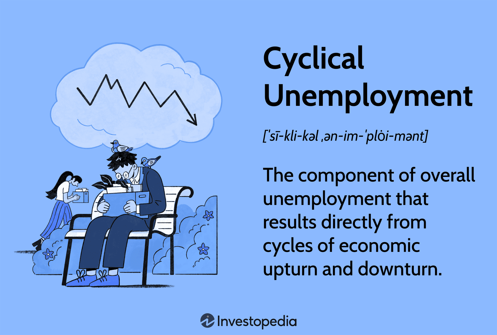

## Table of Contents

## What is cyclical unemployment?

Cyclical unemployment is a type of unemployment that happens because of the ups and downs in the economy. When the economy is not doing well, like during a recession, businesses might not make as much money. Because of this, they might have to lay off workers. This kind of unemployment goes up and down with the economic cycle, which is why it's called cyclical.

Governments and economists pay a lot of attention to cyclical unemployment because it shows how healthy the economy is. When the economy starts to get better, businesses start hiring again, and cyclical unemployment goes down. This type of unemployment is different from other types, like seasonal or structural unemployment, because it's directly tied to the overall economic performance.

## How does cyclical unemployment differ from other types of unemployment?

Cyclical unemployment is different from other types because it happens when the economy goes through a rough patch. Imagine the economy as a big machine that sometimes slows down. When it does, businesses make less money and might have to let workers go. This kind of unemployment goes away when the economy starts doing better again. It's like a roller coaster that goes up and down with the economy's health.

Other types of unemployment don't follow the economy's ups and downs in the same way. For example, seasonal unemployment happens because of the time of year, like when ski resorts close in the summer. Structural unemployment is when people can't find jobs because their skills don't match what jobs are available, maybe because of new technology. Frictional unemployment is when people are between jobs, looking for a new one that's a better fit. Each type has its own reasons and solutions, but cyclical unemployment is special because it's tied directly to how the whole economy is doing.

## What are the main causes of cyclical unemployment?

Cyclical unemployment happens when the economy goes through tough times, like a recession. During these periods, people buy less stuff because they're worried about money. When people buy less, businesses sell less and make less money. To save money, businesses might have to let workers go. This is why cyclical unemployment goes up when the economy is not doing well.

The main cause of cyclical unemployment is the natural ups and downs of the economy. Economists call these ups and downs the business cycle. When the economy is growing, businesses hire more people and unemployment goes down. But when the economy slows down or shrinks, businesses start laying off workers, and cyclical unemployment goes up. This type of unemployment is different from other types because it's directly linked to how the whole economy is doing, not just one industry or season.

## Can you explain the relationship between business cycles and cyclical unemployment?

Business cycles are like the heartbeat of the economy. They go up and down, with times of growth called expansions and times of slowdown called recessions. When the economy is in an expansion, businesses are doing well, selling more stuff, and making more money. Because they're doing well, they need more workers, so they hire more people. This means less cyclical unemployment because more people have jobs.

But when the economy hits a recession, things change. People start buying less because they're worried about money. Businesses sell less and make less money. To save money, businesses might have to lay off workers. This means more cyclical unemployment because more people are out of work. So, cyclical unemployment goes up and down with the business cycle, getting worse during recessions and better during expansions.

## What are some examples of industries most affected by cyclical unemployment?

Some industries that are hit hard by cyclical unemployment are construction and manufacturing. When the economy is doing well, people buy more houses and businesses build more factories. This means construction companies hire more workers to build these houses and factories. But when the economy slows down, people stop buying houses and businesses stop building new factories. This means construction companies have to lay off workers, leading to more cyclical unemployment.

Another industry that feels the ups and downs of the economy is the automotive industry. When people have more money, they buy more cars. Car companies hire more workers to make these cars. But when the economy is not doing well, people stop buying cars. Car companies then have to lay off workers because they don't need as many people to make cars. This also leads to more cyclical unemployment.

Retail and hospitality are also industries that can be affected by cyclical unemployment. When the economy is strong, people go out more, shop more, and travel more. This means more jobs in stores, restaurants, and hotels. But when the economy weakens, people cut back on going out, shopping, and traveling. This means fewer jobs in these industries, and more people might lose their jobs, increasing cyclical unemployment.

## How is cyclical unemployment measured and tracked?

Cyclical unemployment is measured and tracked by looking at the total unemployment rate and then figuring out how much of it is because of the economy's ups and downs. Economists start with the overall unemployment rate, which is the percentage of people who are out of work and looking for a job. They then subtract the types of unemployment that aren't caused by the economy's cycles, like structural and frictional unemployment. What's left is the cyclical unemployment, which shows how many people are out of work because the economy is not doing well.

To track cyclical unemployment over time, economists use data from government agencies like the Bureau of Labor Statistics in the United States. They look at trends in the unemployment rate and compare them to the health of the economy. When the economy goes into a recession, they expect to see the unemployment rate go up because of more cyclical unemployment. And when the economy starts growing again, they expect to see the unemployment rate go down as businesses start hiring again. By keeping an eye on these trends, economists can see how cyclical unemployment is changing and understand how well the economy is doing.

## What are the economic impacts of cyclical unemployment on a country?

Cyclical unemployment can have big effects on a country's economy. When a lot of people are out of work because the economy is not doing well, they don't have money to spend on things they want or need. This means businesses sell less stuff, which can make the economy even worse. It's like a cycle where less spending leads to more unemployment, which leads to even less spending. Governments also get less money from taxes because people are earning less, so it's harder for them to help the economy get better.

On the other hand, cyclical unemployment can also lead to changes in the economy that help it grow again. When businesses start hiring again because the economy is getting better, people start spending more money. This can kickstart the economy and lead to more jobs. Governments might also use policies like lowering interest rates or spending more money to help the economy recover faster. So, while cyclical unemployment can make things tough for a while, it's part of the ups and downs that economies go through, and it can lead to a stronger economy in the long run.

## What government policies are effective in reducing cyclical unemployment?

Governments can use different policies to help reduce cyclical unemployment. One way is by changing interest rates. When the economy is not doing well, the government can lower interest rates. This makes it cheaper for businesses to borrow money, so they might start new projects and hire more workers. It also makes it cheaper for people to borrow money to buy things like houses or cars, which can help the economy grow. Another way is through fiscal policy, where the government spends more money on things like building roads or schools. This creates jobs and helps people have more money to spend, which can make the economy stronger.

Another effective policy is providing unemployment benefits. When people lose their jobs during a recession, unemployment benefits give them money to live on while they look for new jobs. This helps them keep spending money, which can help the economy. Governments can also offer job training programs to help people learn new skills that are in demand. This can make it easier for them to find jobs when the economy starts to get better. By using these policies, governments can help reduce cyclical unemployment and make the economy stronger.

## How does cyclical unemployment affect different demographic groups?

Cyclical unemployment can hit different groups of people in different ways. Young people and those just starting their careers often feel it the most. When the economy slows down, businesses might cut back on hiring new workers. This means young people who are trying to get their first job or move up in their careers might have a harder time finding work. They might have to wait longer to start their careers or take jobs that don't match their skills or education.

Older workers can also be affected a lot by cyclical unemployment. When businesses need to save money, they might lay off older workers who have higher salaries. It can be harder for these workers to find new jobs because they might not want to take a pay cut or might need to learn new skills. This can make it tough for them to stay in the workforce. Women and minorities might also face more challenges during times of high cyclical unemployment, as they might already face other barriers in the job market.

## What are the long-term effects of cyclical unemployment on the labor market?

Cyclical unemployment can have big effects on the labor market over time. When a lot of people are out of work because the economy is not doing well, they might start to lose their skills. If they're out of work for a long time, it can be hard for them to find new jobs even when the economy gets better. This can lead to a weaker labor market where people are not as good at their jobs as they used to be. Also, when people are out of work for a long time, they might stop looking for jobs altogether. This can make the labor force smaller, which can hurt the economy in the long run.

Another long-term effect of cyclical unemployment is that it can change the kinds of jobs that are available. When businesses start hiring again after a recession, they might not hire back all the workers they let go. Instead, they might use new technology or change how they do things. This can mean fewer jobs in some industries and more jobs in others. People who were out of work might need to learn new skills to get these new jobs. If they can't, they might stay out of work longer, which can keep the labor market from getting back to normal.

## How do economists predict and forecast cyclical unemployment trends?

Economists use different tools and data to predict and forecast cyclical unemployment trends. They look at things like how much people are spending, how many new jobs are being created, and how well businesses are doing. They also use models that help them guess what might happen to the economy in the future. By looking at these things, economists can see if the economy is about to go into a recession or if it's going to start growing again. This helps them predict if cyclical unemployment is going to go up or down.

Another way economists forecast cyclical unemployment is by looking at past business cycles. They study how the economy has acted in the past and use that information to guess what might happen next. For example, if they see that the economy is slowing down in a way that's similar to past recessions, they might predict that cyclical unemployment will go up soon. By keeping an eye on these trends and using their models, economists can give businesses and governments a heads-up about what to expect, so they can plan better for the future.

## What are the global perspectives on managing cyclical unemployment?

Different countries around the world have their own ways of dealing with cyclical unemployment. In some places, governments focus on helping people who lose their jobs by giving them money while they look for new work. This can help people keep spending money, which can make the economy stronger. Other countries might try to make it easier for businesses to borrow money by lowering interest rates. This can help businesses start new projects and hire more people, which can lower cyclical unemployment. Each country's approach depends on its own economy and what its people need.

Globally, there's a lot of talk about how to manage cyclical unemployment better. Some countries work together to share ideas and learn from each other. For example, during big economic downturns like the global financial crisis, many countries worked together to come up with plans to help their economies recover. They used things like spending more money on projects to create jobs and helping businesses stay open. By working together and learning from each other, countries can find better ways to deal with cyclical unemployment and make their economies stronger.

## What causes unemployment?

Unemployment arises from several factors, each influencing different types of unemployment. Economic conditions, notably recessions, are a significant cause of cyclical unemployment. During a recession, there is a general decline in economic activity, which reduces the demand for goods and services. As businesses adjust to reduced consumer spending, they may cut production and lay off workers, leading to increased unemployment. This cyclical pattern aligns with economic cycles, where unemployment rises in downturns and decreases during periods of growth.

Another contributor to unemployment is technological advancement, which is often linked to structural unemployment. As technology evolves, industries may undergo significant transformation, affecting the demand for specific skills and occupations. For instance, automation and [artificial intelligence](/wiki/ai-artificial-intelligence) have replaced certain manual and routine tasks. Workers who possess skills that are no longer in demand may face prolonged unemployment unless they retrain or transition into new roles that require different competencies.

Seasonal demand fluctuations result in seasonal unemployment. This form of unemployment occurs at predictable times throughout the year as industries face varying demands due to seasonal changes. For example, retail and hospitality sectors may hire more employees during the holiday season to cater to increased consumer activity but may reduce their workforce once the season concludes. Similarly, agricultural jobs may decline after the harvest period.

To illustrate the impact of these causes, consider the relation of employment levels to demand in a simplified model:

$$
E = f(D, T, S)
$$

Where:
- $E$ represents employment levels.
- $D$ stands for demand influenced by economic conditions.
- $T$ indicates technological factors altering skill demand.
- $S$ accounts for seasonal variations.

In this framework, a decline in $D$ during recessions negatively impacts $E$, increasing cyclical unemployment. Advances in $T$ can shift skill requirements, affecting $E$ and contributing to structural unemployment. Fluctuations in $S$ affect $E$, leading to seasonal unemployment patterns.

Understanding these causes is crucial for policymakers aiming to mitigate unemployment's adverse effects. Addressing cyclical unemployment may involve fiscal or monetary policies to stimulate the economy, while tackling structural unemployment may require investment in education and training programs to equip the workforce with new skills. For seasonal unemployment, temporary measures or alternative employment opportunities during off-peak periods might be needed to stabilize employment levels year-round.

## References & Further Reading

[1]: Blanchard, O. J., & Johnson, R. (2013). ["Macroeconomics"](https://books.google.com/books/about/Macroeconomics.html?id=-jQZMAEACAAJ). Pearson.

[2]: Krugman, P. R., & Wells, R. (2018). ["Economics"](https://www.amazon.com/Economics-Paul-Krugman/dp/1319244947). Worth Publishers.

[3]: Lam, J. (2014). ["Enterprise Risk Management: From Incentives to Controls."](https://onlinelibrary.wiley.com/doi/book/10.1002/9781118836477) Wiley Finance.

[4]: Hull, J. C. (2018). ["Options, Futures, and Other Derivatives"](https://www.semanticscholar.org/paper/Options%2C-Futures%2C-and-Other-Derivatives-Hull/89bdee500c8623864fc9eb7a471546aa713acc44). Pearson.

[5]: Brynjolfsson, E., & McAfee, A. (2014). ["The Second Machine Age: Work, Progress, and Prosperity in a Time of Brilliant Technologies"](https://psycnet.apa.org/record/2014-07087-000). W. W. Norton & Company. 

[6]: Mandelbrot, B. B. (2004). ["The (Mis)behavior of Markets: A Fractal View of Risk, Ruin, and Reward"](https://books.google.com/books/about/The_Mis_Behaviour_of_Markets.html?id=zg91TAIs6bgC). Basic Books.

[7]: Baker, S. R., Bloom, N., & Davis, S. J. (2016). ["Measuring Economic Policy Uncertainty."](https://academic.oup.com/qje/article/131/4/1593/2468873) The Quarterly Journal of Economics, 131(4), 1593-1636.