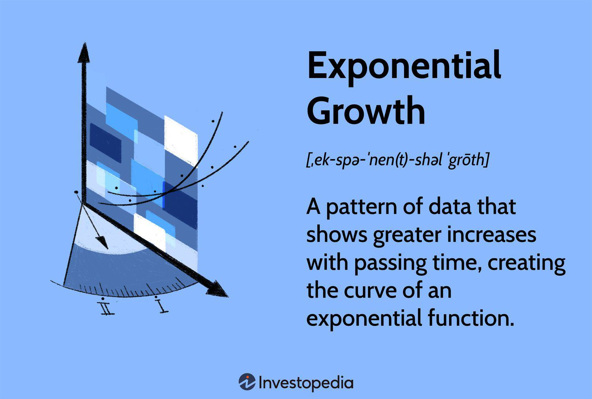

In this article, we explore the unique intersection of 'cylinder functionality' and algorithmic trading, highlighting examples where these concepts blend strategically. Cylinder functionality in financial markets involves derivative transactions with no initial cash investment, commonly found in forex and options. These allow traders to create positions with potentially high pay-offs, presenting a nuanced balance of risk and reward.

Algorithmic trading, on the other hand, employs computer programs to execute pre-defined trading instructions, facilitating rapid and precise trade execution. It allows traders to base decisions on quantitative analysis, eliminating emotional influences, and is particularly effective in processing large data sets instantly, benefiting high-frequency trading strategies.



Understanding these concepts provides a foundation for integrating cylinder transactions into algo trading. This integration can enhance trading performance by strategically leveraging derivatives, minimizing upfront capital and maximizing returns. We'll define key terms and establish a foundational understanding, enabling a comprehensive view of how cylinder strategies can optimize algorithmic trading outcomes.

## Table of Contents

## What is Cylinder Functionality in Finance?

Cylinder functionality in finance primarily refers to specific transactions in the derivative markets, such as foreign exchange (forex) and options, where no initial cash investment is required. These transactions are often embedded within structured financial product interactions, offering distinctive risk and reward profiles.

At the core of cylinder functionality is the conceptual framework allowing traders to engage in market activities without an upfront capital commitment. This is typically achieved through the strategic use of derivative instruments, which are financial contracts that derive their value from an underlying asset, index, or rate. A classic example is the creation of a "cylinder" conducted through options. Such a setup might involve selling a put option to acquire premiums, which are then used to purchase a call option. This series of transactions essentially creates a synthetic position in the underlying asset without deploying initial cash.

These transactions theoretically facilitate more significant speculative or hedging activities by leveraging potential price movements of the underlying assets. The lack of an initial cash investment is accomplished by offsetting income from selling one derivative to pay for another, providing an attractive leverage model.

However, while the absence of an initial cash outlay can be advantageous, cylinder transactions are not without substantial risk. Such transactions demand a sophisticated understanding of the derivatives market, as they may lead to significant liabilities if market movements are unfavorable. Consequently, traders and financial institutions often employ cylinder functionalities within portfolios that are managed meticulously to balance potential returns against associated risks. Adequate risk management and a deep understanding of market behavior are crucial in ensuring that these strategies are beneficial and do not result in unintended financial exposures.

In summary, cylinder functionality represents a nuanced mechanism within derivative markets that enables complex trading strategies potentially augmenting returns without immediate capital investment. The sophistication in executing such strategies comes from accurately anticipating market trends and effectively managing the intricate layers of risk involved.

## Understanding Algo Trading

Algorithmic trading, commonly referred to as algo trading, is a method of executing trades using pre-programmed instructions or algorithms. These algorithms determine aspects such as timing, price, and quantity, allowing trades to be executed at speeds and frequencies that are impossible for human traders.

The primary advantage of [algorithmic trading](/wiki/algorithmic-trading) is its ability to execute trades with precision, ensuring that transaction costs are minimized and execution times are optimal. By automating the trading process, traders can eliminate the emotional biases that often influence decision-making, ensuring that trades are based purely on quantitative analysis and statistical models. This allows for a more disciplined approach to trading, adhering strictly to the strategies defined by the algorithm.

Algo trading relies heavily on the ability to process large volumes of market data swiftly, making it particularly suited for high-frequency trading ([HFT](/wiki/high-frequency-trading-strategies)) strategies. High-frequency trading involves making thousands to millions of trades in fractions of a second, capitalizing on small price changes in the market. The essence of algo trading in this context is its computational power, enabling it to analyze vast datasets instantaneously.

Python, as a programming language, is frequently used in algo trading due to its simplicity and the extensive libraries available for data analysis. A basic example of a Python script for a simple moving average crossover strategy is as follows:

```python
import pandas as pd
import numpy as np

# Load historical data
data = pd.read_csv('historical_data.csv')
data['SMA_50'] = data['Close'].rolling(window=50).mean()
data['SMA_200'] = data['Close'].rolling(window=200).mean()

# Generate signals
data['Signal'] = 0
data['Signal'][50:] = np.where(data['SMA_50'][50:] > data['SMA_200'][50:], 1, -1)

# Calculate returns
data['Returns'] = data['Close'].pct_change()
data['Strategy_Returns'] = data['Returns'] * data['Signal'].shift(1)

# Output cumulative returns
cumulative_returns = (1 + data['Strategy_Returns']).cumprod() - 1
print(cumulative_returns.tail())
```

This code snippet demonstrates how algorithms can be used to exploit simple trading rules, such as moving average crossovers, to make informed trading decisions. By leveraging advanced statistical methods and computational tools, algorithmic trading has become a cornerstone of modern financial markets, offering enhanced efficiency and opportunities for profit.

## Integrating Cylinder Transactions with Algo Trading

The integration of cylinder transactions in algorithmic trading strategies provides creative ways for traders to exploit derivatives and potentially enhance their returns. This involves developing positions that require minimal or no initial capital while offering substantial upside potential. A typical approach includes the formation of options cylinders, which use a combination of put and call options to strategically adjust exposure to an asset's anticipated market movements.

In an options cylinder setup, traders begin by selling put options. The premiums earned from these sold puts supply the funds to purchase call options, thereby crafting a trade where the initial outlay is minimized. This creates a cost-neutral position that balances exposure. The put options commit traders to buying the underlying security if it falls below a certain price (strike price), while the call options permit them to capitalize on gains if the market price exceeds another predefined level. The net effect is a "cylinder" risk profile where potential losses and gains are limited by the combined strike prices of the puts and calls.

A simplified example of such a strategy could involve a trader targeting a specific stock expected to exhibit significant price movement. Suppose the current stock price is $100. The trader might sell puts with a strike price of $95, receiving a premium, and buy calls with a $105 strike price. The premiums from the sold puts effectively subsidize the purchased calls. The risk associated with this setup hinges on the stock price breaching either strike level at expiration.

Algorithmic trading optimizes the execution of this cylinder strategy. By automating trades, algorithms ensure precise entry and [exit](/wiki/exit-strategy) points, adapting quickly to market conditions. They simplify complex calculations and risk assessments, allowing for rapid execution without human emotion impacting decision-making.

Here’s a simple Python script illustrating the calculation for potential earnings of an option cylinder: 

```python
def option_cylinder_profit(stock_price, put_strike, call_strike, put_premium, call_premium):
    net_premium = put_premium - call_premium
    if stock_price < put_strike:
        payoff = (put_strike - stock_price) + net_premium
    elif stock_price > call_strike:
        payoff = (stock_price - call_strike) + net_premium
    else:
        payoff = net_premium
    return payoff

stock_price = 100
put_strike = 95
call_strike = 105
put_premium = 3
call_premium = 3

print(option_cylinder_profit(stock_price, put_strike, call_strike, put_premium, call_premium))
```

This script evaluates the potential profit of a cylinder strategy given a set of option strike prices and premiums. The key takeaway is the ability of algorithms to precisely manage and implement such strategies under defined market conditions, thus increasing the efficiency and reliability of trading activities.

The integration of cylinder transactions and algorithmic trading captures the alignment of derivative market mechanics with automated systems. In practice, these approaches demand rigorous risk assessments and computational capabilities to protect against unfavorable price shifts. As such, building a robust infrastructure to support these transactions involves combining financial expertise with technical prowess, ensuring optimal performance.

## Examples of Cylinder Functionality in Algorithmic Trading

Implementing cylinder functionality in algorithmic trading can be demonstrated through examples involving both equity and [forex](/wiki/forex-system) markets. A notable example is handling XYZ Corporation's stock through a combination of call and put options executed without an initial cash outlay. This technique involves constructing a balanced trade strategy by selling put options to collect premiums, which then fund the purchase of call options. Such a setup is designed to maintain minimal upfront capital while benefiting from potential upward or downward movements of the stock.

Traders utilitize algorithms to precisely time these transactions, thereby maintaining the intended risk exposure without the need for manual intervention. Algorithms can continuously monitor market conditions, automatically executing the necessary buy and sell orders according to the predefined strategy. This automated oversight ensures trades are executed at optimal moments, reacting to rapid market changes much faster than a human trader could.

In the forex market, traders leverage similar principles in currency hedging strategies, automating their execution using algorithmic systems. For instance, they might initiate a cylinder-based strategy by writing an option contract on a currency pair and using the collected premium to purchase another option. By doing so, traders achieve an exposure to currency fluctuations that requires no initial cash. Algorithms serve crucial roles in such setups by managing the timing of trades, adhering to the strategic parameters without human intervention.

Python, a favored language among traders for its robust libraries and easy syntax, is commonly employed for these tasks. Below is a simplified example of a Python code snippet that might be used to automate a part of this process:

```python
import yfinance as yf
from datetime import datetime
import numpy as np

def execute_cylinder(stock_ticker, target_call_price, target_put_price):
    stock_data = yf.Ticker(stock_ticker)
    call_option = stock_data.option_chain().calls
    put_option = stock_data.option_chain().puts

    # Find the desired options based on target prices
    target_call = call_option[np.isclose(call_option['strike'], target_call_price)].iloc[0]
    target_put = put_option[np.isclose(put_option['strike'], target_put_price)].iloc[0]

    # Check conditions and execute options trade algorithmically
    if current_market_conditions_met():
        sell_put(target_put)
        buy_call(target_call)
        print(f"Executed cylinder transaction for {stock_ticker}")
    else:
        print("Market conditions not met, holding off on transaction")

def current_market_conditions_met():
    # Placeholder function to evaluate market conditions
    # Implement specific market logic here
    return True

execute_cylinder('XYZ', 100, 95)
```

In this example, yfinance is used to obtain current options data, and numpy is applied for strike price comparison. The goal is to automate the selection and execution of appropriate options contracts. Algorithms like these simplify complex trades, maintain strategic adherence, and eliminate emotional bias, all while maximizing the intended financial leverage without upfront investment.

Ultimately, the success of such strategies demands robust computational resources and access to real-time market data to ensure optimal performance and to rapidly respond to market dynamics. The convergence of cylinder functionality and algorithmic trading exemplifies innovative financial engineering, pushing the boundaries of conventional trading methodologies.

## Benefits and Risks of Cylinder-Based Algo Trading Strategies

Cylinder-based strategies in algorithmic trading provide the opportunity to maximize leverage effectively while potentially yielding high returns without the necessity of an initial cash investment. This strategy is particularly attractive for traders looking to exploit market opportunities with minimal upfront capital, allowing for a more capital-efficient approach to trading. However, this leverage also introduces unique risks that require careful management.

### Benefits

1. **Maximized Leverage**: By utilizing financial derivatives such as options, traders can control significant positions without the need for proportional capital. This enhances the potential return on investment compared to traditional trading methods. For instance, by selling put options to accumulate premium and using this premium to fund call options, traders construct trades that maintain exposure to market movements without direct initial cash outlay.

2. **Potential for High Returns**: Given the leverage involved, cylinder-based strategies can significantly amplify returns if the market moves favorably. The combination of call and put options can exploit volatility, allowing traders to capitalize on significant price movements. This strategy is particularly effective in volatile markets where price swings are more pronounced.

3. **Efficient Capital Use**: With no initial cash requirement, traders can allocate their capital more efficiently across various positions or strategy implementations, thereby diversifying their portfolio and managing their asset allocation with greater flexibility.

### Risks

1. **Market Liability**: While cylinder strategies do not require upfront cash, they expose traders to potential liabilities if market movements are unfavorable. For example, if the market moves against the structured option position, the losses can be substantial, often requiring collateral or additional margin to cover potential losses.

2. **Complex Risk Management**: The nature of these derivative strategies necessitates sophisticated risk management protocols. Traders must accurately predict market movements and have contingency measures in place, such as stop-loss limits or hedging instruments, to mitigate potential adverse effects.

3. **Resource Intensive**: Implementing these strategies effectively requires substantial computational resources and access to real-time market data. Automated trading systems must process vast amounts of market information instantaneously to execute trades accurately and swiftly, which demands significant technological investment.

4. **Automated Systems Dependency**: While automated systems can reduce human emotional biases and errors in execution, they also pose systemic risks. Technical glitches, algorithmic errors, or inadequacies in data can lead to unexpected trading results, necessitating constant monitoring and adjustment.

In summary, cylinder-based algorithmic trading strategies provide a potent combination of leverage and potential profitability, suited to traders equipped with advanced technology and deep market understanding. Careful consideration of the associated risks is critical, with a well-structured risk management system paramount to navigating the intricacies of market dynamics.

## Conclusion

Cylinder functionality offers distinct possibilities within derivative markets, particularly when woven into algorithmic trading strategies. These strategies provide innovative solutions by allowing traders to construct positions that aim for high returns with minimal or no initial cash outlay. This ability to capitalize on market movements without substantial upfront investment can lead to significant gains.

However, the intricate nature of cylinder transactions means they are not without risk. Strategies that maximize leverage also amplify potential liabilities, especially if market conditions behave unexpectedly. To navigate these risks effectively, traders need to be well-versed in both advanced technology and financial instruments. A robust understanding of market dynamics, coupled with sophisticated risk management techniques, is crucial for sustaining profitability and safeguarding against potential downsides.

As financial markets and technologies advance, the future of trading will inevitably incorporate more sophisticated methods that blend innovative financial concepts like cylinder functionality with algorithmic execution. Continuous education and adaptation will be essential for traders aiming to harness these evolving strategies effectively. The importance of staying informed and technologically equipped cannot be overstated, as this knowledge will be vital for seizing new opportunities and maintaining a competitive edge in an increasingly complex trading environment.

## References & Further Reading

[1]: Chance, D. M., & Brooks, R. (2015). ["Introduction to Derivatives and Risk Management."](https://books.google.com/books/about/Introduction_to_Derivatives_and_Risk_Man.html?id=b8PgBQAAQBAJ) Cengage Learning.

[2]: Hull, J. C. (2018). ["Options, Futures, and Other Derivatives."](https://www.semanticscholar.org/paper/Options%2C-Futures%2C-and-Other-Derivatives-Hull/89bdee500c8623864fc9eb7a471546aa713acc44) Pearson.

[3]: Lopez de Prado, M. L. (2018). ["Advances in Financial Machine Learning."](https://www.amazon.com/Advances-Financial-Machine-Learning-Marcos/dp/1119482089) Wiley.

[4]: Jansen, S. (2020). ["Machine Learning for Algorithmic Trading: Predictive Models to Extract Signals From Market and Alternative Data for Systematic Trading Strategies with Python."](https://github.com/stefan-jansen/machine-learning-for-trading) Packt Publishing.

[5]: Chan, E. (2008). ["Quantitative Trading: How to Build Your Own Algorithmic Trading Business."](https://github.com/ftvision/quant_trading_echan_book) Wiley Trading.

[6]: Aronson, D. R. (2007). ["Evidence-Based Technical Analysis: Applying the Scientific Method and Statistical Inference to Trading Signals."](https://onlinelibrary.wiley.com/doi/book/10.1002/9781118268315) Wiley.