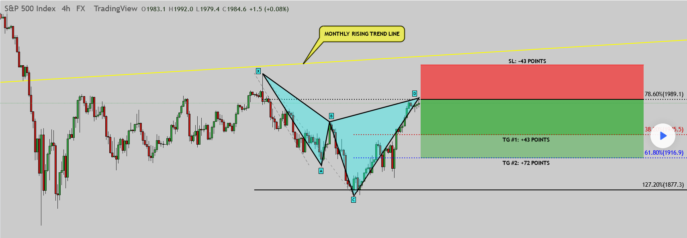

In algorithmic trading, chart patterns serve as invaluable tools for predicting market movements. Among these, the Cypher pattern stands out for its potential in identifying price reversals. This pattern is especially significant due to its distinct structure, which leverages specific Fibonacci levels to predict potential market turning points. Unlike some more common harmonic patterns, the Cypher is unique for its precision and reliability, albeit less frequently occurring.

Traders utilizing algorithmic frameworks benefit from the Cypher pattern's ability to signal possible reversal zones with a high degree of accuracy. By integrating this pattern into trading strategies, traders can enhance their decision-making processes, particularly when dealing with volatile or unpredictable markets. Furthermore, the Cypher pattern offers opportunities to optimize entry and exit points within a trade, thereby potentially increasing profitability.



This article aims to provide a comprehensive understanding of the Cypher pattern, exploring its structural nuances and identification techniques. Additionally, we will examine its application within trading strategies, addressing how traders can effectively incorporate this pattern into their algorithmic systems. Through this exploration, traders can gain a more profound insight into leveraging the Cypher pattern to improve their market predictions and strategic executions.

## Table of Contents

## Understanding the Cypher Pattern

The Cypher pattern is a distinct type of harmonic pattern recognized for its reliance on Fibonacci ratios to forecast potential price reversals. Originating from the work of Darren Oglesbee, the Cypher pattern is less prevalent in trading circles compared to other harmonic patterns, such as the Gartley or Butterfly patterns. However, it possesses a significant reliability when identified accurately.

The pattern consists of five points labeled X, A, B, C, and D, and is structured through four connecting legs: XA, AB, BC, and CD. These legs are defined by precise Fibonacci retracement and extension levels, which are fundamental in the pattern's formation and identification. 

1. **Structure and Fibonacci Ratios**: 
   - The pattern commences with the XA leg, forming the initial thrust.
   - The AB leg is a retracement, typically aligning between 38.2% to 61.8% of the XA leg.
   - The BC leg extends beyond point B, reaching between 127.2% to 141.4% of the XA leg, which defines its distinct extension characteristic.
   - The pattern culminates with the CD leg, which retraces 78.6% of the entire XC move. This specific retracement completes the Cypher pattern and signals the formation of a Potential Reversal Zone (PRZ).

2. **Potential Reversal Zones (PRZ)**:
   - The Cypher pattern's unique formation makes it highly adept at indicating PRZs, where traders anticipate potential reversals in price direction.
   - These reversals can occur in both bullish and bearish market contexts, offering traders strategic entry and exit points.

By adhering to these precise Fibonacci levels, the Cypher pattern provides traders with an analytical edge, combining pattern recognition with mathematical precision. While it requires meticulous attention to detail and understanding of Fibonacci ratios, when executed correctly, the Cypher can be a powerful component of a trader's toolkit. Its ability to signal both bullish and bearish reversals with strategic Fibonacci placement underscores its utility in crafting successful trading strategies.

## Identifying the Cypher Pattern

Identifying a Cypher pattern requires precise attention to specific Fibonacci ratios that define its distinct structure. The pattern consists of five key points: X, A, B, C, and D, connected by four legs: XA, AB, BC, and CD. Recognizing this pattern effectively involves assessing these legs in relation to particular Fibonacci retracement and extension levels.

1. **AB Leg Retracement**: The first step in identifying a Cypher pattern is to analyze the AB leg in relation to the XA leg. The AB leg should retrace between 38.2% to 61.8% of the XA leg. This retracement range is crucial for establishing the validity of the pattern's initial segment.

2. **BC Leg Extension**: The next component, BC, extends beyond the XA leg to a level that typically reaches between 127.2% to 141.4%. This extension serves as a distinguishing feature, setting the Cypher apart from other harmonic patterns and confirming the pattern's unique extension property.

3. **CD Leg Completion**: The Cypher pattern concludes with the CD leg. Completion is confirmed when the CD leg retraces 78.6% of the XC move. This specific level of retracement is integral in determining the final point of the pattern and is indicative of the potential reversal zone (PRZ).

Traders can utilize a range of methods to identify Cypher patterns in their analysis. Many opt for pattern recognition tools and software capable of automating the identification process by detecting these precise Fibonacci levels on a chart. Alternatively, skilled traders may choose manual techniques, applying their experience and insight to recognize potential Cypher patterns amidst fluctuating market data. In both cases, accurately identifying the Fibonacci ratios is essential for leveraging the Cypher pattern in trading strategies.

## Trading Cypher Patterns in Algo Trading

Successful trading of the Cypher pattern involves capitalizing on its predictive capabilities around the D point, where traders often anticipate a market reversal. The precision of trading at this juncture can significantly affect the outcome of trades. 

To manage risk, traders typically set stop-loss orders slightly beyond the D point. This strategy serves as a safeguard against false signals and unexpected market movements that could counter the anticipated reversal. By placing stop-losses judiciously, traders enhance their ability to protect their positions from substantial losses.

Profit targets for the Cypher pattern are commonly established at previous swing highs or lows. These are key areas where price is likely to face resistance or support, making them strategic points for realizing profits. Additionally, Fibonacci retracement levels, such as the 38.2% or 61.8% of the CD leg, are frequently used as profit objectives. These levels are chosen based on the historical tendencies of price action to reverse or pause, allowing traders to systematically capture potential profits.

Algorithmic traders leverage the Cypher pattern by employing automated scripts to accurately detect patterns and execute trades. The automation of this process is crucial, allowing for rapid response to market conditions without the delay inherent in manual trading. Algorithms are programmed to identify the specific Fibonacci relationships that define the Cypher pattern, thus enabling quick and efficient entry and [exit](/wiki/exit-strategy) positions. The robustness of these algorithms is typically assured through extensive back-testing, which is crucial for determining the efficacy of the strategy under various market conditions.

Below is a simple Python script snippet that illustrates how algorithmic traders might implement a Cypher pattern detection algorithm:

```python
import numpy as np

# Function to calculate Fibonacci retracement
def fib_retracement(point_a, point_b):
    return np.round([point_b + (point_a - point_b) * ratio for ratio in [0.382, 0.618, 0.786]], 2)

# Example price data points for Cypher pattern
X, A, B, C = 1.0, 1.1, 1.05, 1.15

# Calculate potential D point using Fibonacci retracement for the CD leg
potential_D_points = fib_retracement(C, X)

print(f"Potential D Points: {potential_D_points}")
```

In this script, the function `fib_retracement` calculates potential reversal zones—D points—by applying Fibonacci ratios to the XC move, demonstrating a core component of the [algorithmic trading](/wiki/algorithmic-trading) strategy involving Cypher patterns. By integrating such coding processes, traders can refine their execution timing, reduce discretion, and consistently apply their trading strategies.

## The Efficacy of Cypher Patterns

The Cypher pattern, while renowned for its accuracy, is not without its limitations. Its efficacy is significantly influenced by the prevailing market conditions. Traders often observe more favorable results when employing the Cypher pattern in ranging or slightly trending markets. This stems from the pattern's ability to effectively identify potential reversal points in such environments, where abrupt market movements are less likely to negate its predictive power.

One distinct advantage of the Cypher pattern is its rarity. Unlike more commonly occurring patterns, the infrequent appearance of the Cypher can lead to clearer signals due to reduced market noise. Traders and algorithmic systems are thus able to react more decisively when the pattern manifests, increasing the likelihood of success in trades based on its signals.

However, to harness the full potential of the Cypher pattern, traders must engage in rigorous [backtesting](/wiki/backtesting) using historical data. This process is critical for several reasons. First, it allows traders to gauge the pattern's past performance across different market conditions, offering insights into its reliability and adaptability. Second, backtesting facilitates the optimization of trading strategies by identifying the most effective parameters, such as entry and exit points, stop-loss orders, and profit targets. 

Utilizing programming languages like Python, traders can develop algorithms to automate this process. A simple backtesting script might look like this:

```python
import pandas as pd

def is_cypher_pattern(data):
    # Placeholder function to detect Cypher pattern
    pass

def backtest strategy(data, strategy):
    results = []

    for index in range(len(data)):
        if is_cypher_pattern(data[index]):
            # Execute strategy
            trade_result = strategy(data[index:])
            results.append(trade_result)

    return results

historical_data = pd.read_csv("historical_market_data.csv")
results = backtest_strategy(historical_data, trading_strategy)

print("Backtest Results:", results)
```

In conclusion, while the Cypher pattern offers a high degree of precision, its effectiveness is contingent on careful analysis and optimal market conditions. By reducing reliance on common patterns, traders can leverage the Cypher pattern to enhance their trading strategies, provided they commit to diligent backtesting and strategizing.

## Conclusion

The Cypher pattern represents a significant opportunity for traders to identify market reversals with considerable accuracy. This harmonic pattern's effectiveness in predicting price reversals stems from its precise use of Fibonacci levels, which are critical in defining its structure. By understanding these Fibonacci ratios and the pattern's unique configuration, traders can effectively integrate the Cypher into algorithmic strategies to enhance their market decision-making capabilities.

To maximize the utility of the Cypher pattern, a comprehensive approach involving diligent backtesting is essential. Historical data analysis allows traders to evaluate the pattern's performance under various market conditions, thereby optimizing trading strategies for actual market applications. Backtesting also aids in fine-tuning parameters such as entry points, stop-loss orders, and profit targets, which are fundamental to successful trading.

Furthermore, the dynamic nature of financial markets necessitates continuous learning and analysis to master the Cypher pattern. Market conditions and [volatility](/wiki/volatility-trading-strategies) can influence the pattern's effectiveness, highlighting the need for ongoing adaptation and refinement of trading strategies. By employing robust pattern recognition tools and leveraging algorithmic trading techniques, traders can swiftly execute trades based on the Cypher pattern, increasing the likelihood of capturing profitable market movements.

Incorporating the Cypher pattern into an algorithmic trading framework thus requires a blend of technical expertise and strategic foresight. By maintaining a thorough understanding of the pattern's structure and remaining vigilant to market changes, traders can capitalize on the Cypher's potential as a predictive tool. This dedication to mastery not only enhances trading performance but also cultivates a deeper comprehension of market dynamics overall.

## References & Further Reading

[1]: Oglesbee, D. (2012). ["Harmonic Trading, Volume Two: Advanced Strategies for Profiting from the Natural Order of the Financial Markets"](https://www.oreilly.com/library/view/harmonic-trading-volume/9780132171762/) by Scott M. Carney.

[2]: Carney, S. M. (2004). ["Harmonic Trading, Volume One: Profiting from the Natural Order of the Financial Markets"](https://books.google.com/books/about/Harmonic_Trading_Volume_One.html?id=myqVlwufBxsC). 

[3]: Pesavento, J. M. (1997). "Fibonacci Ratios with Pattern Recognition." Fibonacci Trader.

[4]: Bulkowski, T. (2005). ["Encyclopedia of Chart Patterns (2nd Edition)"](https://www.amazon.com/Encyclopedia-Chart-Patterns-Thomas-Bulkowski/dp/0471668265). 

[5]: ["Technical Analysis Using Multiple Timeframes"](https://www.amazon.com/Technical-Analysis-Using-Multiple-Timeframes/dp/B007NXQHWW) by Brian Shannon.

[6]: ["Trading Harmonic Patterns With Fibonacci Retracements"](https://www.protradingschool.com/harmonic-patterns/) - Investopedia Article on Harmonic Patterns.

[7]: Mayer, M. (2017). ["The Complete Guide to Market Breadth Indicators: How to Integrate Market, Sector, Stock and Theme Analysis"](https://stockcharts.com/articles/dancing/2019/12/the-complete-guide-to-market-b-138.html).

[8]: Rath, C. (2019). ["The Advanced Fibonacci Trading Course: A Front to Back Guide to Understanding Fibonacci Price Action Analysis."](https://www.physio-pedia.com/Functional_Anatomy_of_the_Knee)