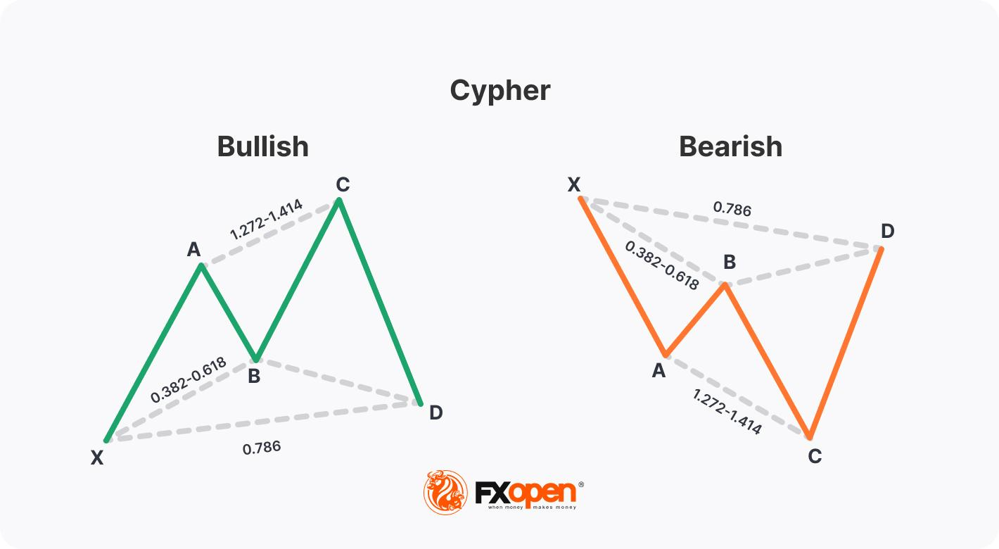

## Table of Contents

## What is the Cypher pattern in trading?

The Cypher pattern is a type of harmonic pattern used in trading to predict potential price reversals in financial markets. It is similar to other harmonic patterns like the Butterfly and Gartley, but has its own unique structure. The pattern consists of four main points labeled X, A, B, and C, and it forms a specific shape on the price chart that traders look for to make trading decisions.

To identify a Cypher pattern, traders look for specific Fibonacci ratios between the different points of the pattern. The key ratios are: the BC leg should be a 1.272 extension of the AB leg, and the CD leg should be a 0.786 retracement of the XA leg. When these ratios align correctly, it suggests that the price might reverse at point D, which is where traders often enter trades. The Cypher pattern helps traders find potential entry and exit points, but it should be used along with other analysis tools for better results.

## How does the Cypher pattern differ from other harmonic patterns?

The Cypher pattern is different from other harmonic patterns like the Butterfly, Gartley, and Bat in its specific structure and Fibonacci ratios. While all harmonic patterns use Fibonacci retracement and extension levels to identify potential reversal points, the Cypher pattern has unique ratios that set it apart. For example, in the Cypher pattern, the BC leg is a 1.272 extension of the AB leg, and the CD leg is a 0.786 retracement of the XA leg. These specific ratios are different from those used in other patterns, making the Cypher pattern unique.

Another key difference is the shape that the Cypher pattern forms on the price chart. Unlike the Gartley or Butterfly patterns, which have more symmetrical shapes, the Cypher pattern has a distinctive look where the B point extends beyond the X point. This creates a more elongated and less symmetrical appearance compared to other harmonic patterns. Traders need to recognize this specific shape to effectively use the Cypher pattern in their trading strategies.

## What are the key Fibonacci levels used in identifying a Cypher pattern?

The Cypher pattern uses specific Fibonacci levels to help traders spot when a price might turn around. The most important levels are the 1.272 extension and the 0.786 retracement. When you're looking at the chart, you need to find where the BC leg is a 1.272 extension of the AB leg. This means that the distance from B to C should be 1.272 times the distance from A to B.

The other key level is the 0.786 retracement of the XA leg, which happens from point C to D. This means that the distance from C to D should be 78.6% of the distance from X to A. By using these two Fibonacci levels, traders can figure out where the Cypher pattern might end and where they should think about buying or selling.

## Can you explain the structure of a Cypher pattern with an example?

The Cypher pattern is made up of four points labeled X, A, B, C, and D. It starts at point X, then moves to A, then to B, then to C, and finally to D. The important thing is the distances between these points. The distance from B to C should be 1.272 times the distance from A to B. This is called a 1.272 extension. Also, the distance from C to D should be 78.6% of the distance from X to A. This is called a 0.786 retracement. When these distances match up, it forms a Cypher pattern.

Let's say you're looking at a stock chart. The price starts at $100 (point X), then drops to $90 (point A), then goes up to $105 (point B), then drops to $95 (point C), and finally goes back up to $97 (point D). Here, the distance from A to B is $15 ($105 - $90), and the distance from B to C is about $10 ($105 - $95). The 1.272 extension of $15 is $19.08, which is close to the $10 drop from B to C. The distance from X to A is $10 ($100 - $90), and the distance from C to D is $2 ($97 - $95). The 0.786 retracement of $10 is $7.86, which is close to the $2 rise from C to D. When these numbers line up, you might have a Cypher pattern, and it could mean the price might change direction at point D.

## What are the entry points for trading a Cypher pattern?

When you see a Cypher pattern on a chart, the main place to start trading is at point D. This is where the pattern finishes, and it's where you think the price might turn around. If the price has been going down before point D, you might want to buy at this point, hoping it will start going up. If the price has been going up before point D, you might want to sell at this point, hoping it will start going down. You can set your buy or sell order a little bit above or below point D to make sure you get into the trade.

Besides point D, you can also look at other places to start trading. Some traders like to enter a trade a bit earlier, at point C, especially if they see other signs that the price might change direction soon. But this can be riskier because the pattern might not finish as expected. Another place to think about is after the price moves away from point D. If it looks like the price is really starting to move in the new direction, you might decide to join the trade then. Always use other tools and signs to help you decide the best time to start trading.

## How do you set stop-loss orders when trading with the Cypher pattern?

When trading with the Cypher pattern, setting a stop-loss order helps protect you from big losses if the price doesn't move the way you expect. A common place to set your stop-loss is just past point X if you're buying at point D, or just before point X if you're selling at point D. This is because point X is the highest or lowest point in the pattern, and if the price goes past it, it might mean the pattern didn't work out.

Another way to set your stop-loss is to use a smaller distance, like a certain percentage or a fixed amount away from your entry point at D. This can help you stay in the trade longer if the price moves a bit against you but still comes back in your favor. Always think about how much risk you're okay with and adjust your stop-loss to match your trading plan.

## What are the potential take-profit levels when using the Cypher pattern?

When you trade using the Cypher pattern, you want to know where to take your profit. A common place to aim for is the 38.2% or 61.8% Fibonacci retracement levels of the XA leg. If you bought at point D, you would look for the price to go up to these levels from point D. If you sold at point D, you would look for the price to go down to these levels from point D. These levels give you a good idea of where the price might stop moving in your favor.

Another way to set your take-profit is to look at the overall trend of the market. If the market has been going up before the Cypher pattern, you might want to take profit at a higher level, like the 1.618 extension of the CD leg. If the market has been going down, you might aim for a lower level, like the 1.618 extension of the CD leg in the opposite direction. It's good to use other tools and signs to help you decide the best place to take your profit.

## How can traders confirm a valid Cypher pattern before entering a trade?

To confirm a valid Cypher pattern, traders need to look at the Fibonacci levels carefully. The BC leg should be a 1.272 extension of the AB leg, and the CD leg should be a 0.786 retracement of the XA leg. If these numbers match up, it's a good sign that you might have a real Cypher pattern. But it's not enough just to look at the numbers. You should also check the overall shape of the pattern on the chart. The B point should go past the X point, making the pattern look a bit stretched out compared to other harmonic patterns.

Besides checking the Fibonacci levels and the shape, traders should also use other tools to make sure the pattern is real. Look at things like support and resistance levels, trend lines, and other chart patterns to see if they agree with what the Cypher pattern is telling you. It's also a good idea to use indicators like the Relative Strength Index (RSI) or Moving Averages to see if they show the price might be ready to turn around at point D. By using these extra checks, you can feel more confident that the Cypher pattern you see is valid and that it's a good time to enter a trade.

## What are common mistakes to avoid when trading the Cypher pattern?

One common mistake traders make when trading the Cypher pattern is relying too much on the pattern alone. Just because the Fibonacci levels and the shape look right doesn't mean you should jump into a trade without checking other things. Always use other tools like support and resistance levels, trend lines, and indicators like the RSI to make sure the pattern is really telling you the price will turn around at point D. Ignoring these extra checks can lead to entering trades that don't work out as expected.

Another mistake is setting stop-loss orders too tight or too far away. If your stop-loss is too close to your entry point, you might get stopped out of a good trade just because the price moves a bit against you. But if your stop-loss is too far away, you could lose a lot of money if the trade goes wrong. Find a balance that fits your risk level. Also, don't forget to set take-profit levels. Without them, you might hold onto a winning trade too long and lose your profits when the price turns back.

## How does market volatility affect the reliability of the Cypher pattern?

Market [volatility](/wiki/volatility-trading-strategies) can make it harder to trust the Cypher pattern. When the market moves a lot and prices change quickly, it can mess up the Fibonacci levels that are so important for the Cypher pattern. If the price jumps around a lot, it might look like you have a Cypher pattern when you really don't, or the pattern might not finish the way you expect. This can make you think the price will turn around at point D, but because of the high volatility, it might keep going instead.

Because of this, it's a good idea to be extra careful when trading the Cypher pattern during times of high market volatility. You might want to use other tools and signs to check if the pattern is really there. Things like trend lines, support and resistance levels, and indicators can help you see if the Cypher pattern is reliable even when the market is moving a lot. By being more careful and using extra checks, you can make better decisions and avoid getting caught in false signals from the Cypher pattern.

## Can the Cypher pattern be used effectively in different time frames?

Yes, the Cypher pattern can be used effectively in different time frames, but you need to be careful about how you use it. In shorter time frames like minutes or hours, the pattern might show up more often, but it can be trickier to spot because the price moves quickly. You might see more false signals, so it's good to use other tools to double-check the pattern. In longer time frames like days or weeks, the pattern might be clearer and more reliable because the price moves more slowly. But you might not see the pattern as often, and you'll need to be patient for the right trading chances.

When you use the Cypher pattern in different time frames, always think about how market conditions and volatility can change. In a very busy market, the pattern might not work as well no matter what time frame you're using. Always look at the bigger picture and use other tools to make sure the pattern is really there. By being careful and checking things from different angles, you can use the Cypher pattern well in any time frame.

## What advanced techniques can enhance the success rate of trading the Cypher pattern?

To boost the success rate of trading the Cypher pattern, one advanced technique is to combine it with other technical indicators. For example, using the Relative Strength Index (RSI) or the Moving Average Convergence Divergence (MACD) can help confirm if the price is likely to reverse at point D. If the RSI shows the price is overbought or oversold at point D, or if the MACD shows a divergence, it adds more proof that the Cypher pattern might be right. Also, looking at the bigger trend can help. If the overall trend agrees with the direction you want to trade, it can make your trade more likely to work out.

Another technique is to use multiple time frames to check the Cypher pattern. You can look at the pattern on a shorter time frame like an hourly chart, but also check it on a longer time frame like a daily chart. If the pattern shows up clearly on both time frames, it's a stronger signal. This way, you can see if the pattern is just a small move or part of a bigger trend. Also, adjusting your stop-loss and take-profit levels based on the volatility of the market can help. If the market is moving a lot, you might want to set your stop-loss a bit further away to avoid getting stopped out too soon, and set your take-profit at levels that match the bigger moves in the market.

## References & Further Reading

[1]: Oglesbee, D. (2012). ["Harmonic Trading, Volume Two: Advanced Strategies for Profiting from the Natural Order of the Financial Markets"](https://www.oreilly.com/library/view/harmonic-trading-volume/9780132171762/) by Scott M. Carney.

[2]: Carney, S. M. (2004). ["Harmonic Trading, Volume One: Profiting from the Natural Order of the Financial Markets"](https://books.google.com/books/about/Harmonic_Trading_Volume_One.html?id=myqVlwufBxsC). 

[3]: Pesavento, J. M. (1997). "Fibonacci Ratios with Pattern Recognition." Fibonacci Trader.

[4]: Bulkowski, T. (2005). ["Encyclopedia of Chart Patterns (2nd Edition)"](https://www.amazon.com/Encyclopedia-Chart-Patterns-Thomas-Bulkowski/dp/0471668265). 

[5]: ["Technical Analysis Using Multiple Timeframes"](https://www.amazon.com/Technical-Analysis-Using-Multiple-Timeframes/dp/B007NXQHWW) by Brian Shannon.

[6]: ["Trading Harmonic Patterns With Fibonacci Retracements"](https://www.protradingschool.com/harmonic-patterns/) - Investopedia Article on Harmonic Patterns.

[7]: Mayer, M. (2017). ["The Complete Guide to Market Breadth Indicators: How to Integrate Market, Sector, Stock and Theme Analysis"](https://stockcharts.com/articles/dancing/2019/12/the-complete-guide-to-market-b-138.html).

[8]: Rath, C. (2019). ["The Advanced Fibonacci Trading Course: A Front to Back Guide to Understanding Fibonacci Price Action Analysis."](https://www.physio-pedia.com/Functional_Anatomy_of_the_Knee)