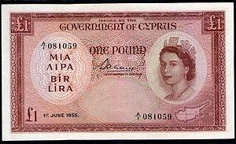

The Cypriot Pound (CYP), once the official currency of Cyprus, holds a pivotal place in the economic history of the island. This article aims to explore the evolution of the Cypriot Pound from its inception to its eventual replacement by the Euro, an event that signaled a significant shift in the economic landscape of Cyprus. In addition, the article examines the growing relevance of algorithmic trading in the context of historical currencies, highlighting the potential integration of past economic trends into modern financial strategies.

Understanding the history of a currency like the Cypriot Pound is essential in today's financial landscape, where algorithmic trading is becoming increasingly prevalent. Algorithmic trading, which uses computer programs to execute trades at speeds and frequencies that a human trader cannot match, often relies on historical data to optimize trading strategies. By incorporating historical currency data, such as trends and fluctuations observed with the Cypriot Pound, algorithmic models can potentially forecast future market behaviors more accurately.



The article will focus on three main themes: firstly, tracing the history of the Cypriot Pound from its introduction in 1878, through its role as a symbol of cultural identity, to the economic implications it entailed. Secondly, examining Cyprus's economic evolution, particularly how the Cypriot Pound was integral to its journey towards modernization. Lastly, we will connect these aspects to contemporary trading practices by discussing the utilization of historical currency data in algorithmic trading.

During its years of circulation, the Cypriot Pound served not just as a monetary unit but also as a cornerstone of Cyprus's economy, influencing everything from local trade to international economic policies. It played a crucial role in sectors like tourism and shipping, which contributed significantly to the country's economic growth.

This article aims to provide an in-depth analysis of the Cypriot Pound's history, highlighting its cultural significance and economic impact, while also exploring how these insights can be leveraged today through the lens of algorithmic trading. By doing so, it seeks to offer readers a comprehensive understanding of the ways in which historical financial data can inform and enrich modern trading strategies.

## Table of Contents

## The Historical Journey of the Cypriot Pound

The Cypriot Pound, also known as the Cyprus Pound (CYP), has a rich history dating back to its introduction by British colonial authorities in 1878. It was during this period that Cyprus was annexed by the British Empire, setting the stage for a currency system that would be heavily influenced by British economic policies. Originally, the Cypriot financial system utilized the British Pound Sterling, but soon a localized currency was introduced to better serve the island’s economy.

By 1925, the Cypriot Pound was officially established as the currency of Cyprus. This development came after a series of monetary reforms aimed at stabilizing the local economy and providing a distinct currency identity separate from British Sterling, although it remained pegged to the British currency until 1972. During this period, the Cypriot Pound consisted of subdivisions like shillings and piastres, which were familiar to the local populace and helped ease the cultural transition.

The post-independence era marked a significant evolution for the Cypriot Pound. Cyprus gained independence from British rule in 1960, and with this newfound autonomy, the Central Bank of Cyprus was established in 1963. The central bank took over the responsibilities of issuing and managing the national currency, which played a crucial role in the economic development of the newly sovereign state. Currency designs began to reflect elements of Cypriot culture and identity, showcasing historical artifacts, architectural landmarks, and natural beauty that resonated with the citizens.

The year 1983 brought about a significant socio-political shift with the division of Cyprus into the Greek Cypriot south and the Turkish Cypriot north. While the Turkish Republic of Northern Cyprus (recognized only by Turkey) adopted the Turkish Lira, the Cypriot Pound remained the currency in the Republic of Cyprus. This division underscored the currency's role not only in economic transactions but also in the socio-political fabric of the island, serving as a symbol of national unity for the Greek Cypriots amid the geopolitical tensions.

Throughout its history, the Cypriot Pound was more than just a medium of exchange; it was a cultural artifact that reflected the island’s heritage and its people’s identity. The designs and motifs on the banknotes and coins served as a continuous reminder of Cyprus's rich and diverse history, even as the currency faced various transformations and ultimately transitioned to the Euro in 2008.

## Economic and Cultural Impact of the CYP

The Cypriot Pound (CYP) played a crucial role in Cyprus’s economic landscape throughout the late 20th century. Its influence was particularly notable in key economic sectors such as tourism and shipping. The burgeoning tourism industry, bolstered by Cyprus’s scenic landscapes and favorable climate, attracted a significant influx of foreign currency, which the CYP helped stabilize. Meanwhile, the maritime industry, rooted in ancient trade routes, relied on the stability of the Cypriot Pound to facilitate international trade and investment. Together, these sectors catalyzed economic growth, transforming Cyprus into a pivotal economic hub in the Mediterranean.

Beyond its economic functions, the CYP was a potent symbol of national pride and identity for Cypriots. After gaining independence in 1960, Cyprus sought to assert its cultural and political autonomy. The Cypriot Pound, adorned with national icons and imagery, became an emblem of this newfound independence, reflecting the island’s rich cultural heritage and aspirations.

However, the currency was not without its challenges and complexities. Between 1960 and 2008, the Cypriot Pound underwent multiple adjustments, particularly concerning its exchange rate policies. Initially pegged to the British Pound, Cyprus moved to link the CYP to the United States Dollar, reflecting strategic economic alignments and international monetary trends. Such peg adjustments aimed to provide economic stability and ease foreign trade but also required careful monetary management to maintain balance between inflation control and export competitiveness.

The transition to the Euro in 2008 marked the end of the Cypriot Pound, as Cyprus joined the Eurozone, aligning its financial system more closely with European economies. This move aimed to foster greater economic stability and integration, providing advantages such as reduced transaction costs and enhanced investment flows due to the Euro’s widespread acceptance. However, it also presented challenges, including the loss of independent monetary policy and concerns among Cypriots about cultural and economic identity.

Overall, while the Cypriot Pound was a lynchpin in Cyprus’s economic and cultural history, its replacement with the Euro reflected broader economic imperatives and aspirations for integration into the European economy.

## The Transition to the Euro

Cyprus's decision to adopt the Euro as its official currency was a significant economic milestone, linked closely with the nation's accession to the European Union (EU) in 2004. The switch to the Euro on January 1, 2008, marked the culmination of Cyprus's integration into the broader European economic framework and brought both advantages and challenges to the island nation.

Upon joining the EU, Cyprus committed to fulfilling the Maastricht criteria to adopt the Euro. These criteria included maintaining low inflation rates, stable exchange rates, sound public finances, and low long-term interest rates — designed to ensure that participating countries operate within a stable economic environment. Cyprus's successful adherence to these requirements led to its acceptance into the Eurozone in 2008, replacing the Cypriot Pound (CYP) after more than half a century of monetary independence.

The conversion to the Euro facilitated significant economic advantages for Cyprus. It eliminated currency exchange risks with major European trading partners and bolstered foreign investment by providing a more stable and predictable financial environment. As a result, transaction costs were reduced, and competitiveness in international markets improved. The reduction of interest rates aligned with the European Central Bank (ECB) standards also spurred domestic borrowing, increasing investment in infrastructure and stimulating economic growth.

However, the transition was not without its challenges. One major concern was price convergence and inflation. Many Cypriots perceived that the adoption of the Euro led to an increase in the cost of living, as prices for goods and services appeared to round up to a higher value when converted from the Cypriot Pound. This perception was common among Eurozone countries during the initial stages of currency adoption and needed careful management and public explanation by national authorities.

Opinions among the Cypriot population about the currency conversion were mixed. While businesses generally welcomed the efficiencies and trade facilitation benefits provided by the Euro, some individuals worried about the erosion of local economic autonomy and cultural identity. For many Cypriots, the Cypriot Pound had not only been a unit of currency but also a symbol of national sovereignty and identity. This emotional connection contributed to a sense of loss that accompanied the transition, despite the economic rationalizations presented.

From a macroeconomic perspective, the increased economic integration with the Eurozone was expected to stabilize Cyprus's financial situation and align it with stronger European economies. Yet some critics argue that the rigid structure of the Eurozone's monetary policy could limit Cyprus's ability to respond independently to localized economic crises.

In summary, Cyprus's transition to the Euro in 2008 represented a balance between economic pragmatism and national sentiment. While it provided clear economic benefits and helped integrate Cyprus more fully into Europe, it also posed challenges that required careful negotiation of public perception and economic management. The experience highlights the intricate dynamics involved in adopting a new currency, particularly one as politically and economically significant as the Euro.

## Algorithmic Trading and Historical Currencies

Algorithmic trading, a modern approach relying on algorithms and computational power, revolutionizes how traders interact with financial markets. Its use extends beyond contemporary assets to include historical currencies like the Cypriot Pound. Analyzing historical currency data offers unique insights, facilitating the development of sophisticated trading strategies. Here's how historical currency data can be utilized in [algorithmic trading](/wiki/algorithmic-trading):

1. **Data Utilization in Trading Strategies**: Historical currency data acts as a rich resource for predicting financial market trends. Traders use algorithms to analyze past pricing data, volatility patterns, and macroeconomic indicators associated with historical currencies. This analysis helps in identifying patterns and forecasting future movements of comparable assets. For instance, the Cypriot Pound's exchange rate fluctuations, economic ties, and geopolitical events provide data points that inform risk assessment and portfolio management.

2. **Examples of Trading Strategies**:
   - **Mean Reversion Strategy**: This strategy assumes that currency prices revert to their historical mean over time. Analyzing historical prices of the Cypriot Pound could allow traders to set thresholds for buy/sell signals, hypothesizing that the current exchange rate will revert to its historical average.
   - **Momentum Strategy**: By examining the sustained price trends in historical currencies like the Cypriot Pound, traders can implement momentum strategies, which involve buying assets that are trending upwards and selling those trending downwards.
   - **Pair Trading**: This involves identifying and trading two historically correlated currencies or currency pairs. Historical data of the Cypriot Pound and its correlation with other currencies could guide the selection of such pairs for trading, based on past deviations being corrected over time.

3. **Integration of Historical Economic Shifts**: Understanding the economic shifts associated with the Cypriot Pound heightens a trader's perspective on modern financial systems. Historical events, such as Cyprus’s economic policies and political changes, can be encoded into algorithms as variables that affect market dynamics. For instance, data from the periods of monetary policy changes or geopolitical tensions can be used to simulate scenarios that might affect contemporary markets.

Python's robust libraries like `pandas` and `numpy` facilitate the manipulation of such historical data, aiding the creation of efficient trading algorithms. Here’s a simple Python example illustrating mean reversion using historical pricing data:

```python
import pandas as pd

def mean_reversion_strategy(data, window_size, threshold):
    data['moving_average'] = data['price'].rolling(window=window_size).mean()
    data['diff'] = data['price'] - data['moving_average']

    # Buy/sell signals
    data['signals'] = 0
    data.loc[data['diff'] > threshold, 'signals'] = -1  # Sell signal
    data.loc[data['diff'] < -threshold, 'signals'] = 1  # Buy signal

    return data

# Example usage
historic_data = pd.read_csv('cypriot_pound_data.csv')  # Historical pricing data of Cypriot Pound
window = 20  # Moving average window size
threshold = 0.05  # Difference threshold for signals
strategy_result = mean_reversion_strategy(historic_data, window, threshold)
```

The adaptation of these strategies to the historical currencies not only enhances the understanding of past financial climates but also provides a strategic edge in handling similar contemporary financial landscapes. Integrating historical data, like that of the Cypriot Pound, into algorithmic trading models, enriches the predictors of market behavior, offering a comprehensive toolkit for modern traders.

## Conclusion

The Cypriot Pound, though no longer in active use, represents a pivotal chapter in Cyprus's economic and cultural narrative. Originating under British colonial rule and becoming the official currency in 1925, it symbolized not only the island's monetary policy but also a piece of its identity until 2008. The pound facilitated the growth of critical sectors such as tourism and shipping and reflected the island’s cultural and political changes, especially noticeable during the nation's separation in 1983. The transition to the Euro marked the end of the CYP, injecting Cyprus's economy into a broader European framework while showcasing both the challenges of adaptation and the promise of integration.

Historical currency analysis remains important to modern finance, particularly in the development of trading strategies like algorithmic trading. The study of former currencies, such as the Cypriot Pound, provides datasets that can be crucial for enhancing predictive trading models. Historical data allows traders and analysts to backtest strategies under various economic scenarios and currency dynamics. For instance, using Python libraries such as `pandas` and `numpy`, one can effectively analyze and simulate the performance of historical exchange rates. Through these methods, understanding the impact of economic, political, and social changes on a currency becomes accessible.

Further exploration into historical currencies enriches our comprehension of current financial systems. It offers insights into the forces that shape monetary policies, influence economic stability, and affect currency effectiveness. Historical knowledge acts as a bridge, connecting past financial landscapes to contemporary strategies, thereby contributing to more nuanced and informed financial decision-making processes. As we further our grasp on historical currencies, we uncover patterns and insights pivotal not only to academic understanding but also to practical advancements in financial markets.

## References

1. **Central Bank of Cyprus Publications**:   
Various publications by the Central Bank of Cyprus provide comprehensive historical records and analysis of the Cypriot Pound, its management, and transition to the Euro. These documents are crucial for understanding the monetary policies and economic decisions impacting Cyprus during the currency's tenure.

2. **"A History of Cyprus" by George Hill**:  
This multi-[volume](/wiki/volume-trading-strategy) work offers an in-depth historical exploration of Cyprus, including its economic aspects. It provides context on the introduction of the Cypriot Pound and its use under British colonial rule and post-independence.

3. **Academic Journals on Cyprus's Economic History**:  
Numerous academic articles discuss the economic development of Cyprus. For instance, the economic impacts of changes in Cyprus's currency regime and its integration into the European Union monetary system are well-documented in journals like the "Journal of Economic History".

4. **"The Euro and Economic Stability in Cyprus" by Michael Sarris**:  
Michael Sarris discusses the economic implications of Cyprus transitioning from the Cypriot Pound to the Euro. His work assesses the financial and political factors influencing this significant change in Cyprus's monetary policy.

5. **Algorithmic Trading Literature**:  
For insights into algorithmic trading, "Algorithmic Trading: Winning Strategies and Their Rationale" by Ernest P. Chan is a widely respected resource. It explores how historical currency data can inform modern trading algorithms, providing perspectives valuable to those interested in the intersection of historical economic data and contemporary trading.

6. **Financial Times and Reuters Archive**:  
These archives offer a chronological account of news reports and expert analyses concerning Cyprus's currency matters, including the economic effects of the Cypriot Pound and its eventual replacement by the Euro.

7. **Cyprus Statistical Service**:  
The Cyprus Statistical Service provides historical economic data, offering vital statistical insights into Cyprus's economy during the era of the Cypriot Pound. This data is instrumental for researchers and practitioners developing algorithmic models based on historical trends and shifts.

8. **Historical Currency Records**:  
Several resources detail the design, issuance, and circulation history of the Cypriot Pound banknotes and coins. These records are available through institutions like numismatic societies and digital archives, which preserve the numismatic heritage of Cyprus.

9. **"Algorithmic Trading and DMA: An Introduction to Direct Access Trading Strategies" by Barry Johnson**:  
A crucial resource for understanding algorithmic trading, especially in the context of implementing strategies based on historical financial data such as that associated with the Cypriot Pound.

These references constitute a foundational base for understanding the multifaceted history of the Cypriot Pound, its economic significance, and the possibilities of its data for algorithmic trading. They offer avenues for extended study and a deeper appreciation of Cyprus's monetary history and modern financial strategies.

## References & Further Reading

[1]: Central Bank of Cyprus. [Publications](https://www.centralbank.cy/en/publications) on the history and transition of the Cypriot Pound.

[2]: Hill, G. A History of Cyprus.

[3]: Sarris, M. (2014). The Euro and Economic Stability in Cyprus.

[4]: Chan, E. P. (2009). [Algorithmic Trading: Winning Strategies and Their Rationale](https://github.com/ftvision/quant_trading_echan_book).

[5]: Jansen, S. (2020). [Machine Learning for Algorithmic Trading](https://github.com/stefan-jansen/machine-learning-for-trading).

[6]: Cyprus Statistical Service. [Economic Data](https://www.cystat.gov.cy/en/Default).

[7]: Financial Times and Reuters Archives. Reports on the transition from the Cypriot Pound to the Euro.

[8]: Johnson, B. (2010). [Algorithmic Trading and DMA: An Introduction to Direct Access Trading Strategies](https://archive.org/details/algorithmictradi0000john).

[9]: Pratt, R. & Attril, B. (2000). Currency Design and Heritage in Cyprus. Available through numismatic societies and archives.