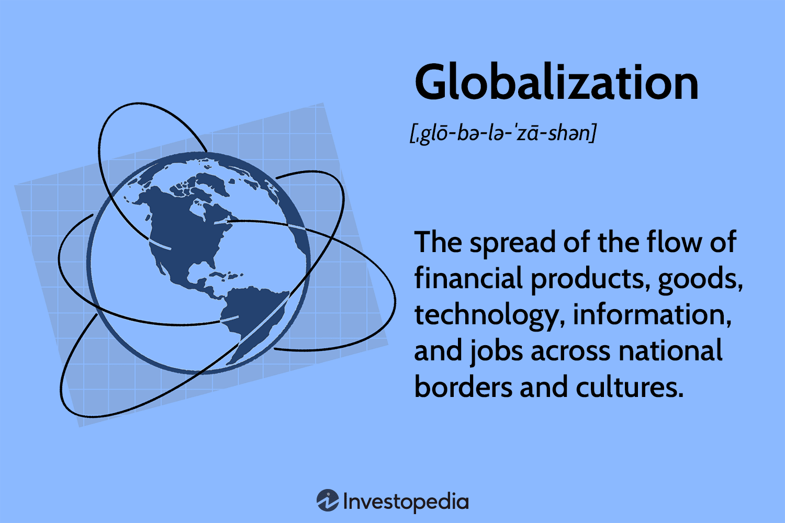

## Table of Contents

## What is the Czech Koruna?

The Czech Koruna is the official money used in the Czech Republic. It is also called the Czech Crown. The symbol for the Czech Koruna is Kč, and its international code is CZK. People in the Czech Republic use this money to buy things like food, clothes, and other goods.

The Czech Koruna started being used on February 8, 1993, after Czechoslovakia split into the Czech Republic and Slovakia. Before that, the country used the Czechoslovak Koruna. The Czech National Bank is in charge of the Czech Koruna. They make sure there is the right amount of money in the country and that it stays valuable.

## How is the Czech Koruna abbreviated?

The Czech Koruna is shortened to Kč. This is the symbol you see when you are in the Czech Republic and looking at prices or money.

It is also known by the international code CZK. This code is used around the world to talk about the Czech Koruna in banks and money exchanges.

## When was the Czech Koruna introduced?

The Czech Koruna was introduced on February 8, 1993. This was after Czechoslovakia split into two countries: the Czech Republic and Slovakia. Before that, people in Czechoslovakia used the Czechoslovak Koruna.

The Czech National Bank is the one that manages the Czech Koruna. They make sure there is enough money in the country and that it stays useful for buying things. The symbol for the Czech Koruna is Kč, and it is also known around the world by the code CZK.

## What are the different denominations of the Czech Koruna?

The Czech Koruna comes in different sizes of coins and banknotes. The coins are 1, 2, 5, 10, 20, and 50 Koruna. They are made of different metals like steel, nickel, and copper. Each coin has a different look and feel. The 1 and 2 Koruna coins are smaller and lighter, while the 50 Koruna coin is bigger and heavier.

The banknotes are 100, 200, 500, 1000, 2000, and 5000 Koruna. They are made of paper and have pictures of famous people and places in the Czech Republic. The lower value banknotes, like the 100 and 200 Koruna, are smaller than the higher value ones, like the 2000 and 5000 Koruna. Each banknote has different colors and designs to help people tell them apart easily.

## How does the Czech Koruna compare to other currencies in Central Europe?

The Czech Koruna is one of the main currencies used in Central Europe, alongside the Polish Zloty, Hungarian Forint, and Slovak Koruna. Each of these currencies has its own value and is used in its own country. The Czech Koruna is often seen as a stable currency, which means its value does not change too much over time. This stability can make it easier for people and businesses in the Czech Republic to plan their money matters.

Compared to other Central European currencies, the Czech Koruna is generally stronger than the Hungarian Forint but weaker than the Polish Zloty. For example, if you want to buy things in Hungary, you might need more Forints than you would need Korunas in the Czech Republic for the same item. On the other hand, the Polish Zloty is stronger, so you would need fewer Zlotys to buy the same thing in Poland. These differences can affect how much money tourists need to bring when they visit these countries, and how much it costs for businesses to trade between them.

## What historical events have significantly impacted the value of the Czech Koruna?

The value of the Czech Koruna has been influenced by several key events over the years. One major event was the split of Czechoslovakia into the Czech Republic and Slovakia in 1993. This split led to the creation of the Czech Koruna, replacing the Czechoslovak Koruna. At first, the new currency had to find its own value in the world market, which caused some changes in its worth. Another important event was the Czech Republic joining the European Union in 2004. This made the country more connected to Europe, which helped make the Koruna more stable and valuable because people trusted the country more.

Another event that affected the Czech Koruna was the global financial crisis that started in 2008. During this time, many countries' currencies lost value, and the Czech Koruna was no different. It became weaker because people were worried about the economy and were not sure about investing in the Czech Republic. However, the Czech National Bank worked hard to keep the currency stable, and over time, the Koruna regained its strength. These events show how the value of the Czech Koruna can be influenced by both local changes, like the country splitting, and global events, like financial crises.

## How has the exchange rate of the Czech Koruna evolved since its introduction?

Since its introduction on February 8, 1993, the value of the Czech Koruna has gone through many changes. At first, when the Czech Republic split from Czechoslovakia, the new currency had to find its place in the world. The exchange rate started at around 30 Korunas to 1 US Dollar. Over the next few years, the Koruna got stronger as the country's economy grew and people trusted it more. By the early 2000s, the exchange rate was around 25 Korunas to 1 US Dollar.

The journey of the Czech Koruna continued to be affected by big events. When the Czech Republic joined the European Union in 2004, the Koruna became even stronger because the country was now part of a bigger, more stable group. The exchange rate reached about 20 Korunas to 1 US Dollar. However, the global financial crisis in 2008 made the Koruna weaker again, dropping to around 25 Korunas to 1 US Dollar. Since then, the Czech National Bank has worked to keep the currency stable, and by 2023, the exchange rate was around 22 Korunas to 1 US Dollar. The value of the Koruna keeps changing, but it has become a strong and trusted currency over time.

## What role does the Czech National Bank play in managing the Czech Koruna?

The Czech National Bank is very important for taking care of the Czech Koruna. It is like a big boss that makes sure the money in the Czech Republic works well. The bank decides how much money should be in the country and tries to keep the value of the Koruna stable. They do this by setting interest rates, which is like the price of borrowing money. If the bank thinks the Koruna is getting too weak, they might make borrowing money more expensive to help the Koruna get stronger.

The bank also watches the economy to see if they need to do anything to help it grow. Sometimes, they buy or sell other countries' money, like US Dollars or Euros, to change how much the Koruna is worth. This is called intervening in the market. By doing these things, the Czech National Bank helps make sure that people in the Czech Republic can trust their money and use it to buy things easily.

## How does the Czech Koruna affect the Czech Republic's economy?

The Czech Koruna plays a big role in the Czech Republic's economy. It is the money people use to buy things, so its value affects how much they can buy. If the Koruna is strong, people can buy more things from other countries for less money. But if the Koruna is weak, things from other countries cost more. This can make it harder for people to buy things they need or want. Also, a strong Koruna can help the country attract more tourists because their money goes further when they visit.

The value of the Koruna also affects businesses. If the Koruna is strong, it might be harder for companies in the Czech Republic to sell things to other countries because their products become more expensive. But if the Koruna is weak, it can help businesses sell more to other countries because their products are cheaper. The Czech National Bank tries to keep the Koruna's value stable so that the economy can grow smoothly. By managing the Koruna well, the bank helps make sure that people and businesses in the Czech Republic can plan their money matters and feel confident about the future.

## What are the key economic indicators that influence the value of the Czech Koruna?

Several key economic indicators affect the value of the Czech Koruna. One big one is the country's inflation rate, which is how fast prices are going up. If inflation is high, the Koruna might get weaker because it means people's money can buy less. Another important indicator is the [interest rate](/wiki/interest-rate-trading-strategies) set by the Czech National Bank. If the interest rate goes up, borrowing money becomes more expensive, and this can make the Koruna stronger because people might want to invest more in the country. The country's GDP, or how much all the goods and services are worth, also matters. If the GDP is growing, it usually means the economy is doing well, and this can make the Koruna stronger.

Another key indicator is the trade balance, which shows if the country is selling more things to other countries than it is buying. If the Czech Republic is exporting more than importing, this can make the Koruna stronger because it means more money is coming into the country. Unemployment rates are also important. If fewer people are out of work, it usually means the economy is strong, which can help the Koruna's value. Finally, global events like financial crises or changes in other countries' economies can also impact the Koruna, making it go up or down depending on how these events affect the Czech Republic's economy.

## How has the Czech Koruna's performance been influenced by global economic trends?

The value of the Czech Koruna has been affected a lot by what happens in the world's economy. For example, during the global financial crisis in 2008, the Koruna became weaker because people were worried about money everywhere. They were not sure about investing in the Czech Republic, so they sold their Korunas, which made the currency lose value. Also, when big countries like the United States or countries in Europe change their interest rates, it can affect the Koruna. If these countries make borrowing money cheaper, people might take their money out of the Czech Republic to invest in those places, making the Koruna weaker.

Another way global trends affect the Koruna is through trade. If the world economy is doing well, the Czech Republic might sell more things to other countries, which can make the Koruna stronger. But if the world economy is struggling, the Czech Republic might not sell as much, which can make the Koruna weaker. Also, big events like Brexit or changes in oil prices can shake up the world's economy, and this can cause the Koruna to go up or down depending on how these events affect the Czech Republic. The Czech National Bank watches all these global trends and tries to keep the Koruna stable even when the world's economy is changing.

## What are the future prospects for the Czech Koruna in the context of European economic integration?

The future of the Czech Koruna is closely tied to how the Czech Republic fits into the European economy. The country is part of the European Union, but it has not yet joined the Eurozone, which means it still uses its own currency instead of the Euro. There is always talk about whether the Czech Republic will switch to the Euro someday. If it does, the Koruna would go away, and this could change the economy a lot. But for now, the Czech National Bank keeps working to make sure the Koruna stays strong and stable, even as other countries in Europe use the Euro.

The European Union keeps getting more connected, and this can affect the Czech Koruna in different ways. If the European economy does well, it can help the Czech Republic's economy grow, which makes the Koruna stronger. But if there are problems in Europe, like financial crises or big changes in how countries work together, it can make the Koruna weaker. The Czech National Bank watches these changes and tries to keep the Koruna's value steady. Even though the future is not certain, the Koruna is likely to stay important for the Czech Republic for a while, helping people and businesses as they work and trade with other countries in Europe.

## References & Further Reading

[1]: Bergstra, J., Bardenet, R., Bengio, Y., & Kégl, B. (2011). ["Algorithms for Hyper-Parameter Optimization."](https://dl.acm.org/doi/10.5555/2986459.2986743) Advances in Neural Information Processing Systems 24.

[2]: ["Advances in Financial Machine Learning"](https://www.amazon.com/Advances-Financial-Machine-Learning-Marcos/dp/1119482089) by Marcos Lopez de Prado

[3]: ["Evidence-Based Technical Analysis: Applying the Scientific Method and Statistical Inference to Trading Signals"](https://www.amazon.com/Evidence-Based-Technical-Analysis-Scientific-Statistical/dp/0470008741) by David Aronson

[4]: ["Machine Learning for Algorithmic Trading"](https://github.com/stefan-jansen/machine-learning-for-trading) by Stefan Jansen

[5]: ["Quantitative Trading: How to Build Your Own Algorithmic Trading Business"](https://www.amazon.com/Quantitative-Trading-Build-Algorithmic-Business/dp/1119800064) by Ernest P. Chan