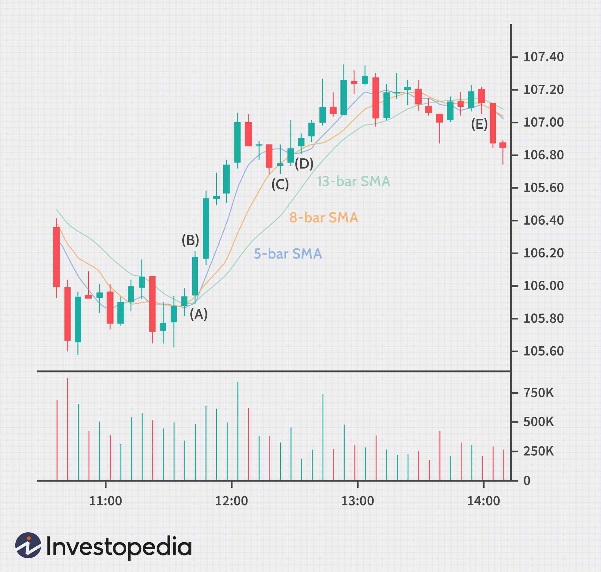

In the ever-evolving world of finance and investing, understanding various trading metrics is crucial for evaluating success. Among these metrics, Daily Average Revenue Trades (DARTs) play a significant role, especially in the brokerage industry. DARTs serve as a key indicator, measuring the average number of trades executed per day that generate revenue for a brokerage firm. This metric has become an essential tool in assessing the health and profitability of brokerage services.

The concept of DARTs has evolved significantly in response to changing market dynamics, particularly the shift towards zero-commission trading. Traditionally, DARTs encompassed trades that resulted in commissions or fees, providing a straightforward metric for brokerage earnings. However, with the advent of commission-free trading, brokerages have been compelled to redefine what constitutes a revenue-generating trade. This evolution has seen the incorporation of alternative revenue streams such as payment for order flow, which now contribute to the DART metric.

Understanding DARTs extends beyond simply counting trades; it involves examining different types of transactions and their potential to generate revenue. Stock trades, options, ETFs, and mutual funds all play varying roles in shaping a brokerage's DART. Furthermore, the integration of algorithmic trading has had a notable impact on DARTs by increasing trade frequency and volume, thereby influencing revenue generation.

This article aims to explore the multifaceted nature of DARTs, their evolution, and their impact on the brokerage sector. We will discuss different types of trades and how algorithmic trading has influenced DARTs and revenue generation. By examining these aspects, you'll gain a comprehensive understanding of how average revenue per trade is assessed through the DART metric. By the end of this article, you will have a deeper insight into the dynamic nature of trading and brokerage industries, informed by the pivotal role of DARTs.

## Table of Contents

## Understanding Daily Average Revenue Trades (DARTs)

Daily Average Revenue Trade (DART) is a key metric utilized by brokerages to measure the average number of trades per day that generate revenue. Traditionally, the DART metric was primarily associated with trades that generated commissions or fees, thereby serving as a direct indicator of brokerage profitability. This traditional view linked DARTs closely with the ability of a brokerage to drive fee-based revenue. However, with the advent and proliferation of zero-commission trading, the definition of DART has undergone significant transformation.

In today's trading environment, zero-commission trading is common. This shift necessitated an evolution in how DARTs are calculated and understood. Instead of solely relying on commissions, brokerages now consider trades that, although commission-free, generate revenue through alternative mechanisms. One prominent method is payment for order flow (PFOF), where brokerages receive compensation for directing orders to particular market makers or exchanges. This remuneration can vary significantly and depend on the trade volume and specific arrangements made by the brokerage.

For analysts, DART remains a vital tool for predicting brokerage earnings and assessing industry performance. It offers insights into a brokerage's operational efficiency and market competitiveness. When analyzing DART figures, analysts consider that a higher DART typically suggests a robust trading activity level, with diverse revenue streams supporting the brokerage's financial stability.

To illustrate this through a hypothetical calculation, if a brokerage processes 10 million trades over a month with 22 trading days, the DART would be 454,545:

$$
DART = \frac{\text{Total Trades}}{\text{Trading Days}} = \frac{10,000,000}{22} \approx 454,545
$$

This computation confirms the brokerage's capacity to handle a significant [volume](/wiki/volume-trading-strategy) of trades, indicative of its ability to attract and retain active clients, and adapt to the changing landscape of commission structures.

Ultimately, the DART metric has become an essential indicator of brokerage health and future profitability, reflecting both traditional and modern revenue streams. As the industry continues to evolve, DART will likely remain a critical measure of performance, necessitating brokerages to strategically adapt their definitions and calculations to maintain a clear picture of financial success.

## Types of Trades Impacting DARTs

Various types of trades contribute to the Daily Average Revenue Trades (DART) metric, encompassing instruments like stocks, options, exchange-traded funds (ETFs), and mutual funds. Each type plays a distinct role in shaping the overall DART figures for brokerages.

**Stock Trades**

Stock trades are fundamental to the DART metric, typically involving the buying and selling of equity shares. Traditionally, these trades generated revenue through commissions. However, the recent shift toward zero-commission trading has changed this landscape. Brokerages now often earn revenue through other means, such as payment for order flow, wherein they receive compensation for directing trade orders to specific parties.

**Option Trades**

Option trades introduce greater complexity into the DART calculation. Unlike stocks, options grant the right, but not the obligation, to buy or sell an asset at a predetermined price. Due to their intricate nature, option trades usually entail fees or commissions despite the zero-commission trend for stocks. This characteristic means that option trades can significantly impact the overall DART figures, as each transaction may still generate direct revenue.

**ETFs and Mutual Fund Trades**

[ETF](/wiki/etf-trading-strategies) and mutual fund trades also contribute to the DART metric. ETFs, in particular, have gained popularity due to their diversified portfolios and liquidity. Similar to stocks, ETFs often participate in zero-commission trading programs. However, they can still serve as a revenue source through payment for order flow arrangements. 

**Adapting to Commission Changes**

To align with the changing landscape of trading commissions, brokerages have been compelled to adapt their trading strategies. This adaptation has led to a reevaluation of what constitutes a revenue-generating trade within the context of DART. By strategically highlighting commission-inclusive trades or enhancing arrangements like payment for order flow, brokerages can maintain their profitability metrics while accommodating new industry norms.

In summary, the evolution of trade types and their associated revenue models has transformed DART from a straightforward commission-based metric to a more nuanced indicator incorporating various revenue streams. This diversification underscores the necessity for brokerages to continuously adapt and refine their strategies to thrive in an era of zero-commission trading.

## Challenges and Opportunities in DART Calculation

The reduction in commissions presents a significant challenge in utilizing Daily Average Revenue Trades (DART) as a precise earnings predictor for brokerages. Traditionally, DART calculations focused on the average number of commission-generating trades per day, providing a straightforward measure of profitability. However, with the rise of zero-commission trading, this traditional approach has been disrupted, necessitating an expanded definition of DART to include commission-free trades.

Zero-commission trading is now widespread, compelling brokerages to rethink their strategies for measuring trades that contribute to DART. Given that commission-free trades do not intrinsically generate direct revenue, brokerages must identify alternative revenue streams, such as payment for order flow, securities lending, or premium services. This shift is essential for maintaining the relevance of the DART metric amidst changing fee structures. The expanded definition of DART to include zero-commission trades opens up opportunities to capitalize on increased trade volume and enhanced order flow, thereby augmenting revenue through alternative channels.

One primary challenge with the evolving DART metric is the potential for misinterpretation. An increase in DART may no longer directly correlate with higher profits when relying solely on commission-based trades. Investors and analysts must recognize that while an increased trade volume reflected in an elevated DART might suggest improved engagement, it doesn't automatically indicate augmented brokerage earnings unless accompanied by effective monetization of these trades.

However, the adapted DART metric also presents opportunities. Zero-commission trading incentivizes higher trading frequencies, as reduced trading costs encourage greater participation from retail investors. This increase in trading activity, in turn, enhances order flow—a crucial revenue stream where brokerages receive compensation for directing trades to specific parties. By carefully managing and analyzing order flow, brokerages can maintain profitability despite the absence of traditional commission fees.

To navigate these challenges and opportunities, brokerages must redefine 'revenue-generating' trades with precision to ensure transparency and sustainable profitability. This may involve a nuanced approach that considers the comprehensive contribution of each trade to the brokerage's bottom line beyond mere transaction counts. Effectively communicating these redefined metrics to stakeholders is essential for maintaining trust and investor confidence.

In summary, while the shift towards zero-commission trading complicates the use of DART as a clear indicator of profitability, it simultaneously creates avenues for alternative revenue generation. Brokerages that adeptly redefine their DART metrics and align their business strategies with evolving market conditions can leverage increased trading activities to foster growth and sustain profitability.

## The Role of Algorithmic Trading in DARTs

Algorithmic trading incorporates sophisticated algorithms to execute trades with speed and efficiency, significantly influencing Daily Average Revenue Trades (DARTs). This approach leverages technology to automate trading processes, thereby facilitating an increase in both trade volume and frequency for brokerages. By capitalizing on [algorithmic trading](/wiki/algorithmic-trading), brokerages are able to potentially boost their DART figures, which is crucial for assessing brokerage performance and profitability.

This trading method is particularly attractive to sophisticated traders who seek to capitalize on minimal margins aided by high-speed transactions. By employing algorithms, traders can execute a vast number of trades in milliseconds, taking advantage of fleeting market opportunities that would be challenging to exploit manually. This characteristic of high-speed trading not only attracts experienced traders but also supports the continuous elevation of DART metrics, as more trades are being generated consistently.

The automation capabilities intrinsic to algorithmic trading play a pivotal role in elevating DART metrics. Such automation ensures that trading strategies are executed with precision and without delay, resulting in a consistent and high-volume trading environment. This consistency and volume are integral to enhancing DART metrics, as they directly contribute to the count of revenue-generating trades reported by a brokerage.

However, despite the clear advantages of algorithmic trading, it necessitates meticulous oversight to ensure that it contributes positively to a brokerage's revenue without exposing the firm to undue risk. It is essential to strike a balance between maximizing trade volume and maintaining robust risk management protocols. Algorithmic trading can inadvertently introduce risks such as flash crashes or market anomalies, which can skewer DART metrics if not properly monitored. Therefore, brokerages must implement rigorous checks and balances to maintain the integrity and accuracy of the DART metric while leveraging the benefits of automated trading solutions. 

In summary, algorithmic trading markedly influences DARTs by enhancing trade efficiency and volume, but it requires careful management to ensure profitable and risk-averse operations.

## Conclusion

Daily Average Revenue Trades (DARTs) continue to serve as an essential metric for evaluating brokerage performance, even amid changing market dynamics. As zero-commission trading becomes increasingly prevalent, brokerages are compelled to reconsider and expand their definitions of what constitutes a DART. This shift requires a nuanced understanding of differing trade types and the significant role of algorithmic trading, which brings both opportunities and complexities to the evaluation process.

To accurately interpret DARTs, it is vital for investors and analysts to stay abreast of these developments. As algorithmic trading continues to influence trade frequency and volume, its impact on DARTs cannot be overstated. The automation and speed provided by algorithmic interventions mean a rise in trading activity, which could significantly alter DART calculations and their implications for revenue.

The ongoing evolution of DARTs underscores the adaptive nature of the brokerage industry, emphasizing the necessity for transparency in defining revenue-generating trades amidst shifting trading landscapes. Through careful observation of these trends and developments, financial practitioners can leverage DARTs not only for immediate financial analysis but also to anticipate longer-term shifts within the industry.

Ultimately, the dynamic characteristics of DARTs reflect the broader transformations within the trading ecosystem, pointing toward a future where brokerage strategies and performance metrics will continually adapt to technological advances and regulatory changes. This adaptability ensures DARTs remain a significant tool for predicting brokerage health and profitability.

## References & Further Reading

[1]: Seru, A. (2020). ["Brooke Fox with The Spread: Retail Trading Shows Growth with Zero-Commissions."](https://www.nasdaq.com/articles/who-counts-as-a-retail-investor-2020-12-17) Traders Magazine.

[2]: Yeh, C., Yang, C., Loh, H., & Lee, C. (2021). ["Adaptation Strategies of Brokerages in the Zero-Commission Era: Evidence from the U.S. Market."](https://onlinelibrary.wiley.com/doi/abs/10.1002/smtd.202300101) Working Papers on Finance.

[3]: Malkiel, B. G. (2019). ["A Random Walk Down Wall Street: The Time-Tested Strategy for Successful Investing."](https://www.amazon.com/Random-Walk-Down-Wall-Street/dp/0393330338) W. W. Norton & Company.

[4]: Osipovich, A. (2019). ["How Zero Commissions Are Reshaping Online Brokerages."](https://www.merriam-webster.com/sentences/abscond) The Wall Street Journal.

[5]: Lopez de Prado, M. (2018). ["Advances in Financial Machine Learning."](https://www.amazon.com/Advances-Financial-Machine-Learning-Marcos/dp/1119482089) Wiley.