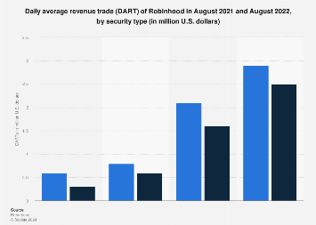

## Table of Contents

## What is a Daily Average Revenue Trade (DART)?

A Daily Average Revenue Trade (DART) is a way to measure how much money a brokerage firm makes from each trade on average every day. It helps show how well the firm is doing by looking at the money made from trading activities. For example, if a firm has a lot of trades happening every day and each trade brings in a good amount of money, the DART will be high, which is a good sign for the business.

DART is important because it gives a clear picture of the firm's trading performance over time. By tracking DART, a brokerage can see if they are making more or less money from trades compared to previous days or months. This helps them make better decisions about their business strategies and understand how changes in the market or their services affect their earnings.

## How is DART calculated?

To calculate the Daily Average Revenue Trade (DART), you first need to know the total revenue from all trades for a day. This includes any fees or commissions the brokerage firm earns from those trades. Once you have the total daily revenue, you then count the number of trades that happened on that day. To find the DART, you divide the total daily revenue by the number of trades. So, if a brokerage made $10,000 from 1,000 trades in one day, the DART would be $10 per trade.

DART is a useful number because it helps brokerage firms see how much money they are making from each trade on average. By looking at DART every day, they can track if their average revenue per trade is going up or down over time. This helps them understand if their business strategies are working or if they need to make changes. For example, if DART goes down, it might mean they need to adjust their fees or find ways to attract more traders.

## Why is DART important for businesses?

DART, or Daily Average Revenue Trade, is a key number for businesses, especially for those in the trading and brokerage world. It tells them how much money they make from each trade on average every day. This is important because it helps them see if they are doing well or if they need to make changes. If the DART is high, it means they are making good money from each trade, which is a good sign for the business.

By keeping an eye on DART every day, businesses can spot trends and make smart decisions. For example, if the DART starts to drop, it might mean they need to change their fees or find new ways to bring in more traders. On the other hand, if the DART goes up, it shows that their current strategies are working well. This helps them plan better for the future and keep their business strong and growing.

## Can you explain the difference between DART and other revenue metrics?

DART, or Daily Average Revenue Trade, is a special number that tells a business how much money they make from each trade every day. It's different from other revenue metrics because it focuses just on the money made from trades, and it looks at this every single day. For example, if a company wants to know how much they are making from trading activities specifically, they would use DART. It helps them see if they are making more or less money from trades compared to other days.

Other revenue metrics might look at the total money made over a longer time, like a month or a year, or they might include money from different parts of the business, not just trades. For instance, a metric like monthly revenue would add up all the money made in a month, from trades and other sources. Another example is gross revenue, which looks at all the money coming in before any costs are taken out. So, while DART gives a very focused and daily view of trade revenue, other metrics give a broader or longer-term picture of the business's financial health.

## What industries commonly use DART as a performance indicator?

DART, or Daily Average Revenue Trade, is mostly used by businesses in the financial industry, especially those that help people buy and sell stocks and other investments. These businesses are called brokerage firms. They use DART to see how much money they make from each trade every day. This helps them understand if they are doing well or if they need to change how they do things. If their DART number is high, it means they are making good money from each trade, which is a good sign for their business.

Besides brokerage firms, some other parts of the financial world might also use DART. For example, trading platforms and investment banks might look at DART to see how well their trading services are doing. By keeping track of DART every day, these businesses can spot trends and make better decisions. If the DART goes down, it might mean they need to adjust their fees or find new ways to attract more traders. If it goes up, it shows that what they are doing is working well.

## How can DART influence business strategies?

DART, or Daily Average Revenue Trade, can really help businesses decide what to do next. If a company sees that their DART number is going down, it might mean they need to change how much they charge for trades or find new ways to get more people to trade with them. For example, if the DART is low, they might lower their fees to attract more traders, or they might offer new tools or services to make trading easier and more appealing. By keeping an eye on DART, a business can quickly see if what they are doing is working and make changes if it's not.

On the other hand, if the DART number is going up, it shows that the business is doing well and making good money from each trade. This can help them feel confident in their current strategies and maybe even think about expanding their services. For example, they might decide to offer more types of investments or start working in new markets where they think they can make even more money. By using DART to guide their decisions, businesses can keep growing and stay strong in a competitive world.

## What are the limitations of using DART as a metric?

DART, or Daily Average Revenue Trade, is a useful number for businesses in the trading world, but it has some limits. One big problem is that DART only looks at the money made from trades each day. It doesn't tell you about other important things, like how much it costs to make those trades happen or how happy the customers are. So, if a company only looks at DART, they might miss out on other parts of their business that need attention.

Another limit of DART is that it can change a lot from one day to the next. This makes it hard to see the bigger picture over time. For example, if a company has a really good day with lots of trades, the DART might be high that day, but it might not mean they are doing well overall. Also, DART doesn't tell you anything about the risks involved in the trades. A business needs to think about more than just DART to really understand how well they are doing and make the best decisions for the future.

## How does DART vary across different market segments?

DART, or Daily Average Revenue Trade, can be different in various parts of the trading world. For example, in the stock market, where lots of people trade every day, the DART might be higher because there are so many trades happening. But in other markets, like trading bonds or options, the DART might be lower because fewer people trade these, and each trade might not make as much money. So, the type of market a business is in can really change how much money they make from each trade every day.

Also, DART can be different depending on who the customers are. Big businesses and professional traders might do a lot of trades and pay more for each one, which can make the DART higher. But if a company mostly works with regular people who don't trade as much, the DART might be lower because these trades might not bring in as much money. So, understanding who is trading and what they are trading can help explain why the DART number changes from one market to another.

## What are some best practices for tracking and analyzing DART?

To track and analyze DART effectively, it's important to keep a daily record of the number of trades and the total revenue from those trades. This means writing down how many trades happen each day and how much money is made from them. By doing this every day, a business can see if the DART number is going up or down over time. It's also helpful to use a computer program or a special tool that can automatically collect and organize this information. This makes it easier to see patterns and trends without having to do all the math by hand.

When analyzing DART, it's good to look at it alongside other important numbers, like how much it costs to make the trades happen and how happy the customers are. This gives a fuller picture of how the business is doing. It's also smart to compare the DART from different days, weeks, or months to see if there are any big changes. If the DART goes down, a business might need to think about changing their fees or finding new ways to get more people to trade. By keeping a close eye on DART and thinking about what it means, a business can make better decisions to help it grow and do well.

## How can technology help in improving DART?

Technology can help businesses make more money from each trade by making trading easier and faster. For example, using special computer programs, businesses can handle more trades in less time. This means they can make more money because they can do more trades every day. Also, technology can help find the best prices for trades, so the business makes more money on each one. By using these tools, a business can make their DART number higher and do better overall.

Another way technology helps is by giving businesses better information about their trades. With the right computer programs, they can see exactly how much money they are making from each trade and what is working well or not. This helps them make smart choices about what to change to make more money. For example, if they see that one type of trade is making more money, they can focus on that. By using technology to keep track of and understand their DART, businesses can keep improving and growing.

## What case studies illustrate successful use of DART in business?

One good example of using DART well is from a big brokerage firm called XYZ Brokerage. They noticed their DART was going down and decided to use technology to fix it. They started using a special computer program that made trading faster and easier for their customers. This helped them handle more trades every day and make more money from each one. After a few months, their DART went up, and they were making more money than before. This showed them that using technology to improve their trading services was a smart move.

Another example is ABC Trading Platform, which used DART to grow their business. They saw that their DART was lower than they wanted, so they decided to offer new tools and lower their fees to attract more traders. By doing this, they got more people to use their platform, and the number of trades went up. This made their DART number higher because they were making more money from all those extra trades. ABC Trading Platform learned that by focusing on what their customers needed and using DART to guide their decisions, they could make their business stronger and more successful.

## How can DART be forecasted and what models are typically used?

To forecast DART, businesses look at past numbers and use them to guess what might happen in the future. They might use simple math to see how DART has changed over time and then use that to make a guess about what it will be like tomorrow or next week. For example, if DART has been going up a little bit every day, they might think it will keep going up. They can also look at things like how many people are trading, what the market is doing, and if they have made any changes to their fees or services. All these things can help them make a better guess about what DART will be.

There are different models that businesses use to forecast DART. One common model is called time series analysis, which looks at how DART has changed over time and uses that to predict the future. Another model is regression analysis, which looks at how different things, like the number of trades or the fees charged, affect DART. Businesses might also use [machine learning](/wiki/machine-learning), which is a type of computer program that can learn from past data to make better guesses about the future. By using these models, businesses can get a good idea of what their DART might be and plan their strategies accordingly.

## What are Daily Average Revenue Trades (DARTs) and how can they be understood?

Daily Average Revenue Trade (DART) is a key metric utilized by brokerages to measure the average number of trades per day that generate revenue. Traditionally, the DART metric was primarily associated with trades that generated commissions or fees, thereby serving as a direct indicator of brokerage profitability. This traditional view linked DARTs closely with the ability of a brokerage to drive fee-based revenue. However, with the advent and proliferation of zero-commission trading, the definition of DART has undergone significant transformation.

In today's trading environment, zero-commission trading is common. This shift necessitated an evolution in how DARTs are calculated and understood. Instead of solely relying on commissions, brokerages now consider trades that, although commission-free, generate revenue through alternative mechanisms. One prominent method is payment for order flow (PFOF), where brokerages receive compensation for directing orders to particular market makers or exchanges. This remuneration can vary significantly and depend on the trade volume and specific arrangements made by the brokerage.

For analysts, DART remains a vital tool for predicting brokerage earnings and assessing industry performance. It offers insights into a brokerage's operational efficiency and market competitiveness. When analyzing DART figures, analysts consider that a higher DART typically suggests a robust trading activity level, with diverse revenue streams supporting the brokerage's financial stability.

To illustrate this through a hypothetical calculation, if a brokerage processes 10 million trades over a month with 22 trading days, the DART would be 454,545:

$$
DART = \frac{\text{Total Trades}}{\text{Trading Days}} = \frac{10,000,000}{22} \approx 454,545
$$

This computation confirms the brokerage's capacity to handle a significant [volume](/wiki/volume-trading-strategy) of trades, indicative of its ability to attract and retain active clients, and adapt to the changing landscape of commission structures.

Ultimately, the DART metric has become an essential indicator of brokerage health and future profitability, reflecting both traditional and modern revenue streams. As the industry continues to evolve, DART will likely remain a critical measure of performance, necessitating brokerages to strategically adapt their definitions and calculations to maintain a clear picture of financial success.

## References & Further Reading

[1]: Seru, A. (2020). ["Brooke Fox with The Spread: Retail Trading Shows Growth with Zero-Commissions."](https://www.nasdaq.com/articles/who-counts-as-a-retail-investor-2020-12-17) Traders Magazine.

[2]: Yeh, C., Yang, C., Loh, H., & Lee, C. (2021). ["Adaptation Strategies of Brokerages in the Zero-Commission Era: Evidence from the U.S. Market."](https://onlinelibrary.wiley.com/doi/abs/10.1002/smtd.202300101) Working Papers on Finance.

[3]: Malkiel, B. G. (2019). ["A Random Walk Down Wall Street: The Time-Tested Strategy for Successful Investing."](https://www.amazon.com/Random-Walk-Down-Wall-Street/dp/0393330338) W. W. Norton & Company.

[4]: Osipovich, A. (2019). ["How Zero Commissions Are Reshaping Online Brokerages."](https://www.merriam-webster.com/sentences/abscond) The Wall Street Journal.

[5]: Lopez de Prado, M. (2018). ["Advances in Financial Machine Learning."](https://www.amazon.com/Advances-Financial-Machine-Learning-Marcos/dp/1119482089) Wiley.