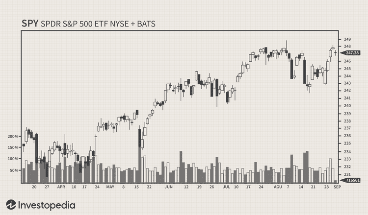

In the ever-evolving world of finance, the integration of technology with trading practices has opened myriad opportunities for traders aiming to optimize their strategies. A significant advancement in recent times is the application of algorithmic trading to analyze daily charts—an approach that combines the precision and speed of automated systems with the foundational insights of daily chart analysis. Algorithmic trading, often referred to as algo trading, utilizes computer algorithms to execute trading orders at speeds and complexities beyond human capabilities. 

This article examines how traders are utilizing daily chart financial analysis in their algorithmic trading frameworks. Daily chart analysis involves the examination of price movements and trends over daily time frames, offering a granular yet comprehensive view of market dynamics. Through identifying predictable patterns and signals, this analysis provides key foundations for making informed trading decisions. Algo trading complements this by providing the computational power to backtest strategies and execute trades based on these insights efficiently.



For both seasoned traders and newcomers, understanding these concepts is crucial. As the trading environment becomes increasingly complex, blending traditional analysis with modern technological tools can be pivotal in navigating markets effectively. To get started, it's important to grasp key terms and the essential principles underlying daily chart analysis and algorithmic trading. This knowledge lays the groundwork for creating sophisticated trading strategies that leverage the best of both worlds.

## Table of Contents

## Understanding Daily Chart Financial Analysis

Daily chart financial analysis is a fundamental approach in trading that involves examining price movements over a daily timeframe. This analysis helps traders make informed decisions by identifying trends, patterns, and signals indicative of potential market behavior. Key tools and indicators commonly utilized in this type of analysis include moving averages, trend lines, and candlestick patterns, each providing a unique perspective on price action.

**Moving Averages** are vital indicators in daily chart analysis. They smooth out price data to identify the direction of a trend over a certain period. The simple moving average (SMA) is calculated by adding the closing prices of a security over a specific number of periods and then dividing the sum by the number of periods. The formula for a simple moving average over $n$ periods is:

$$

SMA = \frac{P_1 + P_2 + \cdots + P_n}{n}
$$

where $P_1, P_2, \ldots, P_n$ represent the closing prices of a security over $n$ days. More advanced moving averages, such as the exponential moving average (EMA), give more weight to recent prices, making them more responsive to new information. In Python, one can compute the EMA using the `pandas` library:

```python
import pandas as pd

def calculate_ema(prices, days):
    return prices.ewm(span=days, adjust=False).mean()
```

**Trend Lines** are straight lines drawn on a chart that connect two or more price points and act as a line of support or resistance. An upward trend line is drawn below pivot lows, illustrating the overall direction of an uptrend, whereas a downward trend line is drawn above pivot highs in a downtrend. These lines give traders a visual representation of the market direction and potential reversal points.

**Candlestick Patterns** are another crucial component. Each candlestick on the chart represents a single day's price action, displaying the open, high, low, and close prices. Patterns such as "doji", "hammer", and "engulfing" can signal potential reversals or continuations in the market. For instance, a "hammer" at the bottom of a downtrend might indicate a bullish reversal potential.

Real-world examples illuminate how daily chart analysis aids in predicting price actions. For instance, during a downtrend, a trader might observe a "hammer" candlestick pattern coupled with a bounce above a trend line and the price crossing above a moving average. Such confluence of indicators often signals a potential reversal, suggesting a buying opportunity.

By analyzing daily charts, traders can gain essential insights into market trends and potential turning points, which are critical for developing effective trading strategies. The ability to recognize these patterns and interpret the signals they offer is a key skill for traders aiming to capitalize on market movements.

## The Role of Algorithmic Trading in Financial Markets

Algorithmic trading, or algo trading, relies on computer algorithms to automate the trading process, allowing traders to execute orders at speeds and complexities that surpass human capabilities. This approach revolutionizes trading by utilizing predefined rules based on timing, price, quantity, or any mathematical model. The core strength of [algorithmic trading](/wiki/algorithmic-trading) lies in its ability to process vast amounts of data rapidly, ensuring precise and efficient trade executions.

One of the primary advantages of algorithmic trading is the ability to backtest strategies. Backtesting involves applying trading algorithms to historical market data to assess their viability. This process allows traders to evaluate the effectiveness of their strategies and make data-driven decisions for future trades. By identifying successful patterns and errors in strategies before deploying them in live markets, traders can minimize risks and optimize performance.

Developing an algorithmic trading strategy typically involves several steps. First, traders must identify and define strategy parameters, such as entry and [exit](/wiki/exit-strategy) points based on market trends or technical indicators. Once a strategy is conceptualized, it is coded using programming languages like Python, which offers extensive libraries for financial markets analysis. For example, here is a simple Python snippet demonstrating a basic moving average crossover strategy:

```python
import pandas as pd
import numpy as np

# Sample stock data
data = pd.DataFrame({
    'close': [100, 102, 105, 107, 106, 108, 110, 111, 109, 110]
})

# Calculate moving averages
data['short_ma'] = data['close'].rolling(window=3).mean()
data['long_ma'] = data['close'].rolling(window=5).mean()

# Generate trading signals
data['signal'] = np.where(data['short_ma'] > data['long_ma'], 1, 0)
data['signal'] = data['signal'].diff()

print(data[['close', 'short_ma', 'long_ma', 'signal']])
```

This code calculates short and long moving averages from historical closing prices and generates a buy signal when the short-term moving average crosses above the long-term average.

Beyond [backtesting](/wiki/backtesting) and strategy implementation, algorithmic trading significantly reduces human errors. Automated systems are not swayed by emotions, which can cloud judgment and lead to irrational trading decisions. By removing human psychology from trading, algo trading enhances consistency and the ability to adhere strictly to a defined trading strategy.

Additionally, algorithmic trading facilitates complex strategies involving multiple assets or complex computations that would be challenging and time-intensive for human traders. Strategies supported by algorithmic trading include statistical [arbitrage](/wiki/arbitrage), [trend following](/wiki/trend-following), and [market making](/wiki/market-making), among others.

The advantages of algorithmic trading extend to enhanced decision-making processes. Algorithms can execute orders based on intricate criteria, considering multiple market data points simultaneously. This ability to process and analyze data comprehensively enables traders to make informed decisions quickly, capitalizing on fleeting market opportunities.

In conclusion, the role of algorithmic trading in financial markets is paramount, offering substantial benefits in speed, precision, and data analysis. By implementing robust algorithms, traders can enhance their strategies' efficacy, eliminate biases, and stay competitive in an increasingly fast-paced trading environment.

## Integrating Algo Trading with Daily Chart Analysis

Integrating algorithmic trading with daily chart analysis presents a significant advancement for traders seeking to enhance their decision-making processes. By leveraging daily chart financial analysis, traders can automate strategies based on daily price movements, which streamlines the trading process and ensures timely reactions to market changes.

The synergy between these methodologies facilitates the development of robust trading strategies that can capitalize on observable daily market trends. Strategies like mean reversion, [momentum](/wiki/momentum) trading, and [breakout](/wiki/breakout-trading) strategies are prime examples of how such integration can be effectively implemented.

Mean reversion strategies, for instance, operate on the premise that asset prices will eventually return to their average levels. By employing algorithms, traders can automate the detection of scenarios where prices deviate significantly from the mean. Here’s an example of a simple Python algorithm to automate mean reversion trading:

```python
import numpy as np
import pandas as pd

# Loading price data
data = pd.read_csv('daily_price_data.csv')
prices = data['Close']

# Calculate moving average
window = 20
rolling_mean = prices.rolling(window=window).mean()

# Trading signals
buy_signals = prices < rolling_mean - np.std(prices)
sell_signals = prices > rolling_mean + np.std(prices)

```

Momentum trading, conversely, involves making trades based on the strength of price movements. Algo trading enhances momentum strategies by providing tools to assess when the momentum of an asset justifies a trade. Breakout strategies, another popular approach, can be automated to identify when an asset's price breaks through a defined support or resistance level, prompting a trade that benefits from potentially large price movements.

Real-world applications of this integration reveal how traders can successfully harness these techniques. For example, hedge funds and proprietary trading firms utilize sophisticated algorithms to exploit short-term price inefficiencies that are often unnoticed by human traders. Automated systems enable traders to monitor multiple instruments simultaneously, analyze large datasets in real-time, and act on signals that meet predefined criteria without delay.

By automating chart pattern recognition and trading signals, traders are positioned to react promptly to emerging opportunities. This automation not only increases the speed of response but also reduces the cognitive load on traders, allowing for more efficient trading systems. The operational capacity to process complex datasets with speed and precision is a key advantage when integrating algo trading with daily chart analysis, placing traders in a stronger position to navigate volatile markets.

In conclusion, the integration of algo trading with daily chart analysis offers traders a sophisticated toolkit for developing and executing trading strategies with greater efficiency and accuracy. It is this enhancement of trading precision and speed that positions such integration as a fundamental evolution in modern trading practices.

## Challenges and Considerations

The integration of algorithmic trading with daily chart analysis offers significant benefits, yet it also presents several challenges. Key issues include data quality, algorithm complexity, and market [volatility](/wiki/volatility-trading-strategies). Ensuring high-quality data is crucial, as inaccurate or incomplete data can lead to erroneous trading decisions. Data must be meticulously cleaned, validated, and sourced from reputable providers to ensure reliable analysis and trading outcomes.

Algorithm complexity is another hurdle. Developing sophisticated algorithms requires deep financial knowledge and programming skills. Complex algorithms might perform well in simulations but can fail in live markets due to unforeseen circumstances. Hence, it's essential to strike a balance between complexity and practicality. Regular backtesting and refinement of trading algorithms are necessary to identify weaknesses and enhance their robustness. Backtesting involves evaluating trading strategies over historical data to ascertain their effectiveness before deploying them in real markets.

Market volatility further complicates algorithmic trading. Sudden price swings can impact the performance of trading algorithms, leading to substantial losses. Algorithms must be designed to account for such volatility and include risk management components to minimize potential downside. Stop-loss orders and position sizing are common strategies to mitigate risks associated with volatile markets.

Ethical considerations also play a crucial role in algorithmic trading. The rapid execution of trades by algorithms can sometimes lead to unintended market consequences, such as flash crashes. These abrupt, significant drops in asset prices can destabilize markets and erode trader confidence. To mitigate these risks, traders must adhere to ethical practices, including setting appropriate thresholds for trade execution and ensuring algorithms do not exploit market inefficiencies excessively.

Regulatory compliance is vital in algo trading. Financial markets are subject to stringent regulations to maintain order and protect investors. Traders must ensure their algorithms comply with these regulations to avoid legal complications. This entails staying informed about regulatory changes and adapting algorithms accordingly. As regulations vary across jurisdictions, traders operating in multiple markets need to maintain a comprehensive understanding of the global regulatory landscape.

In conclusion, while the synergy between algorithmic trading and daily chart analysis can enhance trading strategies, it is not without challenges. Addressing issues like data quality, algorithm complexity, and market volatility, along with maintaining ethical standards and regulatory compliance, are essential steps in leveraging these technologies effectively. Regularly updating algorithms and staying informed of market trends and regulatory changes will help traders navigate these challenges successfully.

## Future Trends in Trading Strategies

As technology continues to advance, trading strategies are undergoing significant transformations, with [artificial intelligence](/wiki/ai-artificial-intelligence) (AI) and [machine learning](/wiki/machine-learning) (ML) leading the charge. These technologies offer unprecedented capabilities in analyzing and forecasting market movements by processing and interpreting immense datasets with greater accuracy and speed.

The integration of AI into trading systems allows for the enhancement of traditional algorithms. For instance, machine learning models can identify complex patterns and relationships in historical data that may not be apparent through conventional methods. This ability to learn and adapt from data can significantly improve the predictive performance of trading algorithms.

Neural networks, a subset of machine learning models, have gained traction for their ability to model non-linear relationships within trading datasets. Deep learning models, characterized by their multiple layers, are particularly adept at handling vast amounts of unstructured data. These models have shown promise in tasks such as sentiment analysis, where they can analyze news articles or social media feeds to gauge market sentiment, thus informing trading decisions.

Moreover, the future of trading strategies will likely see a rise in cross-market analysis. This approach involves analyzing data from multiple financial markets simultaneously to identify inter-market dependencies and divergences. By leveraging data across different asset classes, traders can gain a holistic view of market dynamics, potentially uncovering arbitrage opportunities or hedging strategies that were previously hidden.

Python, widely used in the financial industry for its simplicity and robust libraries, supports the implementation of these techniques. Libraries such as TensorFlow and PyTorch facilitate the development of neural networks and [deep learning](/wiki/deep-learning) models, while tools like Pandas and NumPy assist in managing and analyzing large datasets.

```python
import numpy as np
import pandas as pd
from sklearn.model_selection import train_test_split
from sklearn.neural_network import MLPRegressor

# Example of a simple neural network model for predicting stock prices
# Assume 'data' is a DataFrame containing the relevant financial indicators

# Preparing data
X = data.drop('target', axis=1)  # Features
y = data['target']  # Target variable (e.g., future stock price)

# Splitting dataset into training and testing sets
X_train, X_test, y_train, y_test = train_test_split(X, y, test_size=0.2, random_state=42)

# Defining the neural network model
model = MLPRegressor(hidden_layer_sizes=(50, 25), max_iter=1000, random_state=42)

# Training the model
model.fit(X_train, y_train)

# Predicting
predictions = model.predict(X_test)
```

Looking ahead, it is crucial for traders to stay informed about these technological advancements. As AI and ML continue to evolve, they will likely offer even more sophisticated tools and strategies for market analysis. Keeping abreast of these innovations will be vital for traders striving to maintain a competitive edge in the ever-evolving financial landscape.

## Conclusion

Trading strategies that incorporate daily chart financial analysis and algorithmic trading offer a compelling blend of established market analysis techniques and cutting-edge technological applications. These strategies enable traders to leverage historical price data and computational efficiency, allowing for enhanced decision-making processes. This article has explored the intricacies of integrating daily chart analysis with algorithmic trading, highlighting the potential advantages, such as the ability to automate trades, reduce human error, and respond swiftly to market changes. However, these strategies also present challenges, including the need for high-quality data and complex algorithm management.

For traders aiming to enhance their performance, understanding and implementing these strategies can be transformative. The combination allows traders to develop highly effective strategies that can adapt to market conditions and capitalize on patterns and trends with increased precision. Successful implementation requires a commitment to continual learning and adaptation, given the ever-changing dynamics of financial markets and technological advancements.

In conclusion, harnessing the power of algorithmic trading alongside robust financial analysis can create new pathways for achieving success in trading. By staying informed of the latest tools and methodologies, traders can maintain a competitive advantage, making technology and analytical precision cornerstone elements of their trading strategies.

## References & Further Reading

[1]: Bergstra, J., Bardenet, R., Bengio, Y., & Kégl, B. (2011). ["Algorithms for Hyper-Parameter Optimization."](https://dl.acm.org/doi/10.5555/2986459.2986743) Advances in Neural Information Processing Systems 24.

[2]: ["Advances in Financial Machine Learning"](https://www.amazon.com/Advances-Financial-Machine-Learning-Marcos/dp/1119482089) by Marcos Lopez de Prado

[3]: ["Evidence-Based Technical Analysis: Applying the Scientific Method and Statistical Inference to Trading Signals"](https://www.amazon.com/Evidence-Based-Technical-Analysis-Scientific-Statistical/dp/0470008741) by David Aronson

[4]: ["Machine Learning for Algorithmic Trading"](https://github.com/stefan-jansen/machine-learning-for-trading) by Stefan Jansen

[5]: ["Quantitative Trading: How to Build Your Own Algorithmic Trading Business"](https://www.amazon.com/Quantitative-Trading-Build-Algorithmic-Business/dp/1119800064) by Ernest P. Chan