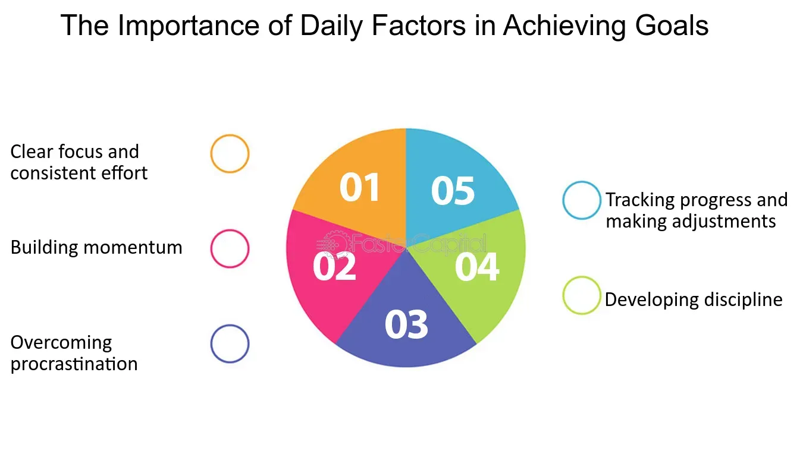

## Table of Contents

## What is the Daily Factor?

The Daily Factor is a term used in finance and investing. It refers to the daily performance of an investment or a financial index. This factor helps investors understand how much an investment changes in value from one day to the next. By looking at the Daily Factor, investors can see if their investments are going up or down on a daily basis.

Understanding the Daily Factor is important for people who trade stocks or other financial products. It helps them make quick decisions about buying or selling. For example, if the Daily Factor shows that a stock is going down, an investor might decide to sell it to avoid losing more money. On the other hand, if the Daily Factor is positive, they might want to keep the investment or buy more.

## How does the Daily Factor work?

The Daily Factor works by measuring the change in an investment's value from one day to the next. It's like checking the temperature every day to see if it's getting hotter or colder. If you own a stock, the Daily Factor tells you if the price of that stock went up or down compared to the day before. This number is usually shown as a percentage. So, if the Daily Factor is 2%, it means the stock's price increased by 2% that day.

Investors use the Daily Factor to make decisions. If the Daily Factor is positive, it means the investment is doing well, and they might want to hold onto it or buy more. But if the Daily Factor is negative, it means the investment's value is going down, and they might decide to sell it to avoid losing more money. By watching the Daily Factor every day, investors can react quickly to changes in the market and try to make the best choices for their money.

## Why is the Daily Factor important?

The Daily Factor is important because it helps people who invest their money see how well their investments are doing every day. When you invest in things like stocks, the price can go up or down each day. By looking at the Daily Factor, which is just a percentage that shows how much the price changed, investors can quickly understand if their investment is making money or losing money. This is really helpful because it lets them make decisions fast, like whether to keep the investment or sell it.

Also, the Daily Factor helps investors stay on top of what's happening in the market. Since the market can change a lot from one day to the next, knowing the Daily Factor means you can react to these changes. If the Daily Factor is good, it might be a sign to buy more of that investment. But if it's bad, it might be a warning to sell before you lose more money. This way, the Daily Factor is a tool that keeps investors informed and helps them manage their money better.

## Can you provide a simple example of the Daily Factor in action?

Imagine you bought a stock for $100. The next day, you check the Daily Factor and see it's 5%. This means the stock's price went up by 5% from the day before. So, the new price of the stock is $105. You're happy because your investment is doing well.

The next day, you check again, and the Daily Factor is -2%. This means the stock's price dropped by 2% from the day before. So, the new price of the stock is now $102.90. You might start to think about whether you should sell the stock to avoid losing more money, or if you should hold onto it and hope it goes back up.

## What are the key components of the Daily Factor?

The Daily Factor is made up of two main parts: the starting price of the investment and how much it changes in one day. The starting price is what the investment was worth at the end of the last trading day. The change is how much the price goes up or down from that starting point. 

To find the Daily Factor, you take the change in price and turn it into a percentage. This percentage tells you how much the investment went up or down in one day. For example, if a stock was $100 at the end of the day and it's $105 the next day, the Daily Factor is 5% because the price went up by $5, which is 5% of $100.

## How is the Daily Factor calculated?

The Daily Factor is calculated by looking at how much an investment's price changes in one day. You start with the price of the investment at the end of the last trading day. This is your starting point. Then, you see what the price is at the end of the next trading day. The difference between these two prices is how much the investment changed in value.

To turn this change into the Daily Factor, you make it into a percentage. You take the change in price and divide it by the starting price. Then, you multiply by 100 to get a percentage. For example, if a stock was $100 at the end of the last day and it's $105 at the end of the next day, the change is $5. You divide $5 by $100 to get 0.05, and then multiply by 100 to get a Daily Factor of 5%. This percentage shows how much the investment went up or down in one day.

## What are common applications of the Daily Factor in different industries?

The Daily Factor is used a lot in the finance and investment world. People who trade stocks, bonds, or other financial products use it to see how their investments are doing every day. If the Daily Factor shows a stock is going up, they might decide to buy more or keep what they have. But if it's going down, they might sell to avoid losing money. This helps them make quick decisions and stay on top of the market's ups and downs.

In the insurance industry, the Daily Factor can help with managing risk. Insurance companies use it to track how much their investments change each day. This helps them make sure they have enough money to pay out claims. If the Daily Factor shows their investments are losing value, they might need to change their strategy to keep their finances stable.

In the real estate market, the Daily Factor isn't used as often, but it can still be useful. Real estate investors might look at the Daily Factor of related stocks or funds to get a sense of how the market is doing. If the Daily Factor of real estate investment trusts (REITs) is positive, it might be a good time to invest in property. If it's negative, they might wait for a better opportunity.

## How does the Daily Factor affect financial planning and analysis?

The Daily Factor plays a big role in financial planning and analysis because it helps people see how their investments are doing every day. When you're planning your finances, knowing the Daily Factor can tell you if you're on the right track or if you need to make changes. For example, if you're saving for a big goal like buying a house, you want to know if your investments are growing. If the Daily Factor is positive, you can feel good about your progress. But if it's negative, you might need to rethink your strategy to make sure you reach your goal.

In financial analysis, the Daily Factor helps experts understand how different investments are performing over time. Analysts look at the Daily Factor to spot trends and make predictions about the market. If they see that the Daily Factor for a certain stock or fund is consistently positive, they might recommend it to clients. On the other hand, if the Daily Factor is often negative, they might warn clients to stay away. This daily information helps analysts give better advice and helps people make smarter decisions with their money.

## What are the limitations of using the Daily Factor?

The Daily Factor can be helpful, but it has some limits. One big problem is that it only shows what happened in one day. It doesn't tell you about the bigger picture or long-term trends. If you only look at the Daily Factor, you might make quick decisions without thinking about what could happen over weeks or months. This can lead to selling good investments too soon or buying bad ones because they had a good day.

Another limit is that the Daily Factor can be affected by short-term events that don't really matter in the long run. For example, a stock might go down because of a news story, but that doesn't mean it's a bad investment. If you only look at the Daily Factor, you might miss out on good opportunities because you're reacting to daily changes instead of looking at the bigger picture. It's important to use the Daily Factor along with other tools to get a full understanding of your investments.

## How can the Daily Factor be optimized for better results?

To make the Daily Factor work better for you, it's important to look at it along with other information. Instead of just focusing on what happens each day, try to see the bigger picture. Look at weekly or monthly trends to understand how your investments are doing over time. This way, you won't make quick decisions based only on one day's change. You can also use tools like moving averages to smooth out the daily ups and downs and get a clearer view of the trend.

Another way to use the Daily Factor better is to set clear goals and understand your risk level. If you know what you're aiming for, like saving for a house or retirement, you can decide if daily changes are helping or hurting your plan. If your investments are too risky and the Daily Factor is often negative, you might want to switch to safer options. By thinking about your long-term goals and how much risk you can handle, you can use the Daily Factor to make smarter choices and avoid panicking over short-term changes.

## What advanced techniques can be used to analyze the Daily Factor?

One advanced way to look at the Daily Factor is by using something called "[volatility](/wiki/volatility-trading-strategies) analysis." Volatility is just a fancy word for how much the price of an investment goes up and down. By studying the Daily Factor over time, you can see if an investment is calm or if it's jumping around a lot. If it's too jumpy, it might be too risky for you. You can use numbers like standard deviation to measure this. This helps you understand if the daily changes are normal or if something big is happening.

Another technique is called "correlation analysis." This means looking at how the Daily Factor of one investment moves with others. If two investments always go up or down together, they are correlated. Knowing this can help you spread out your money better. If all your money is in investments that move the same way, you might lose a lot if the market goes down. By looking at correlations, you can pick investments that don't all go up and down at the same time, which can make your money safer.

You can also use "time series analysis" to look at the Daily Factor. This means studying the Daily Factor over many days to find patterns. For example, you might see that an investment goes up at certain times of the year or reacts to certain news. By understanding these patterns, you can make better guesses about what might happen next. This can help you decide when to buy or sell to make the most money.

## Can you discuss a case study where the Daily Factor significantly impacted a business decision?

A good example of how the Daily Factor can affect a business decision happened with a company called XYZ Investments. They had a lot of money invested in a tech stock that was doing well. One day, they noticed the Daily Factor showed the stock had dropped by 10%. This was a big surprise because the stock had been going up for weeks. The managers at XYZ Investments had to decide fast what to do. They used the Daily Factor along with other information like news about the company and the overall market. After looking at everything, they decided to hold onto the stock because they believed it was just a short-term drop and the company was still strong.

In another case, a small business owner named Jane used the Daily Factor to help her decide when to expand her bakery. Jane had saved money in a mutual fund, and she was watching the Daily Factor every day. One month, she saw that the Daily Factor was consistently positive, showing that her investment was growing. She decided it was a good time to take some money out of the fund to buy new equipment for her bakery. By using the Daily Factor, Jane felt confident that she was making a smart decision based on the daily performance of her investment. This helped her grow her business at the right time.

## What is the Daily Factor and how can it be understood?

The daily factor is a numerical value that quantifies the annual yield of an investment on a per-day basis. Represented as a decimal, this metric enables investors to assess the income generated by an asset daily, thus offering a precise measure of yield evaluation. Particularly advantageous for income-focused investors and institutional entities, the daily factor provides a granular insight into daily interest returns. This precision aids in the meticulous calculation of short-term yields and allows investors to effectively compare varying securities.

For bond investors, the daily factor is indispensable. By understanding how the daily interest accumulated contributes to the overall yield of their investment, investors are better equipped to gauge the performance of their portfolios. If an investor is analyzing diverse bonds, the daily factor aids in discerning which bond offers optimal performance in terms of accrued daily interest. Consider, for example, the daily factor $d$ calculated from an annual [interest rate](/wiki/interest-rate-trading-strategies) $r$ as follows: 

$$
d = \left(1 + \frac{r}{365}\right)^{365} - 1
$$

This formula approximates the daily yield of a security based on the assumption of compound interest and provides a means to compare different investment vehicles on a comparable daily interest basis.

This understanding enhances decision-making, enabling investors to make informed choices regarding asset allocation and investment strategies. Recognizing the significance of daily factors ensures that portfolio adjustments can be made to maximize returns while managing risk effectively. As a tool for precise yield measurement, the daily [factor](/wiki/factor-investing) stands as a foundational element for income-seeking investors aiming to achieve optimized financial outcomes.

## References & Further Reading

[1]: Bergstra, J., Bardenet, R., Bengio, Y., & Kégl, B. (2011). ["Algorithms for Hyper-Parameter Optimization."](https://dl.acm.org/doi/10.5555/2986459.2986743) Advances in Neural Information Processing Systems 24.

[2]: ["Advances in Financial Machine Learning"](https://www.amazon.com/Advances-Financial-Machine-Learning-Marcos/dp/1119482089) by Marcos Lopez de Prado

[3]: ["Evidence-Based Technical Analysis: Applying the Scientific Method and Statistical Inference to Trading Signals"](https://www.amazon.com/Evidence-Based-Technical-Analysis-Scientific-Statistical/dp/0470008741) by David Aronson

[4]: ["Machine Learning for Algorithmic Trading"](https://github.com/stefan-jansen/machine-learning-for-trading) by Stefan Jansen

[5]: ["Quantitative Trading: How to Build Your Own Algorithmic Trading Business"](https://www.amazon.com/Quantitative-Trading-Build-Algorithmic-Business/dp/1119800064) by Ernest P. Chan