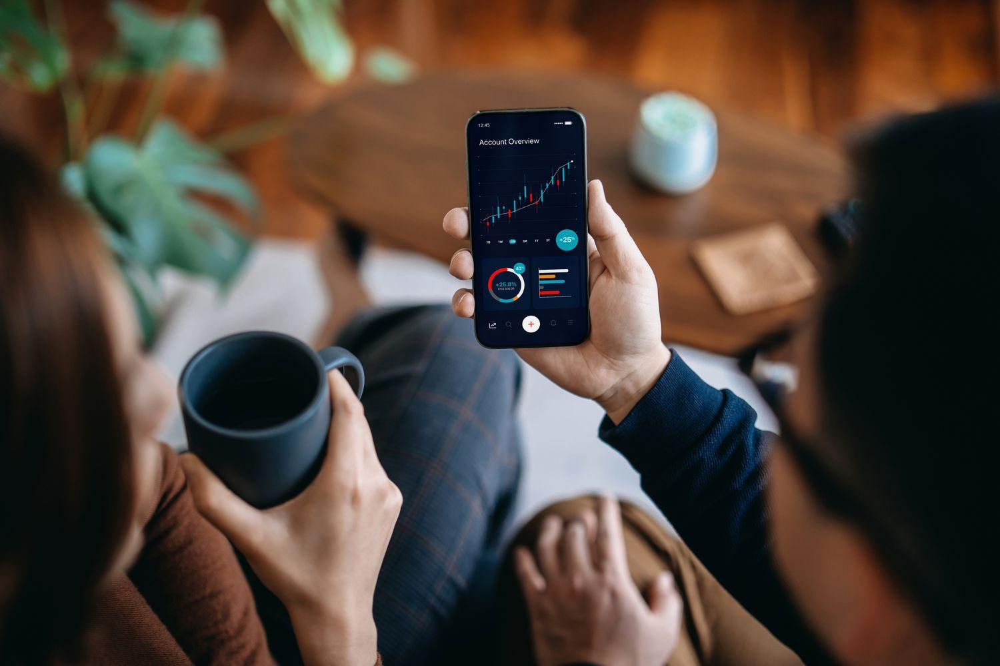

Commodities trading is a fundamental component of financial markets worldwide, enabling the buying and selling of raw materials and primary products. In China, the Dalian Commodity Exchange (DCE) has emerged as a pivotal institution within the country's commodities market landscape. Established in 1993, the DCE serves as a major platform for trading futures and options contracts, particularly for key sectors such as agriculture, metals, and chemicals. 

The advent of algorithmic trading, often referred to as algo trading, is reshaping the methodologies by which commodities are traded. This innovative approach employs computer programs to execute trades at speeds and volumes that are unattainable through traditional methods. The integration of algo trading into markets like the DCE represents a significant shift, enhancing the efficiency and precision of trading activities. 



This article examines the intersection of commodities trading and algorithmic strategies, with a specific focus on the Dalian Commodity Exchange. It will explore the operational mechanics of algo trading within the DCE and analyze the subsequent impacts on financial markets, highlighting both the opportunities and challenges introduced by this technology-driven transformation. Through understanding these dynamics, participants in the financial markets can better navigate this evolving landscape where technology and trading converge.

## Table of Contents

## Understanding Commodities Trading

Commodities trading involves the buying and selling of raw materials and primary products, which form the backbone of the global economy. Commodities are typically categorized into three main sectors: agricultural products (such as wheat, corn, and soybeans), metals (including gold, silver, and copper), and energy resources (such as crude oil and natural gas). These resources are indispensable in various industrial processes and consumer markets.

The trading of commodities takes place on organized exchanges, which provide a structured environment for transactions. These exchanges offer standardized contracts that specify the quality, quantity, and delivery terms of the commodities being traded. This standardization facilitates liquidity and price discovery, allowing market participants to effectively manage risk. Some of the most prominent global commodities exchanges include the Chicago Mercantile Exchange (CME), the London Metal Exchange (LME), and the Intercontinental Exchange (ICE), along with the Dalian Commodity Exchange (DCE) in China.

Commodities trading can be profitable due to the price fluctuations inherent in supply and demand dynamics. Prices are influenced by factors such as geopolitical events, weather conditions, and changes in technology or government policies. Traders and investors participate in this market to capitalize on these price movements, either through direct investment or via derivatives such as futures and options.

However, commodities trading is also characterized by significant risks and [volatility](/wiki/volatility-trading-strategies). Price swings can be abrupt and substantial, leading to potential losses for traders. To mitigate these risks, traders often use various hedging strategies, employing financial instruments like futures contracts to lock in prices for commodities that they are producing or consuming. Additionally, sophisticated models and algorithms are increasingly employed to analyze market trends and make informed trading decisions.

Overall, while commodities trading offers lucrative opportunities, it requires a deep understanding of the market dynamics and a strategic approach to managing associated risks.

## Overview of the Dalian Commodity Exchange

The Dalian Commodity Exchange (DCE) is a prominent player in the landscape of Chinese futures exchanges, being one of the four major exchanges in the country. Established in 1993, the DCE has evolved into an influential global hub for commodities trading, with a particular focus on futures and options contracts. The exchange's primary offerings include agricultural products, metals, and chemical commodities, making it a versatile platform for a wide array of market participants.

Agricultural products such as soybeans, corn, and palm oil are among the key contracts traded on the DCE, reflecting China's significant role as a consumer and producer in the agricultural sector. In the metals category, the exchange facilitates the trading of iron ore futures, which is crucial given China's substantial demand for steel production. The chemical sector is represented through contracts like polyethylene and polyvinyl chloride, echoing the growth and industrial demand within China.

A defining feature of the DCE is its strict regulatory environment, which ensures market integrity and fair trading practices. The regulatory framework is designed to maintain transparency and prevent excessive speculation, factors that are essential for attracting both domestic and international investors. This environment not only protects participants but also enhances the exchange's credibility as a reliable trading venue.

In recent years, participation by international traders on the DCE has seen a noticeable increase, attributable to China's broader efforts to open its markets. This international involvement is facilitated by the DCE's diverse product offerings, competitive pricing, and efficient trading mechanisms. As China's economy continues to integrate with global markets, the DCE stands to gain further prominence on the international stage. Such participation is fostered by strategic partnerships and collaborations with global exchanges and financial institutions, bolstering the DCE's position as a key player in global commodities trading.

In summary, the Dalian Commodity Exchange is not only a critical component of China's domestic commodity trading framework but also an increasingly important participant in the global commodities market. With its robust infrastructure, regulatory oversight, and diverse range of traded commodities, the DCE is poised for continued growth and integration into international trading systems.

## The Rise of Algorithmic Trading

Algorithmic trading, commonly referred to as algo trading, represents a paradigm shift in the execution of trades within financial markets. At its core, algo trading employs computer programs equipped with complex algorithms to automatically execute and manage trading orders. These algorithms are typically designed to take advantage of market conditions by delivering high-speed and high-frequency transactions, which dynamically adjust based on real-time data.

The primary advantage of algo trading lies in its ability to process vast amounts of market information and execute trades at speeds unattainable by human traders. This rapid execution capability is crucial in high-frequency trading ([HFT](/wiki/high-frequency-trading-strategies)), where success is often determined by the execution speed of transactions. Utilizing algorithms, traders can deploy sophisticated trading strategies that involve continuous monitoring and instant reaction to price changes, thus maximizing profit opportunities and minimizing risks.

These programs often incorporate a variety of mathematical models and techniques, such as statistical [arbitrage](/wiki/arbitrage), to identify and exploit pricing inefficiencies across securities. Python, due to its extensive library support and simplicity, is a favored language in developing these models. An example of a basic algorithm could include calculating moving averages to identify trends:

```python
def moving_average(prices, window):
    return [sum(prices[i:i+window])/window for i in range(len(prices) - window + 1)]

prices = [100, 102, 101, 105, 107, 108, 110]
window_size = 3
print(moving_average(prices, window_size))
```

This small piece of code calculates the moving average over a given window size, which traders can use as part of their strategy for entering and exiting trades based on trend analysis.

One of the renowned advantages of algo trading is its ability to minimize human error. By automating decision-making processes, it reduces the impact of emotional and psychological biases that can affect human traders. Moreover, the enhanced efficiency contributed by algo trading often leads to improved [liquidity](/wiki/liquidity-risk-premium) in markets, as it facilitates more frequent and consistent transactions.

However, the deployment of algorithms in trading also presents challenges. The ability for rapid execution of large volumes of orders can sometimes result in unintended consequences, such as flash crashes—sudden, severe drops in market prices caused by excessive selling pressure from algorithms acting on certain signals.

Moreover, concerns over market manipulation have arisen, as sophisticated algorithms can be used to affect market conditions in a way that benefits those controlling the algorithms at the expense of others. As a result, regulatory bodies constantly update guidelines to monitor and mitigate potential abuses associated with algo trading strategies.

In conclusion, while algo trading significantly improves the speed and efficiency of trade executions, the complexities involved necessitate robust oversight and regulation to ensure market integrity. The progressive evolution of technology and algorithmic strategies continues to shape and redefine commodities and financial markets worldwide.

## Algo Trading on the Dalian Commodity Exchange

The integration of [algorithmic trading](/wiki/algorithmic-trading) into the Dalian Commodity Exchange (DCE) has significantly reshaped its operational dynamics. One of the key factors facilitating this transformation is the advanced technology and infrastructure that support high-speed trading. The DCE has invested in state-of-the-art trading systems that allow for rapid execution of trades, minimizing latency and enabling traders to participate in high-frequency trading activities. This technological advancement is crucial for algorithmic trading, where speed and efficiency are paramount.

Algorithmic trading enhances price discovery and market efficiency on the DCE. By continuously analyzing market data and executing trades based on predetermined criteria, algorithms contribute to more accurate and timely pricing of commodities. This continuous flow of information and transactions aids in the establishment of fair market prices, ultimately benefiting all market participants. The enhanced efficiency brought about by algo trading reduces transaction costs and improves the liquidity of the market.

Traders on the DCE employ algorithms for various strategic purposes, including risk hedging, arbitrage, and trend analysis. For instance, algorithmic systems can be designed to automatically hedge against adverse price movements, thereby managing exposure to market risks. Additionally, traders use algorithms to identify and exploit price differentials across different markets or commodities, engaging in arbitrage strategies to lock in profits. These algorithms can also analyze large datasets to identify market trends, enabling traders to make informed decisions.

To manage the risks associated with algorithmic trading, the DCE has implemented a series of regulations and safeguards. These measures are designed to prevent market abuses such as manipulation and to ensure the stability of the trading environment. The use of circuit breakers and trading halts are examples of mechanisms that help to mitigate the impact of rapid market fluctuations that may arise from algorithmic activities. By maintaining a robust regulatory framework, the DCE aims to uphold market integrity while facilitating the benefits of algorithmic trading.

## The Impact on Financial Markets

The integration of algorithmic trading with commodities exchanges such as the Dalian Commodity Exchange (DCE) is significantly reshaping financial markets. One of the key features of this transformation is the increased speed and [volume](/wiki/volume-trading-strategy) of transactions. Algorithmic trading facilitates high-frequency trading, allowing market participants to execute large volumes of trades in fractions of a second. This capability not only enhances trading efficiency but also reflects in heightened market activity and liquidity.

One direct outcome of this enhanced trading capability is tighter bid-ask spreads. By leveraging algorithmic strategies, traders can quickly adjust their orders to changes in market conditions, thus narrowing the difference between the price sellers are willing to accept and the price buyers are willing to pay. This reduction in bid-ask spreads contributes to improved market liquidity, making it easier for other market participants to enter and [exit](/wiki/exit-strategy) positions without significantly impacting prices.

However, these advantages come with new challenges, particularly in categories of regulatory oversight and market stability. The rapid pace of algorithmic trading can lead to increased market volatility, occasionally resulting in "flash crashes" where prices plummet and recover in a very short timeframe. To mitigate these risks, exchanges like the DCE implement regulatory measures such as circuit breakers and predefined limits on trading activities to maintain orderly market operations.

The ongoing evolution of technology further propels changes in global commodities markets. As computational power and data analytics continue to advance, algorithmic trading strategies become increasingly sophisticated. These advancements enable traders to capitalize on market inefficiencies with greater precision and speed. Nevertheless, they also demand rigorous regulatory scrutiny to ensure market integrity and protect against systemic risks.

Overall, the combination of algorithmic trading and commodities exchanges like the DCE is transforming the landscape of financial markets, offering both opportunities for enhanced trading efficiency and challenges related to market regulation and stability.

## Conclusion

The landscape of commodities trading is evolving rapidly with the integration of algorithmic trading techniques. The Dalian Commodity Exchange (DCE) is a leading figure in implementing these advancements within China, leveraging technology to enhance market operations and efficiency. This shift toward algorithmic trading offers significant advantages such as improved market liquidity, enhanced price discovery, and the capability to execute complex trading strategies with remarkable precision. These benefits, however, come with the necessity for robust regulatory frameworks and continuous monitoring to safeguard market integrity and prevent issues like market manipulation or unintended disruptions.

For participants in financial markets, understanding the intricate dynamics of this technologically-driven trading environment is crucial. Grasping these dynamics allows traders and investors to better navigate the potential risks and opportunities that algorithmic trading presents. As technology continues to advance, it is anticipated that the future of commodities trading will not only expand but also innovate at an unprecedented pace, offering new dimensions of market interaction and analysis.

To succeed in this future landscape, stakeholders must remain vigilant and adaptable, ensuring that they harness the benefits of algorithmic trading while mitigating its risks. This approach will be vital for maintaining the balance between innovation and stability in global commodities markets.

## References & Further Reading

[1]: Hull, J. (2017). ["Options, Futures, and Other Derivatives"](https://www.amazon.com/Options-Futures-Other-Derivatives-10th/dp/013447208X) (9th ed.). Pearson.

[2]: Geman, H. (2005). ["Commodities and Commodity Derivatives: Modelling and Pricing for Agriculturals, Metals and Energy"](https://download.e-bookshelf.de/download/0000/5675/90/L-G-0000567590-0015270354.pdf). Wiley.

[3]: Aldridge, I. (2013). ["High-Frequency Trading: A Practical Guide to Algorithmic Strategies and Trading Systems"](https://www.amazon.com/High-Frequency-Trading-Practical-Algorithmic-Strategies/dp/1118343506). Wiley.

[4]: Lopez de Prado, M. (2018). ["Advances in Financial Machine Learning"](https://books.google.com/books/about/Advances_in_Financial_Machine_Learning.html?id=oU9KDwAAQBAJ). Wiley.

[5]: Mackenzie, D. (2017). ["Trading at the Speed of Light: How Ultrafast Algorithms are Transforming Financial Markets"](https://www.jstor.org/stable/j.ctv191kx1k). Princeton University Press.

[6]: Jarrow, R. (2019). ["Derivatives: Markets, Valuation, and Risk Management"](https://www.academia.edu/58832068/An_Introduction_to_Derivative_Securities_Financial_Markets_and_Risk_Management). Cambridge University Press.