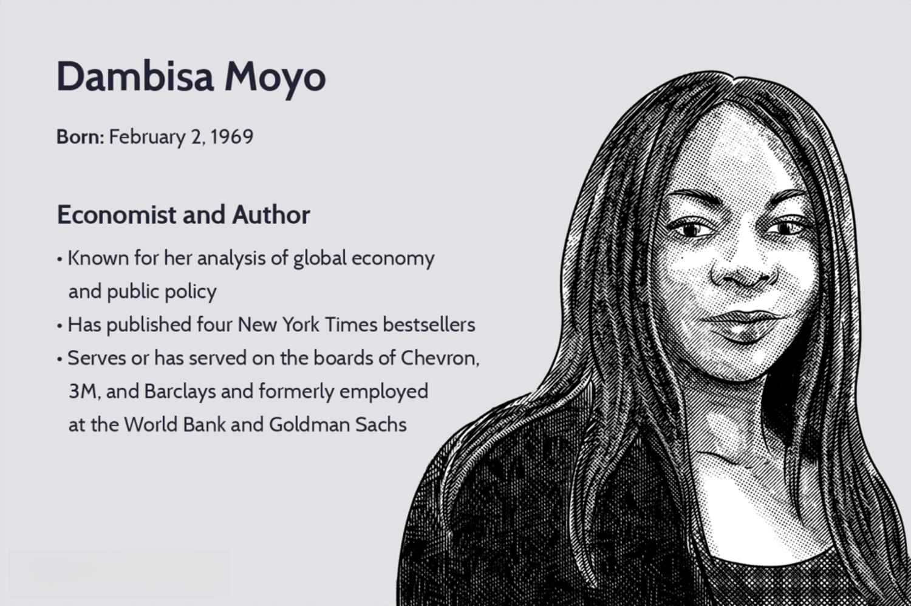

Dambisa Moyo is a renowned Zambian-born economist and author whose extensive work has significantly influenced macroeconomics and global affairs. Her contributions extend beyond traditional economic paradigms, as she is frequently sought after for her insights on international development, economic policies, and the complexities of financial markets. With a career marked by high-level roles in influential financial institutions and membership on the boards of major multinational corporations, Moyo's perspectives are pivotal in shaping contemporary economic discourse. 

Furthermore, her intellectual pursuits have recently encompassed the domain of algorithmic trading, an area where complex algorithms automate the decision-making processes in financial markets. This reflects her broad expertise across multiple facets of the financial sector. Algorithmic trading poses both opportunities and challenges, and understanding Moyo’s insights provides a nuanced view of how these advanced methodologies intersect with macroeconomic dynamics. This article aims to explore Dambisa Moyo's career, her notable works, and her perspectives on algorithmic trading, showcasing her impact on both macroeconomic theory and practical financial innovations.

## Table of Contents

## Who is Dambisa Moyo?

Dambisa Moyo is a distinguished economist whose career spans influential roles in various global financial institutions. She began her ascent in the economic world at the World Bank, where she contributed to significant research and policy work aimed at fostering sustainable economic growth. Moyo further honed her expertise during her tenure at Goldman Sachs, where she was involved in macroeconomic research and public policy, analyzing critical global economic trends and advising key clients on strategic investment decisions.

Her career extends into corporate governance as she serves on the board of directors for multinational corporations such as Chevron and 3M. These roles highlight her expertise in steering strategic directions for major companies in an increasingly complex global market landscape.

In addition to her corporate and financial roles, Dambisa Moyo has significantly impacted literature and academia. She has authored four New York Times bestselling books, through which she analyzes various aspects of global economics and developmental challenges. Her works have not only contributed to public discourse on economic strategies but have also been instrumental in shaping contemporary understanding of the intricate balance between economic aid and sustainable growth. Her publications demonstrate a profound insight into macroeconomic issues, reinforcing her status as a thought leader in economic policy and international development.

## Dambisa Moyo's Economic Perspectives

Dambisa Moyo is prominently recognized for her critical stance on the effectiveness of development aid and her advocacy for economic growth as a vital component to improve global living standards. Moyo argues that traditional aid models have often perpetuated dependency rather than fostering the self-sufficiency of developing nations. Her analysis suggests that such aid can undermine local economies by inhibiting the growth of industries that could be otherwise competitive.

Moyo stresses the significance of private sector investment as a more sustainable and effective alternative to government aid. She postulates that encouraging entrepreneurship and facilitating private investments can drive economic development more reliably. This approach is predicated on the premise that private capital, when strategically invested, can stimulate job creation and infrastructure development, leading to self-sustaining economic growth.

Moyo argues that government aid often comes with strings attached, leading to increased debt burdens and policy impositions that may not align with local needs. Instead, she suggests a shift towards creating an environment that attracts private investors, encouraging innovations and technology transfer, and thereby achieving a lasting impact. Moyo's economic perspective underscores the need for policy frameworks that prioritize market-based solutions, deregulation, and the removal of barriers to business operations to mobilize domestic and foreign investments. 

Her analyses further imply that fostering a vibrant private sector involves investment in human capital and infrastructure, which can enhance productivity and competitiveness. She posits that governments should play a supportive role by ensuring political stability, rule of law, and transparency, creating a conducive ecosystem for businesses to thrive.

Moyo's views have sparked debates among economists and policymakers, challenging conventional aid paradigms and promoting a discourse focusing on sustainable economic strategies. Her perspectives continue to shape discussions on how emerging economies can leverage private investments to overcome poverty and achieve long-term development goals.

## Published Works and Influence

Dambisa Moyo's published works have significantly impacted discussions surrounding global economics and development. Her most renowned book, "Dead Aid: Why Aid Is Not Working and How There Is a Better Way for Africa," critiques the long-standing practice of providing foreign aid to African countries. In "Dead Aid," Moyo argues that foreign aid, rather than helping, often hinders Africa's economic growth by creating dependency, fostering corruption, and stunting financial development. Instead, she proposes alternative strategies, such as increased trade, investment in infrastructure, and microfinance, to drive sustainable growth and self-sufficiency in the continent.

Another significant contribution by Moyo is "Winner Take All: China's Race for Resources and What It Means for the World." In this book, she examines China's global quest for natural resources and the economic and geopolitical implications of this growing dominance. Moyo highlights how China's strategic investments in oil, minerals, and arable land across the globe influence global economic dynamics, affecting geopolitics and reshaping international relationships.

"How the West Was Lost: Fifty Years of Economic Folly and the Stark Choices Ahead" is another influential work by Moyo. In it, she analyses the economic missteps in Western countries that have led to financial crises and relative decline. Moyo argues that policy failures, such as the prioritization of short-term consumerism over long-term growth and innovation, have contributed to economic stagnation. She emphasizes the need for the West to adapt new strategies to compete effectively in the changing global landscape.

These works establish Dambisa Moyo as a formidable thinker in economic theory and policy. Her insights challenge conventional wisdom, urging policymakers and stakeholders to rethink traditional economic strategies for more sustainable and equitable global development solutions.

## Algorithmic Trading: Moyo's Insights

Algorithmic trading has revolutionized financial markets by employing sophisticated algorithms to execute trading decisions with remarkable speed and accuracy. This technology is at the intersection of computer science and finance, offering the potential to optimize strategies and enhance market efficiency. Dambisa Moyo's insights into [algorithmic trading](/wiki/algorithmic-trading) can provide a nuanced understanding of how these automated systems interact with macroeconomic policies and market dynamics.

Moyo's expertise in global markets is invaluable in assessing the implications of algorithmic trading. She recognizes that while these systems offer significant benefits, including increased [liquidity](/wiki/liquidity-risk-premium) and reduced transaction costs, they also pose risks to financial stability. One of the concerns is the potential for systemic risk arising from algorithmic trading. Algorithms can lead to market [volatility](/wiki/volatility-trading-strategies) when multiple trading systems simultaneously execute similar strategies, possibly triggering events like the Flash Crash of 2010, where rapid, automated selling contributed to a sharp market decline.

Furthermore, Moyo highlights the importance of considering the broader macroeconomic environment in which algorithmic trading operates. Changes in interest rates, inflation, and fiscal policies can have pronounced effects on automated trading strategies. For instance, an algorithm designed to exploit small [arbitrage](/wiki/arbitrage) opportunities may need to adjust parameters when a central bank announces new monetary policy measures. Hence, understanding these external factors is crucial for developing robust trading algorithms that can adapt to economic shifts.

Moyo also points out that the proliferation of algorithmic trading necessitates stringent regulatory frameworks to mitigate risks. These regulations would aim to ensure transparency and accountability, preventing algorithms from engaging in manipulative practices such as spoofing or layering, which can distort market prices.

In summary, Dambisa Moyo's perspectives on algorithmic trading underscore the dual nature of this innovation; it can both enhance market operations and introduce new complexities. Her insights emphasize the need for balancing technological advancement with regulatory oversight to harness the full potential of algorithmic trading while safeguarding financial systems against potential disruptions.

## Conclusion

Dambisa Moyo remains a significant figure in economic and financial discourse through her contributions to macroeconomic theory and the advancement of techniques such as algorithmic trading. Her critical viewpoints on international development and economic growth underscore the importance of private sector investment for sustainable development. This approach challenges traditional aid models, proposing innovative strategies that emphasize economic independence and resilience.

In addition to her macroeconomic insights, Moyo's examination of algorithmic trading highlights the intersection of technology and finance. As automated trading systems increasingly dominate financial markets, her nuanced understanding of the potential benefits and risks is invaluable. These insights help illuminate the ways in which algorithmic trading can influence market stability and efficiency, offering a template for policymakers and financial experts to consider in their evaluations and strategies.

As markets continue to evolve with technological advancements and shifting economic landscapes, Moyo's perspectives are likely to remain key in shaping future economic policies and trading strategies. Her comprehensive understanding of both macroeconomic trends and modern financial technologies positions her well to influence the direction of global economic discourse for years to come.

## References & Further Reading

[1]: Moyo, Dambisa. ["Dead Aid: Why Aid Is Not Working and How There Is a Better Way for Africa."](https://www.researchgate.net/publication/38091995_Dead_aid_Why_aid_is_not_working_and_how_there_is_a_better_way_for_Africa) Farrar, Straus and Giroux, 2010.

[2]: Moyo, Dambisa. ["Winner Take All: China's Race for Resources and What It Means for the World."](https://www.amazon.com/Winner-Take-All-Chinas-Resources/dp/0465028284) Basic Books, 2012.

[3]: Moyo, Dambisa. ["How the West Was Lost: Fifty Years of Economic Folly and the Stark Choices Ahead."](https://www.amazon.com/How-West-Was-Lost-Folly/dp/0374533210) Farrar, Straus and Giroux, 2011.

[4]: Aldridge, Irene. ["High-Frequency Trading: A Practical Guide to Algorithmic Strategies and Trading Systems."](https://www.amazon.com/High-Frequency-Trading-Practical-Algorithmic-Strategies/dp/1118343506) Wiley, 2013.

[5]: Patterson, Scott. ["Dark Pools: The Rise of the Machine Traders and the Rigging of the U.S. Stock Market."](https://www.amazon.com/Dark-Pools-Machine-Traders-Rigging/dp/0307887189) Crown Business, 2013.