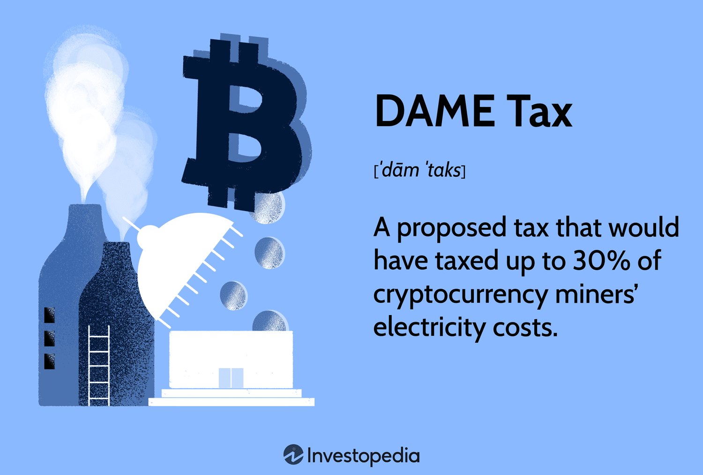

## Table of Contents

## What is the DAME Tax?

The DAME Tax, which stands for Digital Asset Mining Energy, is a proposed tax in the United States aimed at cryptocurrency miners. It is designed to make miners pay more for the electricity they use. The idea behind this tax is to help the environment by reducing the energy used for mining cryptocurrencies like Bitcoin. The tax would add a 30% charge on the electricity costs of mining operations.

Some people support the DAME Tax because they believe it will help lower the environmental impact of crypto mining. Mining uses a lot of electricity, which can harm the planet. Others worry that the tax might make it too expensive to mine cryptocurrencies in the U.S., causing miners to move to other countries. This could hurt the American economy. The debate about the DAME Tax continues as people try to balance environmental concerns with economic growth.

## Why was the DAME Tax introduced?

The DAME Tax was introduced because people are worried about how much electricity cryptocurrency mining uses. Mining cryptocurrencies like Bitcoin takes a lot of power, which can be bad for the environment. The tax is meant to make miners pay more for the electricity they use, hoping this will make them use less energy. By doing this, the government wants to help protect the environment.

Some people think the DAME Tax is a good idea because it might reduce the harm to the planet caused by mining. They believe that if miners have to pay more for electricity, they will find ways to use less of it. However, others are worried that the tax could make mining too expensive in the U.S. They think this might push miners to move to other countries, which could hurt the American economy. The debate continues as people try to find a balance between helping the environment and supporting economic growth.

## Who is affected by the DAME Tax?

The DAME Tax directly affects cryptocurrency miners in the United States. These are the people and companies that use a lot of electricity to mine digital currencies like Bitcoin. If the tax becomes law, miners will have to pay an extra 30% on their electricity costs. This could make it more expensive for them to keep mining in the U.S.

The tax could also indirectly affect other people and businesses. If miners move to other countries because of the higher costs, it might hurt the American economy. Jobs related to mining could be lost, and the areas where miners operate might see less economic activity. On the other hand, if the tax helps reduce the energy used for mining, it could be good for the environment, which benefits everyone.

## How is the DAME Tax calculated?

The DAME Tax is calculated by adding an extra 30% to the electricity costs that cryptocurrency miners use. If a miner's electricity bill is $100, the DAME Tax would add another $30, making the total cost $130. This tax only applies to the electricity used for mining digital currencies like Bitcoin.

The idea is to make miners pay more for the power they use, which might encourage them to use less electricity. This could help the environment because mining uses a lot of energy. But, it could also make mining more expensive in the U.S., which might cause miners to move to other countries.

## What are the key components of the DAME Tax mechanism?

The DAME Tax is a proposed tax in the United States that targets cryptocurrency miners. The main part of the tax is a 30% extra charge on the electricity costs that miners use. If a miner's electricity bill is $100, the DAME Tax would add another $30, making the total cost $130. This tax only applies to the electricity used for mining digital currencies like Bitcoin.

The goal of the DAME Tax is to make miners use less electricity. Mining cryptocurrencies uses a lot of power, which can harm the environment. By making miners pay more for their electricity, the government hopes they will find ways to use less energy. This could help protect the environment. However, the tax might also make mining more expensive in the U.S., which could cause miners to move to other countries. This could hurt the American economy.

## How does the DAME Tax impact the cryptocurrency mining industry?

The DAME Tax could make it more expensive for cryptocurrency miners to operate in the United States. If miners have to pay an extra 30% on their electricity costs, it might be too costly for them to keep mining here. This could lead some miners to move their operations to other countries where electricity is cheaper. If many miners leave, it could hurt the American economy because there would be fewer jobs and less economic activity related to mining.

On the other hand, the DAME Tax could be good for the environment. Mining cryptocurrencies like Bitcoin uses a lot of electricity, which can harm the planet. By making miners pay more for their power, the tax might encourage them to use less energy. This could help reduce the environmental impact of mining. However, finding the right balance between helping the environment and supporting the economy is a big challenge.

## What are the potential benefits of the DAME Tax for the environment?

The DAME Tax could help the environment by making cryptocurrency miners use less electricity. Mining digital currencies like Bitcoin takes a lot of power, which can harm the planet. If miners have to pay more for their electricity, they might find ways to use less of it. This could mean using more efficient machines or moving to places with cleaner energy sources. By using less power, miners would create less pollution, which is good for the environment.

Reducing the energy used for mining could also help fight climate change. Less electricity means fewer greenhouse gases are released into the air. These gases, like carbon dioxide, trap heat and make the planet warmer. By lowering the amount of energy used for mining, the DAME Tax could help slow down climate change. This would be a big win for the environment and for everyone who lives on Earth.

## How can businesses comply with the DAME Tax regulations?

If the DAME Tax becomes law, businesses that mine cryptocurrencies need to keep track of how much electricity they use for mining. They should make sure their electricity bills are accurate and set aside money to pay the extra 30% tax on those bills. It's important for them to stay up-to-date with any new rules or changes to the tax so they can follow them correctly. They might need to talk to a tax expert to make sure they are doing everything right.

Some businesses might look for ways to use less electricity to lower their costs. They could switch to more energy-efficient machines or move their operations to places with cheaper or cleaner energy. By doing this, they can reduce the impact of the DAME Tax and help the environment at the same time. Keeping good records and staying informed will help businesses comply with the tax and keep their operations running smoothly.

## What are the criticisms and controversies surrounding the DAME Tax?

Some people don't like the DAME Tax because they think it will hurt the American economy. They worry that if miners have to pay more for electricity, they might move their businesses to other countries where it's cheaper. This could mean fewer jobs and less money for the U.S. Critics also say the tax might slow down the growth of the cryptocurrency industry in America. They believe that instead of taxing miners, the government should help them find ways to use less energy or switch to cleaner power sources.

Others argue about whether the DAME Tax will really help the environment. Some think that even if miners use less electricity in the U.S., they might just move to other places where they use more dirty energy. This wouldn't help the planet. There's also a debate about fairness. Some people think the tax is too hard on miners and that it doesn't treat all businesses the same way. They believe the government should look at other ways to protect the environment without making it so tough on one group of businesses.

## How does the DAME Tax compare to similar taxes in other countries?

The DAME Tax in the United States is a special tax on the electricity used by cryptocurrency miners. It adds an extra 30% to their electricity bills. Other countries have their own ways of dealing with the energy used for mining. For example, in China, the government has banned cryptocurrency mining in some areas to control the energy use. They don't have a special tax like the DAME Tax, but they control it by not allowing it at all. In Canada, some places have high electricity rates for miners to make them use less power, but it's not a separate tax like in the U.S.

In Europe, different countries have different rules. Sweden, for example, has low electricity costs which makes it a good place for miners. They don't have a special tax on mining energy like the DAME Tax. In contrast, some European countries are thinking about putting taxes on the profits from mining, not the energy used. This is different from the DAME Tax, which focuses on the electricity costs. Overall, while the DAME Tax is unique in how it targets electricity costs, other countries use a mix of bans, high rates, and profit taxes to handle the energy used by cryptocurrency miners.

## What future changes or adjustments might be made to the DAME Tax?

In the future, the DAME Tax might be changed to make it better for both the environment and the economy. One change could be to lower the tax rate from 30% to something less, so it's not so hard on miners. This might keep more miners in the U.S. and help the economy. Another idea is to give miners tax breaks if they use cleaner energy sources, like wind or solar power. This would help the environment by encouraging miners to switch to less harmful energy.

There's also a chance that the government could add more rules to make sure the tax is fair. They might decide to only tax miners who use a lot of electricity, instead of all miners. This way, smaller miners wouldn't have to pay as much. The government might also work with miners to find new ways to save energy, instead of just taxing them. These changes could help balance the need to protect the environment with the need to keep the cryptocurrency mining industry strong in the U.S.

## How can individuals and businesses strategize to minimize the impact of the DAME Tax?

Individuals and businesses can take steps to reduce the impact of the DAME Tax by focusing on using less electricity. For example, they can switch to more energy-efficient mining machines that use less power. They might also look for places with cheaper or cleaner electricity to move their operations. By doing this, they can lower their electricity bills and pay less in taxes. Keeping good records of their energy use and staying informed about any changes to the tax can also help them plan better.

Another way to minimize the impact is to explore alternative energy sources. If miners can use renewable energy like solar or wind power, they might get tax breaks or other benefits. This not only helps them save money on the DAME Tax but also helps the environment. Working with other miners and industry groups to push for fairer tax rules could also be helpful. By coming together, they might be able to influence the government to make changes that are better for everyone.

## References & Further Reading

[1]: De Vries, A. (2018). ["Bitcoin's Growing Energy Problem."](https://www.sciencedirect.com/science/article/pii/S2542435118301776) PLOS ONE.

[2]: Narayanan, A., Bonneau, J., Felten, E., Miller, A., & Goldfeder, S. (2016). ["Bitcoin and Cryptocurrency Technologies: A Comprehensive Introduction."](https://press.princeton.edu/books/hardcover/9780691171692/bitcoin-and-cryptocurrency-technologies) Princeton University Press.

[3]: O'Leary, D. E. (2013). ["Artificial Intelligence and Big Data."](https://ieeexplore.ieee.org/document/6547979) IEEE Intelligent Systems.

[4]: de Vries, A., & Stoll, C. (2021). ["Bitcoin's Energy Consumption."](https://www.sciencedirect.com/science/article/abs/pii/S0921344921005103) Joule.

[5]: White, G. (2021). ["The DAME Tax Proposal and Crypto Mining's Future."](https://www.tomshardware.com/news/white-house-dame-tax-cryptomining-electricity) The Block (access may require subscription).

[6]: Yermack, D. (2017). ["Corporate Governance and Blockchains."](https://academic.oup.com/rof/article/21/1/7/2888422) Review of Finance.