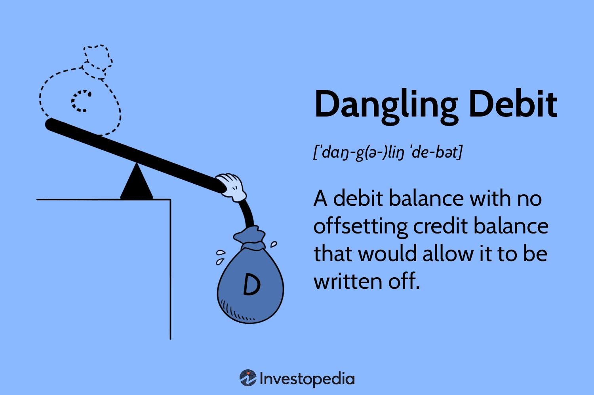

## Table of Contents

## What is a dangling debit?

A dangling debit is a term used in accounting when there is a debit entry that does not have a corresponding credit entry. This situation can happen due to errors in recording transactions or when a transaction is only partially completed. For example, if a company records a purchase but forgets to record the payment, the debit for the purchase remains unmatched, creating a dangling debit.

Dangling debits can cause problems because they make the accounting records unbalanced. In double-entry accounting, every debit should have an equal and opposite credit. When this balance is disrupted, it can lead to incorrect financial statements and make it difficult to track the financial health of a business. It's important for accountants to regularly review their records to find and fix any dangling debits to keep the accounts accurate.

## How does a dangling debit occur in accounting?

A dangling debit happens when a business records a debit but forgets to record the matching credit. Imagine a company buys some supplies and records the cost as a debit. If they forget to record that they paid for the supplies with cash or a bank transfer, the debit for the supplies will be left hanging without a matching credit. This can happen because of simple mistakes, like forgetting to enter a transaction, or because someone didn't finish recording all parts of a transaction.

These dangling debits can cause big problems because they mess up the balance in the accounting system. In accounting, every debit needs to have a matching credit to keep things balanced. When there's a dangling debit, the [books](/wiki/algo-trading-books) don't add up correctly, which can make the financial statements wrong. It's important for businesses to check their records often to find and fix any dangling debits so they can keep their financial information accurate and reliable.

## Can you provide an example of a dangling debit?

Imagine a small business, "Sunny's Bakery," that buys some flour for $100. The accountant at Sunny's Bakery records this purchase by debiting the "Supplies" account for $100. This is the correct first step because the bakery now has more supplies. However, the accountant forgets to record that the bakery paid for the flour with cash. The payment part of the transaction, which should have been a credit to the "Cash" account for $100, is missing. This creates a dangling debit because the debit to "Supplies" does not have a matching credit.

Because of this mistake, the bakery's accounting records are not balanced. The total debits will be $100 more than the total credits, which means the financial statements will be incorrect. To fix this, the accountant needs to go back and record the missing credit to the "Cash" account for $100. Once both parts of the transaction are recorded, the books will balance again, and the dangling debit will be resolved.

## What are the common causes of dangling debits?

Dangling debits often happen because of simple mistakes. Someone might forget to record a part of a transaction. For example, if a business buys something and records the purchase but forgets to record the payment, the debit for the purchase will be left hanging without a matching credit. This can also happen if someone starts to record a transaction but doesn't finish it, maybe because they got interrupted or distracted.

Another common cause is errors in data entry. Sometimes, people might enter the wrong amount or record the transaction in the wrong account. If they debit an account but forget to credit another, it creates a dangling debit. It's important for businesses to check their records often to catch these mistakes early and keep their financial information accurate.

## How can dangling debits affect financial statements?

Dangling debits can mess up a company's financial statements because they make the accounting records unbalanced. In accounting, every debit needs to have an equal and opposite credit. If there's a dangling debit, the total debits will be more than the total credits, which means the financial statements won't show the right numbers. This can make it look like the company has more assets or expenses than it really does.

These mistakes can cause big problems. If the financial statements are wrong, the company might make bad decisions based on the incorrect information. For example, they might think they have more money to spend than they actually do. Also, if the company needs to show its financial statements to investors or banks, the errors could make people doubt the company's financial health. It's important for businesses to check their records often to find and fix any dangling debits so they can keep their financial information accurate and trustworthy.

## What steps should be taken to identify a dangling debit?

To find a dangling debit, start by checking the trial balance. This is a report that lists all the debits and credits in the accounts. If the total debits don't match the total credits, there might be a dangling debit. Look at each account with a debit balance and see if there's a matching credit somewhere else. If you can't find one, you've probably found a dangling debit.

After you spot a possible dangling debit, go through the transactions recorded around the time it happened. Check the receipts, invoices, and bank statements to see if you missed recording a credit. Sometimes, talking to the people who made the transactions can help too. They might remember something that wasn't recorded properly. By carefully reviewing the records and double-checking the transactions, you can find and fix dangling debits to keep the accounting accurate.

## How can dangling debits be resolved or corrected?

To fix a dangling debit, start by looking at the trial balance to see if the total debits and credits match. If they don't, find the account with the extra debit. Check all the transactions recorded around that time, looking at receipts, invoices, and bank statements to find the missing credit. Sometimes, talking to the people involved in the transactions can help, as they might remember something that wasn't recorded. Once you find the missing credit, record it in the right account to balance the books.

After you've found and recorded the missing credit, make sure to update the financial statements. This will fix any errors that the dangling debit caused. It's a good idea to review the accounts regularly to catch and fix these mistakes early. This way, you can keep the financial information accurate and reliable, helping the business make better decisions and maintain trust with investors and banks.

## What are the best practices to prevent dangling debits?

To prevent dangling debits, it's important to have good habits when recording transactions. Always make sure to record both the debit and the credit parts of every transaction right away. Double-check your work to make sure you haven't missed anything. Using accounting software can help because it often reminds you to enter both parts of a transaction. Also, having clear rules and training for everyone who records transactions can reduce mistakes.

Regularly reviewing the accounts is another way to stop dangling debits before they cause big problems. Look at the trial balance often to make sure the debits and credits match. If you find a mistake, fix it quickly. It's also a good idea to have someone else check the work, especially for big or important transactions. This can catch errors that one person might miss. By being careful and checking the records often, you can keep the accounts accurate and avoid dangling debits.

## What are the potential legal and tax implications of dangling debits?

Dangling debits can lead to serious legal and tax problems for a business. If the financial statements are wrong because of dangling debits, the company might not pay the right amount of taxes. This could lead to fines or penalties from the tax authorities. Also, if the company is audited, the errors could cause legal trouble. The auditors might think the mistakes were on purpose, which could lead to even bigger fines or even criminal charges.

To avoid these issues, it's important for businesses to keep their accounting accurate. Regular checks and good record-keeping can help prevent dangling debits. If a business finds a dangling debit, it should fix it quickly and make sure the financial statements are correct. This way, they can avoid legal and tax problems and keep everything running smoothly.

## How do different accounting software systems handle dangling debits?

Different accounting software systems have different ways to deal with dangling debits. Most good accounting software is set up to make sure that every debit has a matching credit. This means they won't let you finish recording a transaction if it's not balanced. For example, if you try to record a purchase without recording the payment, the software might stop you and ask you to add the missing credit before you can save the transaction. This helps prevent dangling debits from happening in the first place.

Some software also has tools to help find and fix dangling debits if they do happen. These tools can run reports that show if the books are out of balance. If there's a dangling debit, the software can point it out and help you find the missing credit. By using these features, businesses can keep their accounts accurate and avoid the problems that come with dangling debits.

## What advanced techniques can be used to audit for dangling debits?

To audit for dangling debits, one advanced technique is to use data analytics tools. These tools can scan through large amounts of accounting data quickly and find any imbalances between debits and credits. They can create reports that show where the books are not balanced, making it easier to spot dangling debits. By using these tools, auditors can check the accounts more thoroughly and catch mistakes that might be missed in a regular audit.

Another technique is to use reconciliation software. This software helps match transactions across different accounts and systems, making sure that every debit has a corresponding credit. It can automatically flag any transactions that don't balance, which helps auditors find dangling debits faster. Regular use of reconciliation software can also prevent dangling debits from happening in the first place by making sure all parts of a transaction are recorded correctly.

## How do international accounting standards address the issue of dangling debits?

International accounting standards, like the International Financial Reporting Standards (IFRS), don't talk about "dangling debits" directly. But they do stress the importance of having accurate and balanced financial statements. According to IFRS, every transaction should be recorded with both a debit and a credit to keep the accounts balanced. If there's a dangling debit, it means the accounts are not balanced, which goes against the principles of IFRS. So, businesses that follow IFRS need to find and fix any dangling debits to make sure their financial statements are correct.

To follow international standards, businesses should use good accounting practices to prevent and fix dangling debits. This includes double-checking every transaction, using accounting software that requires balanced entries, and doing regular audits. By doing these things, companies can keep their financial statements accurate and meet the requirements of international accounting standards. This helps them avoid legal and tax problems and keeps their financial reporting trustworthy.

## What is the Role of Debit in Trading?

In trading, particularly within the context of margin accounts, the concept of a "debit balance" plays a pivotal role. A debit balance emerges when a client has borrowed funds from a broker, resulting in a situation where their liabilities exceed the available cash or securities in their account. This condition is quite prevalent in margin trading, where traders utilize borrowed funds to enhance potential returns on their investments. 

The fundamental equation representing a debit balance in a margin account can be expressed as:

$$
\text{Debit Balance} = \text{Loaned Amount} - \text{Collateral Value}.
$$

Here, the loaned amount is the funds borrowed from the broker, while the collateral value represents the total value of securities within the margin account that serve as a guarantee for the borrowed amount.

Managing and understanding the dynamics of debit balances is crucial for effective risk management, particularly during periods of heightened market [volatility](/wiki/volatility-trading-strategies). A debit balance must be carefully monitored since fluctuations in asset prices can lead to margin calls, where traders must either deposit additional funds or sell off assets to restore balance and meet margin requirements.

In the sphere of [algorithmic trading](/wiki/algorithmic-trading), systems must be equipped to accurately monitor and track debit balances, as they are integral to managing and mitigating financial risks. The algorithms must incorporate real-time data analytics to assess the volatility and possible scenarios that could influence debit balances. This needs to be done with precision to prevent unintended liquidation or adverse financial outcomes.

Algorithmic trading systems can be programmed to recognize triggers that could potentially impact the debit balance, such as sudden market shifts or changes in interest rates. For instance, a simplified Python function to check if a margin call is necessary might look like this:

```python
def check_margin_call(debit_balance, collateral_value, maintenance_margin):
    """
    Checks if a margin call is necessary.

    :param debit_balance: The current debit balance (borrowed funds).
    :param collateral_value: The current value of the collateral.
    :param maintenance_margin: The minimum required percentage of equity.
    :return: Boolean indicating if a margin call is needed.
    """
    equity = collateral_value - debit_balance
    margin_requirement = maintenance_margin * collateral_value
    return equity < margin_requirement

# Example usage
debit_balance = 15000
collateral_value = 20000
maintenance_margin = 0.25  # 25%

if check_margin_call(debit_balance, collateral_value, maintenance_margin):
    print("Margin call needed.")
else:
    print("No margin call required.")
```

Such measures are crucial in ensuring that algorithmic trading not only captures market opportunities efficiently but also maintains sound risk management practices. Understanding debit balances and incorporating their dynamics into trading algorithms is essential for ensuring the sustainability and profitability of algorithmic trading strategies.

## How can accounting be integrated with algorithmic trading?

Precise financial records are crucial for effective algorithmic trading strategies. The integration of accounting principles with trading systems enhances trading algorithm reliability by ensuring all financial activities are accurately tracked and reported. This integration requires maintaining balanced ledgers through the dual entry system, a fundamental aspect akin to traditional accounting practices.

In algorithmic trading, it is vital to record transactions accurately to allow algorithms to make informed, real-time trading decisions. The dual entry system, which records each transaction as both a debit and a credit, helps maintain this balance and ensures that trading systems have a complete view of the financial position. For example, when a trade is executed, the corresponding debit in one account should be matched by a credit in another, ensuring the ledger remains balanced. This process can be represented mathematically by the equation:

$$
\text{Assets} = \text{Liabilities} + \text{Equity}
$$

This principle allows trading algorithms to work within the constraints of the allocated capital, adjusting for any changes dynamically based on incoming data.

Accurate transaction recording is fundamental in minimizing errors and optimizing financial forecasts. When integrated with algorithmic trading platforms, accounting records become a real-time feed for financial data, ensuring the algorithms are always using the most current and accurate information. This capability is essential for developing trading strategies that respond to rapid market fluctuations, as discrepancies in data can lead to financial losses.

Moreover, strong accounting systems play a critical role in back-testing algorithmic strategies. By providing a reliable historical record, these systems allow developers to simulate how their algorithms would have performed under different market conditions. This historical data gives algorithms a benchmark for identifying patterns and optimizing performance without risking actual capital.

In conclusion, the meticulous integration of accounting practices within algorithmic trading frameworks strengthens the foundation of trading strategies. It aids in maintaining the integrity of financial operations, reducing the likelihood of errors, and enhancing the precision of financial analytics. As trading continues to evolve with technological advancements, the convergence of these disciplines will likely yield even greater efficiencies and innovations in financial markets.

## References & Further Reading

[1]: Bergstra, J., Bardenet, R., Bengio, Y., & Kégl, B. (2011). ["Algorithms for Hyper-Parameter Optimization."](https://dl.acm.org/doi/10.5555/2986459.2986743) Advances in Neural Information Processing Systems 24.

[2]: ["Advances in Financial Machine Learning"](https://www.amazon.com/Advances-Financial-Machine-Learning-Marcos/dp/1119482089) by Marcos Lopez de Prado

[3]: ["Evidence-Based Technical Analysis: Applying the Scientific Method and Statistical Inference to Trading Signals"](https://www.amazon.com/Evidence-Based-Technical-Analysis-Scientific-Statistical/dp/0470008741) by David Aronson

[4]: ["Machine Learning for Algorithmic Trading"](https://github.com/stefan-jansen/machine-learning-for-trading) by Stefan Jansen

[5]: ["Quantitative Trading: How to Build Your Own Algorithmic Trading Business"](https://github.com/LucindaYa/quant-resources/blob/master/Quantitative%20Trading%20How%20to%20Build%20Your%20Own%20Algorithmic%20Trading%20Business.pdf) by Ernest P. Chan