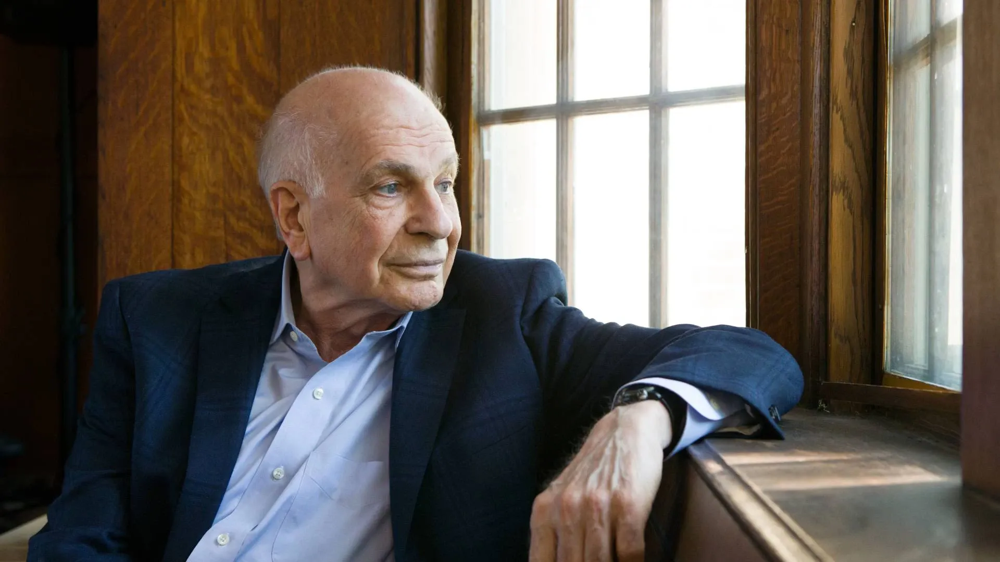

## Table of Contents

## Who is Daniel Kahneman?

Daniel Kahneman is a famous psychologist and economist. He was born in 1934 in Tel Aviv, Israel. He is best known for his work on how people make decisions and think about risks. Kahneman won the Nobel Prize in Economics in 2002 for his research. He did not study economics at first, but his work changed how people understand economic decisions.

Kahneman worked with another researcher named Amos Tversky. Together, they came up with the idea of "prospect theory." This theory explains why people often make choices that seem strange or not logical. They found that people feel the pain of losing something more than the joy of gaining something of equal value. This idea has helped many fields, like finance and marketing, understand human behavior better.

Kahneman also wrote a popular book called "Thinking, Fast and Slow." In this book, he explains how people have two ways of thinking: a fast, automatic way and a slow, careful way. He shows how these two ways can lead to mistakes in thinking and decision-making. His work has made a big impact on psychology, economics, and many other areas.

## Where was Daniel Kahneman born and raised?

Daniel Kahneman was born in Tel Aviv, Israel, in 1934. His family moved to France when he was young because of World War II. They lived in France during the war, which was a scary time for them.

After the war, Kahneman and his family moved back to Israel. He grew up and went to school there. This is where he started to become interested in psychology and how people think.

## What degrees did Daniel Kahneman earn and from which institutions?

Daniel Kahneman earned his first degree from the Hebrew University of Jerusalem. He studied psychology there and got his Bachelor's degree. After that, he stayed at the same university and earned his PhD in Psychology. This was in the 1960s.

Later, Kahneman moved to the United States. He worked at several universities, including the University of California, Berkeley, and the University of British Columbia. He did not earn more degrees during this time, but he did a lot of important research and teaching.

## What is the significance of Daniel Kahneman's collaboration with Amos Tversky?

Daniel Kahneman's collaboration with Amos Tversky was very important. Together, they created something called "prospect theory." This theory changed how people understand why we make certain choices. Before their work, many thought that people always make decisions in a logical way. But Kahneman and Tversky showed that this is not true. They found that people often make choices based on how they feel about gains and losses, not just the final outcome. This idea has helped many fields, like economics and marketing, to better understand how people behave.

Their work together also led to many other important ideas. For example, they talked about something called "heuristics," which are like mental shortcuts that people use to make decisions quickly. Sometimes these shortcuts can lead to mistakes. Kahneman and Tversky's research on this helped explain why people sometimes make choices that seem strange or not logical. Their collaboration was so important that Kahneman won the Nobel Prize in Economics in 2002 for their work. Sadly, Amos Tversky had passed away by then, but Kahneman made sure to say that the prize was really for both of them.

## Can you explain the concept of prospect theory developed by Kahneman and Tversky?

Prospect theory is an idea that Daniel Kahneman and Amos Tversky came up with to explain how people make choices. They found that people don't always make decisions based on the final outcome, like how much money they might win or lose. Instead, people care more about the changes from their current situation. For example, if someone has $100 and they might gain $50 or lose $50, the pain of losing $50 feels much worse than the joy of gaining $50. This is called loss aversion, and it's a big part of prospect theory.

Another important part of prospect theory is how people see the chances of something happening. Kahneman and Tversky found that people don't always think about probabilities in a clear way. For example, people might think a small chance of winning a big prize is more likely than it really is. This can make people take risks that don't make sense. Prospect theory helps explain why people sometimes make choices that seem strange or not logical, because it shows how feelings and the way we see chances can affect our decisions.

## What are some of the key books written by Daniel Kahneman?

Daniel Kahneman wrote a very famous book called "Thinking, Fast and Slow." In this book, he explains that people have two ways of thinking. The first way is fast and automatic, like when you quickly decide to catch a ball. The second way is slow and careful, like when you solve a math problem. Kahneman shows how these two ways of thinking can lead to mistakes. He talks about things like how we can be tricked by our feelings and how we sometimes make choices that don't seem to make sense.

Another important book by Kahneman is "Noise: A Flaw in Human Judgment," which he wrote with Olivier Sibony and Cass R. Sunstein. This book is about how people can make different decisions even when they are looking at the same information. They call this "noise." The book explains how noise can be a big problem in places like courts and hospitals, where it can lead to unfair or wrong decisions. Kahneman and his co-authors give ideas on how to reduce noise and make decisions more fair and reliable.

## How has Daniel Kahneman's work influenced the field of economics?

Daniel Kahneman's work has changed the way economists think about how people make choices. Before Kahneman, many economists thought people always made decisions based on clear, logical thinking. But Kahneman showed that feelings and the way we see chances can affect our choices. This idea is called behavioral economics. It looks at how people really behave, not just how they should behave. Kahneman's work, especially with Amos Tversky, led to the idea of prospect theory. This theory explains why people might take risks or avoid them in ways that don't seem to make sense. Economists now use these ideas to understand things like why people buy certain things or how they react to changes in prices.

Kahneman's ideas have also changed how economists study markets and money. For example, they now think about how people feel about losing money compared to gaining money. This is called loss aversion. It helps explain why people might keep a losing investment instead of selling it, even when it would be smarter to let it go. Kahneman's work has made economists realize that to understand the economy, they need to understand people's feelings and behaviors. His book "Thinking, Fast and Slow" has helped many people learn about these ideas. Economists now use these insights to make better predictions and help people make better choices.

## What contributions has Daniel Kahneman made to the field of psychology?

Daniel Kahneman has made big contributions to psychology by showing how people think and make choices. He worked with Amos Tversky to create prospect theory, which explains that people feel the pain of losing something more than the joy of gaining something of equal value. This idea, called loss aversion, has helped psychologists understand why people make certain decisions. Kahneman also talked about heuristics, which are like mental shortcuts that help us make quick decisions but can sometimes lead to mistakes. His work has changed how psychologists study thinking and decision-making.

Another important contribution Kahneman made to psychology is the idea of two different ways of thinking, which he explained in his book "Thinking, Fast and Slow." He said that people have a fast, automatic way of thinking that helps us react quickly, and a slow, careful way of thinking that we use for more complex decisions. Kahneman showed how these two ways can lead to errors in our thinking. His ideas have helped psychologists understand how our brains work and why we sometimes make choices that don't seem to make sense. His work has had a big impact on the field of psychology and has helped many other areas, like economics and medicine, understand human behavior better.

## What awards and recognitions has Daniel Kahneman received for his work?

Daniel Kahneman has won many important awards for his work. The biggest one is the Nobel Prize in Economics, which he won in 2002. He got this prize for his research on how people make choices and think about risks. This work was done with Amos Tversky, but Tversky had passed away by the time Kahneman won the prize. Kahneman also won the University of Louisville Grawemeyer Award in 2002, which is given for ideas that can change the world.

Kahneman has received many other awards too. In 2003, he was awarded the American Psychological Association's Award for Outstanding Lifetime Contribution to Psychology. He also got the Warren Medal from the Society of Experimental Psychologists in 2007. In 2013, he won the Presidential Medal of Freedom, which is one of the highest honors a person can get in the United States. All these awards show how much his work has helped people understand how we think and make decisions.

## How does Daniel Kahneman's work apply to behavioral finance?

Daniel Kahneman's work has had a big impact on behavioral finance, which is a part of economics that looks at how people's feelings and behaviors affect their money choices. One of his main ideas, prospect theory, helps explain why people might do things with their money that don't seem to make sense. For example, people feel the pain of losing money more than the joy of gaining the same amount. This idea, called loss aversion, can make people keep a losing investment instead of selling it, even when it would be smarter to let it go. Kahneman's work shows that people don't always make choices based on clear, logical thinking. Instead, feelings and the way we see chances can affect our decisions.

Another way Kahneman's work applies to behavioral finance is through his ideas about heuristics, which are like mental shortcuts we use to make quick decisions. These shortcuts can help us make choices fast, but they can also lead to mistakes. For example, if someone sees that a stock has been going up, they might think it will keep going up without really looking at the reasons why. This can lead to bad investment choices. Kahneman's book "Thinking, Fast and Slow" talks about how our fast, automatic thinking can trick us into making choices that aren't the best for our money. His work has helped people in finance understand why people sometimes make choices that seem strange and how to help them make better decisions.

## What are some criticisms or controversies surrounding Kahneman's theories?

Some people have criticized Daniel Kahneman's theories because they think his ideas about how people make choices don't always fit with what happens in real life. For example, some say that his idea of loss aversion, which says people feel the pain of losing something more than the joy of gaining something, might not be true for everyone. They argue that different people might feel differently about gains and losses, and that it can depend on the situation. Critics also say that Kahneman's theories are based on experiments done in labs, which might not be the same as how people act in the real world. They think that real-life choices can be affected by many things that aren't in lab experiments.

Another criticism is about Kahneman's idea of heuristics, which are like mental shortcuts we use to make quick decisions. Some people think that these shortcuts can be helpful and not just lead to mistakes. They argue that using heuristics can be a good way to make decisions when we don't have all the information or time to think carefully. Critics also say that Kahneman's theories might make it seem like people are not good at making choices, but they believe that people can learn and get better at making decisions over time. Despite these criticisms, Kahneman's work has still helped many people understand how we think and make choices.

## How is Daniel Kahneman's legacy continuing to impact current research and future studies?

Daniel Kahneman's work continues to shape how researchers study how people think and make choices. His ideas about prospect theory and loss aversion are still used to understand why people make certain decisions, especially in fields like economics and finance. Many studies now look at how people feel about gains and losses, and how these feelings affect their choices. Kahneman's work on heuristics, or mental shortcuts, also helps researchers see how people make quick decisions and why these decisions can sometimes lead to mistakes. His book "Thinking, Fast and Slow" has inspired a lot of new research on how our fast and slow thinking can trick us into making choices that don't seem to make sense.

Kahneman's legacy also influences future studies in psychology and other areas. Researchers are still trying to understand more about how people make choices and how to help them make better ones. His ideas about noise in decision-making, which he talked about in his book "Noise: A Flaw in Human Judgment," are leading to new ways to make decisions more fair and reliable. Many scientists are using Kahneman's work to study things like how to improve health choices, how to make better policies, and how to help people save money. His work has opened up many new paths for research that will continue to help us understand human behavior better.

## What are the notable accomplishments and published works?

Daniel Kahneman's notable accomplishments predominantly stem from his collaboration with Amos Tversky in the development of Prospect Theory. This theory, introduced in their 1979 paper "Prospect Theory: An Analysis of Decision under Risk," represented a paradigm shift in how economists understood human behavior in financial decision-making. Unlike traditional economic models that assumed rational actors with consistent preference patterns, Prospect Theory demonstrated that individuals often rely on heuristics and exhibit biases, leading them to make decisions that deviate from the expected utility theory.

Prospect Theory is built on several key components that describe how people actually perceive and evaluate outcomes. One of these is the idea of "value functions" which are defined over gains and losses rather than final assets. This suggests that individuals derive utility from changes in wealth rather than absolute levels. The theory posits that the value function is concave for gains and convex for losses, reflecting risk-averse behavior in gaining scenarios and risk-seeking tendencies in losing situations. Furthermore, these value functions are steeper for losses than gains, encapsulating the idea of loss aversion. Mathematically, this can be described as follows:

$$
v(x) = 
\begin{cases} 
x^\alpha & \text{if } x \geq 0 \\
-\lambda (-x)^\beta & \text{if } x < 0 
\end{cases}
$$

where $\alpha$ and $\beta$ are risk aversion coefficients (commonly less than or equal to 1), and $\lambda > 1$ represents the loss aversion coefficient.

Kahneman's contributions to psychology and economics were recognized globally, culminating in the awarding of the Nobel Memorial Prize in Economic Sciences in 2002. Despite Tversky's passing in 1996, the prize recognized the duo's joint efforts in laying the groundwork for behavioral economics—a field that integrates psychological insights into economic theory to better understand decision-making processes.

Beyond Prospect Theory, Kahneman authored the seminal book "Thinking, Fast and Slow" in 2011. This influential work brought the concepts of cognitive biases and heuristics to a broader audience. Kahneman distinguished two systems of thought: System 1, which is fast, intuitive, and emotional, and System 2, which is slower, deliberative, and logical. The book explores how reliance on System 1 often results in cognitive biases and errors in judgment, such as confirmation bias and overconfidence. These insights are crucial not only in academic circles but also among practitioners in finance, policy-making, and various sectors that require sound decision-making.

"Thinking, Fast and Slow" has had a profound impact across fields, teaching decision-makers to recognize and mitigate the influence of cognitive biases on judgment and actions. Consequently, Kahneman’s work continues to shape modern understandings of behavior, expanding the breadth of psychological research's applicability to real-world challenges in economics and beyond.

## What is the legacy and influence of this figure on modern economics?

Daniel Kahneman's contributions to psychology and economics have significantly altered the landscape of these fields, particularly through the introduction of cognitive biases, heuristics, and Prospect Theory. Before Kahneman, the dominant economic models assumed that individuals made rational decisions aimed at maximizing utility. However, his research illuminated the intricate ways in which human decision-making deviates from these rational paradigms.

Cognitive biases are systematic patterns of deviation from norm or rationality in judgment, meaning that individuals create their subjective social reality from their perception of the input. These biases often stem from heuristics, which are mental shortcuts used when solving problems and making judgments quickly and efficiently. Although helpful, heuristics can lead to errors or cognitive biases, impacting judgment and decision-making processes. Kahneman's exploration of these concepts has not only enhanced understanding within psychology and economics but has also laid the foundation for the field of behavioral economics. This branch of economics investigates how psychological factors influence economic decision-making, challenging traditional economic theories that largely ignore psychological insights.

Prospect Theory, which Kahneman developed with Amos Tversky, has been particularly influential. It suggests that people do not evaluate outcomes solely based on their final states but rather in terms of gains and losses relative to a reference point. This contrasts sharply with the traditional expected utility theory, which posits that individuals make decisions to maximize expected utility. A core component of Prospect Theory is loss aversion—the idea that losses tend to have a more significant emotional impact on individuals than an equivalent amount of gains. This asymmetry can be represented mathematically, where the value function $v(x)$ is steeper for losses than for gains:

$$

v(x) = 
\begin{cases} 
x^\alpha & \text{if } x \geq 0 \\
-\lambda (-x)^\beta & \text{if } x < 0 
\end{cases} 
$$

where $\lambda > 1$ indicates loss aversion. This model captures the tendency for people to prefer avoiding losses to acquiring equivalent gains.

The implications of Kahneman's work extend to multiple domains. In finance, understanding loss aversion and other cognitive biases helps explain phenomena like the equity premium puzzle—why stocks have historically offered higher returns than seemingly justified by their risks, as investors demand extra compensation for bearing potential losses. In policy-making, these insights emphasize the importance of framing and presentation of options to the public, impacting areas such as health communications and retirement savings plans where decision framing can significantly alter outcomes.

By highlighting these human tendencies, Kahneman has enriched economic theory with a more accurate depiction of human behavior, one that recognizes the complexities of human psychology. His work underscores a significant paradigm shift, moving away from the assumption of perfect rationality towards an appreciation of the nuanced, often imperfect, nature of human decision-making.

## References & Further Reading

[1]: Kahneman, D., & Tversky, A. (1979). ["Prospect Theory: An Analysis of Decision under Risk."](http://web.mit.edu/curhan/www/docs/Articles/15341_Readings/Behavioral_Decision_Theory/Kahneman_Tversky_1979_Prospect_theory.pdf) Econometrica, 47(2), 263-291.

[2]: Kahneman, D. (2011). ["Thinking, Fast and Slow."](https://link.springer.com/article/10.1007/s00362-013-0533-y) Farrar, Straus and Giroux.

[3]: Thaler, R. H. (2015). ["Misbehaving: The Making of Behavioral Economics."](https://psycnet.apa.org/record/2015-22902-000) W. W. Norton & Company.

[4]: Shiller, R. J. (2000). ["Irrational Exuberance."](https://press.princeton.edu/books/paperback/9780691173122/irrational-exuberance) Princeton University Press.

[5]: Statman, M. (2011). ["What Investors Really Want: Discover What Drives Investor Behavior and Make Smarter Financial Decisions."](https://papers.ssrn.com/sol3/papers.cfm?abstract_id=1743173) McGraw-Hill Education.