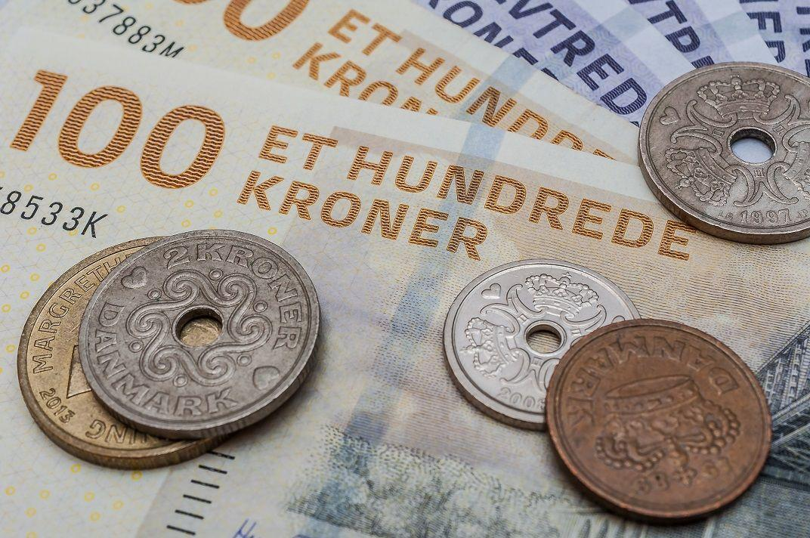

## Table of Contents

## What is the Danish Krone?

The Danish Krone is the currency used in Denmark. It is also used in Greenland and the Faroe Islands, which are part of the Kingdom of Denmark. The symbol for the Danish Krone is "kr." and it is divided into 100 øre. 

People in Denmark use the Danish Krone every day to buy things like food, clothes, and other goods. The currency is managed by Denmark's central bank, called Danmarks Nationalbank. The value of the Danish Krone can change compared to other currencies, like the US Dollar or the Euro, depending on the economy.

## What is the symbol and currency code for the Danish Krone?

The symbol for the Danish Krone is "kr." This symbol is used when writing down amounts of money in Denmark. For example, if something costs 50 Danish Kroner, you would write it as "50 kr."

The currency code for the Danish Krone is "DKK." This code is used around the world to talk about the Danish Krone in a way that everyone understands. When you see "DKK" in a price or on a bank statement, it means the amount is in Danish Kroner.

## Which country uses the Danish Krone as its official currency?

Denmark uses the Danish Krone as its official currency. People in Denmark use the Danish Krone every day to buy things they need, like food and clothes. The Danish Krone is also managed by a special bank called Danmarks Nationalbank, which helps keep the money stable.

The Danish Krone is not just used in Denmark. It is also the official currency in Greenland and the Faroe Islands. These places are part of the Kingdom of Denmark, so they use the same money. This makes it easy for people to buy things when they travel between Denmark, Greenland, and the Faroe Islands.

## How is the Danish Krone abbreviated?

The Danish Krone is abbreviated as "kr." This abbreviation is used when writing down prices or amounts of money in Denmark. For example, if something costs 50 Danish Kroner, it would be written as "50 kr."

The currency code for the Danish Krone is "DKK." This code is used around the world to talk about the Danish Krone in a way that everyone can understand. When you see "DKK" in a price or on a bank statement, it means the amount is in Danish Kroner.

## What is the history of the Danish Krone?

The Danish Krone has been around for a long time. It first started being used in 1875. Before that, Denmark used different kinds of money like the Danish Rigsdaler. In 1875, Denmark joined something called the Scandinavian Monetary Union with Sweden and Norway. They all used a currency called the Krone, which means "crown" in their languages. This union lasted until World War I, when the countries started using their own money again.

After World War I, Denmark kept using the Krone but made it their own special currency. Over the years, the Danish Krone has changed a lot. It used to be divided into 100 øre, but now the øre coins are not used anymore because they were too small. The Danish Krone is still used today in Denmark, Greenland, and the Faroe Islands. It is managed by a special bank called Danmarks Nationalbank, which helps keep the money stable and useful for people in Denmark.

## When was the Danish Krone first introduced?

The Danish Krone was first introduced in 1875. Before that, Denmark used a different currency called the Danish Rigsdaler. In 1875, Denmark joined the Scandinavian Monetary Union with Sweden and Norway. They all decided to use a currency called the Krone, which means "crown" in their languages.

This union lasted until World War I. After the war, Denmark kept using the Krone but made it their own special currency. Over time, the Danish Krone has changed a lot. It used to be divided into 100 øre, but now the øre coins are not used anymore because they were too small. Today, the Danish Krone is still used in Denmark, Greenland, and the Faroe Islands. It is managed by a special bank called Danmarks Nationalbank, which helps keep the money stable and useful for people.

## What are the denominations of the Danish Krone?

The Danish Krone comes in different sizes of money called denominations. For coins, you can have 1 krone, 2 kroner, 5 kroner, 10 kroner, and 20 kroner. The smallest coin used to be the 50 øre, but it is not used anymore because it was too small. People in Denmark use these coins every day to buy things like snacks or small items.

For paper money, the Danish Krone has bigger amounts. You can have banknotes of 50 kroner, 100 kroner, 200 kroner, 500 kroner, and 1000 kroner. These are used for bigger purchases like clothes or electronics. The different sizes and colors of the banknotes help people tell them apart easily.

## How does the Danish Krone relate to the Euro?

The Danish Krone is the money used in Denmark, while the Euro is used in many other countries in Europe. Denmark is part of the European Union, but it chose not to use the Euro. Instead, it keeps using its own money, the Danish Krone. The value of the Danish Krone can change compared to the Euro, and this is decided by something called the exchange rate.

Denmark's central bank, called Danmarks Nationalbank, works hard to keep the Danish Krone stable compared to the Euro. They do this by making sure the exchange rate stays close to a certain number, which is about 7.46 Danish Kroner for 1 Euro. This helps people in Denmark feel confident about their money, even though they are not using the Euro like many of their neighbors in Europe.

## What are the key factors influencing the exchange rate of the Danish Krone?

The exchange rate of the Danish Krone is influenced by many things. One big [factor](/wiki/factor-investing) is the policy of Denmark's central bank, called Danmarks Nationalbank. They try to keep the Danish Krone stable compared to the Euro. They do this by making sure the exchange rate stays close to about 7.46 Danish Kroner for 1 Euro. This means they might buy or sell Danish Kroner to keep the rate steady. Another factor is the economy of Denmark. If the economy is doing well, people might want more Danish Kroner, which can make the currency stronger.

Another important factor is what's happening in the world economy. If other countries' economies are doing well or poorly, it can affect the Danish Krone. For example, if the Eurozone's economy is strong, it might make the Euro stronger, which can affect the Danish Krone's value. Also, things like interest rates and inflation in Denmark can play a role. If interest rates in Denmark are higher than in other countries, people might want to invest in Danish Kroner, making it stronger. If inflation is high, the value of the Danish Krone might go down.

## How has the Danish Krone performed against major currencies in the last decade?

Over the last ten years, the Danish Krone has stayed pretty stable against major currencies like the Euro and the US Dollar. Denmark's central bank, Danmarks Nationalbank, works hard to keep the Danish Krone's value close to 7.46 kroner for 1 Euro. This means that the Danish Krone hasn't changed much compared to the Euro. Against the US Dollar, the Danish Krone has seen some ups and downs, but overall, it has stayed fairly steady.

The stability of the Danish Krone against the Euro is because Denmark wants to keep its economy linked closely to the Eurozone without actually using the Euro. This has helped keep things calm for businesses and people in Denmark. Against other major currencies like the British Pound or the Japanese Yen, the Danish Krone has also been stable, but it can move a bit more because these currencies are not as closely tied to Denmark's economy. Overall, the Danish Krone has been a reliable currency over the last decade.

## What are the monetary policy tools used by Denmark to manage the Krone?

Denmark uses a few main tools to keep the Danish Krone stable. One big tool is the [interest rate](/wiki/interest-rate-trading-strategies). Denmark's central bank, called Danmarks Nationalbank, can change the interest rate to make the Krone more or less attractive to people. If they want the Krone to be stronger, they might raise the interest rate so people want to invest in Denmark. If they want it to be weaker, they might lower the interest rate.

Another tool is buying and selling currency in something called the foreign exchange market. If the Krone is getting too weak, the central bank can use its money to buy Kroner, which makes the currency stronger. If the Krone is getting too strong, they can sell Kroner to make it weaker. This helps keep the Krone close to the target rate of about 7.46 kroner for 1 Euro. By using these tools, Denmark can keep the Krone stable and help its economy stay strong.

## What are the future prospects and challenges for the Danish Krone?

The future of the Danish Krone looks pretty stable. Denmark's central bank, called Danmarks Nationalbank, works hard to keep the Krone close to 7.46 kroner for 1 Euro. This makes the Krone a reliable currency for businesses and people in Denmark. As long as Denmark stays part of the European Union without using the Euro, the Krone should stay steady. If the economy in Denmark keeps doing well, the Krone might stay strong against other currencies too.

But there are also some challenges. One big challenge is what happens in the Eurozone. If the Eurozone has big problems, it could affect the Danish Krone because Denmark wants to keep its currency stable compared to the Euro. Another challenge is global economic changes. If big economies like the US or China have problems, it could make the Krone weaker. Also, if people in Denmark start to think that using the Euro might be better, it could put pressure on the Krone. But overall, with good management, the Danish Krone should keep going strong.

## What are the challenges and opportunities?

Algorithmic trading, while offering numerous advantages, comes with distinct challenges and opportunities, especially when dealing with currencies like the Danish Krone (DKK), which is pegged to the euro. Understanding these facets is crucial for traders looking to integrate algorithmic strategies with the DKK.

### Challenges of Trading DKK's Pegged Nature to the Euro

The DKK’s fixed exchange rate system, pegged to the euro under the European Exchange Rate Mechanism (ERM II), presents a notable constraint for algorithmic traders. This peg means that the DKK exhibits relatively low [volatility](/wiki/volatility-trading-strategies) compared to free-floating currencies, which can limit the opportunities for high-frequency trading ([HFT](/wiki/high-frequency-trading-strategies)) and [arbitrage](/wiki/arbitrage) strategies that thrive on price discrepancies and swift market movements. Algorithmic systems, therefore, must be finely tuned to detect and capitalize on slight deviations and inefficiencies within the narrow trading ranges dictated by the peg.

One mathematical approach to assess potential trading opportunities under such constraints is through volatility analysis. The standard deviation formula, often denoted as σ, helps in understanding the price variability:

$$
\sigma = \sqrt{\frac{1}{N} \sum_{i=1}^{N} (x_i - \mu)^2}
$$

where $x_i$ represents individual price points, $\mu$ is the mean price, and $N$ is the total number of observations.

### Considerations for Trading in Less Volatile Environments

Trading in less volatile environments like the DKK necessitates a shift in algorithmic focus. Strategies that incorporate mean reversion, pairs trading, or signal filtering can be more effective. Traders might also explore incorporating economic indicator data, such as Danish economic reports or eurozone sentiment indices, to predict minor shifts aligning with policy changes or macroeconomic developments.

### Opportunities Provided by DKK's Stability

While the pegged nature of the DKK limits volatility, it also provides stability, which can be advantageous. Successful [algorithmic trading](/wiki/algorithmic-trading) in this context requires developing robust trading models that focus on medium to long-term trends. The predictable movement tied to the euro ensures a certain level of reliability, reducing the risk of unexpected price swings. This stability allows for refining algorithmic strategies that emphasize precision and consistency over aggressive market exploitation.

### Impact of Regulatory Environments

The regulatory landscape significantly impacts algorithmic trading in Denmark and the broader EU. Denmark's integration in the European single market necessitates compliance with EU-wide regulations like the Markets in Financial Instruments Directive II (MiFID II). These regulations, which aim to increase transparency, efficiency, and fairness in financial markets, can impose additional complexities on algorithmic traders. Traders must ensure that their algorithms incorporate risk management and adherence to reporting requirements as mandated by these regulations.

### Future Prospects for the DKK in Technological Advancements

Advancements in [artificial intelligence](/wiki/ai-artificial-intelligence) (AI) and [machine learning](/wiki/machine-learning) (ML) have the potential to revolutionize how traders approach the DKK market. As algorithms become more sophisticated, they can better analyze complex datasets, enhance prediction accuracy, and optimize execution strategies in real-time. Quantum computing also presents a future avenue for development, potentially allowing for faster processing of market data and more effective handling of large and complex financial models.

In conclusion, while algorithmic trading with the DKK presents unique complexities due to its pegged structure and regulatory environment, it also offers opportunities through stability and technological advancements. Understanding and adapting to these factors will be vital for traders looking to integrate the DKK into their algorithmic strategies.

## References & Further Reading

[1]: ["Algorithmic Trading: Winning Strategies and Their Rationale"](https://books.google.com/books/about/Algorithmic_Trading.html?id=WAlFDwAAQBAJ) by Ernest P. Chan

[2]: ["Advances in Financial Machine Learning"](https://www.amazon.com/Advances-Financial-Machine-Learning-Marcos/dp/1119482089) by Marcos Lopez de Prado

[3]: ["Quantitative Trading: How to Build Your Own Algorithmic Trading Business"](https://www.amazon.com/Quantitative-Trading-Build-Algorithmic-Business/dp/1119800064) by Ernest P. Chan

[4]: ["Machine Learning for Algorithmic Trading"](https://github.com/stefan-jansen/machine-learning-for-trading) by Stefan Jansen

[5]: ["Denmark's Fixed Exchange Rate Policy: The Future of the Krone Peg to the Euro"](https://www.brookings.edu/research/denmarks-fixed-exchange-rate-policy-the-future-of-the-krone-peg-to-the-euro/) by Brookings Institution

[6]: ["The Handbook of High Frequency Trading"](https://www.amazon.com/Handbook-High-Frequency-Trading-Gregoriou-ebook/dp/B00TH0LWHY) by Greg Gregoriou